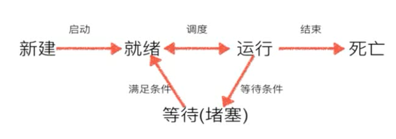

**进程以及状态**
**1，进程**
程序：例如xxx.py这是程序，是一个静态
进程：一个程序运行起来后，代码+用到的资源称之为进程，他是操作系统分配资源的基本单元。
不仅可以通过线程完成多任务，进程也是可以的。
**2，进程的状态**
工作中，任务数往往大于cpu的核数，即一定有一些任务正在执行，而另外一些任务在等待cpu进行执行，因此导致了有了不同的状态。



- 就绪态：运行的都已经慢去，正在等cpu执行
- 执行态：cpu正在执行其他功能
- 等待态：等待某些条件满足，例如一个程序sleep，此时就处于等待状态。

## 进程的创建-multiprocessing

multiprocessing模块就是跨平台版本的多进程模块，提供了一个Process类来代表一个进程对象，这个对象可以理解为一个独立的进程，可以执行另外的事情

### 1、两个while循环一起执行

```python
from multiprocessing import Process
import time


def run_pro():
    # 子进程要执行的代码
    while True:
        print("---------2----------")
        time.sleep(1)


if __name__ == "__main__":
    p = Process(target=run_pro)
    p.start()
    while True:
        print("-----1-------")
        time.sleep(1)
````

说明：
    
    创建子进程时，只需要传入一个执行函数和函数的参数，创建一个Process示例，用start()方法启动。


### 2、进程pid

```python
from multiprocessing import Process
import time
import os


def run_pro():
    # 子进程要执行的代码
    while True:
        print("子进程运行中，pid=%d" % os.getpid())  # os.getpid获取当前进程的进程号
        print("子进程将要结束")
        time.sleep(1)


if __name__ == "__main__":
    print("父进程pid：%d" % os.getpid())  # os.getpid获取当前进程的进程号
    p = Process(target=run_pro)
    p.start()
```

### 3、Process语法结构如下：

Process([group[,target[,name[,args[,kwargs]]]])

- target：如果传递了函数的引用，可以任务这个子进程就执行这里的代码
- args：给target执行的函数传递参数，以元祖的方式传递
- kwargs：给target执行的函数传递命名参数
- name：给进程设定一个名字，可以不设定
- group：指定进程组，大多数情况下用不到


Process创建的实例对象的常用方法：

- start()：启动子进程示例（创建子进程）
- is_alive()：判断进程子进程是否还活着
- join([timeout])：是否等待子进程执行结束，或等待多少秒


**注意：程序运行会先运行父进程，然后再运行子进程，子进程会复制创建子进程之前的所有父进程中的所有变量**