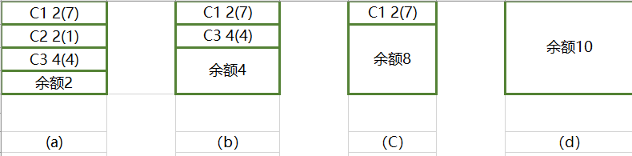

多线程基础的学习，在爬虫教程系列/第4章：爬虫进阶里面有了。
-----------

# 同步的概念
同步就是协同步调，按预定的案后次序进行运行。如：你说完，我在说。“同”字从字面上容易理解为一起动作其实不是，“同”字应是协同、协助、互相配合。
如进程、线程同步，可理解为进程或线程A和B一起配合，A执行到一定程度时要依靠B的某个结果，于是停下来，示意B运行，B运行，再将结果给A，A再继续操作。

## 1、死锁
在线程间共享多个资源的时候，如果两个线程分别占有一部分资源并且同时等待对方的资源，就会造成死锁。尽管死锁狠少发生，但一旦发生就会造成应用的停止响应，下面看一个死锁的例子：

```python
import threading
import time


class MyThread1(threading.Thread):
    def run(self):
        # 对mutexA上锁
        mutexA.acquire()

        #mutexA上锁后，延时1秒，等待另外那个线程，把mutexB上锁
        print(self.name+'--------do1-----up------')
        time.sleep(1)

        # 此时会堵塞，因为这个mutexB已经被另外的线程抢先上锁了
        mutexB.acquire()
        print(self.name+'-------do1----down')
        mutexB.release()

        # 对mutexA上锁
        mutexA.release()

class MyThread2(threading.Thread):
    def run(self):
        # 对 mutexB上锁
        mutexB.acquire()

        # mutexB上锁后，延时1秒，等待另外那个线程，把mutexA上锁
        print(self.name+'-----do2-----up----------')
        time.sleep(1)

        # 此时会堵塞，因为这个mutexA已经被另外的线程抢先上锁了
        mutexA.acquire()
        print(self.name+'-------do2----down')
        mutexA.release()

        # 对mutexB上锁
        mutexB.release()

mutexA = threading.Lock()
mutexB = threading.Lock()

if __name__ == '__main__':
    t1 = MyThread1()
    t2 = MyThread2()
    t1.start()
    t2.start()
```

## 2、避免死锁

- 程序设置时要尽量避免（银行家算法）
- 添加超时时间等

## 附录-银行家算法


一个银行家如何将一定数目的资金安全地借给若干个客户，使这些客户既能借到钱完成要干的事，同时银行家又能收回全部资金而不至于破产，这就是银行家问题。这个问题同操作系统中分配资源问题十分相似：银行家就像一个操作系统，客户就像运行的进程，银行家的资金就是系统的资源。

例如：有三个客户，C1，C2，C3，向银行家借款，该银行家的资金总额为10个资金单位，其中C1客户要借9个资金单位，C2客户要借3个资金单位，C3客户要借8个资金单位，总计20个资金单位。某一时刻的状态如下图所示。





对于a图的状态，银行家先把2个资金单位借给C1，把2个资金单位借给C2，把4个资金单位借给C3，剩下的钱，按照安全序列的要求，我们所选的第一个客户应满足所需的贷款小于银行家当前所剩余的钱款，可以看出只有C2客户能被满足：C2客户需1个资金单位，银行家手中的2个资金单位，于是银行家把1个资金单位借给C2客户，使之完成工作并归还所借的3个资金单位的钱，进入b图，同理，银行家把4个资金单位借给C3客户，使其完成工作并归还所借的8个资金单位的钱，在C图中，只剩下一个客户C1，它需7个资金单位，这时银行家有8个资金单位，所以C1也能顺利借到钱并完成工作。最后（见图d）银行家收回10个资金单位，保证不赔本。那么客户序列{C1，C2，C3}就是个安全序列，按照这个序列贷款，银行家才是安全的。否则的话，若在图b状态时，银行家把手中的4个资金单位借给了C1，则出现不安全状态：这是C1，C3均不能完成工作，而银行家手中又没有钱了，系统陷入僵持局面，银行家也不能收回投资。

综上所述，银行家算法是从当前状态出发，逐个按安全序列检查个客户谁能完成其工作，然后假定其完成工作且归还全部贷款，再进而检查下一个能完成工作的客户，.....。如果所有客户都能完成工作，则找到一个安全序列，银行家才是安全的。