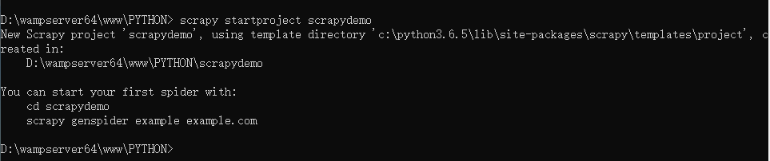
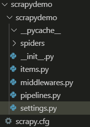

# Scrapy快速入门：

## 安装和文档：

1、安装：通过pip install Scrapy即可安装
2、Scrapy官方文档： http://doc.scrapy.org/en/latest
3、Scrapy中文文档： http://scrapy-chs.readthedocs.io/zh_CN/latest/index.html
注意：如果在windows 系统下，提示这个错误 ModuleNotFoundError：No module name named 'win32api '，那么使用一下命令就可以解决： 
```
pip install pypiwin32
```
## 快速入门：

创建项目：

要使用Scrapy 框架创建项目，需要通过命令来创建。首先进入到你想把这个项目存放的目录。然后使用一下命令创建：

```
scrapy startproject [项目名称]
```




目录结构介绍：




以下介绍主要文件的作用：
1、items.py ：用来存放爬虫爬取下来的数据模型。
2、middlewares.py：用来存放各种中间件的文件。
3、pipelines.py：用来将 items 的模型储存到本地磁盘中。
4、settings.py：本爬虫的一些配置信息（比如请求头、多久发送一次请求、ip代理池等）。
5、scrapy.cfg：项目的配置文件。
6、spiders包：以后所有的爬虫，都是存放到这个里面。

使用Scrapy框架爬取糗事百科段子：

使用命令创建一个爬虫：

```cmd
scrapy genspider qsbk "qiushibaike.com"
```

在做一个爬虫之前，一定要记得修改 settings.py 中的设置。这两个地方是强烈建议设置的。

1、ROBOTSTXT_OBEY 设置为 Falsee，默认是 True。即遵守机器协议，那么在爬虫的时候，scrapy首先去找robots.txt文件，如果没有找到。则停止爬取。

2、DEFAULT_REQUEST_HEADERS 添加 User-Agent。这个也是告诉服务器，我这个请求是一个正常的请求，不是一个爬虫。

**完成的爬虫代码：**

1、爬虫部分代码

```python
import scrapy
from scrapydemo.items import ScrapydemoItem
class QsbkSpider(scrapy.Spider):
    name = 'qsbk'
    allowed_domains = ['qiushibaike.com']
    start_urls = ['https://www.qiushibaike.com/text/page/1/']
    base_domain = 'https://www.qiushibaike.com'
    def parse(self, response):
        # SelectorList
        duanzi_divs = response.xpath("//div[@id='content-left']/div")
        for duanzi_div in duanzi_divs:
            # Selector
            author = duanzi_div.xpath(".//h2/text()").get().strip()
            content = "".join(duanzi_div.xpath(".//div[@class='content']//text()
").getall()).strip()
            item = ScrapydemoItem(author=author,content=content)
            
            yield item
        next_url = response.xpath("//ul[@class='pagination']/li[last()]/a/
@href").get()
        if not next_url:
            return
        else:
            yield scrapy.Request(self.base_domain+next_url,callback=self.parse)

```

糗事百科Scrapy爬虫笔记：
1、response 是一个 ' scrapy.http.response.html.HtmlResponse '对象。可以执行 ‘ xpath ’和‘ css ’语法来提取数据。
2、提取出来的数据，是一个 ‘Selector’或者是一个 ‘SelectorList ’对象，如果想要获取其中的字符串，那么应该执行 ‘getall ’或者 ‘get ’ 方法。
3、getall 方法：获取 ’Selector‘中的所有文本，返回的是一个列表。
4’get方法：获取的是 ‘Selector ’中的第一个文本，返回的是str类型。
5、如果数据解析回来，要传给pipline处理，那么可以使用‘yield’来返回，或者是收集所有的tiem，最后 统一使用return返回。
6、item ：建议在 items.py ' 中定义好模型。以后一不要使用字典。
7、pipline：这个是专门用来保存数据的。其中有三个方法会经常用的。

- ’open_spider(self,spider) '：当爬虫打开的时候执行。
- ‘  process_item(self,item,spider) '：当爬虫有item传过来的时候会被调用。
- ’ close_spider(self,spider) ‘：当爬虫关闭时会被调用。
- 
要激活pipline，应该在 ’settings.py  ’中，设置 ‘ITEM_PIPELINES ‘ 示例如下：

```
ITEM_PIPELINES = {
    'scrapydemo.pipelines.ScrapydemoPipeline': 300,
}
```


## JsonItemExporter和JsonLinesItemExporter：

保存json数据的时候，可以使用这两个类，让操作变得更加简单。

1、‘JsonItemExporter’：这个是每次把数据添加到内存中，最后统一写入到磁盘中，好处是，存储的数据是一个满足json规则。坏处是如果数据较大，那么比较耗内存：

示例代码如下：

```python
class ScrapydemoPipeline(object):
from scrapy.exporters import JsonItemExporter
    def __init__(self):
        self.fp = open("duanzi.json", 'wb')
        self.exporter = JsonItemExporter(
            self.fp, ensure_ascii=False, encoding='utf-8')
        self.exporter.start_exporting()
    def open_spider(self, spider):
        print("爬虫开始了....")
    def process_item(self, item, spider):
        self.exporter.export_item(item)
        return item
    def close_spider(self, spider):
        self.exporter.finish_exporting()
        self.fp.close()
        print("爬虫结束了....")
```
2、’JsonLinesItemExporter‘：这个是每次调用 ' export_item '的时候就把这个item储存到磁盘中。坏处是每一个字典是一行，整个文件不是一个满足json格式的文件。好处是每次处理数据的时候就直接储存到硬盘中，这样不会比较耗内存，数据也比较安全。

```python
from scrapy.exporters import JsonItemExporter, JsonLinesItemExporter
class ScrapydemoPipeline(object):


def __init__(self):
self.fp = open("duanzi.json", 'wb')
self.exporter = JsonLinesItemExporter(
self.fp, ensure_ascii=False, encoding='utf-8')
def open_spider(self, spider):
print("爬虫开始了....")


def process_item(self, item, spider):
self.exporter.export_item(item)
return item


def close_spider(self, spider):
self.fp.close()
print("爬虫结束了....")


```


