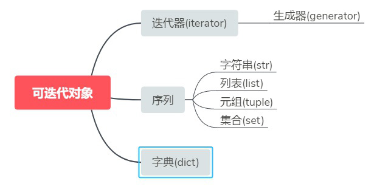

可迭代对象是Python中一个非常庞大的概念，它主要包括如下三类：


- 迭代器
- 序列
- 字典



从上图可以看出不同概念之间的关系，迭代器是可迭代对象的一个子集，而生成器又是迭代器的一个子集，是一种特殊的迭代器。除了迭代器之外，Python中还有序列、字典等可迭代对象。

# 一 、迭代器

## 一 、迭代的概念

迭代器即迭代的工具，那什么是迭代呢？

迭代是一个重复的过程，每次重复即一次迭代，并且每次迭代的结果都是下一次迭代的初始值。

```python
# 只是单纯的重复
while True: 
    print('===>') 
```

```python
# 迭代
l=[1,2,3]
count=0
while count < len(l): 
    print(l[count])
    count+=1
```

## **二 、为何要有迭代器？什么是可迭代对象？什么是迭代器对象？**

### 1、为何要有迭代器？

对于序列类型：字符串、列表、元组，我们可以使用索引的方式迭代取出其包含的元素。但对于字典、集合、文件等类型是没有索引的，若还想取出其内部包含的元素，则必须找出一种不依赖于索引的迭代方式，这就是迭代器。

### 2、什么是可迭代对象？

```python
#可迭代对象指的是内置有__iter__属性的对象，即obj.__iter__
```

```python
#这个不是可迭代对象！
a=1
print(a.__iter__)

输出结果为：
Traceback (most recent call last):
  File "e:/开发目录/PYTHON/downloader/test.py", line 2, in <module>
    print(a.__iter__)
AttributeError: 'int' object has no attribute '__iter__'

显然是报错了！
```


### 3、什么是迭代器对象？

```python
#可迭代对象执行obj.__iter__()得到的结果就是迭代器对象。
print([1,2,3].__iter__())
输出结果：
<list_iterator object at 0x000002770F3694F0>
```

而迭代器对象指的是即内置有__iter__又内置有__next__方法的对象

```python
#文件类型是迭代器对象
f = open(r"test.py")
print(f.__iter__)
print(f.__next__)
输出结果为：

<method-wrapper '__iter__' of _io.TextIOWrapper object at 0x000001E1039D7380>
<method-wrapper '__next__' of _io.TextIOWrapper object at
0x000001E1039D7380>


```

### 4、注意：

迭代器对象一定是可迭代对象，而可迭代对象不一定是迭代器对象！

## 三 、迭代器对象的使用


```python
dic={'a':1,'b':2,'c':3}
iter_dic=dic.__iter__() #得到迭代器对象，迭代器对象即有__iter__又有__next__，
#但是：迭代器.__iter__()得到的仍然是迭代器本身
iter_dic.__iter__() is iter_dic #True

print(iter_dic.__next__()) #等同于next(iter_dic)
print(iter_dic.__next__()) #等同于next(iter_dic)
print(iter_dic.__next__()) #等同于next(iter_dic)
# print(iter_dic.__next__()) #抛出异常StopIteration，或者说结束标志

#有了迭代器，我们就可以不依赖索引迭代取值了
iter_dic=dic.__iter__()
while 1:
    try:
        k=next(iter_dic)
        print(dic[k])
    except StopIteration:
        break
        
#这么写太丑陋了，需要我们自己捕捉异常，控制next，python这么牛逼，能不能帮我解决呢？
#能，请看for循环
```

## 四、 for循环

```python
#基于for循环，我们可以完全不再依赖索引去取值了
dic={'a':1,'b':2,'c':3}
for k in dic:
    print(dic[k])

输出结果：
1
2
3


```


**for循环的工作原理**

1. 执行in后对象的dic.__iter__()方法，得到一个迭代器对象iter_dic
2. 执行next(iter_dic),将得到的值赋值给k,然后执行循环体代码
3. 重复过程2，直到捕捉到异常StopIteration,结束循环

## 五、 迭代器的优缺点


优点：
  - 提供一种统一的、不依赖于索引的迭代方式
  - 惰性计算，节省内存
缺点：
  - 无法获取长度（只有在next完毕才知道到底有几个值）
  - 一次性的，只能往后走，不能往前退


```python
l_iterator = [1, 2, 3, 4, 5].__iter__() # 转换为迭代器
print('l_iterator 第一次循环')
for v in l_iterator:
    print(v)
print("==========================")
print('l_iterator 第二次循环')
for v in l_iterator:
    print(v)
print(len(l_iterator))

输出结果：
    
 l_iterator 第一次循环
1
2
3
4
5
==========================
l_iterator 第二次循环
Traceback (most recent call last):
  File "e:/开发目录/PYTHON/downloader/test.py", line 22, in <module>
    print(len(l_iterator))
TypeError: object of type 'list_iterator' has no len()
```


# 二 、生成器

## **一 、什么是生成器**


````python
#只要函数内部包含有yield关键字，那么函数名()的到的结果就是生成器，并且不会执行函数内部代码
def func():
    print('====>first')
    yield 1
    print('====>second')
    yield 2
    print('====>third')
    yield 3
    print('====>end')

g=func()
print(g) 

输出结果：
<generator object func at 0x0000000002184360> 


````

## **二、 生成器就是迭代器**

```python
def func():
    print("====>first")
    yield 1
    print("====>second")
    yield 2
    print("====>third")
    yield 3
    print("====>end")


g = func()
print(g.__iter__)
print(g.__next__)
# 所以生成器就是迭代器，因此可以这么取值
res = next(g)
print(res)

输出结果为：

<method-wrapper '__iter__' of generator object at 0x000001901FF3FF20>
<method-wrapper '__next__' of generator object at 0x000001901FF3FF20>
====>first
1
```


# 三、 yield


```python
def foo():
    print("starting...")
    while True:
        res = yield 4
        print("res:", res)


g = foo()
print(next(g))
print("*" * 20)
print(next(g))

输出结果：

starting...
4
********************
res: None
4

yield 是一个类似 return 的关键字，只是这个函数返回的是个生成器。
```


**解析代码运行顺序：**

1. 程序开始执行以后，因为foo函数中有yield关键字，所以foo函数并不会真的执行，而是先得到一个生成器g(相当于一个对象)
2. 直到调用next方法，foo函数正式开始执行，先执行foo函数中的print方法，然后进入while循环
3. 程序遇到yield关键字，然后把yield想象成return,return了一个4之后，程序停止，并没有执行赋值给res操作，此时next(g)语句执行完成，所以输出的前两行（第一个是while上面的print的结果,第二个是return出的结果）是执行print(next(g))的结果。
4. 程序执行print("*"*20)，输出20个*
5. 又开始执行下面的print(next(g)),这个时候和上面那个差不多，不过不同的是，这个时候是从刚才那个next程序停止的地方开始执行的，也就是要执行res的赋值操作，这时候要注意，这个时候赋值操作的右边是没有值的（因为刚才那个是return出去了，并没有给赋值操作的左边传参数），所以这个时候res赋值是None,所以接着下面的输出就是res:None,
6. 程序会继续在while里执行，又一次碰到yield,这个时候同样return 出4，然后程序停止，print函数输出的4就是这次return出的4.

 **yield 和 return 的关系与区别**

带yield的函数是一个生成器，而不是一个函数了，这个生成器有一个函数就是next函数，next就相当于“下一步”生成哪个数，这一次的next开始的地方是接着上一次的next停止的地方执行的，所以调用next的时候，生成器并不会从foo函数的开始执行，只是接着上一步停止的地方开始，然后遇到yield后，return出要生成的数，此步就结束。

```python
def foo():
    print("starting...")
    while True:
        res = yield 4
        print("res:", res)


g = foo()
print(next(g))
print("*" * 20)
print(g.send(7))

输出结果：

starting...
4
********************
res: 7
4
```

先大致说一下send函数的概念：此时你应该注意到上面那个的紫色的字，还有上面那个res的值为什么是None，这个变成了7，到底为什么，这是因为，send是发送一个参数给res的，因为上面讲到，return的时候，并没有把4赋值给res，下次执行的时候只好继续执行赋值操作，只好赋值为None了，而如果用send的话，开始执行的时候，先接着上一次（return 4之后）执行，先把7赋值给了res,然后执行next的作用，遇见下一回的yield，return出结果后结束。

5.程序执行g.send(7)，程序会从yield关键字那一行继续向下运行，send会把7这个值赋值给res变量

6.由于send方法中包含next()方法，所以程序会继续向下运行执行print方法，然后再次进入while循环

7.程序执行再次遇到yield关键字，yield会返回后面的值后，程序再次暂停，直到再次调用next方法或send方法。

**next()等同于send(None)**

 

------

 

 **参考：**

https://www.cnblogs.com/linhaifeng/articles/7580428.html#_label3

https://www.zhihu.com/question/345210030

https://www.cnblogs.com/ellisonzhang/p/10273843.html

https://pyzh.readthedocs.io/en/latest/the-python-yield-keyword-explained.html

https://blog.csdn.net/mieleizhi0522/article/details/82142856/

