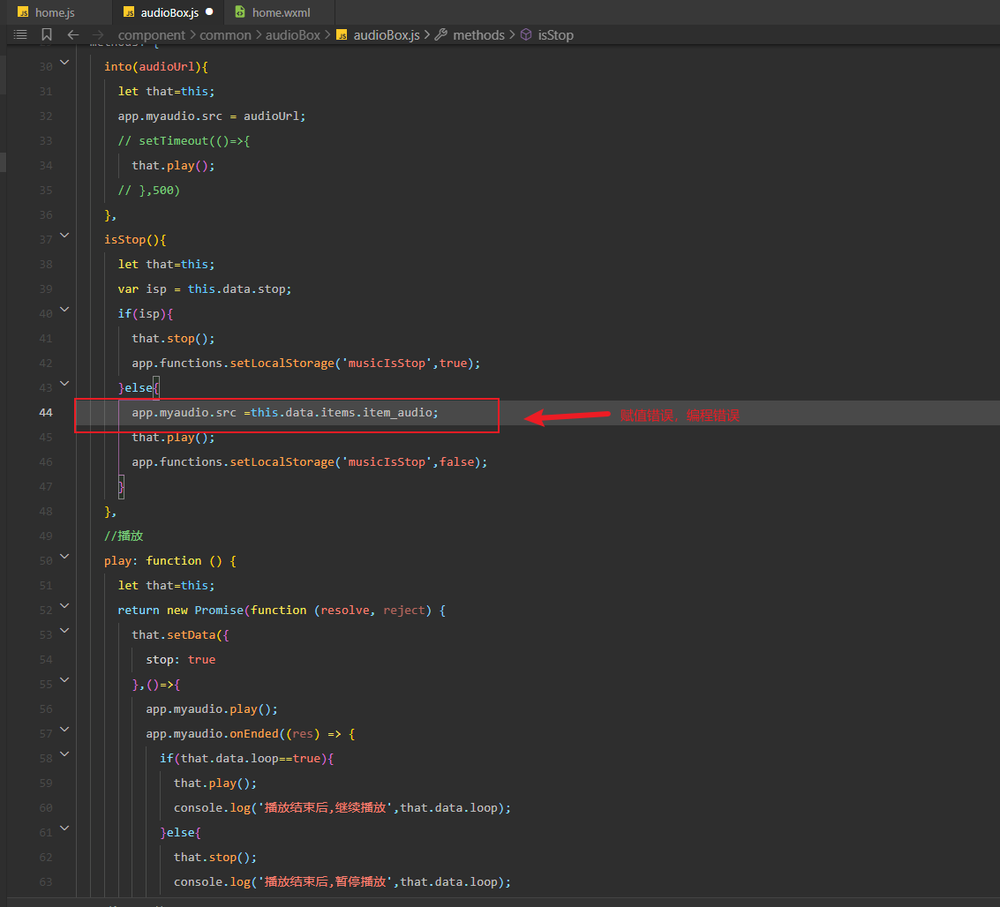
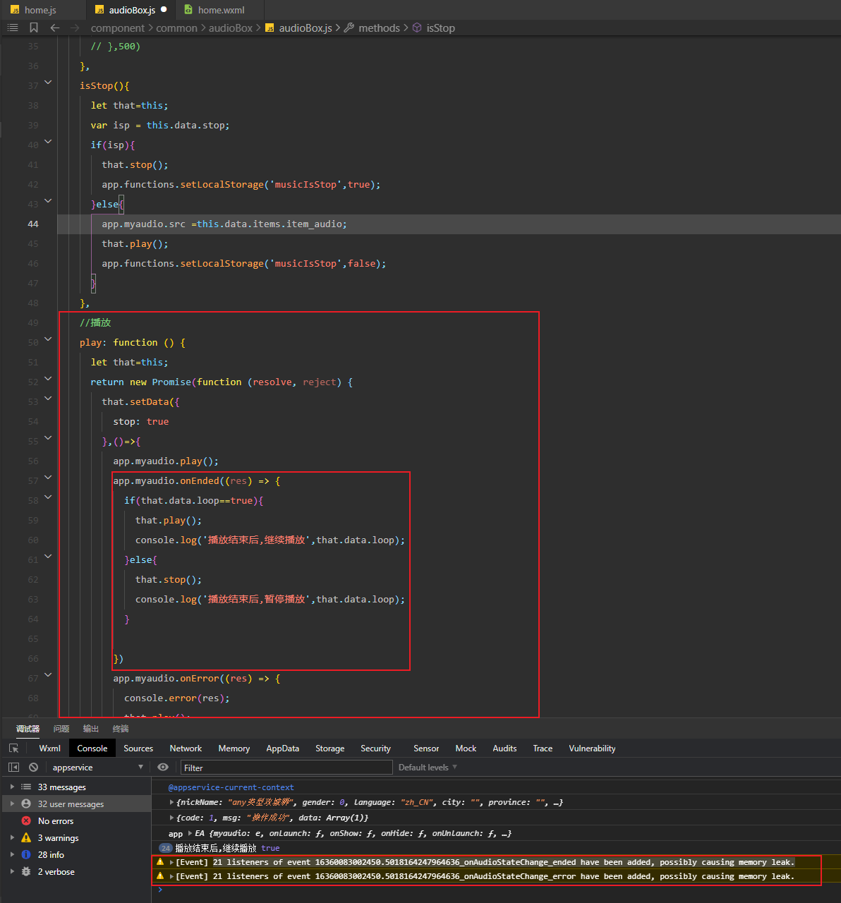
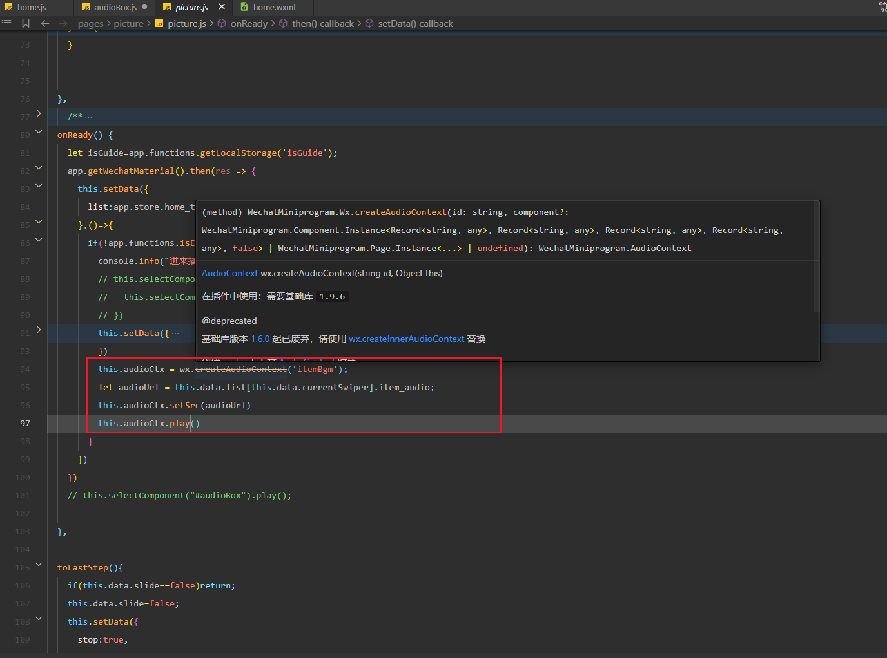

首先，编程错误，写错代码，导致报错。

写法混乱，js逻辑极其混乱，导致内存泄漏，造成程序卡死状态。

写法混乱，新旧api混用，使用已废弃的api。

一会用封装的audioBox组件，一会自己页面写，一会用全局的audioCtx，还得维护全局的ctx状态，一会单独页面写audioCtx，极其混乱。

audioCtx的状态判定也是有问题，用stop来判断ctx的状态，stop为true，音频播放，stop为音频暂停，非常不合理，不利于后期维护。

