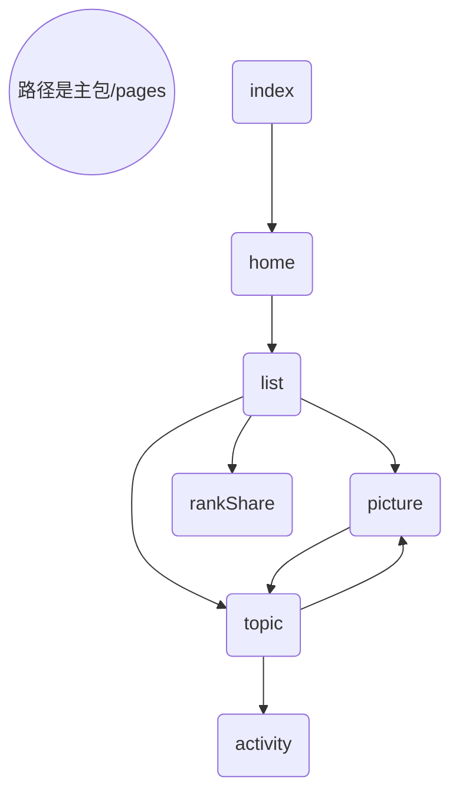
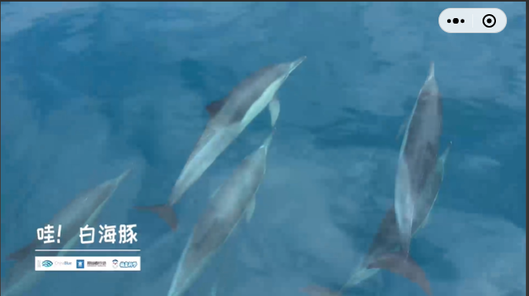
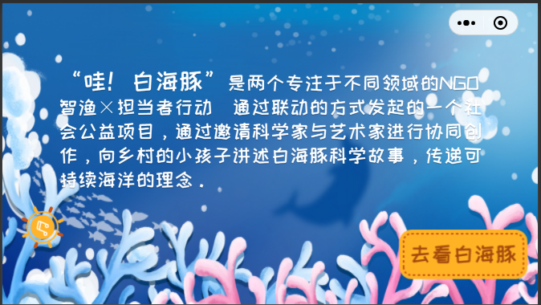
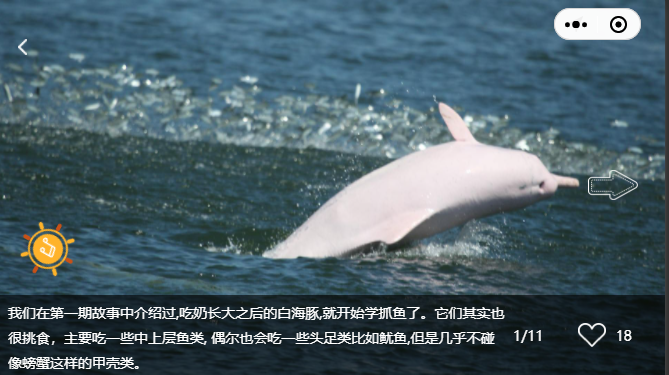
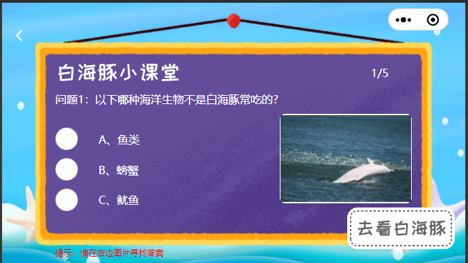
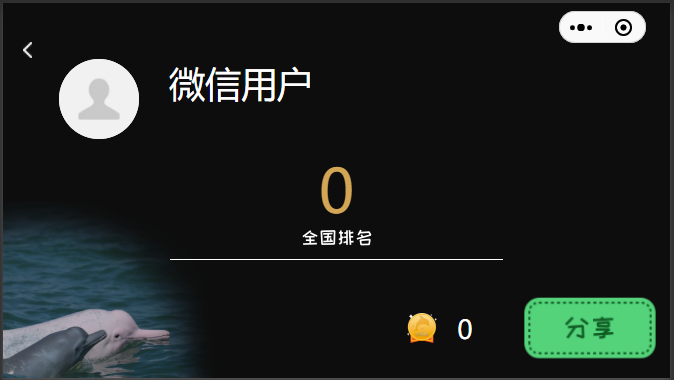

# 流程图

```mermaid
graph TD
	页面路((路径是主包/pages))
	
    index(index) --> home(home)
    home(home) --> list(list)
    list(list) --> picture(picture)
    list(list) --> topic(topic)
    list(list) --> rankShare(rankShare)
    picture(picture) --> topic(topic)
    topic(topic) --> picture(picture)
    topic(topic) --> activity(activity)
```

# 页面图片

## 说明：一共7个页面；

## index

## home

## list

## picture

## topic

## rankShare

## activity

