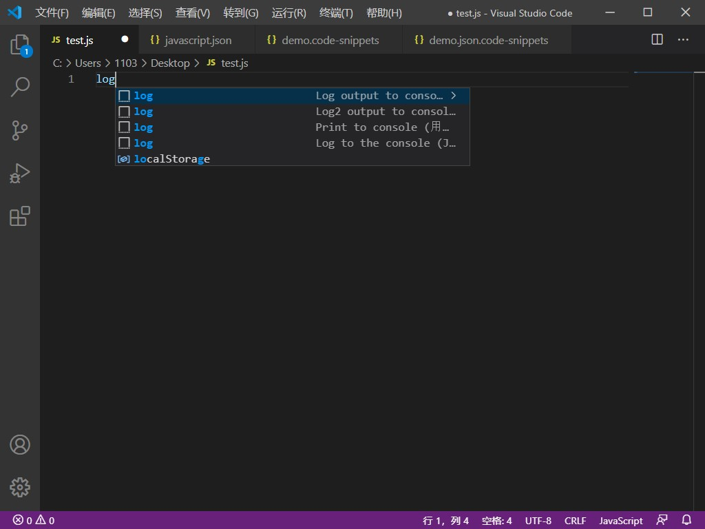
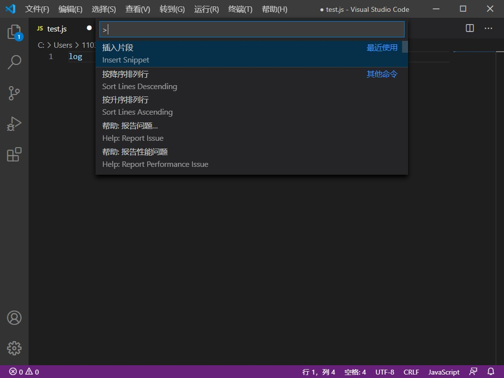
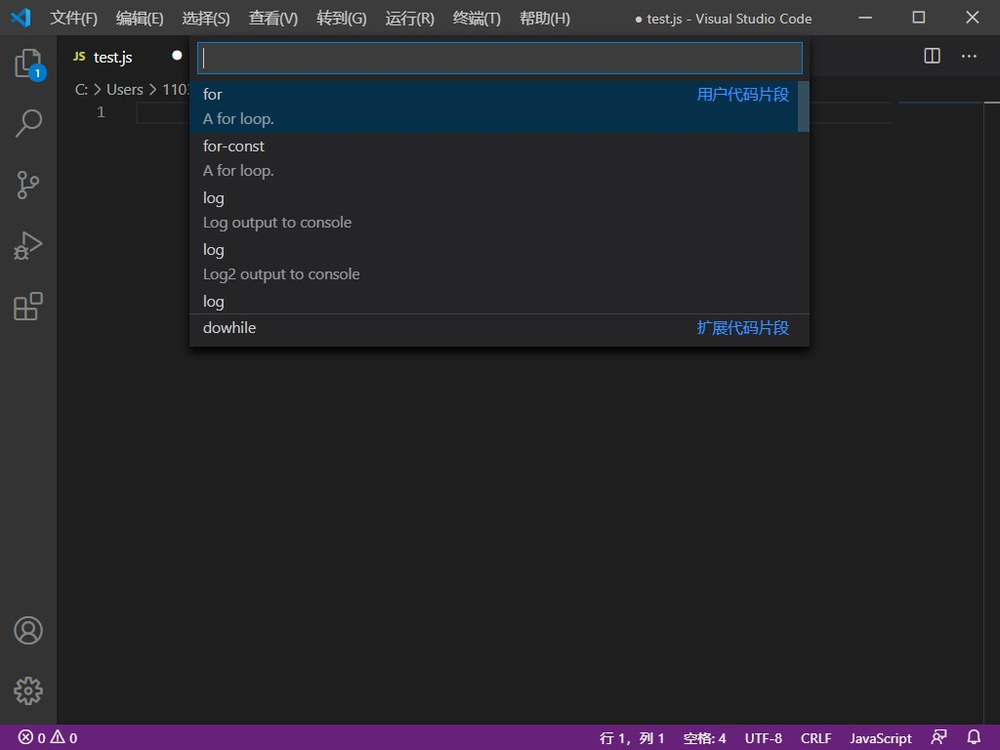

# Visual Studio代码中的代码片段

代码段是模板，可让您更轻松地输入重复的代码模式，例如循环或条件语句。

在Visual Studio Code中，代码片段会与其他建议一起出现在智能感知中，也出现在专用的代码片段选择器中（在“命令面板”中**插入代码片段**）。还支持制表符补全：使用启用它`"editor.tabCompletion": "on"`，键入一个**代码段前缀**（触发文本），然后按Tab插入一个代码段。







## 创建自己的代码段

您可以轻松定义自己的代码片段，而无需任何扩展。要创建或编辑自己的**代码段，请**在“ **文件”** > **“首选项****”**下选择“ **用户代码段****”**（在macOS上为**“** **代码”** > **“首选项** ”），然后选择要显示**代码段**的语言，如果需要，则选择“ **新建全局代码段”文件**选项。出现所有语言。VS Code为您管理基础代码段文件的创建和刷新。


代码段文件以JSON格式编写，支持C样式的注释，并且可以定义无限数量的代码段。片段支持大多数TextMate语法以实现动态行为，并根据插入上下文智能地格式化空格，并允许轻松地进行多行编辑。

以下是`for`JavaScript循环代码段的示例：

```json
// in file 'Code/User/snippets/javascript.json'
{
  "For Loop": {
    "prefix": ["for", "for-const"],
    "body": ["for (const ${2:element} of ${1:array}) {", "\t$0", "}"],
    "description": "A for loop."
  }
}
```

在上面的示例中：

- “ For Loop”是代码段名称。如果未`description`提供，则通过IntelliSense显示。
- `prefix`定义一个或多个触发词，这些触发词在IntelliSense中显示该片段。子字符串匹配是在前缀上执行的，因此，在这种情况下，“ fc”可以匹配“ for-const”。
- `body`是一个或多个内容行，插入时将作为多行内容加入。换行符和嵌入的选项卡将根据插入代码段的上下文进行格式化。
- `description` 是IntelliSense显示的代码段的可选描述。

另外，所述`body`的例子中的上述具有三个占位符（在遍历顺序列出）： ，`${1:array}`，`${2:element}`和`$0`。您可以使用Tab快速跳到下一个占位符，此时您可以编辑占位符或再次跳到下一个占位符。结肠（如果有的话）之后的字符串是默认的文本，例如`element`在`${2:element}`。占位符遍历顺序从数字开始递增，从1开始；零是一种可选的特殊情况，它总是排在最后，并在光标位于指定位置的情况下退出摘要模式。

## 片段范围

代码片段的范围有限，因此仅建议相关代码段。片段的范围可以是：

1. 摘要所涉及的**语言（**可能是所有语言）
2. 摘要所涉及的**项目（**可能是全部）

### 语言片段范围

根据是否在以下代码中定义，每个代码段的范围都限于一种，几种或所有（“全局”）语言：

1. 一个**语言**片段文件
2. 一个**全局性**片段文件

用户定义的单语言代码段是在特定语言的代码段文件中定义的（例如`javascript.json`），您可以通过**“首选项：配置用户代码段”中**的语言标识符来访问该文件。仅在编辑其定义的语言时才能访问该代码段。

多语言和全局用户定义的代码段均在“全局”代码段文件（带有文件后缀的JSON `.code-snippets`）中定义，也可以通过**“首选项：配置用户代码段”进行访问**。在全局代码段文件中，代码段定义可能具有`scope`采用一个或多个语言标识符的附加属性，这使该代码段仅可用于那些指定的语言。如果未提供任何`scope`属性，则全局代码段适用于**所有**语言。

大多数用户定义的代码段的范围仅限于一种语言，因此是在特定于语言的代码段文件中定义的。

### 项目片段范围

您还可以将全局片段文件（带有文件后缀的JSON `.code-snippets`）的范围限定到您的项目。项目文件夹摘要是使用**“'...**“ **首选项：配置用户代码段”**下拉菜单中的**“**选项”选项，该**选项**位于`.vscode`文件夹中项目的根目录下。项目摘要文件可用于与该项目中的所有用户共享摘要。项目文件夹片段与全局片段相似，并且可以通过该`scope`属性将范围限定为特定语言。

## 片段语法

该`body`片段可以使用特殊的结构来控制插入光标和文字。以下是受支持的功能及其语法：

### 制表位

使用制表符，可以使编辑器光标在摘要内移动。使用`$1`，`$2`指定游标的位置，。该数字是将按`$0`Tab键访问的顺序，而表示最终光标的位置。相同的Tabstop的多次出现被链接并同步更新。

### 占位符

占位符是带有值的制表符，例如`${1:foo}`。将插入并选择占位符文本，以便可以轻松更改它。占位符可以嵌套，例如`${1:another ${2:placeholder}}`。

### 选择

占位符可以选择作为值。语法是用逗号分隔的值枚举，例如用竖线字符括起来`${1|one,two,three|}`。插入代码段并选择占位符后，选项将提示用户选择其中一个值。

### 变量

使用`$name`或`${name:default}`，您可以插入变量的值。如果未设置变量，则将其**默认值**或空字符串插入。当变量未知（即未定义其名称）时，将插入该变量的名称，并将其转换为占位符。

### 变量

使用`$name`或`${name:default}`，您可以插入变量的值。如果未设置变量，则将其**默认值**或空字符串插入。当变量未知（即未定义其名称）时，将插入该变量的名称，并将其转换为占位符。

可以使用以下变量：

- `TM_SELECTED_TEXT` 当前选择的文本或空字符串
- `TM_CURRENT_LINE` 当前行的内容
- `TM_CURRENT_WORD` 光标下的单词内容或空字符串
- `TM_LINE_INDEX` 基于零索引的行号
- `TM_LINE_NUMBER` 基于一索引的行号
- `TM_FILENAME` 当前文档的文件名
- `TM_FILENAME_BASE` 当前文档的文件名，不带扩展名
- `TM_DIRECTORY` 当前文件的目录
- `TM_FILEPATH` 当前文档的完整文件路径
- `CLIPBOARD` 剪贴板中的内容
- `WORKSPACE_NAME` 打开的工作空间或文件夹的名称

要插入当前日期和时间：

- `CURRENT_YEAR` 本年度
- `CURRENT_YEAR_SHORT` 本年度的最后两位数字
- `CURRENT_MONTH` 以两位数表示的月份（例如“ 02”）
- `CURRENT_MONTH_NAME` 月的全名（例如“七月”）
- `CURRENT_MONTH_NAME_SHORT` 月的简称（例如“ Jul”）
- `CURRENT_DATE` 一个月中的某天
- `CURRENT_DAY_NAME` 一天的名称（例如“星期一”）
- `CURRENT_DAY_NAME_SHORT` 一天的简称（例如“ Mon”）
- `CURRENT_HOUR` 24小时制的当前小时
- `CURRENT_MINUTE` 当前分钟
- `CURRENT_SECOND` 当前秒
- `CURRENT_SECONDS_UNIX` 自Unix时代以来的秒数

要插入行或块注释，请遵循当前语言：

- `BLOCK_COMMENT_START`输出示例：用PHP `/*`或HTML`<!--`
- `BLOCK_COMMENT_END`输出示例：用PHP `*/`或HTML`-->`
- `LINE_COMMENT` 示例输出：在PHP中 `//`

以下代码段可插入`/* Hello World */`JavaScript文件和`<!-- Hello World -->`HTML文件中：

```json
{
  "hello": {
    "scope": "javascript,html",
    "prefix": "hello",
    "body": "$BLOCK_COMMENT_START Hello World $BLOCK_COMMENT_END"
  }
}
```

 

------

参考：

https://code.visualstudio.com/docs/editor/userdefinedsnippets