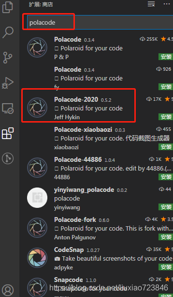
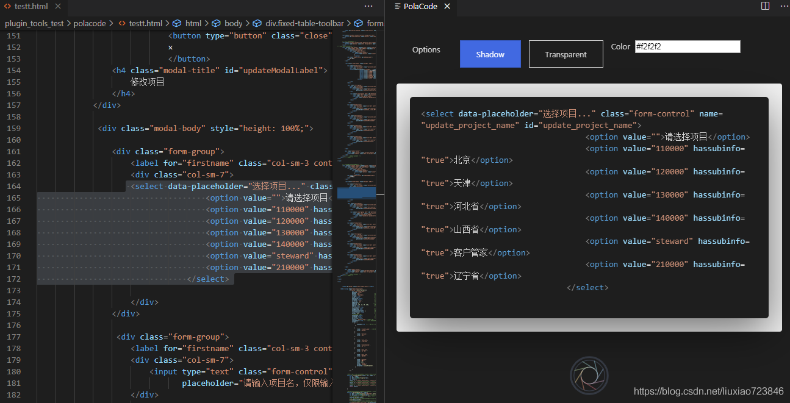

今天介绍一款在vscode中对代码截图的插件——polacode，

安装插件：

 

 

选择polacode-2020 安装即可。

使用：

打开代码编辑页面，然后按"ctrl+shift+p" ，输入polacode、回车即可。接下来，选中代码，就会生成对应的截图，我们还可以设置大小、透明度、边框、颜色... 最后，点击最下方生成图片按钮。

 

 

 

 

------

参考：

https://blog.csdn.net/liuxiao723846/article/details/107426983