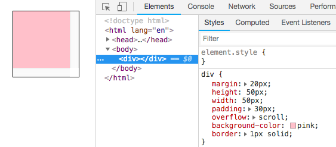
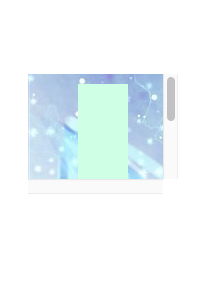
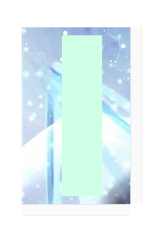
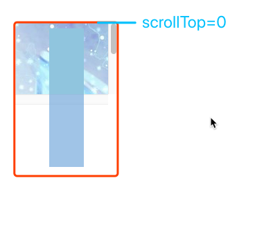
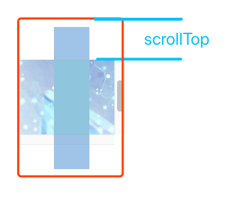
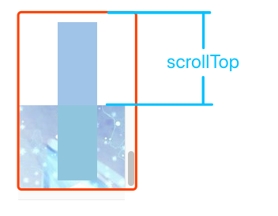
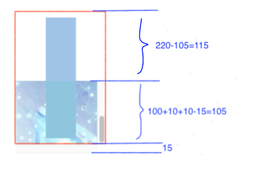

# 1、 clientHeight，只读
clientHeight  可以用公式  CSS height + CSS padding - 水平滚动条的高度 (如果存在)  来计算。


 如图，这样一个div，它的clientHeight为95，计算：50(height)+30(padding-top)+30(padding-bottom)-15(经测量滚动条高度就是15)=95

 

# 2、 clientTop，只读
一个元素顶部边框的宽度（以像素表示）。嗯。。就只是  `border-top-width` ，类似的属性还有一个 `clientLeft ，顾名思义……`

 

# 3 、offsetHeight，只读
元素的offsetHeight是一种元素CSS高度的衡量标准，包括元素的边框、内边距和元素的水平滚动条（如果存在且渲染的话），是一个整数。

还是上面的图，div的offsetHeight为112。计算：50+60(上下内边距)+2(上下边框)=112


# 4 、offsetTop，只读
HTMLElement.offsetParent 是一个只读属性，返回一个指向最近的包含该元素的定位元素。如果没有定位的元素，则 offsetParent 为最近的 table, table cell 或根元素（标准模式下为 html；quirks 模式下为 body）。当元素的 style.display 设置为 "none" 时，offsetParent 返回 null。

它返回当前元素相对于其 offsetParent 元素的顶部的距离。

还是上面那张图，div的offsetTop为20，因为margin-top是20，距离html顶部的距离是20...

# 5、 scrollHeight，只读
```html
<!DOCTYPE html>
<html lang="en">
<head>
    <meta charset="UTF-8">
    <title>Document</title>
    <style>
        #outer {
            margin: 100px 50px;
            background: url(http://images.cnblogs.com/cnblogs_com/wenruo/873448/o_esdese.jpg);
            height: 100px;
            width: 50px;
            padding: 10px 50px;
            overflow: scroll;
        } 
        #inner {
            height: 200px;
            width: 50px;
            background-color: #d0ffe3;
        }
    </style>
</head>
<body>
    <div id="outer">
        <div id="inner"></div>
    </div>
</body>
</html>
````
因为限制了父元素的高度，所以不能全部显示子元素，设置了overflow之后，可以通过滚动条的形式滑动查看子元素。效果如图1，如果没有限制父元素的高度，那么效果将如图2显示。

|  |  |
| :----------------------------------------------------------: | :----------------------------------------------------------: |
|                           图（1）                            |                           图（2）                            |


scrollHeight就是图2的高度，没有高度限制时，能够完全显示子元素时的高度（clientHeight）。

所以这里scrollHeight为220，计算：200+10+10=220


# 6、 scrollTop，可写
是这些元素中唯一一个可写可读的。






所以当滚动条在最顶端的时候， scrollTop=0 ，当滚动条在最低端的时候， scrollTop=115 

这个115怎么来的（滚动条高度是15，作者量的），见下图。


crollTop是一个整数。

如果一个元素不能被滚动，它的scrollTop将被设置为0。

设置scrollTop的值小于0，scrollTop 被设为0。

如果设置了超出这个容器可滚动的值, scrollTop 会被设为最大值。

判定元素是否滚动到底：
```javascript
element.scrollHeight - element.scrollTop === element.clientHeight
```
返回顶部
```javascript
element.scrollTop = 0
```
一个简单的返回顶部的例子，一个需要注意的地方是，动画是由快到慢的。


```html
<!DOCTYPE html>
<html lang="en">
<head>
    <meta charset="UTF-8">
    <title>返回顶部</title>
    <style>
        #outer { height: 100px; width: 100px; padding: 10px 50px; border: 1px solid; overflow: auto; }
    </style>
</head>
<body>
    <div id="outer">
        <div id="inner"></div>
    </div>
    <button onclick="toTop(outer)">返回顶部</button>
    <script>
        function toTop(ele) {
            // ele.scrollTop = 0;
            let dy = ele.scrollTop / 4; // 每次更新scrollTop改变的大小
            if (ele.scrollTop > 0) {
                ele.scrollTop -= Math.max(dy, 10);
                setTimeout(() => {
                    toTop(ele, dy);
                }, 30);
            }
        }
        // 初始化
        window.onload = () => {
            for (let i = 0; i < 233; i++) inner.innerText += `第${i}行\n`;
        }
    </script>
</body>
</html>
```


