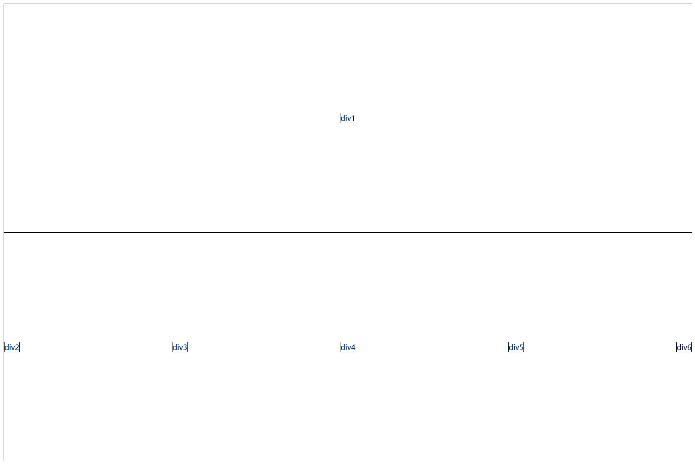

# 1 注意
需要对齐的元素的父元素dispaly的值必须为box

box-align值为center时，子元素为垂直居中

box-pack 属性规定当框大于子元素的尺寸，在何处放置子元素。该属性规定水平框中的水平位置，以及垂直框中的垂直位置。 

# 2 对于水平框，box-pack值为center时，子元素水平居中
## HTML代码：

```html
<div id="parent1">
    <div id="div1">
        div1
    </div>
</div>

```
## CSS代码：
```css
div{
    border: solid black 1px;
}
#parent1{
    width: 100%;
    height: 500px;
    display: -webkit-box;
    display: -moz-box;
    -webkit-box-align: center;
    -moz-box-align: center;
    -moz-box-pack: center;
    -webkit-box-pack: center;
}

```

# 3 当box-pack值为justify时，子元素分散对齐
## HTML代码：

```html
<div id="parent2">
    <div id="div2">
        div2
    </div>
    <div id="div3">
        div3
    </div>
    <div id="div4">
        div4
    </div>
    <div id="5">
        div5
    </div>
    <div id="div6">
        div6
    </div>
</div>
```

 ## CSS代码：


```css
#parent2{
    width: 100%;
    height: 500px;
    display: -webkit-box;
    display: -moz-box;
    -webkit-box-align: center;
    -moz-box-align: center;
    -moz-box-pack: justify;
    -webkit-box-pack: justify;
}
```


效果图：




--------------------

转载：https://blog.csdn.net/good_zwn/article/details/82025857