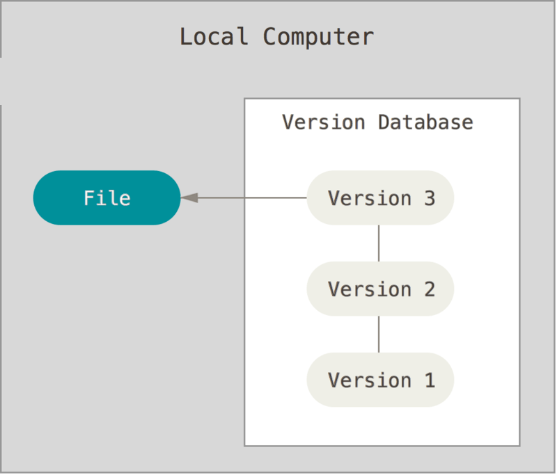

# 一、什么是git

git是一个开源的分布式版本控制系统，可以有效、高速地处理从很小到非常大的项目版本管理。

Git 是 Linus Torvalds 为了帮助管理 Linux 内核开发而开发的一个开放源码的版本控制软件。

Git 与常用的版本控制工具 CVS, Subversion 等不同，它采用了分布式版本库的方式，不必服务器端软件支持。

# 二、为什么要用版本控制系统呢？

**举个例子：**

如果你用Microsoft Word写过长篇大论，那你一定有这样的经历：

想删除一个段落，又怕将来想恢复找不回来怎么办？有办法，先把当前文件“另存为……”一个新的Word文件，再接着改，改到一定程度，再“另存为……”一个新文件，这样一直改下去，最后你的Word文档变成了这样：

过了一周，你想找回被删除的文字，但是已经记不清删除前保存在哪个文件里了，只好一个一个文件去找，真麻烦。

看着一堆乱七八糟的文件，想保留最新的一个，然后把其他的删掉，又怕哪天会用上，还不敢删，真郁闷。

更要命的是，有些部分需要你的财务同事帮助填写，于是你把文件Copy到U盘里给她（也可能通过Email发送一份给她），然后，你继续修改Word文件。一天后，同事再把Word文件传给你，此时，你必须想想，发给她之后到你收到她的文件期间，你作了哪些改动，得把你的改动和她的部分合并，真困难。

于是你想，如果有一个软件，不但能自动帮我记录每次文件的改动，还可以让同事协作编辑，这样就不用自己管理一堆类似的文件了，也不需要把文件传来传去。如果想查看某次改动，只需要在软件里瞄一眼就可以，岂不是很方便？

这个软件用起来就应该像这个样子，能记录每次文件的改动：

| 版本 | 文件名      | 用户 | 说明                   | 日期       |
| :--- | :---------- | :--- | :--------------------- | :--------- |
| 1    | service.doc | 张三 | 删除了软件服务条款5    | 7/12 10:38 |
| 2    | service.doc | 张三 | 增加了License人数限制  | 7/12 18:09 |
| 3    | service.doc | 李四 | 财务部门调整了合同金额 | 7/13 9:51  |
| 4    | service.doc | 张三 | 延长了免费升级周期     | 7/14 15:17 |

**再举个例子：**

假设你在的公司要上线一个新功能，你们开发团队为实现这个新功能，写了大约5000行代码，上线没2天，就发现这个功能用户并不喜欢，你老板让你去掉这个功能，你怎么办？你说简单，直接把5000行代码去掉就行了，但是我的亲，说的简单，你的这个功能写了3周时间，但你还能记得你是新增加了哪5000行代码么？所以你急需要一个工具，能帮你记录每次对代码做了哪些修改，并且可以轻易的把代码回滚到历史上的某个状态。 这个神奇的工具就叫做版本控制。 

##  关于版本控制

什么是“版本控制”？我为什么要关心它呢？ 版本控制是一种记录一个或若干文件内容变化，以便将来查阅特定版本修订情况的系统，你可以对任何类型的文件进行版本控制。

如果你是位图形或网页设计师，可能会需要保存某一幅图片或页面布局文件的所有修订版本（这或许是你非常渴望拥有的功能），采用版本控制系统（VCS）是个明智的选择。 有了它你就可以将选定的文件回溯到之前的状态，甚至将整个项目都回退到过去某个时间点的状态，你可以比较文件的变化细节，查出最后是谁修改了哪个地方，从而找出导致怪异问题出现的原因，又是谁在何时报告了某个功能缺陷等等。 使用版本控制系统通常还意味着，就算你乱来一气把整个项目中的文件改的改删的删，你也照样可以轻松恢复到原先的样子。 但额外增加的工作量却微乎其微。

### 本地版本控制系统

许多人习惯用复制整个项目目录的方式来保存不同的版本，或许还会改名加上备份时间以示区别。 这么做唯一的好处就是简单，但是特别容易犯错。 有时候会混淆所在的工作目录，一不小心会写错文件或者覆盖意想外的文件。

为了解决这个问题，人们很久以前就开发了许多种本地版本控制系统，大多都是采用某种简单的数据库来记录文件的历次更新差异。

TODO，这图片需要编辑

其中最流行的一种叫做 RCS，现今许多计算机系统上都还看得到它的踪影。 [RCS](https://www.gnu.org/software/rcs/) 的工作原理是在硬盘上保存补丁集（补丁是指文件修订前后的变化）；通过应用所有的补丁，可以重新计算出各个版本的文件内容。

### 集中式版本控制系统

接下来人们又遇到一个问题，如何让在不同系统上的开发者协同工作？ 于是，集中化的版本控制系统（Centralized Version Control Systems，简称 CVCS）应运而生。 这类系统，诸如 CVS、Subversion 以及 Perforce 等，都有一个单一的集中管理的服务器，保存所有文件的修订版本，而协同工作的人们都通过客户端连到这台服务器，取出最新的文件或者提交更新。 多年以来，这已成为版本控制系统的标准做法。

这种做法带来了许多好处，特别是相较于老式的本地 VCS 来说。 现在，每个人都可以在一定程度上看到项目中的其他人正在做些什么。 而管理员也可以轻松掌控每个开发者的权限，并且管理一个 CVCS 要远比在各个客户端上维护本地数据库来得轻松容易。

事分两面，有好有坏。 这么做最显而易见的缺点是中央服务器的单点故障。 如果宕机一小时，那么在这一小时内，谁都无法提交更新，也就无法协同工作。 如果中心数据库所在的磁盘发生损坏，又没有做恰当备份，毫无疑问你将丢失所有数据——包括项目的整个变更历史，只剩下人们在各自机器上保留的单独快照。 本地版本控制系统也存在类似问题，只要整个项目的历史记录被保存在单一位置，就有丢失所有历史更新记录的风险。

### 分布式版本控制系统

于是分布式版本控制系统（Distributed Version Control System，简称 DVCS）面世了。 在这类系统中，像 Git、Mercurial、Bazaar 以及 Darcs 等，客户端并不只提取最新版本的文件快照， 而是把代码仓库完整地镜像下来，包括完整的历史记录。 这么一来，任何一处协同工作用的服务器发生故障，事后都可以用任何一个镜像出来的本地仓库恢复。 因为每一次的克隆操作，实际上都是一次对代码仓库的完整备份。

更进一步，许多这类系统都可以指定和若干不同的远端代码仓库进行交互。籍此，你就可以在同一个项目中，分别和不同工作小组的人相互协作。 你可以根据需要设定不同的协作流程，比如层次模型式的工作流，而这在以前的集中式系统中是无法实现的。****

## Git的诞生

很多人都知道，Linus Torvalds在1991年创建了开源的Linux，从此，Linux系统不断发展，已经成为最大的服务器系统软件了。

Linus虽然创建了Linux，但Linux的壮大是靠全世界热心的志愿者参与的， 绝大多数的 Linux 内核维护工作都花在了提交补丁和保存归档的繁琐事务上（1991－2002年间）。 到 2002 年，整个项目组开始启用一个专有的分布式版本控制系统 BitKeeper 来管理和维护代码。

不过，到了2002年，Linux系统已经发展了十年了，代码库之大让Linus很难继续通过手工方式管理了，社区的弟兄们也对这种方式表达了强烈不满，于是Linus选择了一个商业的版本控制系统BitKeeper，BitKeeper的东家BitMover公司出于人道主义精神，授权Linux社区免费使用这个版本控制系统。

到了 2005 年，开发 BitKeeper 的商业公司同 Linux 内核开源社区的合作关系结束，他们收回了 Linux 内核社区免费使用 BitKeeper 的权力。 这就迫使 Linux 开源社区（特别是 Linux 的缔造者 Linus Torvalds）基于使用 BitKeeper 时的经验教训，开发出自己的版本系统。