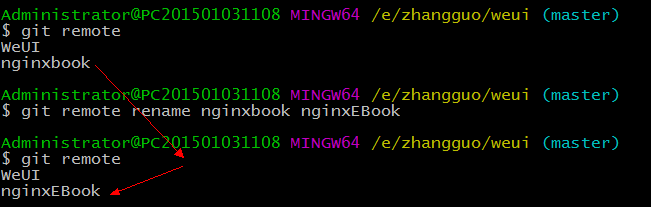
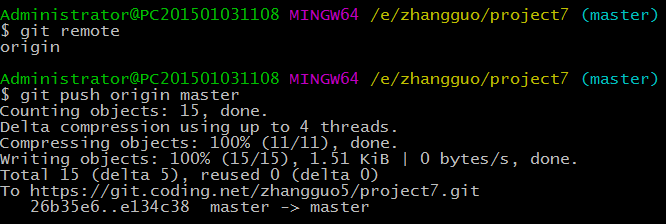

# 远程仓库

Git是分布式版本控制系统，同一个Git仓库，可以分布到不同的机器上，但开发参与者必须在同一个网络中，且必须有一个项目的原始版本，通常的办法是让一台电脑充当服务器的角色，每天24小时开机，其他每个人都从这个“服务器”仓库克隆一份到自己的电脑上，并且各自把各自的提交推送到服务器仓库里，也从服务器仓库中拉取别人的提交。完全可以自己搭建一台运行Git的服务器但现在更适合的做法是使用免费的托管平台。


## 托管平台

### GitHub

项目容量限制为 1G，上传文件限制 100M，公有库和私有库数量不受限制，私有库协作者数量限制 3 人


### 码云（Gitee）

https://gitee.com/


### coding.net

https://coding.net/


### bitbucket

https://bitbucket.org/

bitbucket**免费支持5个开发成员的团队创建无限私有代码托管库**


## 使用SSH作为远程仓库传输协议

本地Git仓库和远程仓库之间的传输有两种协议，

一种是https协议，每次使用需要输入账号密码，

另一种是SSH协议，在本地生成SSH key后，将开公钥配置的远程仓库的账户设置即可每次使用不需要重复需要账号密码。

创建SSH Key。在用户主目录下，看看有没有.ssh目录，如果有，再看看这个目录下有没有`id_rsa`和`id_rsa.pub`这两个文件，如果已经有了，可直接跳到下一步。如果没有，打开Shell（Windows下打开Git Bash），创建SSH Key：

```bash
$ ssh-keygen -t rsa -C "youremail@example.com"
```

你需要把邮件地址换成你自己的邮件地址，然后一路回车，使用默认值即可，由于这个Key也不是用于军事目的，所以也无需设置密码。

如果一切顺利的话，可以在用户主目录里找到`.ssh`目录，里面有`id_rsa`和`id_rsa.pub`两个文件，这两个就是SSH Key的秘钥对，`id_rsa`是私钥，不能泄露出去，`id_rsa.pub`是公钥，可以放心地告诉任何人。

## 使用GitHUb作为托管平台

第1步：注册账号

第2步：登陆GitHub，打开“Account settings”，“SSH Keys”页面：

然后，点“Add SSH Key”，填上任意Title，在Key文本框里粘贴`id_rsa.pub`文件的内容：


点“Add Key”，你就应该看到已经添加的Key：


### 添加远程库

现在的情景是，本地创建了一个Git仓库后，又想在GitHub创建一个Git仓库，并且让这两个仓库进行远程同步，这样，GitHub上的仓库既可以作为备份，又可以让其他人通过该仓库来协作，真是一举多得。

首先，登陆GitHub，然后，在右上角找到“Create a new repo”按钮，创建一个新的仓库：


在Repository name填入`learngit`，其他保持默认设置，点击“Create repository”按钮，就成功地创建了一个新的Git仓库：


目前，在GitHub上的这个`learngit`仓库还是空的，GitHub告诉我们，可以从这个仓库克隆出新的仓库，也可以把一个已有的本地仓库与之关联，然后，把本地仓库的内容推送到GitHub仓库。

现在，我们根据GitHub的提示，在本地的`learngit`仓库下运行命令：

```bash
$ git remote add origin git@github.com:karl-man/learngit.git
```

请千万注意，把上面的`michaelliao`替换成你自己的GitHub账户名，否则，你在本地关联的就是我的远程库，关联没有问题，但是你以后推送是推不上去的，因为你的SSH Key公钥不在我的账户列表中。

添加后，远程库的名字就是`origin`，这是Git默认的叫法，也可以改成别的，但是`origin`这个名字一看就知道是远程库。

下一步，就可以把本地库的所有内容推送到远程库上：

```bash
$ git push -u origin master
Counting objects: 20, done.
Delta compression using up to 4 threads.
Compressing objects: 100% (15/15), done.
Writing objects: 100% (20/20), 1.64 KiB | 560.00 KiB/s, done.
Total 20 (delta 5), reused 0 (delta 0)
remote: Resolving deltas: 100% (5/5), done.
To github.com:michaelliao/learngit.git
 * [new branch]      master -> master
Branch 'master' set up to track remote branch 'master' from 'origin'.
```

把本地库的内容推送到远程，用`git push`命令，实际上是把当前分支`master`推送到远程。

由于远程库是空的，我们第一次推送`master`分支时，加上了`-u`参数，Git不但会把本地的`master`分支内容推送的远程新的`master`分支，还会把本地的`master`分支和远程的`master`分支关联起来，在以后的推送或者拉取时就可以简化命令。


推送成功后，可以立刻在GitHub页面中看到远程库的内容已经和本地一模一样：


从现在起，只要本地作了提交，就可以通过命令：

```bash
$ git push origin master
```

把本地`master`分支的最新修改推送至GitHub，现在，你就拥有了真正的分布式版本库！

### SSH警告

当你第一次使用Git的`clone`或者`push`命令连接GitHub时，会得到一个警告：

```bash
The authenticity of host 'github.com (xx.xx.xx.xx)' can't be established.
RSA key fingerprint is xx.xx.xx.xx.xx.
Are you sure you want to continue connecting (yes/no)?
```

这是因为Git使用SSH连接，而SSH连接在第一次验证GitHub服务器的Key时，需要你确认GitHub的Key的指纹信息是否真的来自GitHub的服务器，输入`yes`回车即可。

Git会输出一个警告，告诉你已经把GitHub的Key添加到本机的一个信任列表里了：

```bash
Warning: Permanently added 'github.com' (RSA) to the list of known hosts.
```

这个警告只会出现一次，后面的操作就不会有任何警告了。

如果你实在担心有人冒充GitHub服务器，输入`yes`前可以对照[GitHub的RSA Key的指纹信息](https://help.github.com/articles/what-are-github-s-ssh-key-fingerprints/)是否与SSH连接给出的一致。

### 删除远程库

如果添加的时候地址写错了，或者就是想删除远程库，可以用`git remote rm <name>`命令。使用前，建议先用`git remote -v`查看远程库信息：

```bash
$ git remote -v
origin  git@github.com:michaelliao/learn-git.git (fetch)
origin  git@github.com:michaelliao/learn-git.git (push)
```

然后，根据名字删除，比如删除`origin`：

```bash
$ git remote rm origin
```

此处的“删除”其实是解除了本地和远程的绑定关系，并不是物理上删除了远程库。远程库本身并没有任何改动。要真正删除远程库，需要登录到GitHub，在后台页面找到删除按钮再删除。

### 从远程库克隆

上次我们讲了先有本地库，后有远程库的时候，如何关联远程库。

现在，假设我们从零开发，那么最好的方式是先创建远程库，然后，从远程库克隆。

首先，登陆GitHub，创建一个新的仓库，名字叫`gitskills`：


我们勾选`Initialize this repository with a README`，这样GitHub会自动为我们创建一个`README.md`文件。创建完毕后，可以看到`README.md`文件：


现在，远程库已经准备好了，下一步是用命令`git clone`克隆一个本地库：

```bash
$ git clone git@github.com:michaelliao/gitskills.git
Cloning into 'gitskills'...
remote: Counting objects: 3, done.
remote: Total 3 (delta 0), reused 0 (delta 0), pack-reused 3
Receiving objects: 100% (3/3), done.
```

注意把Git库的地址换成你自己的，然后进入`gitskills`目录看看，已经有`README.md`文件了：

```bash
$ cd gitskills
$ ls
README.md
```

## 使用Gitee作为托管平台

使用GitHub时，国内的用户经常遇到的问题是访问速度太慢，有时候还会出现无法连接的情况（原因你懂的）。

如果我们希望体验Git飞一般的速度，可以使用国内的Git托管服务——[Gitee](https://gitee.com/?utm_source=blog_lxf)（[gitee.com](https://gitee.com/?utm_source=blog_lxf)）。

和GitHub相比，Gitee也提供免费的Git仓库。此外，还集成了代码质量检测、项目演示等功能。对于团队协作开发，Gitee还提供了项目管理、代码托管、文档管理的服务，5人以下小团队免费。

 Gitee的免费版本也提供私有库功能，只是有5人的成员上限。

使用Gitee和使用GitHub类似，在Gitee上注册账号并登录后，需要先上传自己的SSH公钥。选择右上角用户头像 -> 菜单“修改资料”，然后选择“SSH公钥”，填写一个便于识别的标题，然后把用户主目录下的`.ssh/id_rsa.pub`文件的内容粘贴进去：


点击“确定”即可完成并看到刚才添加的Key：


如果我们已经有了一个本地的git仓库（例如，一个名为learngit的本地库），如何把它关联到Gitee的远程库上呢？

首先，我们在Gitee上创建一个新的项目，选择右上角用户头像 -> 菜单“控制面板”，然后点击“创建项目”：


项目名称最好与本地库保持一致：

然后，我们在本地库上使用命令`git remote add`把它和Gitee的远程库关联：

```bash
git remote add origin git@gitee.com:liaoxuefeng/learngit.git
```

之后，就可以正常地用`git push`和`git pull`推送了！

如果在使用命令`git remote add`时报错：

```bash
git remote add origin git@gitee.com:liaoxuefeng/learngit.git
fatal: remote origin already exists.
```

这说明本地库已经关联了一个名叫`origin`的远程库，此时，可以先用`git remote -v`查看远程库信息：

```bash
git remote -v
origin	git@github.com:michaelliao/learngit.git (fetch)
origin	git@github.com:michaelliao/learngit.git (push)
```

可以看到，本地库已经关联了`origin`的远程库，并且，该远程库指向GitHub。

我们可以删除已有的GitHub远程库：

```bash
git remote rm origin
```

再关联Gitee的远程库（注意路径中需要填写正确的用户名）：

```bash
git remote add origin git@gitee.com:liaoxuefeng/learngit.git
```

此时，我们再查看远程库信息：

```bash
git remote -v
origin	git@gitee.com:liaoxuefeng/learngit.git (fetch)
origin	git@gitee.com:liaoxuefeng/learngit.git (push)
```

现在可以看到，origin已经被关联到Gitee的远程库了。通过`git push`命令就可以把本地库推送到Gitee上。

有的小伙伴又要问了，一个本地库能不能既关联GitHub，又关联Gitee呢？

答案是肯定的，因为git本身是分布式版本控制系统，可以同步到另外一个远程库，当然也可以同步到另外两个远程库。

使用多个远程库时，我们要注意，git给远程库起的默认名称是`origin`，如果有多个远程库，我们需要用不同的名称来标识不同的远程库。

仍然以`learngit`本地库为例，我们先删除已关联的名为`origin`的远程库：

```bash
git remote rm origin
```

然后，先关联GitHub的远程库：

```bash
git remote add github git@github.com:michaelliao/learngit.git
```

注意，远程库的名称叫`github`，不叫`origin`了。

接着，再关联Gitee的远程库：

```bash
git remote add gitee git@gitee.com:liaoxuefeng/learngit.git
```

同样注意，远程库的名称叫`gitee`，不叫`origin`。

现在，我们用`git remote -v`查看远程库信息，可以看到两个远程库：

```bash
git remote -v
gitee	git@gitee.com:liaoxuefeng/learngit.git (fetch)
gitee	git@gitee.com:liaoxuefeng/learngit.git (push)
github	git@github.com:michaelliao/learngit.git (fetch)
github	git@github.com:michaelliao/learngit.git (push)
```

如果要推送到GitHub，使用命令：

```bash
git push github master
```

如果要推送到Gitee，使用命令：

```bash
git push gitee master
```

这样一来，我们的本地库就可以同时与多个远程库互相同步：

```ascii
┌─────────┐ ┌─────────┐
│ GitHub  │ │  Gitee  │
└─────────┘ └─────────┘
     ▲           ▲
     └─────┬─────┘
           │
    ┌─────────────┐
    │ Local Repo  │
    └─────────────┘
```

Gitee也同样提供了Pull request功能，可以让其他小伙伴参与到开源项目中来。

## 远程仓库操作

申请到了Git远程仓库的帐号并创建了一个空的远程仓库现在我们就可以结合本地的仓库与远程仓库一起协同工作了，模拟多人协同开发，这里我们全部使用命令完成。

### 常用操作指令

```bash
# 下载远程仓库的所有变动
$ git fetch [remote]

# 显示所有远程仓库
$ git remote -v

# 显示某个远程仓库的信息
$ git remote show [remote]

# 增加一个新的远程仓库，并命名
$ git remote add [shortname] [url]

# 取回远程仓库的变化，并与本地分支合并
$ git pull [remote] [branch]

# 上传本地指定分支到远程仓库
$ git push [remote] [branch]

# 强行推送当前分支到远程仓库，即使有冲突
$ git push [remote] --force

# 推送所有分支到远程仓库
$ git push [remote] --all

#简单查看远程---所有仓库
git remote  （只能查看远程仓库的名字）#查看单个仓库
git  remote show [remote-branch-name]

#新建远程仓库
git remote add [branchname]  [url]

#修改远程仓库
git remote rename [oldname] [newname]

#删除远程仓库
git remote rm [remote-name]

#获取远程仓库数据
git fetch [remote-name] (获取仓库所有更新，但不自动合并当前分支)
git pull (获取仓库所有更新，并自动合并到当前分支)

#上传数据，如git push origin master
git push [remote-name] [branch]
```

###git clone 克隆

远程操作的第一步，通常是从远程主机克隆一个版本库，这时就要用到`git clone`命令。

```bash
$ git clone <版本库的网址>
```

比如，克隆一个上课示例的版本库。

```bash
$ git clone https://github.com/zhangguo5/AngularJS04_BookStore.git
```

该命令会在本地主机生成一个目录，与远程主机的版本库同名。如果要指定不同的目录名，可以将目录名作为`git clone`命令的第二个参数。

```bash
$ git clone <版本库的网址> <本地目录名>
```

`git clone`支持多种协议，除了HTTP(s)以外，还支持SSH、Git、本地文件协议等，下面是一些例子。

[](javascript:void(0);)

```bash
$ git clone http[s]://example.com/path/to/repo.git/
$ git clone ssh://example.com/path/to/repo.git/
$ git clone git://example.com/path/to/repo.git/
$ git clone /opt/git/project.git 
$ git clone file:///opt/git/project.git
$ git clone ftp[s]://example.com/path/to/repo.git/
$ git clone rsync://example.com/path/to/repo.git/
```

[](javascript:void(0);)

SSH协议还有另一种写法。

```bash
$ git clone [user@]example.com:path/to/repo.git/
```

通常来说，Git协议下载速度最快，SSH协议用于需要用户认证的场合。各种协议优劣的详细讨论请参考 [官方文档](http://git-scm.com/book/en/Git-on-the-Server-The-Protocols)。

示例：


结果：


### git remote

为了便于管理，Git要求每个远程主机都必须指定一个主机名。`git remote`命令就用于管理主机名。

不带选项的时候，`git remote`命令列出所有远程主机。

```bash
$ git remote
```

 

使用`-v`选项，可以参看远程主机的网址。

```bash
$ git remote -v
```

 

上面命令表示，当前只有一台远程主机，叫做origin，以及它的网址。

克隆版本库的时候，所使用的远程主机自动被Git命名为`origin`。如果想用其他的主机名，需要用`git clone`命令的`-o`选项指定。

```bash
$ git clone -o WeUI https://github.com/Tencent/weui.git
$ git remote
```

 

上面命令表示，克隆的时候，指定远程主机叫做WeUI。

`git remote show`命令加上主机名，可以查看该主机的详细信息。

```bash
$ git remote show <主机名>
```

 

`git remote add`命令用于添加远程主机。

```bash
$ git remote add <主机名> <网址>
```

 

`git remote rm`命令用于删除远程主机。

```bash
$ git remote rm <主机名>
```

 

`git remote rename`命令用于远程主机的改名。

```bash
$ git remote rename <原主机名> <新主机名>
```

 

### git fetch

一旦远程主机的版本库有了更新（Git术语叫做commit），需要将这些更新取回本地，这时就要用到`git fetch`命令。

```bash
$ git fetch <远程主机名>
```

 

上面命令将某个远程主机的更新，全部取回本地。

`git fetch`命令通常用来查看其他人的进程，因为它取回的代码对你本地的开发代码没有影响。

默认情况下，`git fetch`取回所有分支（branch）的更新。如果只想取回特定分支的更新，可以指定分支名。

```bash
$ git fetch <远程主机名> <分支名>
```

 

比如，取回`origin`主机的`master`分支。

```bash
$ git fetch origin master
```

所取回的更新，在本地主机上要用"远程主机名/分支名"的形式读取。比如`origin`主机的`master`，就要用`origin/master`读取。

`git branch`命令的`-r`选项，可以用来查看远程分支，`-a`选项查看所有分支。

[](javascript:void(0);)

```bash
$ git branch -r
origin/master

$ git branch -a
* master
  remotes/origin/master
```

[](javascript:void(0);)

上面命令表示，本地主机的当前分支是`master`，远程分支是`origin/master`。

取回远程主机的更新以后，可以在它的基础上，使用`git checkout`命令创建一个新的分支。

```bash
$ git checkout -b newBrach origin/master
```

上面命令表示，在`origin/master`的基础上，创建一个新分支。

此外，也可以使用`git merge`命令或者`git rebase`命令，在本地分支上合并远程分支。

```bash
$ git merge origin/master
# 或者
$ git rebase origin/master
```

上面命令表示在当前分支上，合并`origin/master`。

### git pull

`git pull`命令的作用是，取回远程主机某个分支的更新，再与本地的指定分支合并。它的完整格式稍稍有点复杂。

```bash
$ git pull <远程主机名> <远程分支名>:<本地分支名>
```

比如，取回`origin`主机的`next`分支，与本地的`master`分支合并，需要写成下面这样。

```bash
$ git pull origin next:master
```


如果远程分支是与当前分支合并，则冒号后面的部分可以省略。

```bash
$ git pull origin next
```

上面命令表示，取回`origin/next`分支，再与当前分支合并。实质上，这等同于先做`git fetch`，再做`git merge`。

```bash
$ git fetch origin
$ git merge origin/next
```

在某些场合，Git会自动在本地分支与远程分支之间，建立一种追踪关系（tracking）。比如，在`git clone`的时候，所有本地分支默认与远程主机的同名分支，建立追踪关系，也就是说，本地的`master`分支自动"追踪"`origin/master`分支。

Git也允许手动建立追踪关系。

```bash
git branch --set-upstream master origin/next
```

上面命令指定`master`分支追踪`origin/next`分支。

如果当前分支与远程分支存在追踪关系，`git pull`就可以省略远程分支名。

```bash
$ git pull origin
```

上面命令表示，本地的当前分支自动与对应的`origin`主机"追踪分支"（remote-tracking branch）进行合并。

如果当前分支只有一个追踪分支，连远程主机名都可以省略。

```bash
$ git pull
```

上面命令表示，当前分支自动与唯一一个追踪分支进行合并。

如果合并需要采用rebase模式，可以使用`--rebase`选项。

```bash
$ git pull --rebase <远程主机名> <远程分支名>:<本地分支名>
```

如果远程主机删除了某个分支，默认情况下，`git pull` 不会在拉取远程分支的时候，删除对应的本地分支。这是为了防止，由于其他人操作了远程主机，导致`git pull`不知不觉删除了本地分支。

但是，你可以改变这个行为，加上参数 `-p` 就会在本地删除远程已经删除的分支。

```bash
$ git pull -p
# 等同于下面的命令
$ git fetch --prune origin 
$ git fetch -p
```

### git push

`git push`命令用于将本地分支的更新，推送到远程主机。它的格式与`git pull`命令相仿。

```bash
$ git push <远程主机名> <本地分支名>:<远程分支名>
```

注意，分支推送顺序的写法是<来源地>:<目的地>，所以`git pull`是<远程分支>:<本地分支>，而`git push`是<本地分支>:<远程分支>。

如果省略远程分支名，则表示将本地分支推送与之存在"追踪关系"的远程分支（通常两者同名），如果该远程分支不存在，则会被新建。

```bash
$ git push origin master
```

 

上面命令表示，将本地的`master`分支推送到`origin`主机的`master`分支。如果后者不存在，则会被新建。

如果省略本地分支名，则表示删除指定的远程分支，因为这等同于推送一个空的本地分支到远程分支。

```bash
$ git push origin :master
# 等同于
$ git push origin --delete master
```

 

上面命令表示删除`origin`主机的`master`分支。

如果当前分支与远程分支之间存在追踪关系，则本地分支和远程分支都可以省略。

```bash
$ git push origin
```

上面命令表示，将当前分支推送到`origin`主机的对应分支。


如果是新建分支第一次push，会提示：
　　fatal: The current branch dev1 has no upstream branch.
　　To push the current branch and set the remote as upstream, use
　　git push --set-upstream origin dev1
　　输入这行命令，然后输入用户名和密码，就push成功了。

　　以后的push就只需要输入git push origin

原因是：

[](javascript:void(0);)

```
#因为在git的全局配置中，有一个push.default属性，其决定了git push操作的默认行为。在Git 2.0之前，这个属性的默认被设为'matching'，2.0之后则被更改为了'simple'。

#我们可以通过git version确定当前的git版本（如果小于2.0，更新是个更好的选择），通过git config --global push.default 'option'改变push.default的默认行为（或者也可直接编辑~/.gitconfig文件）。

push.default 有以下几个可选值：
nothing, current, upstream, simple, matching

其用途分别为：
nothing - push操作无效，除非显式指定远程分支，例如git push origin develop（我觉得。。。可以给那些不愿学git的同事配上此项）。
current - push当前分支到远程同名分支，如果远程同名分支不存在则自动创建同名分支。
upstream - push当前分支到它的upstream分支上（这一项其实用于经常从本地分支push/pull到同一远程仓库的情景，这种模式叫做central workflow）。
simple - simple和upstream是相似的，只有一点不同，simple必须保证本地分支和它的远程
upstream分支同名，否则会拒绝push操作。
matching - push所有本地和远程两端都存在的同名分支。
因此如果我们使用了git2.0之前的版本，push.default = matching，git push后则会推送当前分支代码到远程分支，而2.0之后，push.default = simple，如果没有指定当前分支的upstream分支，就会收到上文的fatal提示。
```

[](javascript:void(0);)

如果当前分支只有一个追踪分支，那么主机名都可以省略。

```bash
$ git push
```

如果当前分支与多个主机存在追踪关系，则可以使用`-u`选项指定一个默认主机，这样后面就可以不加任何参数使用`git push`。

```bash
$ git push -u origin master
```

上面命令将本地的`master`分支推送到`origin`主机，同时指定`origin`为默认主机，后面就可以不加任何参数使用`git push`了。

不带任何参数的`git push`，默认只推送当前分支，这叫做simple方式。此外，还有一种matching方式，会推送所有有对应的远程分支的本地分支。Git 2.0版本之前，默认采用matching方法，现在改为默认采用simple方式。如果要修改这个设置，可以采用`git config`命令。

```bash
$ git config --global push.default matching
# 或者
$ git config --global push.default simple
```

还有一种情况，就是不管是否存在对应的远程分支，将本地的所有分支都推送到远程主机，这时需要使用`--all`选项。

```bash
$ git push --all origin
```

上面命令表示，将所有本地分支都推送到`origin`主机。

如果远程主机的版本比本地版本更新，推送时Git会报错，要求先在本地做`git pull`合并差异，然后再推送到远程主机。这时，如果你一定要推送，可以使用`--force`选项。

```bash
$ git push --force origin 
```

上面命令使用`--force`选项，结果导致远程主机上更新的版本被覆盖。除非你很确定要这样做，否则应该尽量避免使用`--force`选项。

最后，`git push`不会推送标签（tag），除非使用`--tags`选项。

```bash
$ git push origin --tags
```

## 在命令行中同步本地仓库示例

假定我们创建好了一个远程仓库地址为：https://coding.net/u/zhangguo5/p/project7/git，现在我们在本地创建一个项目并同步到远程仓库中。

1）、创建文件添加到暂存区


2）、提交到本地仓库


3）、提交到远程仓库

添加远程主机地址：


推送文件：


结果：


