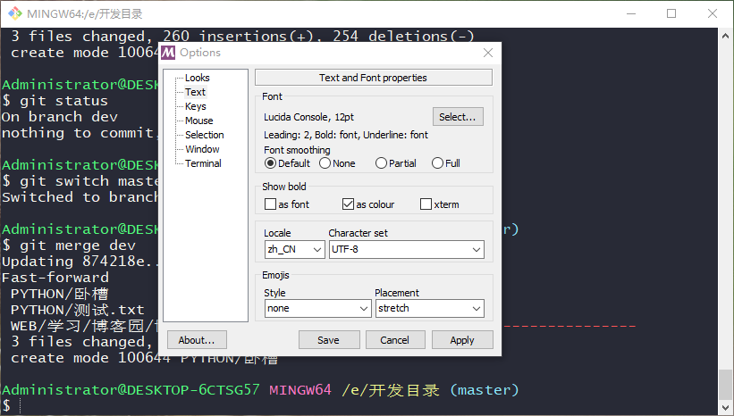

# 1 一般情况
## 1.1 git status命令
git status，显示的文件目录如果存在中文字符，则中文字符则会转成八进制显示。

## 1.2 设置
在bash右键打开 `Options` ，点击 `Text` ，在 Locale处选择 `zh_CN`，在Character set处选择 `UTF-8 `。

然后在 git bash 终端输入命令：git config --global core.quotepath false 即可。

# 2 特殊情况

如果在上面设置了之后，出现中文混乱的编码字符，而不是正常的中文或者八进制的字符，那就要将 git 完全卸载。

## 2.1 流程

首先卸载掉git，然后删掉git安装的目录，最后在 `C:\Users\Administrator` 路径，删掉所有的文件，然后重装git，再按照上面的一般情况去设置即可。