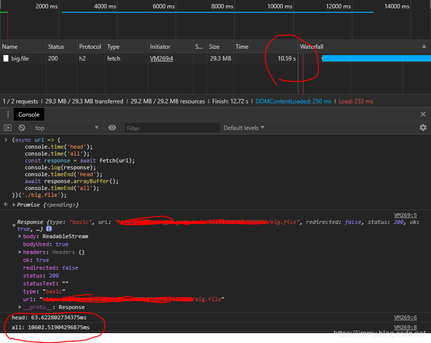

# Response.json()为啥返回一个promise？
自从基于promise的fetch api横空出世以后，AJAX也改名叫AJAJ了。处理http请求变得更简单了，但使用fetch的时候经常需要这样写：
```javascript
let response = await fetch(MY_URL);
let json         = await response.json();
```
其中第一个await很好理解，等待网络响应需要await一下，可是response对象得到以后居然还需要一次await才能从response中得到body内容，不止是json()方法，其余的parse方法都返回一个promise：

- arrayBuffer()
- blob()
- formData()
- json()
- text()
- stack上普遍认同的观点是，当http包很大的时候：

第一个promise等到head到来，第二个promise等到body到来。
第一个promise结束后，http响应并没有结束，数据仍然在传输中！

# 做个实验：

首先准备一个30m的大文件big.file，放在服务器上，然后fetch它，并利用计时器来检测响应时间：
```javascript
(async url => {
    console.time('head');
    console.time('all');
    const response = await fetch(url);
    console.log(response);
    console.timeEnd('head');
    await response.arrayBuffer();
    console.timeEnd('all');
})('./big.file');
```




图中可以看到，当response对象拿到手只经过了64ms，而等整个http请求完成却花了10s！第一个fetch()方法得到的promise远远快于第二个promise。（当然，如果是一个小文件的话，你会发现2次时间相差无几）

而64ms结束后response对象顺利的打印出来了，可以看到，Response.body属性是一个ReadableStream流，说明此时数据流仍在进行，看不到body，但是head已经可以看到了。

实验证明了上述的观点：fetch后2次promise分别对应http的head和body的传输，这种新奇的玄学现象和写法也正是由于http的特性造成的（head和body分离）。

head与body分离的特性在很多场合是非常有用的，有时候我们不需要等待http传输完成，就可以从head中得到关键信息，从而影响后面的决策，比如从head中的状态码可以预先判断请求是否成功，不必将错误信息写在body中了。


