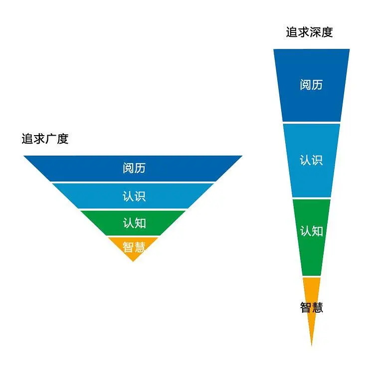

大脑是用来思考的，而不是用来记忆的！
-----

# 什么是知识体系

在说知识体系之前，我们首先要说知识，那什么是知识呢？

知识的定义是：人类认识自然和社会的成果或结晶。包括经验知识和理论知识。

毛主席《整顿党的作风》：“自从有阶级的社会存在以来，世界上的知识只有两门，一门叫做生产斗争知识，一门叫做阶级斗争知识。自然科学、社会科学，就是这两门知识的结晶，哲学则是关于自然知识和社会知识的概括和总结。

知识体系的定义：在有明确目的的前提下（迫切需要提升某个领域的知识能力和水平），有意识地整理相关的知识碎片，并将其结构化（点、线、面、体），通过合适的工具进行知识的转化，通过解决实际问题融合在个人的认知系统中，最终形成的外部实体结构化知识文档及内在的知识储备。

# 为什么要创建知识体系
在知识大爆炸的年代，知识的获取更加容易，只做输入并且是无序的输入，让大脑变成资料收集站和资料囤积站。知识缺乏关联，形成各种只是孤岛，吸收率非常低，对我们没有任何帮助，新知识的获取动力越来越弱。

**例子：**

如果你是国家的领导人，你如何管理国家的人口？以及如何在14亿人中，快速找到某一个人？

你可能会这样说：

把国家分成34的省和行政区，然后每一个行政区后面又分成若干个县市，每一个市又划分若干个区，每个区有划分小区，村庄，每个村庄又有若干个家庭，然后找到你所在的那个家庭，最后定位到你。

试问，如果没有这个索引结构，如果管理14亿人口？

再随便举一个生活的例子：

现在很多小区快递大多都是存放在寄存点，让你去拿，一个大一点的快递代理点每天要处理成千上万个，他们是如何快速定位到你的快递的？

他们会把你的快递放到一个固定的区域给每一个快递建立索引编号，然后他们会把你快递的编号告诉你，等你去拿快递的时候报编号，他们就能迅速定位到你的快递。包括商超、各种卖场、仓库等等，管理东西的方式皆是如此...

你看，这就是我们大脑的工作模式，试问如果没有建立索引，这样的快递你如何去找？

**索引就是大脑工作的方式，我们学过那么多的东西、之所以无用，之所以过不好这一生，是因为你学到的东西都是零碎的，完全没有任何可以索引的机会。**想要让学习过的知识有用，我们就必须让知识体系化。

我们的知识同样如此，如果没有给知识建立起索引，那么真正用的时候就会像上图找快递一样，不知所措，毫无头绪，大脑乱糟糟的一片。

我们给知识建立体系就是给知识建立索引，以及索引间的逻辑关系，当知识体系大厦搭建完毕以后，你就可以随意调用，只要在你知识体系涵盖的范围内，就可以任意纵横。

## 知识体系的作用

- **对某个领域的知识有完整性的认识**
- **能够按图索骥，找到对应的知识点**
- **能够体现你对某领域知识的理解层次以及掌握程度**
- **让你避免碎片化学习知识，体系化有助于你提升学习效率**
- **有助于你理解该领域的思维模型，框架，方法论**
- **能够为你解决领域问题提供弹药库**
- **避免信息过载（知识混乱）造成的焦虑**
- **避免茫无目的的陷入知识的海洋造成的厌学**
- **节约时间成本，高效学习和高层次应用**

## 坏的知识体系

### 缺乏深度
 - **只有广度**
 - **纵深不够**

### 单一化

- **缺乏关联**
- **知识孤岛**

### 难以检索

- **没有分类**
- **分类不合理**
- **只管存，不管用**

### 质量不高

- **理论冲突**
- **资料可信度**
- **不够新鲜**
- **缺乏更新**

## 为什么要明确自己需要的知识领域？

圣人曾说，吾生也有涯，而知也无涯 。以有涯随无涯，殆已！已而为知者，殆而已矣！

圣人这么说并非是让我们放弃求知，而是让我们有正确对待知识的认知。如果你不是天才，那就不要试着什么都去学习。

有人说，知识就像海洋。

如果我们做一件事（尤其是有一定难度，随时容易放弃的事情），没有明确自己为什么做，就像在大海上航行的舵手，迟早会迷失在海洋里。

明确我们建立什么领域的知识体系，等同于明确我们的主攻方向。

一个人在不同的阶段，需要不同领域的知识。

##  学习的分类

> **1）广度学习：**不局限于自己的专业领域，博览群书，开阔视野、打开思维
> **2）深度学习：**在某个专业领域持续深耕，打造自己的核心竞争力

### 1）广度学习

一是 扩大知识圈，走出信息茧房，不能让自己的视野只局限于特定领域。

二是 搭建各个领域的知识框架，形成和扩大知识体系，而不是堆积各种杂乱无章的零碎知识。

三是 培养多元化的思维方式，做到融会贯通。

### 2）深度学习

深度学习，要求在某一领域持续耕耘，形成自己的竞争壁垒。

虽然广度学习强调要培养“多元化思维”，但是深度学习强调的是“聚焦”。

方向越明确、目标越具体，学习效果越好。每个领域都想掺和，最后的结果可能是在每个领域都普普通通。

# 如何创建知识体系

以下是知识体系建立以及知识体系维护的过程。

**知识点是知识的相对独立的最小单元的集合。**

**知识点 = {知识最小单元1，知识最小单元2......知识最小单元N}。**

比如：

“今天我学了如何演讲” 这显然不是一个知识点，这是一个知识面，别人看了也不知道你今天学了什么。再比如：“今天我学到了上台演讲时候身体不要随意晃动”。显然这是一个具体的知识点。衡量日志里的一句话是不是知识点，明确的知识点有两个标准：“让别人看完能理解” 或者 “通过练习我能掌握”。只要符合其中一个，我们认为这是一个标准的知识点。知识点是知识中的最小单位，最具体的内容，

**把解决相同问题的知识最小单元放在一起（集合），就成为一个知识点。**

知识点可以利用笔记、知识卡片、思维导图、PPT进行记录、管理。可以根据个人喜好和习惯来选择。

**知识清单 = {知识点1，知识点2......知识点N}。**

**知识清单是同领域的知识点集合。**

知识清单，可以用思维导图软件制作。

地图的定义是：

> 以一定的数学(Math)法则（即模式化）、符号化、抽象化反映客观实际的形象符号模型或者称为图形数学模型。
> 地图是根据一定的数学法则，将地球（或其他星体）上的自然和人文现象，使用地图语言，通过制图综合，缩小反映在平面上，反映各种现象的空间分布、组合、联系、数量和质量特征及其在时间中的发展变化。

因此，**知识地图的定义**如下：

**知识地图是根据一定的知识分类法则，将某个领域的知识，使用地图语言，通过制图综合，缩小反映在平面上，反映各种（或某领域）知识的空间分布、组合、联系、数量和质量特征及其在时间中的发展变化。**

知识地图的作用，莫过于寻找知识的最优路径。

**知识地图 = {知识清单1关联，知识清单2关联......知识清单N关联}。**

**知识地图是知识清单的关联集合。**

**知识地图可以分为平面知识地图（二维，可通过图片查看）、立体知识地图（三维，必须通过专用软件查看）。**

二维知识地图，可以Visio来做，也可以用Photoshop或者别的平面绘图软件（需要一定的平面设计技能）。

目前市场上流行的那些知识地图，仍然以二维知识地图为主。

**三维的知识地图，由X、Y、Z轴组成。**

X轴：是知识的时间线（知识的发展史），包括起源、发展里程碑、当前阶段最新的观点（包括对立的观点）、未来可能的发展。

Y轴：是关联的其他知识点（关联性）。

Z轴：知识的深度，本质原理，该领域知识的第一性原理。

**以人工智能知识体系举例**：

X轴：人工智能的发展时间线（可以是从原理、重大事件、重大论文等不同维度选取一个，或者每个维度进行整理）。

Y轴：关联的其他知识点：计算机编程、特定领域的知识（计算机视觉、语义识别）

Z轴：数学、认知科学，这取决于你的知识能力层次。一个人工智能领域的软件工程师可以不懂算法背后的原理，一样可以使用网上的开源代码、或者商业SDK来实现人工智能，一旦遇到问题，可能就束手无策。还是需要深入该领域（例如深度学习的源代码、实现算法、论文、认知科学等）。

到目前为止，我们已经了解了知识点、知识清单、知识地图，那么离最终的知识体系还有多远？

**知识体系是一个用于知识内化的思维模型**。你如果喜欢，也可以称之为知识框架。

如果你已经有一个自己的知识体系，那么你可以通过如下三个特征来检验。

**1）自成体系**

体系是一个抽象的概念。

体系，泛指一定范围内或同类的事物按照一定的秩序和内部联系组合而成的整体，是不同系统组成的系统。

不成体系的特征是：不完整、相互矛盾、颗粒度不一致、缺乏逻辑、缺乏结构化。

**2）融会贯通**

能够帮助他人对某个领域的知识，易于理解、掌握。

**3）高度抽象**

不仅仅是资料和知识的收集、堆积，在该领域，你是否能够高度抽象出特点、特征、本质。

知识体系遵循系统论、信息论、控制论的指导。

**知识体系的维度**。

**关联度**：由上至下，从点到线再到面，从微观到宏观。

**抽象度**：从左到右，是从最具体到最抽象的过程，抽象程度反映了知识内化的程度。

**时间维度**：数据与知识是过去的沉淀，而洞察面向当下（能够解决当前问题，做初步的预测，但是预测准确度不高），智慧则是面向未来（对趋势的直觉，预判的准确度更高）。

**客观性/主观性**:数据与知识，属于客观范畴，而洞察与智慧属于主观范畴，和个人有关。

**显性和隐性**：在洞察与智慧之间有一道分割线，可以视为显性和隐性的分界线。

下面是整个知识体系的搭建流程：

1）明确目的

如果我们要去某地，首先要明确目的地。否则，很容易迷失。

这个目的，可以是兴趣爱好，可以是解决某个问题。

2）信息过滤

知识过滤的过程包含获取知识、知识清理、知识输出。

其中最为关键的是知识清理。收集到知识，立刻进行抽象、分类、概括，并且变成知识点、知识清单、知识地图中。

一旦你只收集，不处理，或者是打算某天再处理，那么这些收集来的知识，价值将会随着时间过去而逐步减少，最终只会成为一堆杂乱的信息。

3）知识内化

知识内化，是一个循环迭代的过程。

关键在于，你对知识之间的X轴、Y轴、Z轴的维护。

4）知行合一

检验你对知识的掌握，最好用的办法，就是知识和行动的一致性。

## **搭建知识过程中的注意事项？**

**1.无用之用是为大用**

很多人觉得哲学、美学、逻辑学、社会学、心理学、经济学、历史学等各大学科很高大上，很空洞，感觉学了也不能找到工作啥的，事实上恰恰相反，这些东西才是真正承载人类顶级智慧和知识的学科，你所见到的一切都是在这些底层学科之上构建而成的。

**2.让知识间建立关系，切记一定不要孤立**

当你需要新的知识以后，一定要想办法和你原本已经掌握的知识建立起连接。

比如，你学到了一个新的概念，叫 “沉没成本” ，这个时候你就需要思考，『沉没成本』和『机会成本』有什么关系？、『沉没成本』后和『追加成本』有什么关系？、『沉没成本』 和『认知失调』有什么关系？....等等。

这样构建起来的知识体系是成网状的，当遇到一个现象的时候，你脑中就能浮现出一整张网去解释它。

**3.寻找一切现象，填充你的知识框架：为理论找到实例，为实例提供理论。**

遇到一个现象，一定要不停的问Why，绝对不要只停留在当前的解释，一定要往下追问，如果该问题在A情况话好用，在B情况下是否有用？为什么？这些方法有那些东西，可以在任何情况下都有用等等。

这样会培养和锻炼你看清问题本质的能力。

**4.搭建知识体系的过程一定是需要过程的**

建房子一定是一砖一瓦的填充的，我们的知识体系也是一样，这一定是需要一个过程，当知识体系填充到一定程度以后会怎样，你可以在任何任意纵横。

## **迭代信息：**不断更新，让我们始终站在时代的最前沿。

为什么经典的书，总是更新一版本又一版本？为什么产品总是升级了一代又一代，因为比原来更好的方法、更好的技术、更好的东西出现了。这个时候我们的知识体系就要保持更新，让你的认知始终处于最前沿。

曾经有个概念，叫“燃素”（phlogiston)，现在已经被废弃了。过去，人们不知道空气中有氧这个成分——那时的人们脑子里也没有“氧”这个概念——所以琢磨不明白物质燃烧形成的机理。那时候人们认为某个物体之所以可以被点燃，是因为那物体含有“燃素”。所以，木头里是有燃素的，泥土里是没有燃素的……围绕着这个概念，发展出了一个相对完整的理论，听起来还不错。

当氧气出现了，已经证明所谓的燃素是一个错误的概念，如果你还秉承着燃素，你的思维就会被时代所淘汰。知识和信息都是需要实时更新的，把错误的替换成正确的，好的换成更好的等等，只有这样，才可以让我们在任何时间立于不败之地。

-----------

参考：

https://hanyu.baidu.com/zici/s?wd=%E7%9F%A5%E8%AF%86&query=%E7%9F%A5%E8%AF%86&srcid=28232&from=kg0#detailmean

https://baike.baidu.com/item/%E5%9C%B0%E5%9B%BE/22940

https://baike.baidu.com/item/%E7%9F%A5%E8%AF%86%E7%82%B9

https://zhuanlan.zhihu.com/p/100004400

https://zhuanlan.zhihu.com/p/164401478

https://www.douban.com/note/701394612/

https://www.zhihu.com/question/35103080/answer/1571901982