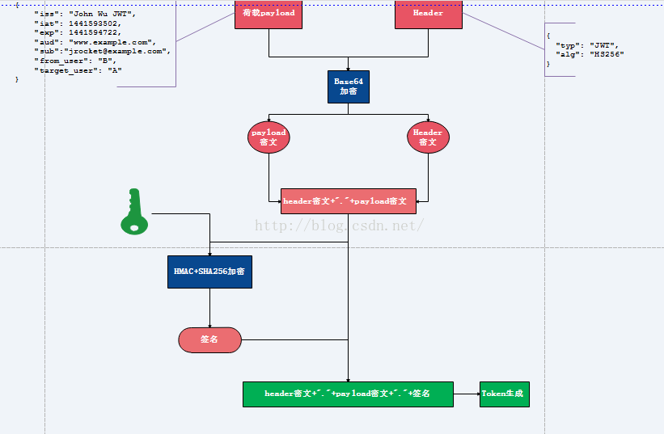
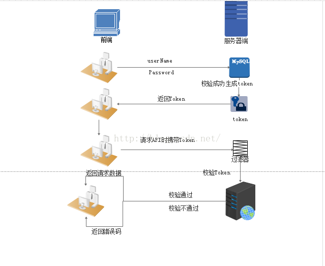

# Sign签名生成与校验

大家先思考一个问题:  你在写开放的API接口时是如何保证数据的安全性的？

**先来看看有哪些安全性问题在开放的api接口中，我们通过http Post或者Get方式请求服务器的时候，会面临着许多的安全性问题，例如：**

1.     请求来源(身份)是否合法？

2.     请求参数被篡改？

3.     请求的唯一性(不可复制)

解决方案：为了保证数据在通信时的安全性，我们可以采用参数签名的方式来进行相关验证。


## 案列分析

我们通过给某 [移动端(app)] 写 [后台接口(api)] 的案例进行分析：     

   客户端：以下简称app   

  后台接口：以下简称api

我们通过app查询产品列表这个操作来进行分析：

app中点击查询按钮==》调用api进行查询==》返回查询结果==>显示在app中

### 一、不进行验证的方式
api查询接口：

app调用：http://api.test.com/getproducts?参数1=value1.......

如上，这种方式简单粗暴，通过调用getproducts方法即可获取产品列表信息了，但是这样的方式会存在很严重的安全性问题，没有进行任何的验证，大家都可以通过这个方法获取到产品列表，导致产品信息泄露。

那么，如何验证调用者身份呢？如何防止参数被篡改呢？


### 二、MD5参数签名的方式

我们对api查询产品接口进行优化：

1.给app分配对应的key、secret

2.Sign签名，调用API 时需要对请求参数进行签名验证，签名方式如下：

   a. 按照请求参数名称将所有请求参数按照字母先后顺序排序得到：keyvaluekeyvalue...keyvalue  字符串如：将arong=1,mrong=2,crong=3 排序为：arong=1, crong=3,mrong=2  然后将参数名和参数值进行拼接得到参数字符串：arong1crong3mrong2。

   b. 将secret加在参数字符串的头部后进行MD5加密 ,加密后的字符串需大写。即得到签名Sign

新api接口代码:

app调用：http://api.test.com/getproducts?key=app_key&sign=BCC7C71CF93F9CDBDB88671B701D8A35&参数1=value1&参数2=value2.......

注：secret 仅作加密使用, 为了保证数据安全请不要在请求参数中使用。

如上，优化后的请求多了key和sign参数，这样请求的时候就需要合法的key和正确签名sign才可以获取产品数据。这样就解决了身份验证和防止参数篡改问题，如果请求参数被人拿走，没事，他们永远也拿不到secret,因为secret是不传递的。再也无法伪造合法的请求。

但是...这样就够了吗？细心的同学可能会发现，如果我获取了你完整的链接，一直使用你的key和sign和一样的参数不就可以正常获取数据了...-_-!是的，仅仅是如上的优化是不够的。。。。。。


请求的唯一性：

为了防止别人重复使用请求参数问题，我们需要保证请求的唯一性，就是对应请求只能使用一次，这样就算别人拿走了请求的完整链接也是无效的。
唯一性的实现：在如上的请求参数中，我们加入时间戳：timestamp（yyyyMMddHHmmss），同样，时间戳作为请求参数之一，也加入sign算法中进行加密。

新的api接口：

app调用：
http://api.test.com/getproducts?key=app_key&sign=BCC7C71CF93F9CDBDB88671B701D8A35×tamp=201603261407&参数1=value1&参数2=value2.......
如上，我们通过timestamp时间戳用来验证请求是否过期。这样就算被人拿走完整的请求链接也是无效的。


# Sign签名安全性分析：


通过上面的案例，我们可以看出，安全的关键在于参与签名的secret，整个过程中secret是不参与通信的，所以只要保证secret不泄露，请求就不会被伪造。

总结

上述的Sign签名的方式能够在一定程度上防止信息被篡改和伪造，保障通信的安全，这里使用的是MD5进行加密，当然实际使用中大家可以根据实际需求进行自定义签名算法，比如：RSA，SHA等加密算法。

## 1：sign验证法：
这种验证方式，一般过程是：
第一：给你一个【私钥】[app_secret] 和[app_id]
第二：你要提交的所有数据都需要提供sign签名。
第三：sign签名的获取方式。
例如：给用户id为99的人增加100积分：

```php
$app_id = 'Te001';
$secret = 'e10adc3949ba59abbe56e057f20f883e';
$url = 'http://127.0.0.1/test/apiDataCheck';
$post = array(
    'user_id' => 99,
    'point' => 100
);
function addSign($url, $data){
    $str = '';
    $data['app_id'] = $app_id;
    ksort($data);
    foreach($data as $k => $v){
        $str .= $k.'='.$v.'&';
    }
    $str = substring($str, 0, -1);
    $str = $url.'?'.$str.$secret;
    $data['sign'] = md5($str);
    return $data;
}
curl_post($url, addSign($post));
```


addSign 就是一个sign的获取方式：所有数据加上app_id，字段顺序排序，以get参数方式连接。然后url+?+get参数+私钥，进行md5加密获取sign签名。进而进行接口调用。
第四：服务器端验证数据合法性。
接口在操作数据之前，首先按照原本既定的sign生成方式，验证sign合法性，进而进行下一步操作。


### sign生成的两种方式：


- 在前端直接用密钥生成sign，后端用相同的密钥验证。

- 前端先将需要请求的参数调用一个api接口，后端生成sign传给前端，前端再拿sign加参数区请求后端，后端再用之间api接口生成的sign验证。


## 2：token法：

token法的步骤大概是：

1：给你一个app_id和app_secret。

2：提供一个利用app_id和app_secret获取token的接口。

3：token的时效性设定。

4：获取token接口的使用次数限制。

```php
1：获取token
$app_id = 'Token001';
$app_secret = 'e10adc3949ba59abbe56e057f20f883e';
$url = 'http://127.0.0.1/token/getToken?app_id='.$app_ip.'&app_secret='.$app_secret;
$token = curl_get($url);
// $token = array(
//     'token' => 'e10adc3949ba59abbe56e057f20f883e',
//     'expire' => '1444444400'
// );
session('token', $token['token']);
session('expire', $token['expire']);
2：接口调用
$url = 'http://127.0.0.1/token/getUserInfo';
$post['user_id'] = 1;
if(time() < session('expire')){
    $post['user_id'] = 1;
    $post['token'] = session('token');
}else{
    步骤1：
}
$userInfo = curl_post($post);
```

5：服务器验证token：


## Token原理以及应用

### 一、token的优势

#### 1.无状态、可扩展

在客户端存储的Tokens是无状态的，并且能够被扩展。基于这种无状态和不存储Session信息，负载负载均衡器能够将用户信息从一个服  务   传到其他服务器上。

如果我们将已验证的用户的信息保存在Session中，则每次请求都需要用户向已验证的服务器发送验证信息(称为Session亲和性)。用户量大时，可能会造成  一些拥堵。但是不要着急。使用tokens之后这些问题都迎刃而解，因为tokens自己hold住了用户的验证信息。

#### 2.安全性


请求中发送token而不再是发送cookie能够防止CSRF(跨站请求伪造)。即使在客户端使用cookie存储token，cookie也仅仅是一个存储机制而不是用于认证。不将信息存储在Session中，让我们少了对session操作。

token是有时效的，一段时间之后用户需要重新验证。我们也不一定需要等到token自动失效，token有撤回的操作，通过token revocataion可以使一个特定的token或是一组有相同认证的token无效。

#### 3.可扩展性

Tokens能够创建与其它程序共享权限的程序。例如，能将一个随便的社交帐号和自己的大号(Fackbook或是Twitter)联系起来。当通过服务登录Twitter(我们将这个过程Buffer)时，我们可以将这些Buffer附到Twitter的数据流上(we are allowing Buffer to post to our Twitter stream)。

使用tokens时，可以提供可选的权限给第三方应用程序。当用户想让另一个应用程序访问它们的数据，我们可以通过建立自己的API，得出特殊权限的tokens。

#### 4.多平台跨域

我们提前先来谈论一下CORS(跨域资源共享)，对应用程序和服务进行扩展的时候，需要介入各种各种的设备和应用程序。

Having our API just serve data, we can also make the design choice to serve assets from a CDN. This eliminates the issues that CORS brings up after we set a quick header configuration for our application.

只要用户有一个通过了验证的token，数据和资源就能够在任何域上被请求到。

              Access-Control-Allow-Origin: *       

#### 5.基于标准

创建token的时候，你可以设定一些选项。我们在后续的文章中会进行更加详尽的描述，但是标准的用法会在JSON Web Tokens体现。

最近的程序和文档是供给JSON Web Tokens的。它支持众多的语言。这意味在未来的使用中你可以真正的转换你的认证机制。

### 二、Token的原理



1.将荷载payload，以及Header信息进行Base64加密，形成密文payload密文，header密文。


2.将形成的密文用句号链接起来，用服务端秘钥进行HS256加密，生成签名.

3.将前面的两个密文后面用句号链接签名形成最终的token返回给服务端

注：

（1）用户请求时携带此token（分为三部分，header密文，payload密文，签名）到服务端，服务端解析第一部分（header密文），用Base64解密，可以知道用了什么算法进行签名，此处解析发现是HS256。

（2）服务端使用原来的秘钥与密文(header密文+"."+payload密文)同样进行HS256运算，然后用生成的签名与token携带的签名进行对比，若一致说明token合法，不一致说明原文被修改。

（3）判断是否过期，客户端通过用Base64解密第二部分（payload密文），可以知道荷载中授权时间，以及有效期。通过这个与当前时间对比发现token是否过期。

三，实现思路




1.用户登录校验，校验成功后就返回Token给客户端。

2.客户端收到数据后保存在客户端

3.客户端每次访问API是携带Token到服务器端。

4.服务器端采用filter过滤器校验。校验成功则返回请求数据，校验失败则返回错误码


