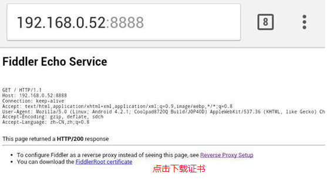
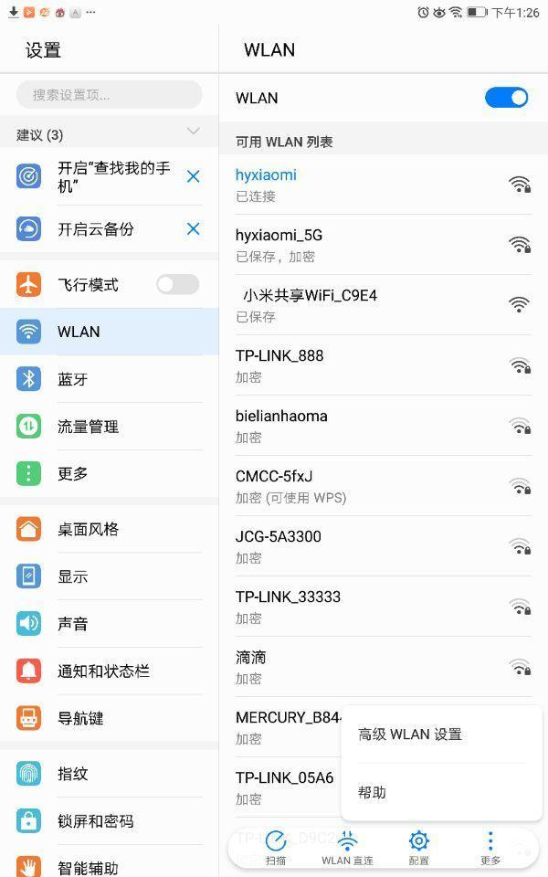
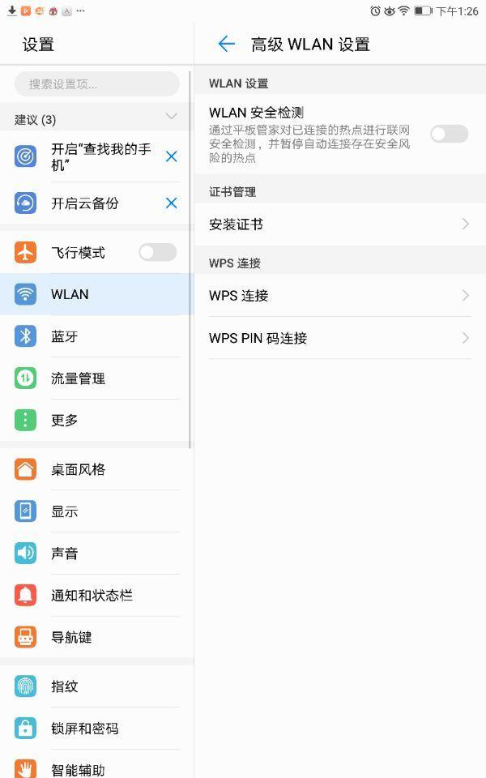
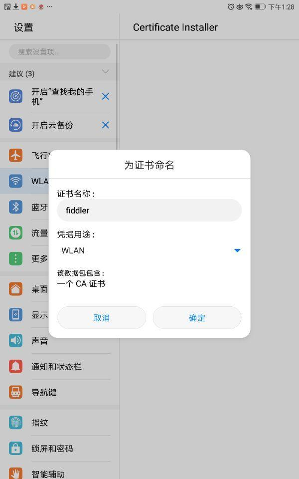
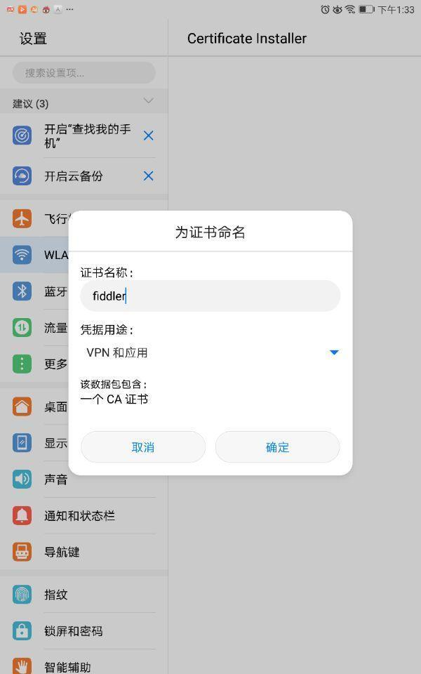

# 手机端抓包配置

fiddler监听端口默认是 8888，你可以把它设置成任何你想要的端口。勾选上 “Allow remote computersto connect” ，允许远程设备连接。

为了减少干扰，可以去掉 “Act assystem proxy on startup” 。

首先查看电脑的 IP 地址，确保手机和电脑在同一个局域网内。

## Android 手机上的配置

将 Fiddler 代理服务器的证书导到手机上才能抓这些 APP 的包。导入的过程:打开浏览器，在地址栏中输入代理服务器的 IP 和端口（即电脑的IP加fiddler的端口），会看到一个Fiddler 提供的页面，然后确定安装就好了。

**注意如果安装失败用一下方法：**

将电脑下载好的证书复制到安卓手机上，来到WLAN设置，选择更多->高级WLAN设置

。

来到WLAN设置，选择更多->高级WLAN设置证书这里不要选择WLAN，不然在应用中打开会显示证书错误

