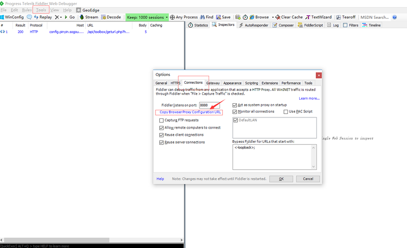
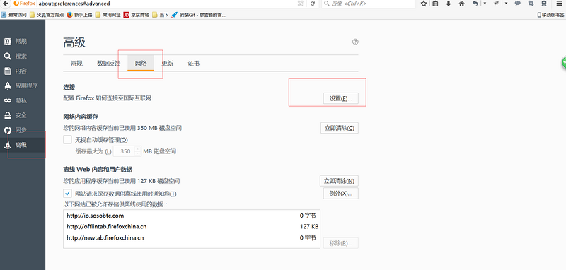
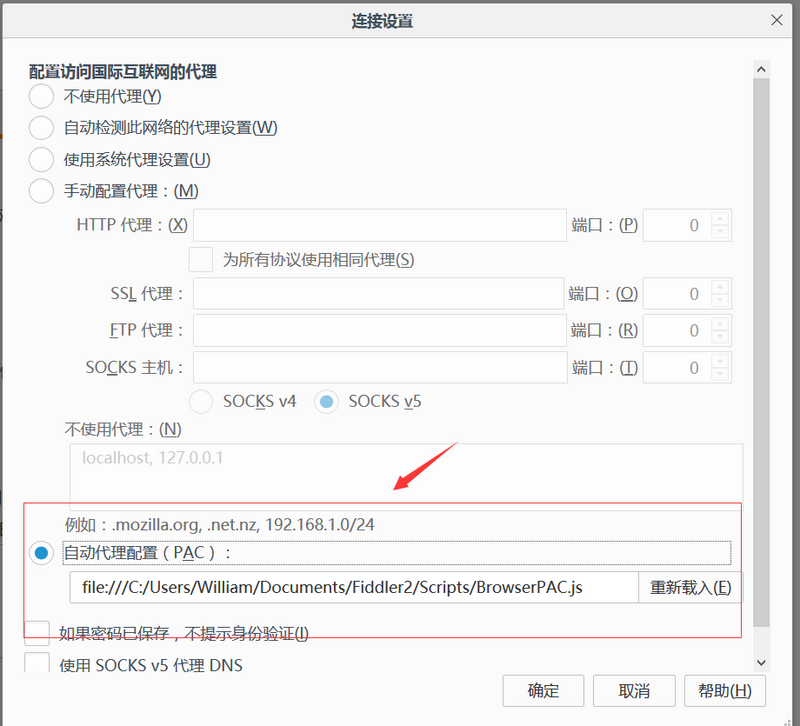
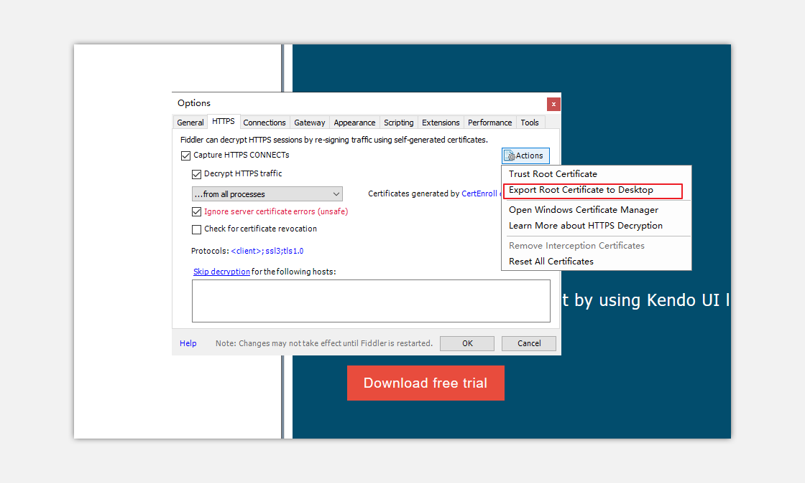
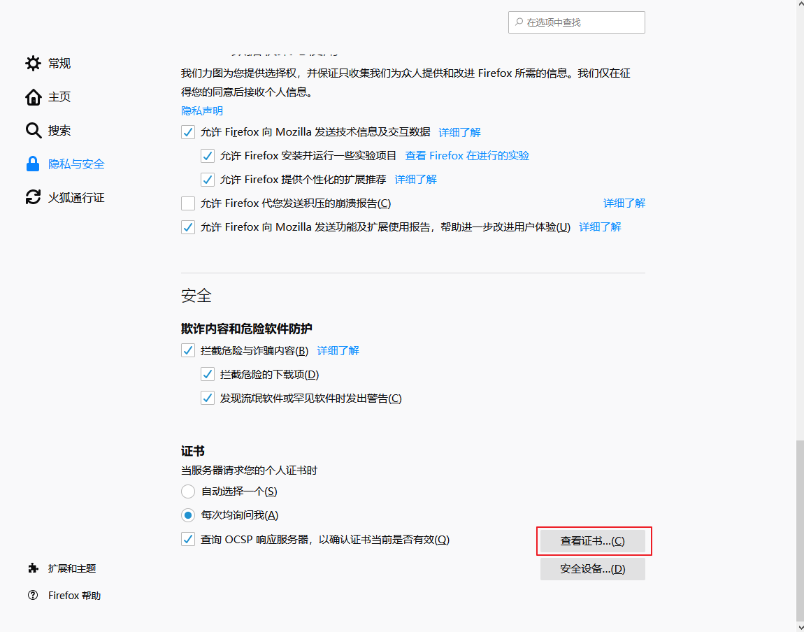
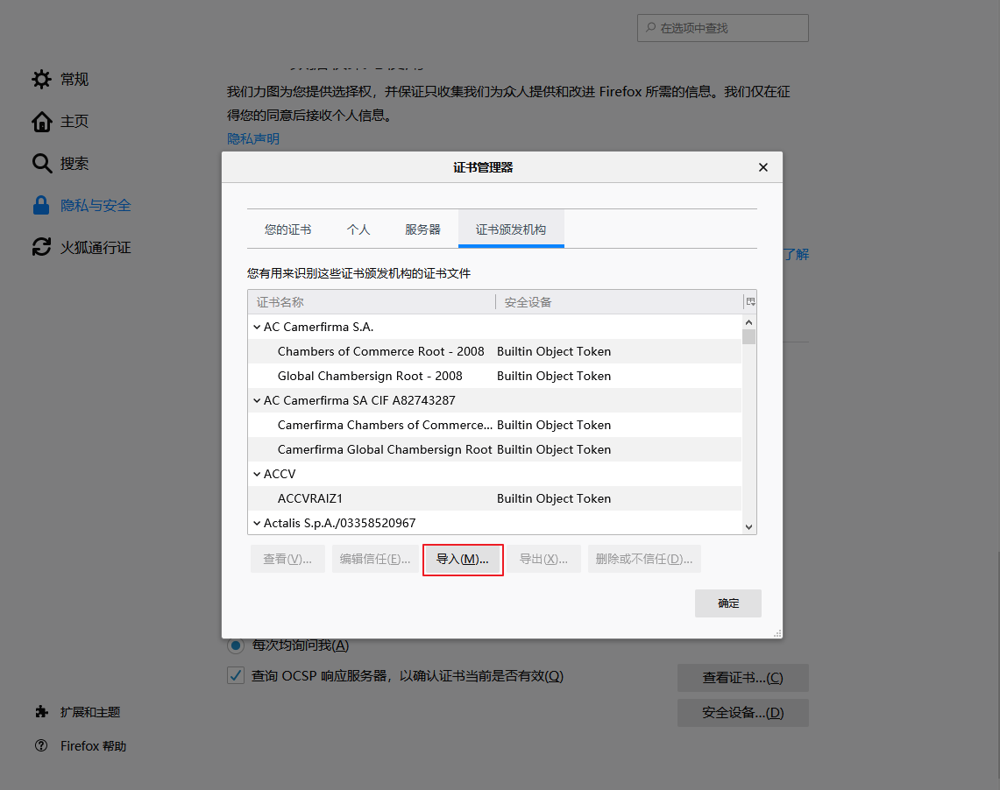

# 配置火狐代理配置代理

## 1、打开fiddler 按图操作，复制选中的链接；  

 fiddler -> tool ->connections

## 2 、打开火狐选项->高级->网络->设置

复制链接到“自动代理配置”

## 3、将fiddler安装的证书导出到桌面

## 4、打开火狐浏览器的选项，点击查看证书

## 5、导入从fiddler导出到的桌面的证书。

