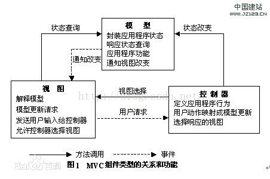
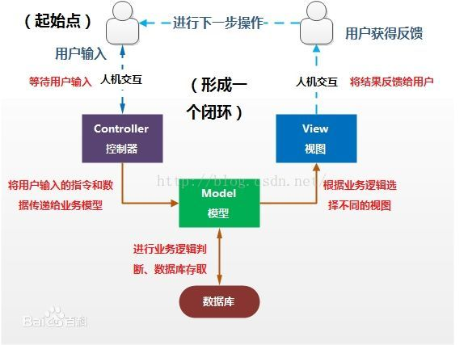

# ThinkPHP框架
ThinkPHP是一个快速、简单的基于MVC和面向对象的轻量级PHP开发框架，遵循Apache2开源协议发布，从诞生以来一直秉承简洁实用的设计原则，在保持出色的性能和至简的代码的同时，尤其注重开发体验和易用性，并且拥有众多的原创功能和特性，为WEB应用开发提供了强有力的支持。
# 什么是 MVC 框架 
MVC (Modal View Controler) 本来是存在于 Desktop 程序中的， M 是指数据模型， V 是指用户界面， C 则是控制器。使用 MVC 的目的是将 M 和 V 的实现代码分离，从而使同一个程序可以使用不同的表现形式。比如一批统计数据你可以分别用柱状图、饼图来表示。 C 存在的目的则是确保 M 和 V 的同步，一旦 M 改变， V 应该同步更新。模型－视图－控制器（ MVC ）是 Xerox PARC 在八十年代为编程语言 Smalltalk － 80 发明的一种软件设计模式，至今已被广泛使用。最近几年被推荐为 Sun 公司 J2EE 平台的设计模式，并且受到越来越多的使用  ColdFusion  和  PHP  的开发者的欢迎。模型－视图－控制器模式是一个有用的工具箱，它有很多好处，但也有一些缺点。
# MVC 如何工作 

MVC 是一个设计模式，它强制性的使应用程序的输入、处理和输出分开。使用 MVC 应用程序被分成三个核心部件：模型、视图、控制器。它们各自处理自己的任务。  

## 视图  
视图是用户看到并与之交互的界面。对老式的 Web 应用程序来说，视图就是由 HTML 元素组成的界面，在新式的 Web 应用程序中， HTML 依旧在视图中扮演着重要的角色，但一些新的技术已层出不穷，它们包括 Macromedia Flash 和象 XHTML ， XML/XSL ， WML 等一些标识语言和 Web services.如何处理应用程序的界面变得越来越有挑战性。 MVC 一个大的好处是它能为你的应用程序处理很多不同的视图。在视图中其实没有真正的处理发生，不管这些数据是联机存储的还是一个雇员列表，作为视图来讲，它只是作为一种输出数据并允许用户操纵的方式。 

##  模型

 模型表示企业数据和业务规则。在 MVC 的三个部件中，模型拥有最多的处理任务，进行业务逻辑处理和数据库存取。被模型返回的数据是中立的，就是说模型与数据格式无关，这样一个模型能为多个视图提供数据。由于应用于模型的代码只需写一次就可以被多个视图重用，所以减少了代码的重复性。 

##  控制器  

控制器接受用户的输入并调用模型和视图去完成用户的需求。所以当单击 Web 页面中的超链接和发送 HTML 表单时，控制器本身不输出任何东西和做任何处理。它只是接收请求并决定调用哪个模型构件去处理请求，然后用确定用哪个视图来显示模型处理返回的数据。

现在我们总结 MVC 的处理过程，首先控制器接收用户的请求，并决定应该调用哪个模型来进行处理，然后模型用业务逻辑来处理用户的请求并返回数据，最后控制器用相应的视图格式化模型返回的数据，并通过表示层呈现给用户。  

## 为什么要使用  MVC
大部分 Web 应用程序都是用像 ASP ， PHP ，或者 CFML 这样的过程化语言来创建的。它们将像数据库查询语句这样的数据层代码和像 HTML 这样的表示层代码混在一起。经验比较丰富的开发者会将数据从表示层分离开来，但这通常不是很容易做到的，它需要精心的计划和不断的尝试。 MVC 从根本上强制性的将它们分开。尽管构造 MVC 应用程序需要一些额外的工作，但是它给我们带来的好处是无庸质疑的。  

首先，最重要的一点是多个视图能共享一个模型，正如我所提及的，现在需要用越来越多的方式来访问你的应用程序。对此，其中一个解决之道是使用 MVC ，无论你的用户想要 Flash 界面或是  WAP  界面；用一个模型就能处理它们。由于你已经将数据和业务规则从表示层分开，所以你可以最大化的重用你的代码了。  

由于模型返回的数据没有进行格式化，所以同样的构件能被不同界面使用。例如，很多数据可能用 HTML 来表示，但是它们也有可能要用 Macromedia Flash 和 WAP 来表示。模型也有 状态管理和数据持久性处理的功能，例如，基于会话的购物车和电子商务过程也能被 Flash 网站或者无线联网的应用程序所重用。  

因为模型是自包含的，并且与控制器和视图相分离，所以很容易改变你的应用程序的数据层和业务规则。如果你想把你的数据库从 MySQL 移植到 Oracle ，或者改变你的基于 RDBMS 数据源到 LDAP ，只需改变你的模型即可。一旦你正确的实现了模型，不管你的数据来自数据库或是 LDAP 服务器，视图将会正确的显示它们。由于运用 MVC 的应用程序的三个部件是相互对立，改变其中一个不会影响其它两个，所以依据这种设计思想你能构造良好的松偶合的构件。  

对我来说，控制器的也提供了一个好处，就是可以使用控制器来联接不同的模型和视图去完成用户的需求，这样控制器可以为构造应用程序提供强有力的手段。给定一些可重用的模型和视图，控制器可以根据用户的需求选择模型进行处理，然后选择视图将处理结果显示给用户。  

## MVC 的缺点  

MVC 的缺点是由于它没有明确的定义，所以完全理解 MVC 并不是很容易。使用 MVC 需要精心的计划，由于它的内部原理比较复杂，所以需要花费一些时间去思考。  
你将不得不花费相当可观的时间去考虑如何将 MVC 运用到你的应用程序，同时由于模型和视图要严格的分离，这样也给调试应用程序到来了一定的困难。每个构件在使用之前都需要经过彻底的测试。一旦你的构件经过了测试，你就可以毫无顾忌的重用它们了。  
根据我个人经验，由于我们将一个应用程序分成了三个部件，所以使用 MVC 同时也意味着你将要管理比以前更多的文件，这一点是显而易见的。这样好像我们的工作量增加了，但是请记住这比起它所能带给我们的好处是不值一提。  
MVC 并不适合小型甚至中等规模的应用程序，花费大量时间将 MVC 应用到规模并不是很大的应用程序通常会得不偿失。  

## MVC 是一条创建软件的好途径  

MVC 设计模式是一个很好创建软件的途径，它所提倡的一些原则，像内容和显示互相分离可能比较好理解。但是如果你要隔离模型、视图和控制器的构件，你可能需要重新思考你的应用程序，尤其是应用程序的构架方面。如果你肯接受 MVC ，并且有能力应付它所带来的额外的工作和复杂性， MVC 将会使你的软件在健壮性，代码重用和结构方面上一个新的台阶。

## 其他的参考thinkphp开发手册
thinkphp3.2.3版本：url：https://www.kancloud.cn/manual/thinkphp/1678
thinkphp5.0版本：url：https://www.kancloud.cn/manual/thinkphp5/118008

