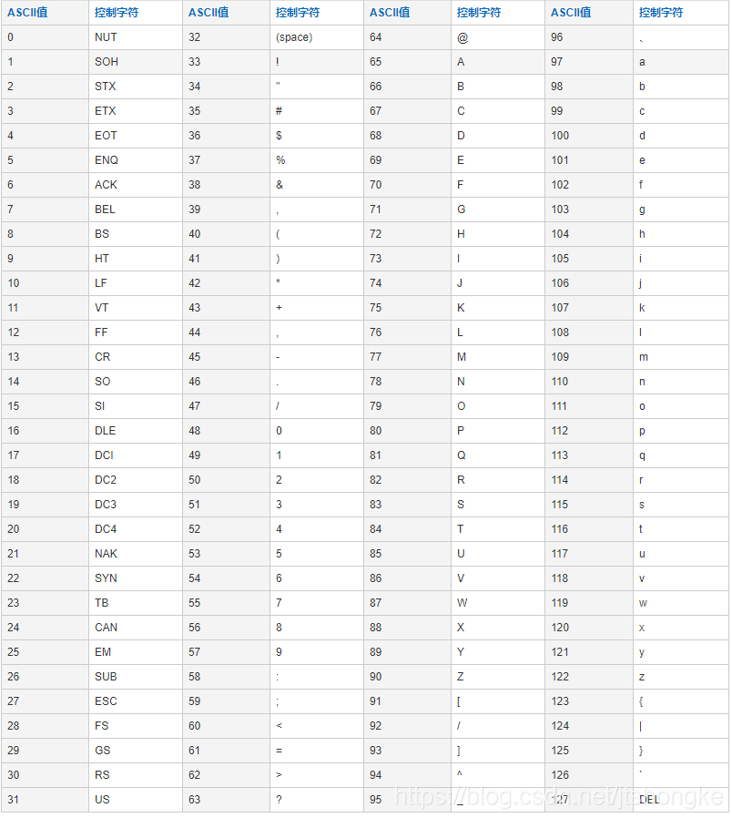
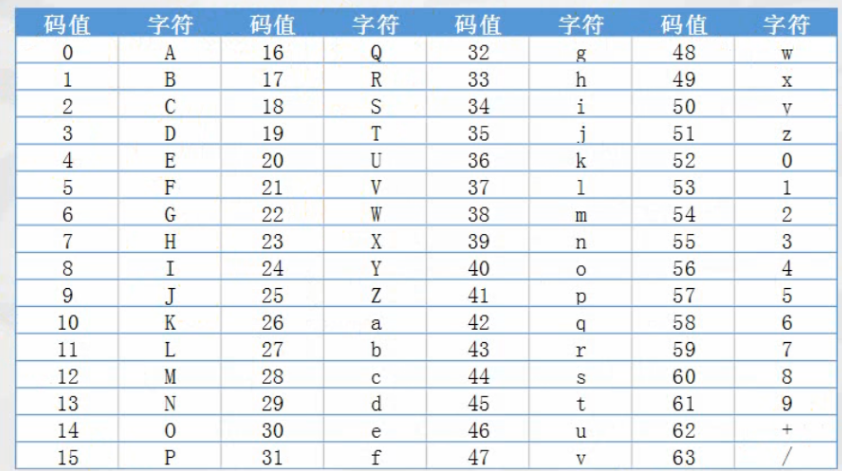

简介：Base64就是一种基于64个可打印字符来表示二进制数据的编码方法。为什么不直接用ASCII码呢？因为我们输入的字符可能有ASCII码中不可见的字符，为了完全可见，就用了base64编码。

比如Hello这个单词，我们把它变成base64编码怎么做呢？

首先引入ASCII对照表：

   2.一个字节是8个比特，先找到对应的ASCII码，再将其转化为8位的二进制，转化如下：

H 对应码值为72，它对应的二进制是 01001000

e对应码值为101，它对应的二进制是：01100101

l对应码值为108，它对应的二进制是：01101100

l对应码值为108，它对应的二进制是：01101100

o对应码值为111，它对应的二进制是：01101111

base64的码值是0-63，所以用6位的二进制就可以完全表示base64的码值（如：000000对应十进制0，111111对应的十进制为63），将上面8位一组的二进制变成6位一组的二进制，由于上面是5*8=40个二进制，不能被6整除，所以要加一组0将其变成48个二进制数（如果还是不能整除，还要继续补8个0，其实就是最小公倍数的倍数）。

原来：01001000 01100101 01101100 01101100 01101111 00000000

现在：010010 000110 010101 101100 011011 000110 111100 000000

3.然后将6位一组的二进制计算出十进制，再跟base64的编码表做对比，再将最后补位的0变成=,即可得到base64字符

010010 对应二进制是：18， 18对应base64字符为：S

000110 对应二进制是：6，    6对应base64字符为：G

010101 对应二进制是：21， 21对应base64字符为：V

101100 对应二进制是：44， 44对应base64字符为：s

011011 对应二进制是：27， 27对应base64字符为：b

000110 对应二进制是：6，    6对应base64字符为：G

111100 对应二进制是：18， 18对应base64字符为：8

000000 补位的0变成=

所以Hello对应的base64编码就是:SGVsbG8=

这里贴上BASE64对照表：

 

-----

参考或转载：

https://blog.csdn.net/jtshongke/article/details/83505132
