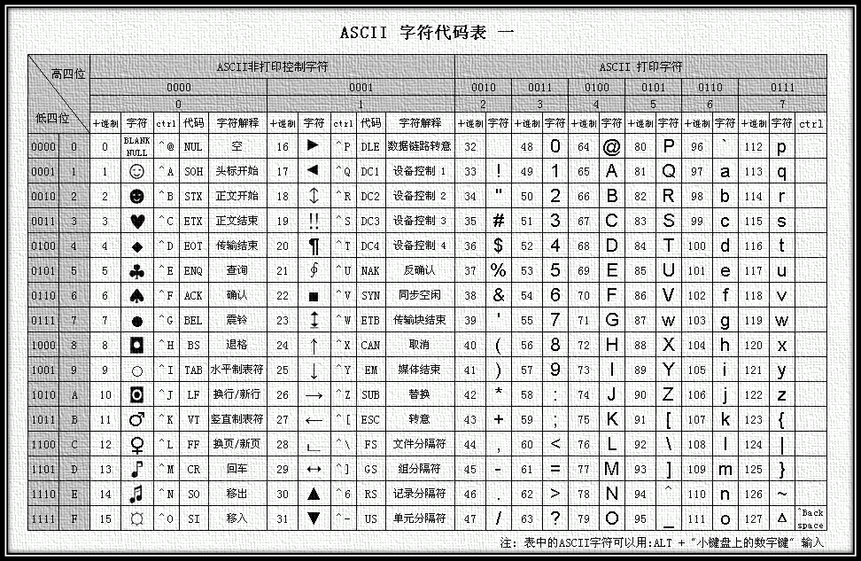

# 什么是字符编码

计算机要想工作必须通电,即用‘电’驱使计算机干活,也就是说‘电’的特性决定了计算机的特性。电的特性即高低电平(人类从逻辑上将二进制数1对应高电平,二进制数0对应低电平)，关于磁盘的磁特性也是同样的道理。结论：计算机只认识数字

　　很明显，我们平时在使用计算机时，用的都是人类能读懂的字符（用高级语言编程的结果也无非是在文件内写了一堆字符），如何能让计算机读懂人类的字符？

　　必须经过一个过程：
　　字符--------（翻译过程）------->数字 

　　这个过程实际就是一个字符如何对应一个特定数字的标准，这个翻译的过程叫做字符编码，这个标准称之为字符集，以便文本在计算机中存储和通过通信网络的传递。

# 字符集的发展史与分类

计算机由美国人发明，最早的字符集为ASCII（**A**merican **S**tandard **C**ode for **I**nformation **I**nterchange，**美国信息交换标准代码**），只规定了英文字母数字和一些特殊字符与数字的对应关系。最多只能用 7 位二进制来表示，即：2^7 = 127，所以，ASCII字符集最多只能表示 128个符号（一共有0~127个整数）。

但是8bit=1byte，所以在高位用补上0，凑齐8bit，用1byte表示ascii编码的大小是一个字节。

计算机发明之处及后面很长一段时间，只用应用于美国及西方一些发达国家，ASCII能够很好满足用户的需求。但是当中国也有了计算机之后，为了显示中文，必须设计一套编码规则用于将汉字转换为计算机可以接受的数字系统的数。

所以中国人规定了自己的标准gb2312字符集，规定了包含中文在内的字符－>数字的对应关系。

日本人规定了自己的Shift_JIS字符集，韩国人规定了自己的Euc-kr字符集。

国标 GB2312 是基于 1980 年发布的《信息交换用汉字编码字符集基本集》，是中文信息处理的中国国家标准，是强制执行的中文编码字符集。

国标码共收录 6763 个简体汉字、682 个符号，其中汉字部分：一级字 3755 个，以拼音排序，二级字 3008 个，该标准用双字节表示一个汉字：

第一个字节称为高字节（0xA1-0xF7），第二字节称为低字节（0xA1-0xFE）。

GB 2312的出现，基本满足了汉字的计算机处理需要，但对于人名、古汉语等方面出现的罕用字，GB 2312不能处理，这导致了后来GBK及GB 18030汉字字符集的出现。

**GBK**即汉字内码扩展规范，K为扩展的汉语拼音中“扩”字的声母。英文全称Chinese Internal Code Specification。GBK编码标准兼容GB2312，共收录汉字21003个、符号883个，并提供1894个造字码位，简、繁体字融于一库。GBK采用双字节表示，总体编码范围为8140-FEFE。

以上这些国家自己定义的字符编码已经够用了，但是如果出现在网络中，由于不兼容，互相访问就出现了乱码现象。那如何解决乱码现象呢？所以迫切需要一个世界的标准（能包含全世界的语言），此时Unicode就上场了。

**Unicode（统一码，也叫万国码、单一码） **，是计算机科学领域里的一项业界标准，包括字符集、编码方案等。Unicode 是为了解决传统的字符编码方案的局限而产生的，它为每种语言中的每个字符设定了统一并且唯一的二进制编码，以满足跨语言、跨平台进行文本转换、处理的要求。

Unicode的学名是"Universal Multiple-Octet Coded Character Set"，简称为UCS。

现在用的是UCS-2，即2个字节编码，而UCS-4是为了防止将来2个字节不够用才开发的。

Unicode常用2-4个字节来表示字符。

由于计算机的内存比较大，并且字符串在内容中表示时也不会特别大，所以内容可以使用unicode来处理，但是存储和网络传输时一般数据都会非常多，那么增加1倍将是无法容忍的！！！

为了解决存储和网络传输的问题，出现了Unicode Transformation Format，学术名UTF，即：对unicode中的进行转换，以便于在存储和网络传输时可以节省空间!

所以，Unicode字符集，出现了UTF-32、 UTF-16和 UTF-8等三种字符编码方案。

- UTF-8： 使用1、2、3、4个字节表示所有字符；优先使用1个字符、无法满足则使增加一个字节，最多4个字节。英文占1个字节、欧洲语系占2个、东亚占3个，其它及特殊字符占4个
- UTF-16： 使用2、4个字节表示所有字符；优先使用2个字节，否则使用4个字节表示。
- UTF-32： 使用4个字节表示所有字符；

---
参考或转载：
https://www.cnblogs.com/alex3714/articles/7550940.html
https://www.cnblogs.com/alex3714/articles/5411456.html
https://www.cnblogs.com/linhaifeng/articles/5950339.html#_label2
https://baike.baidu.com/item/%E5%AD%97%E7%AC%A6%E7%BC%96%E7%A0%81
https://www.cnblogs.com/skynet/archive/2011/05/03/2035105.html
https://baike.baidu.com/item/%E7%BB%9F%E4%B8%80%E7%A0%81/2985798?fromtitle=Unicode&fromid=750500

