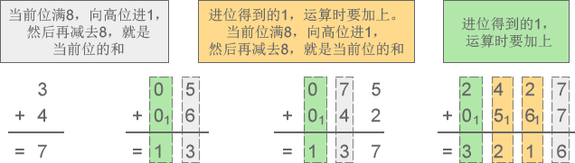
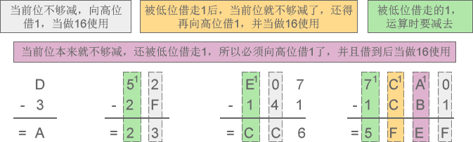

# 什么是进制

进制也就是进位制，是利用固定的数字符号和统一的规则来计数的方法，是人们规定的一种进位方法。 对于任何一种进制---X进制，就表示某一位置上的数运算时是逢X进一位。 十进制是逢十进一，十六进制是逢十六进一，二进制就是逢二进一，以此类推，x进制就是逢x进位。

我们平时使用的数字都是由 0~9 共十个数字组成的，例如 1、9、10、297、952 等，一个数字最多能表示九，如果要表示十、十一、二十九、一百等，就需要多个数字组合起来。

例如表示 5+8 的结果，一个数字不够，只能”进位“，用 13 来表示；这时”进一位“相当于十，”进两位“相当于二十。

因为逢十进一（满十进一），也因为只有 0~9 共十个数字，所以叫做十进制（Decimalism）。十进制是在人类社会发展过程中自然形成的，它符合人们的思维习惯，例如人类有十根手指，也有十根脚趾。

进制也就是进位制。进行加法运算时逢X进一（满X进一），进行减法运算时借一当X，这就是X进制，这种进制也就包含X个数字，基数为X。十进制有 0~9 共10个数字，基数为10，在加减法运算中，逢十进一，借一当十。

## 二进制

我们不妨将思维拓展一下，既然可以用 0~9 共十个数字来表示数值，那么也可以用0、1两个数字来表示数值，这就是二进制（Binary）。例如，数字 0、1、10、111、100、1000001 都是有效的二进制。

在计算机内部，数据都是以二进制的形式存储的，二进制是学习编程必须掌握的基础。本节我们先讲解二进制的概念，下节讲解数据在内存中的存储，让大家学以致用。

二进制加减法和十进制加减法的思想是类似的：

- 对于十进制，进行加法运算时逢十进一，进行减法运算时借一当十；
- 对于二进制，进行加法运算时逢二进一，进行减法运算时借一当二。

下面两张示意图详细演示了二进制加减法的运算过程。

1) 二进制加法：1+0=1、1+1=10、11+10=101、111+111=1110

图1：二进制加法示意图

2) 二进制减法：1-0=1、10-1=1、101-11=10、1100-111=101

## 八进制

除了二进制，C语言还会使用到八进制。

八进制有 0~7 共8个数字，基数为8，加法运算时逢八进一，减法运算时借一当八。例如，数字 0、1、5、7、14、733、67001、25430 都是有效的八进制。

下面两张图详细演示了八进制加减法的运算过程。

1) 八进制加法：3+4=7、5+6=13、75+42=137、2427+567=3216

2) 八进制减法：6-4=2、52-27=23、307-141=146、7430-1451=5757

## 十六进制

除了二进制和八进制，十六进制也经常使用，甚至比八进制还要频繁。

十六进制中，用A来表示10，B表示11，C表示12，D表示13，E表示14，F表示15，因此有 0~F 共16个数字，基数为16，加法运算时逢16进1，减法运算时借1当16。例如，数字 0、1、6、9、A、D、F、419、EA32、80A3、BC00 都是有效的十六进制。

> 注意，十六进制中的字母不区分大小写，ABCDEF 也可以写作 abcdef。

下面两张图详细演示了十六进制加减法的运算过程。

1) 十六进制加法：6+7=D、18+BA=D2、595+792=D27、2F87+F8A=3F11

2) 十六进制减法：D-3=A、52-2F=23、E07-141=CC6、7CA0-1CB1=5FEF

# 进制转换

下面是二、八、十、十六进制之间关系的结构图：

（Figure1：进制关系结构图）

下文会分4个部分对这个图进行分解，针对每个部分会以图文的形式进行讲解：

1. （二、八、十六进制） → （十进制）；
2. （十进制） → （二、八、十六进制）；
3. （二进制） ↔ （八、十六进制）；
4. （八进制） ↔ （十六进制）；

## 进制转换算法（Convert）

### 进制的前缀或后缀

　　在数字前后加上不同的字母来表示不同的进位制。

前缀0b或0B表示二进制，0o或0O或0表示八进制，0x表示16进制，0d或0D或不加任何前缀。

例如：0b101011=0o53=0d43=0x2B

后缀B（Binary)表示二进制，O（Octal）表示八进制，D（Decimal）或不加表示十进制，H（Hexadecimal）表示十六进制。

例如：(101011)B=(53)O=(43)D=(2B)H

### (一) （二、八、十六进制） → （十进制）

（Figure2：其他进制转换为十进制）

#### 二进制 → 十进制

　　方法：二进制数从低位到高位（即从右往左）计算，第0位的权值是2的0次方，第1位的权值是2的1次方，第2位的权值是2的2次方，依次递增下去，把最后的结果相加的值就是十进制的值了。

　　例：将二进制的(101011)B转换为十进制的步骤如下：

1. 第0位 1 x 2^0 = 1；

2. 第1位 1 x 2^1 = 2；

3. 第2位 0 x 2^2 = 0；

4. 第3位 1 x 2^3 = 8；

5. 第4位 0 x 2^4 = 0；

6. 第5位 1 x 2^5 = 32；

7. 读数，把结果值相加，1+2+0+8+0+32=43，即(101011)B=(43)D。

#### 八进制 → 十进制

　　方法：八进制数从低位到高位（即从右往左）计算，第0位的权值是8的0次方，第1位的权值是8的1次方，第2位的权值是8的2次方，依次递增下去，把最后的结果相加的值就是十进制的值了。

　　八进制就是逢8进1，八进制数采用 0～7这八数来表达一个数。

　　例：将八进制的(53)O转换为十进制的步骤如下：

1. 第0位 3 x 8^0 = 3；

2. 第1位 5 x 8^1 = 40；

3. 读数，把结果值相加，3+40=43，即(53)O=(43)D。

#### 十六进制 → 十进制

　　方法：十六进制数从低位到高位（即从右往左）计算，第0位的权值是16的0次方，第1位的权值是16的1次方，第2位的权值是16的2次方，依次递增下去，把最后的结果相加的值就是十进制的值了。

　　十六进制就是逢16进1，十六进制的16个数为0123456789ABCDEF。

　　例：将十六进制的(2B)H转换为十进制的步骤如下：

1. 第0位 B x 16^0 = 11；

2. 第1位 2 x 16^1 = 32；

3. 读数，把结果值相加，11+32=43，即(2B)H=(43)D。

### (二) （十进制） → （二、八、十六进制）

（Figure3：十进制转换为其它进制）

#### 十进制 → 二进制

　　方法：除2取余法，即每次将整数部分除以2，余数为该位权上的数，而商继续除以2，余数又为上一个位权上的数，这个步骤一直持续下去，直到商为0为止，最后读数时候，从最后一个余数读起，一直到最前面的一个余数。 

　　例：将十进制的(43)D转换为二进制的步骤如下：

1. 将商43除以2，商21余数为1；

2. 将商21除以2，商10余数为1；

3. 将商10除以2，商5余数为0；

4. 将商5除以2，商2余数为1；

5. 将商2除以2，商1余数为0； 

6. 将商1除以2，商0余数为1； 

7. 读数，因为最后一位是经过多次除以2才得到的，因此它是最高位，读数字从最后的余数向前读，101011，即(43)D=(101011)B。

（Figure4：图解十进制 → 二进制）

#### 十进制 → 八进制

　　方法1：除8取余法，即每次将整数部分除以8，余数为该位权上的数，而商继续除以8，余数又为上一个位权上的数，这个步骤一直持续下去，直到商为0为止，最后读数时候，从最后一个余数起，一直到最前面的一个余数。

　　例：将十进制的(796)D转换为八进制的步骤如下：

1. 将商796除以8，商99余数为4；

2. 将商99除以8，商12余数为3；

3. 将商12除以8，商1余数为4；

4. 将商1除以8，商0余数为1；

5. 读数，因为最后一位是经过多次除以8才得到的，因此它是最高位，读数字从最后的余数向前读，1434，即(796)D=(1434)O。

（Figure5：图解十进制 → 八进制）

　　方法2：使用间接法，先将十进制转换成二进制，然后将二进制又转换成八进制；

（Figure6：图解十进制 → 八进制）

#### 十进制 → 十六进制

　　方法1：除16取余法，即每次将整数部分除以16，余数为该位权上的数，而商继续除以16，余数又为上一个位权上的数，这个步骤一直持续下去，直到商为0为止，最后读数时候，从最后一个余数起，一直到最前面的一个余数。

　　例：将十进制的(796)D转换为十六进制的步骤如下：

1. 将商796除以16，商49余数为12，对应十六进制的C；

2. 将商49除以16，商3余数为1；

3. 将商3除以16，商0余数为3；

4. 读数，因为最后一位是经过多次除以16才得到的，因此它是最高位，读数字从最后的余数向前读，31C，即(796)D=(31C)H。

（Figure7：图解十进制 → 十六进制）

　　方法2：使用间接法，先将十进制转换成二进制，然后将二进制又转换成十六进制；

（Figure8：图解十进制 → 十六进制）

### (三) （二进制） ↔ （八、十六进制）

（Figure9：二进制转换为其它进制）

#### 二进制 → 八进制

　　方法：取三合一法，即从二进制的小数点为分界点，向左（向右）每三位取成一位，接着将这三位二进制按权相加，然后，按顺序进行排列，小数点的位置不变，得到的数字就是我们所求的八进制数。如果向左（向右）取三位后，取到最高（最低）位时候，如果无法凑足三位，可以在小数点最左边（最右边），即整数的最高位（最低位）添0，凑足三位。

　　例：将二进制的(11010111.0100111)B转换为八进制的步骤如下：

1. 小数点前111 = 7；

2. 010 = 2；

3. 11补全为011，011 = 3；

4. 小数点后010 = 2；

5. 011 = 3；

6. 1补全为100，100 = 4；

7. 读数，读数从高位到低位，即(11010111.0100111)B=(327.234)O。

（Figure10：图解二进制 → 八进制）

二进制与八进制编码对应表：

| 二进制 | 八进制 |
| ------ | ------ |
| 000    | 0      |
| 001    | 1      |
| 010    | 2      |
| 011    | 3      |
| 100    | 4      |
| 101    | 5      |
| 110    | 6      |
| 111    | 7      |

 

#### 八进制 → 二进制

　　方法：取一分三法，即将一位八进制数分解成三位二进制数，用三位二进制按权相加去凑这位八进制数，小数点位置照旧。

　　例：将八进制的(327)O转换为二进制的步骤如下：

1. 3 = 011；

2. 2 = 010；

3. 7 = 111；

4. 读数，读数从高位到低位，011010111，即(327)O=(11010111)B。

（Figure11：图解八进制 → 二进制）

#### 二进制 → 十六进制

　　方法：取四合一法，即从二进制的小数点为分界点，向左（向右）每四位取成一位，接着将这四位二进制按权相加，然后，按顺序进行排列，小数点的位置不变，得到的数字就是我们所求的十六进制数。如果向左（向右）取四位后，取到最高（最低）位时候，如果无法凑足四位，可以在小数点最左边（最右边），即整数的最高位（最低位）添0，凑足四位。

　　例：将二进制的(11010111)B转换为十六进制的步骤如下：

1. 0111 = 7；

2. 1101 = D；

3. 读数，读数从高位到低位，即(11010111)B=(D7)H。

（Figure12：图解二进制 → 十六进制）

#### 十六进制 → 二进制

　　方法：取一分四法，即将一位十六进制数分解成四位二进制数，用四位二进制按权相加去凑这位十六进制数，小数点位置照旧。

　　例：将十六进制的(D7)H转换为二进制的步骤如下：

1. D = 1101；

2. 7 = 0111；

3. 读数，读数从高位到低位，即(D7)H=(11010111)B。

（Figure13：图解十六进制 → 二进制）

### (四) （八进制） ↔ （十六进制）

（Figure14：八进制与十六进制之间的转换）

#### 八进制 → 十六进制

　　方法：将八进制转换为二进制，然后再将二进制转换为十六进制，小数点位置不变。

　　例：将八进制的(327)O转换为十六进制的步骤如下：

1. 3 = 011；

2. 2 = 010；

3. 7 = 111；

4. 0111 = 7；

5. 1101 = D；

6. 读数，读数从高位到低位，D7，即(327)O=(D7)H。

（Figure15：图解八进制 → 十六进制）

#### 十六进制 → 八进制

　　方法：将十六进制转换为二进制，然后再将二进制转换为八进制，小数点位置不变。

　　例：将十六进制的(D7)H转换为八进制的步骤如下：

1. 7 = 0111；

2. D = 1101；

3. 0111 = 7；

4. 010 = 2；

5. 011 = 3；

6. 读数，读数从高位到低位，327，即(D7)H=(327)O。

（Figure16：图解十六进制 → 八进制）

-----

参考或转载：
https://www.cnblogs.com/alex3714/articles/5411456.html
http://c.biancheng.net/view/1724.html
https://www.cnblogs.com/gaizai/p/4233780.html#_labelContents
