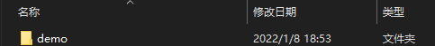
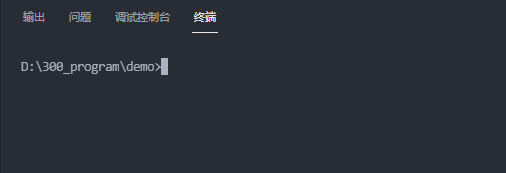
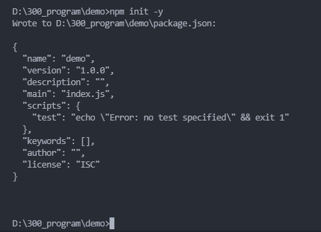
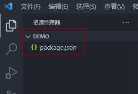
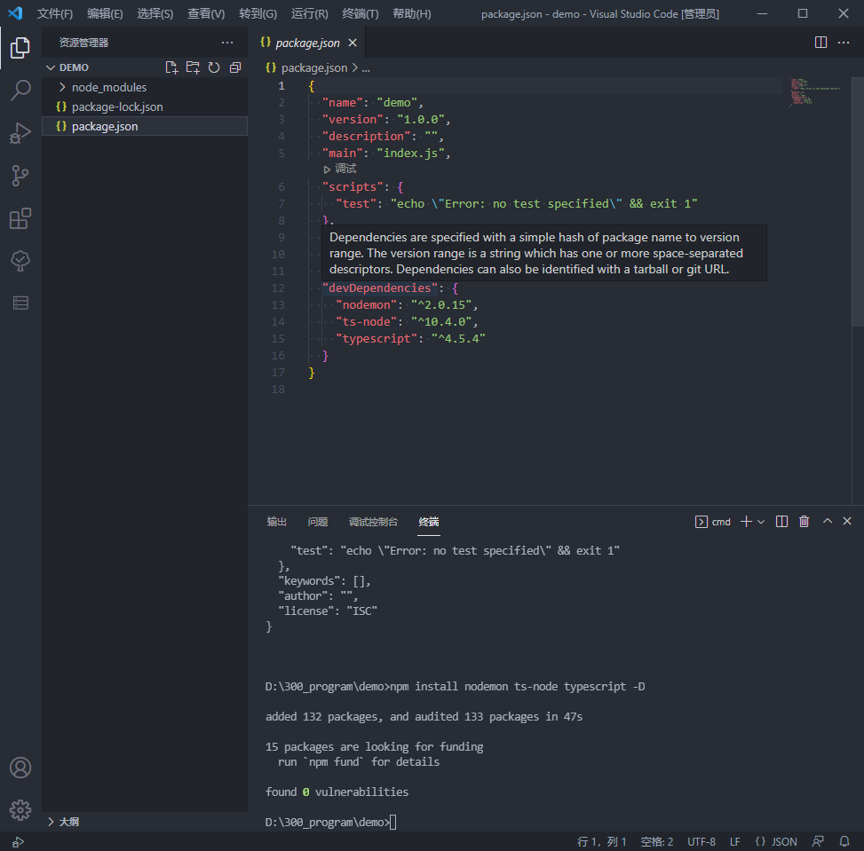
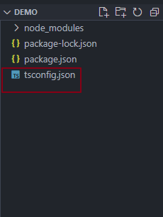
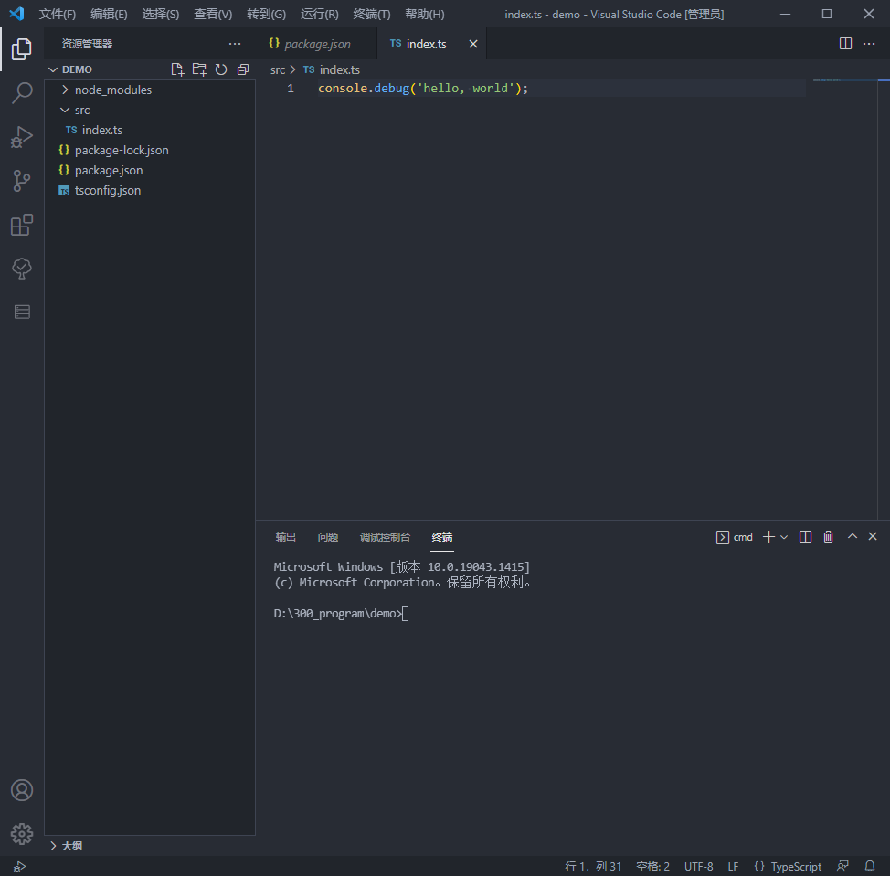
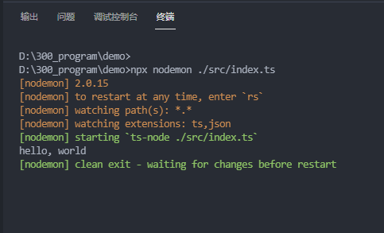

> 写作时间 2022-01-08 23:04:13

# 建立node.js搭配typescript的项目

## what

node.js 是基于 google 的v8引擎的一个 javascript 执行平台，typescript 是 javascript 的超集，在 javascript 的基础上增加了类型系统，node.js 有 typescript 就是如虎添翼，如鱼得水啊。

## why

首先需要了解typescript是什么，有什么用，怎么用，这篇笔记暂时不写。

## how

创建一个文件夹`demo`



在命令行打开文件夹所在的路径


执行 `npm init -y` 命令来生辰包管理文件`package.json`（需安装 node.js）



执行`npm install nodemon ts-node typescript -D`命令安装 nodemon、ts-node 和 typescript 等库



执行`npx tsc --init`命令生成 tsconfig.json 文件


新建`src用于存放项目代码`，然后在 src 目录下新建 index.ts 文件。

在`index.ts`文件中写入以下代码。

```typescript
console.debug('hello, world');
```


在命令行执行`npx nodemon ./src/index.ts`来运行 index.ts 文件



到这里，项目搭建完成