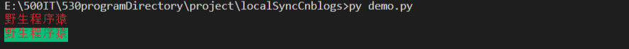
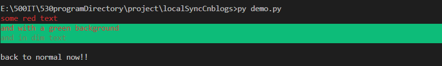

# 方法一：
颜色的控制通过ESC字符(\033)加”[“加颜色代码加”m”实现。ESC的ASCII码是十进制的27，八进制的033(\033)。

输出方式由三部分组成

\033[字体显示方式;字体颜色;字体背景色m'字符'\033[0m

 - 显示方式: 0（默认值）、1（高亮）、22（非粗体）、4（下划线）、24（非下划线）、 5（闪烁）、25（非闪烁）、7（反显）、27（非反显）
- 字体色: 30（黑色）、31（红色）、32（绿色）、 33（黄色）、34（蓝色）、35（洋 红）、36（青色）、37（白色）
- 字体背景色: 40（黑色）、41（红色）、42（绿色）、 43（黄色）、44（蓝色）、45（洋 红）、46（青色）、47（白色）

```python
name = '野生程序猿'
print(f"\033[0;31m{name}\033[0m")      #输出红色的字体
print(f"\033[0;31;42m{name}\033[0m")   #输出红色的字体，背景色为绿色
```




# 方式二：

使用`colorama`模块，安装`pip install colorama`

colorama是一个python专门用来在控制台、命令行输出彩色文字的模块，可以跨平台使用。

可用格式常数:可用的格式常数是：

```
Fore: BLACK, RED, GREEN, YELLOW, BLUE, MAGENTA, CYAN, WHITE, RESET.
Back: BLACK, RED, GREEN, YELLOW, BLUE, MAGENTA, CYAN, WHITE, RESET.
Style: DIM, NORMAL, BRIGHT, RESET_ALL
```

```python
from colorama import Fore,Back,Style
print (Fore.RED + "some red text")
print (Back.GREEN + "and with a green background")
print (Style.DIM + "and in dim text")
print (Style.RESET_ALL)
print ("back to normal now!!")
```




---

参考或转载：

https://blog.csdn.net/qq_44159028/article/details/115400065
https://blog.csdn.net/sinat_38682860/article/details/89977064?dist_request_id=1332041.22626.16193151946081447&depth_1-utm_source=distribute.pc_relevant.none-task-blog-2%7Edefault%7EBlogCommendFromMachineLearnPai2%7Edefault-2.control
https://blog.csdn.net/u014470361/article/details/81512330
https://www.cnblogs.com/xieshengsen/p/6932233.html