# excel文件处理

python操作excel主要用到xlrd、wlwt和xlutils这两个库，即xlrd是读excel， xlwt是写excel的库，xlutils是对读写excel操作的正则。

**安装 xlrd模块：pip install xlrd
安装 xlwt模块：pipinstall xlwt
安装xlutils模块：pip install xlutils**

## 文档：
xlrd模块 url： https://xlrd.readthedocs.io/en/latest/
xlwt模块 url： https://xlwt.readthedocs.io/en/latest/
xlutils模块 url： https://xlutils.readthedocs.io/en/latest/index.html

### 一、安装xlrd模块　　
到python官网下载http://pypi.python.org/pypi/xlrd模块安装，前提是已经安装了python 环境。　　
或者在cmd窗口 pip install xlrd
### 二、使用介绍 
#### 1、常用单元格中的数据类型  　

0 empty（空的）,1 string（text）, 2 number, 3 date, 4 boolean, 5 error， 6 blank（空白表格）

#### 2、导入模块
```python
import xlrd
```
#### 3、打开Excel文件读取数据

```python
data = xlrd.open_workbook(filename)#文件名以及路径，如果路径或者文件名有中文给前面加一个r表示原生字符。
```
#### 4、常用的函数

     Excel文档名称为test.xls，内容如下：

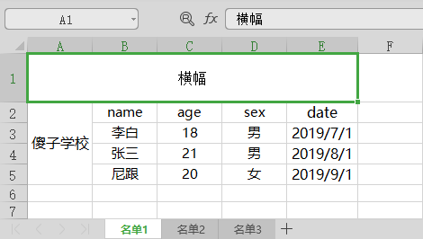


##### （1）打开Excel文件读取数据

```python
import xlrd

data = xlrd.open_workbook('test.xls')
sheet_name = data.sheet_names()
# 获取所有sheet名称
print(sheet_name)

# >>>['名单1', '名单2', '名单3']
```
##### （2）根据下标获取sheet名称

```python
sheet1_name = data.sheet_names()[0]
sheet2_name = data.sheet_names()[1]
sheet3_name = data.sheet_names()[2]

print(sheet1_name)
# >>>名单1

print(sheet2_name)
# >>>名单2

print(sheet3_name)
# >>>名单3

```
##### （3）根据sheet索引或者名称获取sheet内容，同时获取sheet名称、行数、列数

```python
# 根据索引
sheet2 = data.sheet_by_index(0)
print('sheet2名称：{}\nsheet2列数：{}\nsheet2行数：{}'.format(sheet2.name,sheet2.ncols,sheet2.nrows))

# >>>sheet2名称：名单1
# >>>sheet2列数：5
# >>>sheet2行数：5


# 根据名称
sheet1 = data.sheet_by_name('名单1')
print('sheet1名称：{}\nsheet1列数：{}\nsheet1行数：{}'.format(sheet1.name,sheet1.ncols,sheet2.nrows))

# >>>sheet1名称：名单1
# >>>sheet1列数：5
# >>>sheet1行数：5

```

##### （4）根据sheet名称获取整行和整列的值

```python
sheet1 = data.sheet_by_name('名单1')

print(sheet1.row_values(1))
# >>>['傻子学校', 'name', 'age', 'sex', 'date']

print(sheet1.col_values(1))
# >>>['', 'name', '李白', '张三', '尼跟']
```
##### （5）获取指定单元格的内容

```python
sheet1 = data.sheet_by_name('名单1')

print(sheet1.cell(1,1).value) #第2行2列的内容
# >>>name

print(sheet1.cell_value(1,1)) #第2行2列的内容
# >>>name

print(sheet1.row(1)[1].value) #第2行2列的内容
# >>>name
```
##### （6）获取单元格内容的数据类型

```python
sheet1 = data.sheet_by_name('名单1')

print(sheet1.cell(2,1).ctype)
# >>>1

print(sheet1.cell(2,4).ctype)
# >>>3
# 说明： ctype：0 empty，1 string，2 number， 3 date， 4 boolean， 5 error
```
##### （7）使用xlrd的xldate_as_tuple处理date格式

```python
from datetime import datetime,date

sheet1 = data.sheet_by_name('名单1')

if sheet1.cell(2,4).ctype == 3:
    print(sheet1.cell(2,4).value)
    # >>>43647.0

    date_value = xlrd.xldate_as_tuple(sheet1.cell(2,4).value, data.datemode)
    print(date_value)
    # >>>(2019, 7, 1, 0, 0, 0)

    print(date(*date_value[:3]))
    # >>>2019-07-01

    print(date(*date_value[:3]).strftime('%Y/%m/%d'))
    # >>>2019/07/01
```
##### （8）获取单元内容为number的方式（转为整形）

```python
sheet1 = data.sheet_by_name('名单1')

if sheet1.cell(2,2).ctype == 2:
    print(sheet1.cell(2,2).value)
    # >>>18.0

    num_value = int(sheet1.cell(2,2).value)
    # >>>18
    print(num_value)
```
##### （9）获取合并单元格的内容，需要merged_cells属性

```python
data = xlrd.open_workbook('test.xls',formatting_info=True)

sheet1 = data.sheet_by_name('名单1')

print(sheet1.merged_cells)
# merged_cells返回的这四个参数的含义是：(row,row_range,col,col_range),其中[row,
row_range)包括row,不包括row_range,col也是一样，下标从0开始。
# >>>[(0, 1, 0, 5), (1, 5, 0, 1)]

print(sheet1.cell(0,0).value)
# >>>横幅测试

print(sheet1.cell(1,0).value)
# >>>傻子学校

#使用以下方法更方便
merge_value = []
for (row,row_range,col,col_range) in sheet1.merged_cells:
    merge_value.append((row,col))

print(merge_value)
# >>>[(0, 0), (1, 0)]
for v in merge_value:
    print(sheet1.cell(v[0],v[1]).value)
    # >>>横幅测试
    # >>>傻子学校

```
## xlwt模块

先来个简单的例子:

```python

import xlwt
# 创建一个workbook 设置编码
workbook = xlwt.Workbook(encoding = 'utf-8')
# 创建一个worksheet
worksheet = workbook.add_sheet('My Worksheet')
# 写入excel
# 参数对应 行, 列, 值
worksheet.write(1,0, label = 'this is test')
# 保存
workbook.save('Excel_test.xls')
```
以下是保存的excel表格

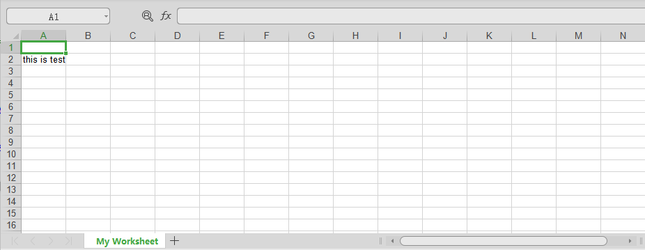


### （1）设置样式

```python
import xlwt

workbook = xlwt.Workbook(encoding = 'ascii')
worksheet = workbook.add_sheet('My Worksheet')

style = xlwt.XFStyle() # 初始化样式

font = xlwt.Font() # 为样式创建字体
font.name = 'Times New Roman'
font.bold = True # 黑体
font.underline = True # 下划线
font.italic = True # 斜体字
style.font = font # 设定样式

worksheet.write(0, 0, 'Unformatted value') # 不带样式的写入
worksheet.write(1, 0, 'Formatted value', style) # 带样式的写入

workbook.save('formatting.xls') # 保存文件
```
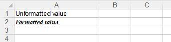


### （2）设置单元格宽度：


```python
import xlwt

workbook = xlwt.Workbook()
worksheet = workbook.add_sheet('My Sheet')
worksheet.write(0, 0,'My Cell Contents')

# 设置单元格宽度
worksheet.col(0).width = 33333

workbook.save('cell_width.xls')
```

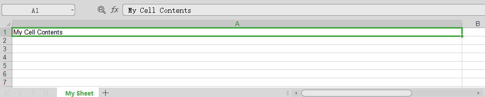


### （3）输入一个日期到单元格：

```python
import xlwt
import datetime

workbook = xlwt.Workbook()
worksheet = workbook.add_sheet('My Sheet')

style = xlwt.XFStyle()
style.num_format_str = 'M/D/YY' # Other options: D-MMM-YY, D-MMM, MMM-YY, h:mm, h:mm:ss, h:mm, h:mm:ss, M/D/YY h:mm, mm:ss, [h]:mm:ss, mm:ss.0

worksheet.write(0, 0, datetime.datetime.now(), style)

workbook.save('Excel_Workbook.xls')

```
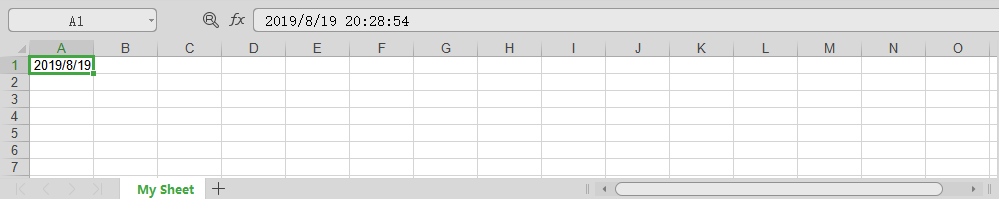
### （4）向单元格添加一个公式：

```python
import xlwt

workbook = xlwt.Workbook()
worksheet = workbook.add_sheet('My Sheet')

worksheet.write(0, 0, 5) # Outputs 5
worksheet.write(0, 1, 2) # Outputs 2
worksheet.write(1, 0, xlwt.Formula('A1*B1')) # Should output "10" (A1[5] * A2[2])
worksheet.write(1, 1, xlwt.Formula('SUM(A1,B1)')) # Should output "7" (A1[5] + A2[2])

workbook.save('Excel_Workbook.xls')

```
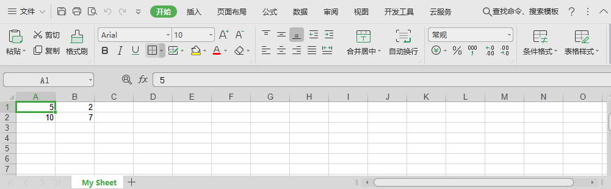


### （5）向单元格添加一个超链接：

```python
import xlwt

workbook = xlwt.Workbook()
worksheet = workbook.add_sheet('My Sheet')

worksheet.write(0, 0, xlwt.Formula('HYPERLINK("http://www.baidu.com";"Baidu")')) # Outputs the text "Baidu" linking to http://www.baidu.com

workbook.save('href.xls')


```
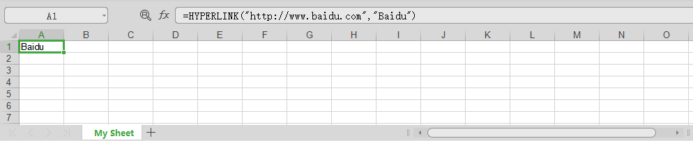

### （6）合并列和行：

```python
import xlwt

workbook = xlwt.Workbook()
worksheet = workbook.add_sheet('My Sheet')
worksheet.write_merge(0, 0, 0, 3, 'First Merge') # Merges row 0's columns 0 through 3.

#列表中每个单元格信息的格式为：(row_start, row_end, col_start, col_end)
#row_start表示合并单元格的起始行；
#row_end表示合并单元格的结束行；
#col_start表示合并单元格的起始列；
#col_end表示合并单元格的结束列；

font = xlwt.Font() # Create Font
font.bold = True # Set font to Bold
style = xlwt.XFStyle() # Create Style
style.font = font # Add Bold Font to Style

worksheet.write_merge(1, 2, 0, 3, 'Second Merge', style) # Merges row 1 through 2's columns 0 through 3.

workbook.save('Excel_Workbook.xls')

```
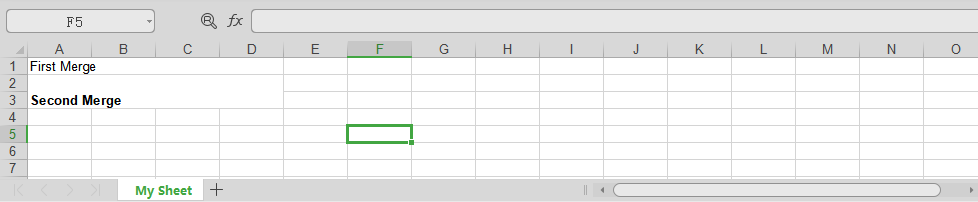


### （7）设置单元格内容的对齐方式：

```python
import xlwt

workbook = xlwt.Workbook()
worksheet = workbook.add_sheet('My Sheet')

alignment = xlwt.Alignment() # Create Alignment
alignment.horz = xlwt.Alignment.HORZ_CENTER # May be: HORZ_GENERAL, HORZ_LEFT, HORZ_CENTER, HORZ_RIGHT, HORZ_FILLED, HORZ_JUSTIFIED, HORZ_CENTER_ACROSS_SEL, HORZ_DISTRIBUTED
alignment.vert = xlwt.Alignment.VERT_CENTER # May be: VERT_TOP, VERT_CENTER, VERT_BOTTOM, VERT_JUSTIFIED, VERT_DISTRIBUTED
style = xlwt.XFStyle() # Create Style
style.alignment = alignment # Add Alignment to Style

worksheet.write(0, 0, 'Cell Contents', style)

workbook.save('align.xls')

```
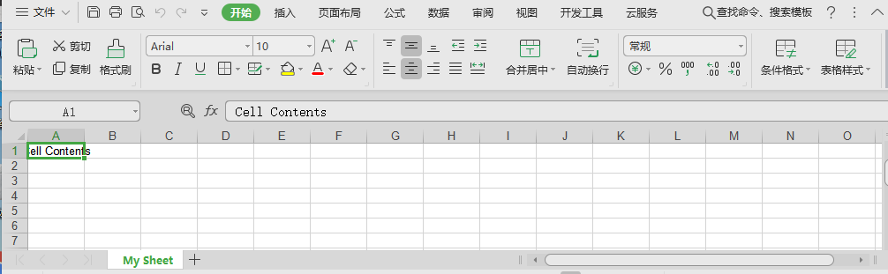


### （8）为单元格添加边框：

```python
# Please note: While I was able to find these constants within the source code, on my system (using LibreOffice,) I was only presented with a solid line, varying from thin to thick; no dotted or dashed lines.
import xlwt

workbook = xlwt.Workbook()
worksheet = workbook.add_sheet('My Sheet')

borders = xlwt.Borders() # Create Borders
borders.left = xlwt.Borders.DASHED
# DASHED虚线
# NO_LINE没有
# THIN实线
# May be: NO_LINE, THIN, MEDIUM, DASHED, DOTTED, THICK, DOUBLE, HAIR, MEDIUM_DASHED, THIN_DASH_DOTTED, MEDIUM_DASH_DOTTED, THIN_DASH_DOT_DOTTED, MEDIUM_DASH_DOT_DOTTED, SLANTED_MEDIUM_DASH_DOTTED, or 0x00 through 0x0D.

borders.right = xlwt.Borders.DASHED
borders.top = xlwt.Borders.DASHED
borders.bottom = xlwt.Borders.DASHED
borders.left_colour = 0x40
borders.right_colour = 0x40
borders.top_colour = 0x40
borders.bottom_colour = 0x40

style = xlwt.XFStyle() # Create Style
style.borders = borders # Add Borders to Style
worksheet.write(0, 0, 'Cell Contents', style)

workbook.save('border.xls')
```


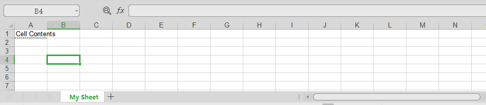

### （9）为单元格设置背景色：

```python
import xlwt

workbook = xlwt.Workbook()
worksheet = workbook.add_sheet('My Sheet')

pattern = xlwt.Pattern() # Create the Pattern
pattern.pattern = xlwt.Pattern.SOLID_PATTERN # May be: NO_PATTERN, SOLID_PATTERN, or 0x00 through 0x12
pattern.pattern_fore_colour = 5 # May be: 8 through 63. 0 = Black, 1 = White, 2 = Red, 3 = Green, 4 = Blue, 5 = Yellow, 6 = Magenta, 7 = Cyan, 16 = Maroon, 17 = Dark Green, 18 = Dark Blue, 19 = Dark Yellow , almost brown), 20 = Dark Magenta, 21 = Teal, 22 = Light Gray, 23 = Dark Gray, the list goes on...

style = xlwt.XFStyle() # Create the Pattern
style.pattern = pattern # Add Pattern to Style

worksheet.write(0, 0, 'Cell Contents', style)

workbook.save('background.xls')
```


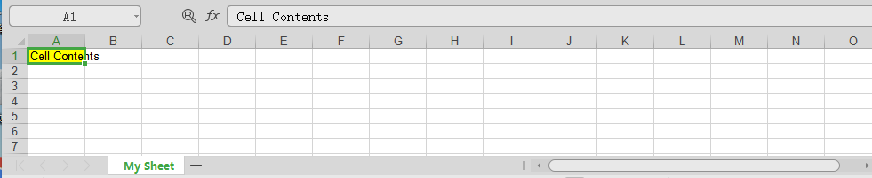

### 案例一

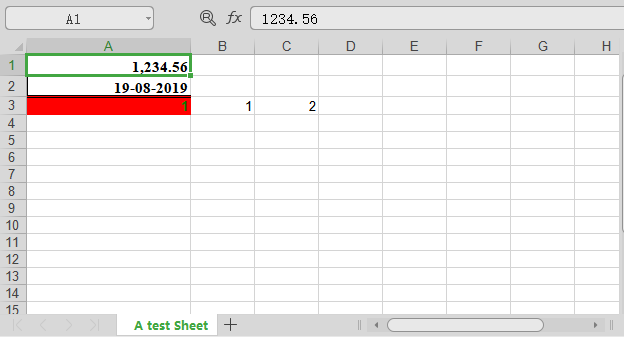

```python
import xlwt
from datetime import datetime,date

def set_style(name, height, bold=False, format_str=''):
    style = xlwt.XFStyle() # 初始化样式

    font = xlwt.Font() #为样式创建字体
    font.name = name #'Times New Roman
    font.bold = bold
    font.height = height

    borders = xlwt.Borders()  #为样式创建边框
    borders.left = 6
    borders.rihgt = 6
    borders.top = 6
    borders.bottom = 6

    style.font = font
    style.borders = borders
    style.num_format_str = format_str

    return style
wb = xlwt.Workbook()
ws = wb.add_sheet('A test Sheet') # 增加sheet

ws.col(0).width = 200*30 #设置第一列列宽
ws.write(0, 0, 1234.56,set_style('Times New Roman',220,bold=True,
format_str='#,##0.00'))

ws.write(1, 0, datetime.now(), set_style('Times New Roman',220,bold=True,
format_str='DD-MM-YYYY'))

styleOK = xlwt.easyxf('pattern: fore_colour light_blue;''font: colour green,
bold True')
pattern = xlwt.Pattern()  #一个实例化的样式类
pattern.pattern = xlwt.Pattern.SOLID_PATTERN #固定的样式
pattern.pattern_fore_colour = xlwt.Style.colour_map['red'] # 背景颜色

styleOK.pattern = pattern

ws.write(2, 0, 1, style=styleOK)
ws.write(2, 1, 1)
ws.write(2, 2, xlwt.Formula("A3+B3"))

wb.save('dubug.xls')   #保存xls
```

### 案例二

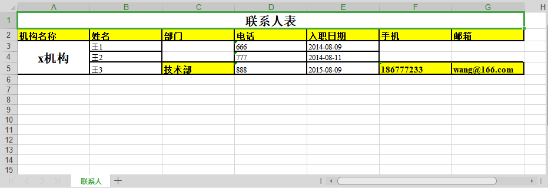


```python
import xlwt
from datetime import datetime,date


def set_style(name, height, bold=False, format_str='',align='center'):

    style = xlwt.XFStyle() # 初始化样式

    font = xlwt.Font() #为样式创建字体
    font.name = name #'Times New Roman
    font.bold = bold
    font.height = height

    borders = xlwt.Borders()  #为样式创建边框
    borders.left = 2
    borders.right = 2
    borders.top = 0
    borders.bottom = 2

    alignment = xlwt.Alignment()  #设置排列

    if align == 'center':
        alignment.horz = xlwt.Alignment.HORZ_CENTER
        alignment.vert = xlwt.Alignment.VERT_CENTER
    else:
        alignment.horz = xlwt.Alignment.HORZ_LEFT
        alignment.vert = xlwt.Alignment.VERT_BOTTOM

    style.font = font
    style.borders = borders
    style.num_format_str = format_str
    style.alignment = alignment

    return style

wb = xlwt.Workbook()
ws = wb.add_sheet('联系人',cell_overwrite_ok=True) #增加sheet

rows = ['机构名称','姓名','部门','电话','入职日期','手机','邮箱']
col1 = ['王1','王2','王3']
col2 = ['666','777','888']
col3 = ['2014-08-09','2014-08-11','2015-08-09']
#写第一行数据
ws.write_merge(
    0,
    0,
    0,
    6,
    '联系人表',
    set_style(
        'Times New Roman',
        320,
        bold=True,
        format_str=''))#合并单元格

#列表中每个单元格信息的格式为：(row_start, row_end, col_start, col_end)
#row_start表示合并单元格的起始行；
#row_end表示合并单元格的结束行；
#col_start表示合并单元格的起始列；
#col_end表示合并单元格的结束列；

styleOK = xlwt.easyxf()
pattern = xlwt.Pattern() #一个实例化的样式类
pattern.pattern = xlwt.Pattern.SOLID_PATTERN #固定的样式
pattern.pattern_fore_colour = xlwt.Style.colour_map['yellow'] #背景颜色

borders = xlwt.Borders() #为样式创建边框
borders.left = 2
borders.right = 2
borders.top = 6
borders.bottom = 2

font = xlwt.Font() #为样式创建字体
font.name = 'Times New Roman'
font.bold = True
font.height = 220

styleOK.pattern = pattern
styleOK.borders = borders
styleOK.font = font


#写第二行数据
for index, val in enumerate(rows):
    ws.col(index).width = 150 * 30 #定义列宽
    ws.write(1, index,val,style=styleOK)

#写第三行-六行第一列数据
ws.write_merge(
    2,
    2 + len(col1)-1,
    0,
    0,
    'x机构',
    set_style(
        'Times New Roman',
        320,
        bold=True,
        format_str=''
    )
) #合并单元格


#从第三行开始写第一列数据
for index, val in enumerate(col1):
    ws.col(1).width = 150*30 #定义列宽
    ws.write(index+2, 1,val,style = set_style('Times New Roman',200,
bold=False,
    format_str='',align=''))


# 从第三行写4列数据
for index ,val in enumerate(col2):
    ws.col(3).width = 150 * 30 #定义列宽
    ws.write(index+2,3,val,style = set_style('Times New Roman',200,bold=False,
format_str='',align=''))


# 从三行开始写5列数据
for index,val in enumerate(col3):
    ws.col(4).width = 150 * 30 #定义列宽
    ws.write(index+2,4,val,style = set_style('Times New Roman',200,
    bold=False,format_str='',align=''))


ws.write(4,2,'技术部',style = styleOK)
ws.write(4,5,'186777233',style = styleOK)
ws.write(4,6,'wang@166.com',style = styleOK)

wb.save('test.xls') #保存xls

```

## xlwt的缺陷

xlwt只能创建一个全新的excel文件,然后对这个文件进行写入内容以及保存。
但是大多数情况下我们希望的是读入一个excel文件，然后进行修改或追加，这个时候就需要xlutils了。

### xlutils模块

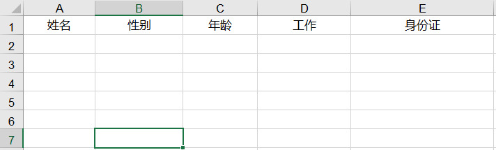

目前希望打开某个excel文件，然后写入内容
最终效果：最初无论设置什么格式或者行高，在程序输入内容之后，都会保存为默认的字体大小和行高

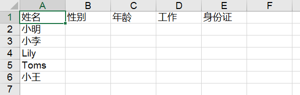


使用xlwt设置excel里面的字体的style

```python
from xlrd import open_workbook
from xlutils.copy import copy
import xlwt
def set_style(name, height, bold=False):
    style = xlwt.XFStyle()  # 初始化样式
    font = xlwt.Font()      # 为样式创建字体
    font.name = name        # 定义具体的字体
    font.bold = bold        # 定义是否加粗
    font.color_index = 4    # 定义字体颜色
    font.height = height    # 定义字体高度
    style.font = font       # 最终把自定义的字体，定义到风格里面
    return style
# 写excel
def write_excel():
    # 读取一个excel文件
    rd_excel = open_workbook("D:\MyProjects\APITest\XLWT_TEST.xls")
    # 将xlrd的对象转化为xlwt的对象
    new_excel = copy(rd_excel)
    # 获得要操作的sheet
    table = new_excel.get_sheet(0)
    # 准备要输入的内容
    values = ['小明','小李','Lily','Toms','小王']
    # xlwt对象的写方法，参数分别是行、列、值
    table.write(1, 0, values[0], set_style('微软雅黑', 300 ,True))
    table.write(2, 0, values[1], set_style('Arial', 100 ,True))
    table.write(3, 0, values[2], set_style('微软雅黑', 400 ,False))
    table.write(4, 0, values[3], set_style('宋体', 200 ,True))
    table.write(5, 0, values[4], set_style('Arial', 300 ,False))
    # xlwt对象的保存方法，这时便覆盖掉了原来的excel
    new_excel.save("D:\MyProjects\APITest\XLWT_TEST.xls")
if __name__ == '__main__':
    write_excel()

```


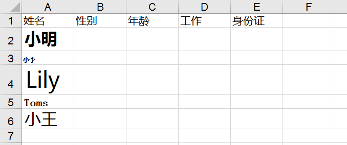