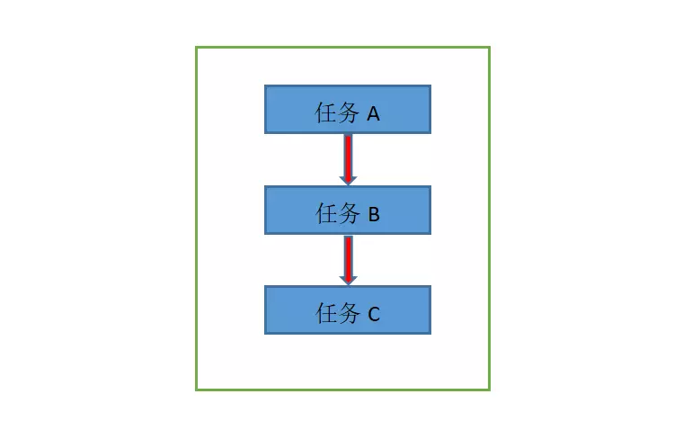

# 多线程爬虫

有些时候，比如下载图片，因为下载图片的是一个耗时的操作。如果采用之前的那种同步的方式下载。那效率会特别慢。这时候我们就可以考虑使用多线程的方式来下载图片。

# 多线程介绍：

多线程是为了同步完成多项任务，通过提高资源使用效率来提高系统的效率。线程是在同一时间需要完成多项任务的时候实现。最简单的比喻就像火车的每一节车厢，而进程是火车。车厢里开火车是无法跑动，同理火车也可以有多节车厢。多线程的出现就是为了提高效率。同时它的出现也带来了一些问题。更多请参考： https://baike.baidu.com/item/多线程/1190404?fr=aladdin

那什么是多线程？提到多线程这里要说两个概念，就是串行和并行，搞清楚这个，我们才能更好地理解多线程。

所谓串行，其实是相对于单条线程来执行多个任务来说的，我们就拿下载文件来举个例子：当我们下载多个文件时，在串行中它是按照一定的顺序去进行下载的，也就是说，必须等下载完A之后才能开始下载B，它们在时间上是不可能发生重叠的。





并行：下载多个文件，开启多条线程，多个文件同时进行下载，这里是严格意义上的，在同一时刻发生的，并行在时间上是重叠的。


了解了这两个概念之后，我们再来说说什么是多线程。举个例子，我们打开腾讯管家，腾讯管家本身就是一个程序，也就是说它就是一个进程，它里面有很多的功能，我们可以看下图，能查杀病毒、清理垃圾、电脑加速等众多功能。
按照单线程来说，无论你想要清理垃圾、还是要病毒查杀，那么你必须先做完其中的一件事，才能做下一件事，这里面是有一个执行顺序的。
如果是多线程的话，我们其实在清理垃圾的时候，还可以进行查杀病毒、电脑加速等等其他的操作，这个是严格意义上的同一时刻发生的，没有执行上的先后顺序。


# threading模块介绍：

threading 模块是 python 中专门提供用来做多线程的模块。 threading 模块中最常见的类是 Thread ，以下看一个简单的多线程程序：

```python
import threading
import time


def coding():
    for x in range(3):
        print("%s正在写代码" % x)
        time.sleep(1)


def drawing():
    for x in range(3):
        print("%s正在画画" % x)
        time.sleep(1)


def single_thread():
    coding()
    drawing()


def multi_thread():
    # 创建子线程
    t1 = threading.Thread(target=coding)
    t2 = threading.Thread(target=drawing)
    # 执行线程
    t1.start()
    t2.start()


single_thread()
# >>>0正在写代码
# >>>1正在写代码
# >>>2正在写代码
# >>>0正在画画
# >>>1正在画画
# >>>2正在画画
# 这里一共花了6秒钟

multi_thread()
# >>>0正在写代码
# >>>1正在写代码
# >>>2正在写代码
# >>>0正在画画
# >>>1正在画画
# >>>2正在画画
# 这里一共花了3秒钟
```


## 查看线程数：

使用 threading.enumerate( )函数便可以看到当前线程的数量。

## 查看当前线程的名字：

使用 threading.current_thread( ) 可以看到当前线程的信息。

## 继承自 threading.Thread 类：

为了让线程代码更好的封装。可以 使用 threading模块下的 Thread 类，继承自这个类，然后实现 run 方法，线程就会自动运行 run 方法中的代码。 示例代码如下：

```python
import threading
import time


class CodingThread(threading.Thread):
    def run(self):
        for x in range(3):
            print("%s正在写代码" % threading.current_thread())
            time.sleep(1)


class DrawingThread(threading.Thread):
    def run(self):
        for x in range(3):
            print("%s正在画画" % threading.current_thread())
            time.sleep(1)


def multi_thread():
    # 创建子线程
    t1 = CodingThread()
    t2 = DrawingThread()
    # 执行线程
    t1.start()
    t2.start()


multi_thread()
# >>><CodingThread(Thread-1, started 11800)>正在写代码
# >>><DrawingThread(Thread-2, started 9600)>正在画画
# >>><CodingThread(Thread-1, started 11800)>正在写代码
# >>><DrawingThread(Thread-2, started 9600)>正在画画
# >>><DrawingThread(Thread-2, started 9600)>正在画画
# >>><CodingThread(Thread-1, started 11800)>正在写代码
# 这里一共花了3秒钟
```

## 多线程共享全局变量-args参数
```python
import threading
import time


def test1(temp):
    temp.append(33)
    print("-----in test1 temp=%s" % str(temp))


def test2(temp):
    print("------in test2 temp=%s" % str(temp))


g_nums = [11, 22]


def main():
    # target指定将来 这个线程去哪个函数执行代码
    # args指定将来掉用函数的时候传递什么数据过去
    t1 = threading.Thread(target=test1, args=(g_nums,))
    t2 = threading.Thread(target=test2, args=(g_nums,))
    t1.start()
    time.sleep(1)
    t2.start()
    time.sleep(1)
    print("----in main Thread g_nums =%s" % str(g_nums))


if __name__ == "__main__":
    main()


```


## 多线程共享全局变量的问题：

多线程都是在同一进程中运行的。因此在进程中的全局变量所有线程都是可以共享的。这就造成了一个问题，因为线程的执行顺序是无序的。有可能会造成数据错误。比如以下代码：
```python
import threading

tickets = 0


def get_ticket():
    global tickets
    for x in range(1000000):
        tickets += 1
    print("tickets:%d" % tickets)


def main():
    for x in range(2):
        # get_ticket()
        t = threading.Thread(target=get_ticket)
        t.start()


main()
# 正常的值应该是 1000000,2000000，但是因为多线程运行的不确定性。因此最后的结果可能是随机的。

```

## 锁机制：

为了解决以上使用共享全局变量的问题。 threading 提供了一个 Lock类，这个类可以在某个线程访问某个变量的时候枷锁，其他线程就不能进来，直到当前线程完成后，把锁释放了，其他线程才能进来。示例代码如下：

```python
import threading

tickets = 0
gLock = threading.Lock()


def get_ticket():
    global tickets
    gLock.acquire()
    for x in range(1000000):
        tickets += 1
    gLock.release()
    print("tickets:%d" % tickets)


def main():
    for x in range(2):
        t = threading.Thread(target=get_ticket)
        t.start()


main()
# >>>tickets:1000000
# >>>tickets:2000000

```
## Lock版本生产者的消费者模式：

生产者和消费者模式是多线程开发中经常见到的一种模式。生产者的线程是专门用来生产一些数据，然后存放到一个中间的变量中。消费者再从这个变量中取出数据进行消费。但是因为要使用中间变量，中间变量经常是一些全局变量，因此需要使用锁来保证数据完整性。以下是使用 threading.Lock 锁实现的“生产者与消费者模式" 的一个例子：
```python
import threading
import random
import time

gMOney = 1000
gLock = threading.Lock()
# 记录生产者生产的次数，达到十次就不再生产
gTimes = 0


class Producer(threading.Thread):
    def run(self):
        global gMOney
        global gLock
        global gTimes
        while True:
            money = random.randint(100, 1000)  # 随机100-1000金额
            gLock.acquire()
            # 如果已经达到十次了，就不再生产了
            if gTimes >= 10:
                gLock.release()
                break
            gMOney += money
            print(f"{threading.current_thread()}当前存入{money}元钱，剩余{gMOney}元钱")
            gTimes += 1
            time.sleep(0.5)
            gLock.release()


class Consumer(threading.Thread):
    def run(self):
        global gMOney
        global gLock
        global gTimes
        while True:
            money = random.randint(100, 500)  # 随机100-500金额
            gLock.acquire()
            if gMOney > money:
                gMOney -= money
                print(f"{threading.current_thread()}当前取出{money}元钱，剩余{gMOney}元钱")
            else:
                # 如果钱不够了，有可能超过次数了，这时候就要判断一下
                print(f"{threading.current_thread()}当前想要出{money}元钱，剩余{gMOney}元钱，不足！")
                if gTimes >= 10:
                    gLock.release()
                    break
            time.sleep(0.5)
            gLock.release()


def main():
    for x in range(3):
        t = Consumer(name="消费者线程%d" % x)
        t.start()
    for x in range(5):
        t = Producer(name="生产者线程%d" % x)
        t.start()


main()
```

## condition版生产者与消费者模式：

Lock 版本的生产者与消费者模式可以正常的运行。但是存在一个不足，在消费者中，总是通过 while True 死循环并且上锁的方式去判断钱够不够。上锁是一个很耗费CPU资源的行为。因此这种方法不是最好的。还有一种更好的方式便是使用 threading.Condition 来实现。 threading.Condition 可以在没有数据的时候处于阻塞等待状态。一旦有合适的数据了，还可以使用 notify 相关的函数来通知其他处于等待的线程。这样就不用做一些无用的上锁和解锁的操作。可以提高程序的性能。首先对 threading.Condition 相关的函数做个介绍， threading.Conditon 类似threading.Lock ，可以在修改全局数据的时候进行上锁，也可以在修改完毕之后进行解锁。以下将一些常用的函数做个简单的介绍：

1、 acquire ：上锁。
2、release ：解锁。
3、wait ：将当前线程处于等待状态，并且会释放锁。可以被其他线程使用 notify 和notify_all 函数唤醒。被唤醒后会继续等待上锁，上锁继续执行下面的代码。
4、notify ： 通知某个正在等待的线程，默认是第一个等待的线程。
5、notify_all ：通知所有正在等待的线程。 notify 和 notify_all 不会释放锁。并且需要在 release之前调用。

Condition 版的生产者与消费者模式代码如下：
```python

import threading
import random
import time

gMOney = 1000
gCondition = threading.Condition()
# 记录生产者生产的次数，达到十次就不再生产
gTimes = 0


class Producer(threading.Thread):
    def run(self):
        global gMOney
        global gLock
        global gTimes
        while True:
            money = random.randint(100, 1000)
            gCondition.acquire()
            # 如果已经达到十次了，就不再生产了
            if gTimes >= 10:
                gCondition.release()
                break
            gMOney += money
            print("%s 当前存入%s元钱，剩余%s元钱" % (threading.current_thread(), money, gMOney))
            gTimes += 1
            gCondition.notify_all()
            gCondition.release()
            time.sleep(0.5)


class Consumer(threading.Thread):
    def run(self):
        global gMOney
        global gLock
        global gTimes
        while True:
            money = random.randint(100, 500)
            gCondition.acquire()
            if gMOney < money:
                if gTimes >= 10:
                    gCondition.release()
                    return
                print(
                    "%s当前想要出%s元钱，剩余%s元钱，不足！"
                    % (threading.current_thread(), money, gMOney)
                )
                gCondition.wait()
            gMOney -= money
            print("%s当前取出%s元钱，剩余%s元钱" % (threading.current_thread(), money, gMOney))
            gCondition.release()
            time.sleep(0.5)


def main():
    for x in range(3):
        t = Consumer(name="消费者线程%d" % x)
        t.start()
    for x in range(5):
        t = Producer(name="生产者线程%d" % x)
        t.start()


main()
```

## Queue线程安全队列：

在线程中，访问一些全局变量，加锁是一个经常的过程。如果你是想把一些数据储存到某个队列中，那么Python内置了一个线程安全的模块叫做 queue 模块。Python 中的queue模块提供了同步、线程安全的队列，包括FIFO（先进先出）队列Queue，LIFO（后入先出）队列LifoQueue。这些队列都实现了锁原语（可以理解为原子操作，即要么不做，要么都做完），能够在多线程中直接使用。可以使用队列化来实现线程间的同步。相关的函数如下：

1、初始化Queue（maxsize）：创建一个先进先出的队列。
2、qsize（）：返回队列的大小。
3、empty（）：判断队列是否为空。
4、full（）：判断队列是否满了。
5、get（）：从队列中取一个数据。
6、put（）：将一个数据放到队列中。


```python
from queue import Queue

q = Queue(4)
for x in range(0, 3):
    q.put(x)
print(q.qsize())
# >>>3
print(q.full())
# >>>False
for x in range(0, 4):
    print(q.get())
# >>>0
# >>>1
# >>>2
```

```python
from queue import Queue
import time
import threading


def set_value(q):
    index = 0
    while True:
        q.put(index)
        index += 1
        time.sleep(3)


def get_value(q):
    while True:
        print(q.get())


def main():
    q = Queue(4)  # 变量
    t1 = threading.Thread(target=set_value, args=[q])  # 添加参数
    t2 = threading.Thread(target=get_value, args=[q])  # 添加参数
    t1.start()
    t2.start()


main()
```

## 下载表情包之同步爬虫完成
```python
from lxml import etree
import requests, os, datetime, re
from urllib import request


def parse_page(url):
    headers = {
        "User-Agent": "Mozilla/5.0 (Windows NT 10.0; Win64; x64;rv:68.0) Gecko/20100101 Firefox/68.0"
    }
    response = requests.get(url, headers=headers)
    text = response.text
    # print(text)

    html = etree.HTML(text)
    imgs = html.xpath("//div[@class='page-content text-center']//img[@class!='gif']")
    # print(imgs)

    for img in imgs:

        img_url = img.get("data-original")
        alt = img.get("alt")
        alt = re.sub(r"[\?？\.,。！!]", "", alt)
        # print(img_url,alt)
        suffix = os.path.splitext(img_url)[1]
        filename = alt + suffix
        # print(filename)
        request.urlretrieve(img_url, "images/" + filename)


def main():

    start = datetime.datetime.now().replace(microsecond=0)
    for x in range(1, 5):
        url = "https://www.doutula.com/photo/list/?page=%d" % x
        parse_page(url)

    end = datetime.datetime.now().replace(microsecond=0)
    print("耗时: %s" % (end - start))


main()

```
## 使用生产者与消费者模式多线程下载表情包：


```python
import threading, requests, os, re, datetime
from lxml import etree
from urllib import request
from queue import Queue


class Producer(threading.Thread):

    headers = {
        "User-Agent": "Mozilla/5.0 (Windows NT 10.0; Win64; x64;rv:68.0) Gecko/20100101 Firefox/68.0"
    }

    def __init__(self, page_queue, img_queue, *args, **kwargs):
        super(Producer, self).__init__(*args, **kwargs)
        self.page_queue = page_queue
        self.img_queue = img_queue

    def run(self):
        while True:
            if self.page_queue.empty():
                break
            url = self.page_queue.get()
            self.parse_page(url)

    def parse_page(self, url):
        response = requests.get(url, headers=self.headers)
        text = response.text
        # print(text)
        html = etree.HTML(text)
        imgs = html.xpath(
            "//div[@class='page-content text-center']//img[@class!='gif']"
        )
        # print(imgs)

        for img in imgs:
            img_url = img.get("data-original")
            alt = img.get("alt")
            alt = re.sub(r"[\?？\.,。！!]", "", alt)
            # print(img_url,alt)
            suffix = os.path.splitext(img_url)[1]
            filename = alt + suffix
            # print(img_url,alt)
            self.img_queue.put((img_url, filename))


class Consumer(threading.Thread):
    def __init__(self, page_queue, img_queue, *args, **kwargs):
        super(Consumer, self).__init__(*args, **kwargs)
        self.page_queue = page_queue
        self.img_queue = img_queue

    def run(self):
        while True:
            if self.img_queue.empty() and self.page_queue.empty():
                break
            img_url, filename = self.img_queue.get()
            # print(img_url,filename)
            request.urlretrieve(img_url, "images2/" + filename)
            print(filename + "下载完成")


def main():

    start = datetime.datetime.now().replace(microsecond=0)
    page_queue = Queue(100)
    img_queue = Queue(1000)
    for x in range(1, 21):
        url = "https://www.doutula.com/photo/list/?page=%d" % x
        page_queue.put(url)
    for x in range(5):
        t = Producer(page_queue, img_queue)
        t.start()
    for x in range(5):
        t = Consumer(page_queue, img_queue)
        t.start()
    end = datetime.datetime.now().replace(microsecond=0)
    print("耗时: %s" % (end - start))


main()
```
## GIL全局解释器锁：

Python自带的解释器是 CPython。 CPython解释器的多线程实际上是一个假的多线程（在多核CPU中，只能利用一核，不能利用多核）。同一时刻只有一个线程在执行，为了保证同一时刻只有一个线程在执行，在 CPython解释器中有一个东西叫做 GIL，叫做全局解释器锁。这个解释器锁是有必要的。因为 CPython解释器的内存管理不是线程安全。当然除了 CPython解释器，还有其他解释器，有些解释器是没有 GIL锁的，见下面：
1、Jython ：用Java实现的Python解释器。不存在GIL锁。更多详情请见：百度百科
2、IronPython ：用 .net 实现的Python解释器，不存在GIl 锁。更多详情请见：百度百科
3、PyPy：用 Python 实现的Python解释器。存在GIL锁。更多详情请见：百度百科
GIL虽然是一个假的多线程。但是在处理一些IO操作（比如文件读写和网络请求）还是可以很大程度上提高效率的。在IO操作上建议使用多线程提高效率。在一些CPU计算操作上不建议使用多线程，而建议使用多进程。


## 多线程下载百思不得姐段子作业：

```python
import requests, threading, csv
from lxml import etree
from queue import Queue


class BSSpider(threading.Thread):
    headers = {
        "User-Agent": "Mozilla/5.0 (Windows NT 10.0; Win64; x64;rv:68.0) Gecko/20100101 Firefox/68.0"
    }

    def __init__(self, page_queue, joke_queue, *args, **kwargs):
        super(BSSpider, self).__init__(*args, **kwargs)
        self.base_domain = "http://www.budejie.com"
        self.page_queue = page_queue
        self.joke_queue = joke_queue

    def run(self):
        while True:
            if self.page_queue.empty():
                break
            url = self.page_queue.get()
            response = requests.get(url, headers=self.headers)
            text = response.text
            html = etree.HTML(text)
            descs = html.xpath("//div[@class='j-r-list-c-desc']")
            for desc in descs:
                jokes = desc.xpath(".//text()")
                joke = "\n".join(jokes).strip()
                # print(joke,'\n')
                link = self.base_domain + desc.xpath(".//a/@href")[0]
                # print(joke,link)
                self.joke_queue.put((joke, link))
            print("=" * 30 + "第%s页下载完成" % url.split("/")[-1] + "=" * 30)


class BSWriter(threading.Thread):
    headers = {
        "User-Agent": "Mozilla/5.0 (Windows NT 10.0; Win64; x64;rv:68.0) Gecko/20100101 Firefox/68.0"
    }

    def __init__(self, joke_queue, writer, gLock, *args, **kwargs):
        super(BSWriter, self).__init__(*args, **kwargs)
        self.joke_queue = joke_queue
        self.writer = writer
        self.lock = gLock

    def run(self):
        while True:
            try:
                joke_info = self.joke_queue.get(timeout=40)
                joke, link = joke_info
                # print(joke_info)
                self.lock.acquire()
                self.writer.writerow((joke, link))
                self.lock.release()
                print("保存一条")
            except:
                break


def main():
    page_queue = Queue(10)
    joke_queue = Queue(500)
    gLock = threading.Lock()
    fp = open("bsbdqj.csv", "a", newline="", encoding="utf-8")
    writer = csv.writer(fp)
    writer.writerow(("content", "link"))
    for x in range(1, 11):
        url = "http://www.budejie.com/text/%d" % x
        page_queue.put(url)

    for x in range(5):
        t = BSSpider(page_queue, joke_queue)
        t.start()
    for x in range(5):
        t = BSWriter(joke_queue, writer, gLock)
        t.start()


main()

```