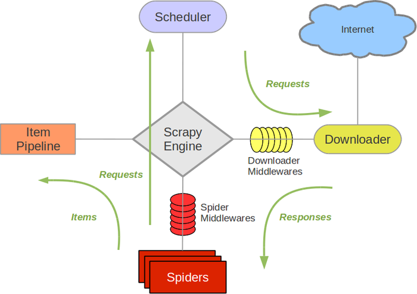
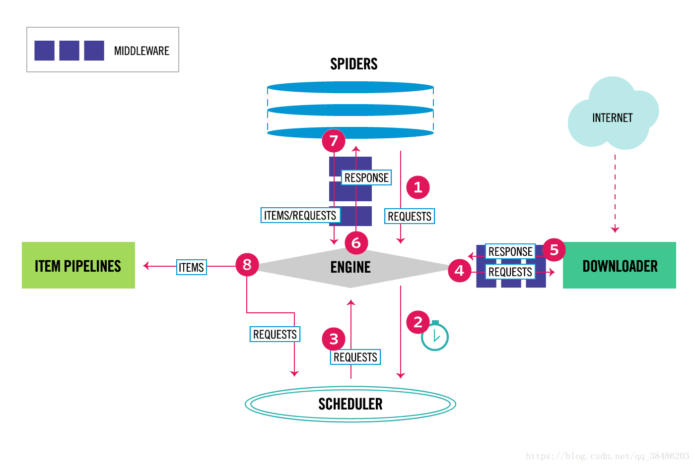

# Scrapy框架架构：

## Scrapy框架介绍：

写一个爬虫，需要做很多的事情。比如：发送请求、数据、数据存储、反反爬虫机制（更换ip代理、设置请求头等）、异步请求。这些工作如果每次都要自己从零开始写的话，比较浪费时间’因此Scrapy 把一些基础的东西封装好了，在它上面写爬虫可以变的更加的高效（爬取效率和开发效率）。因此真正在公司里，一些上了量的爬虫，都是使用 SCrapy框架来解决的。

## scrapy架构图：

### 1、流程图（1）：

### 2、流程图（2）：

Scrapy框架模块功能：

1、Scrapy Engine（引擎）：Scrapy框架的核心部分。负责在 Spider 和ITemPipeline 、 Downloader、Scheduler 中间通信、传递数据等。
2、Spider（爬虫）：发送需要爬去的链接给引擎，最后引擎把其他模块请求回来的数据再发送给爬虫，爬虫就去解析想要的数据。这个部分是我们开发者自己写的，因为想要爬取哪些链接，页面的哪些数据是我们需要的，由程序员自己决定。
3、Scheduler（调度器）：负责接收引擎发送过来的请求，并按照一定的方式进行排列和整理，负责调度请求的顺序等。
4、Downloader（下载器）：负责接收引擎传过来的下载请求，然后去网络上下载对应的数据再提交给引擎。
5、Item PIpeline（管道）：负责将 Spider（爬虫）传递过来的数据进行保存。具体保存在哪里，应该看开发者自己的需求。
6、Downloader Middlewares（下载中间件）：可以扩展下载器和引擎之间的通信功能的中间件。
7、Spider Middlewares（Spider中间件）：可以扩张引擎和爬虫之间通信功能的中间件。