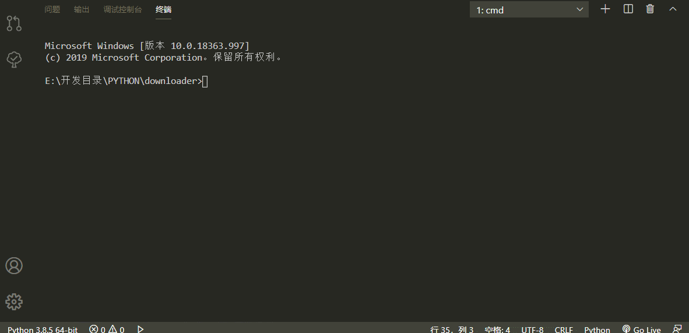

# 1、什么是协程

## 1.1、协程（coroutine）

是计算机程序的一类组件，推广了协作式多任务的子程序，允许执行被挂起与被恢复，协程是由用户程序自己控制调度的。

协程的本质就是在单线程下，由用户自己控制一个任务遇到IO阻塞了就切换另外一个任务去执行，以此来提升效率。

可以控制多个任务之间的切换，切换之前将任务的状态保存下来，以便重新运行时，可以基于暂停的位置继续执行。

可以检测IO操作，在遇到IO操作的情况下才发生切换。

## 1.2、优点： 

本质上协程是在单线程里切换多个任务，是在单线程里实现并发，在应用程序里控制多个任务的切换 + 保存状态。

协程的切换开销更小，属于程序级别的切换，操作系统完全感知不到，因而更加轻量级。

应用程序级别速度要远远高于操作系统的切换。

单线程内就可以实现并发的效果，最大限度地利用cpu。

## 1.3、缺点：

一旦引入协程，就需要检测单线程下所有的IO行为,多个任务一旦有一个阻塞没有切，整个线程都阻塞在原地，该线程内的其他的任务都不能执行了。

协程的本质是单线程下，无法利用多核，但是可以一个程序开启多个进程，每个进程内开启协程运行多个任务。

## 1.4、同子程序的比较

协程可以通过yield（取其“让步”之义而非“出产”）来调用其它协程，接下来的每次协程被调用时，从协程上次yield返回的位置接着执行，通过yield方式转移执行权的协程之间不是调用者与被调用者的关系，而是彼此对称、平等的。

简要比较：

- 子程序可以调用其他子程序，调用者等待被调用者结束后继续执行，故而子程序的生命期遵循后进先出，即最后一个被调用的子程序最先结束返回。协程的生命期完全由对它们的使用需要来决定。
- 子程序的起始处是惟一的入口点，每当子程序被调用时，执行都从被调用子程序的起始处开始。协程可以有多个入口点，协程的起始处是第一个入口点，每个yield返回出口点都是再次被调用执行时的入口点。
- 子程序只在结束时一次性的返回全部结果值。协程可以在yield时不调用其他协程，而是每次返回一部分的结果值，这种协程常称为生成器或迭代器。

## 1.5、同生成器的区别

尽管二者都可以yield多次，挂起自身的执行，并允许在多个入口点重新进入，但它们特别差异在于，协程有能力控制在它让位之后哪个协程任务立即接续它来执行，而生成器不能，它只能把控制权转交给调用生成器的调用者。

在生成器中的`yield`语句不指定要跳转到的协程，而是向父程序传递返回值。

# 2、python3.5 之前的协程

python3.5 之前的协程都是基于 yield 语句的生成器实现的。

## 2.1、单纯用协程切换任务反而会降低运行效率

```python
#串行执行
import time


def func1():
    for i in range(10000000):
        i + 1


def func2():
    for i in range(10000000):
        i + 1


start = time.time()
func1()
func2()
stop = time.time()
print(stop - start)

输出结果为：
0.7310729026794434


```

```python
#基于yield并发执行
import time


def func1():
    while True:
        yield


def func2():
    g = func1()
    for i in range(10000000):
        i + 1
        next(g)


start = time.time()
func2()
stop = time.time()
print(stop - start)

输出结果：
0.8657119274139404


```

## 2.2、使用协程执行IO任务来提高效率

在并发执行多个任务时，在任务一遇到IO情况下，切到任务二去执行，这样就可以利用任务一阻塞的时间完成任务二的计算，效率的提升就在于此。

```python
#yield不能检测IO
import time

# 用time.sleep()模拟IO操作
# yield不能检测IO，后面实现遇到IO自动切换
def func1():
    while True:
        print("func1")
        yield


def func2():
    g = func1()
    for i in range(10000000):
        i + 1
        next(g)
        time.sleep(3)
        print("func2")


start = time.time()
func2()
stop = time.time()
print(stop - start)


```

**需要强调的是：**

1、python的线程属于内核级别的，即由操作系统控制调度（如单线程遇到 IO或执行时间过长就会被迫交出cpu执行权限，切换其他线程运行）。

2、单线程内开启协程，一旦遇到 IO，就会从应用程序级别（而非操作系统）控制切换，以此来提升效率（！！！非 IO操作的切换与效率无关）。

## 2.3、Greenlet

如果我们在单个线程内有20个任务，要想实现在多个任务之间切换，使用yield生成器的方式过于麻烦（需要先得到初始化一次的生成器，然后再调用send。。。非常麻烦），而使用greenlet模块可以非常简单地实现这20个任务直接的切换。

```cmd
安装
pip3 install greenlt
```

```python
from greenlet import greenlet


def eat(name):
    print("%s eat 1" % name)
    g2.switch("egon")
    print("%s eat 2" % name)
    g2.switch()


def play(name):
    print("%s play 1" % name)
    g1.switch()
    print("%s play 2" % name)


g1 = greenlet(eat)
g2 = greenlet(play)

g1.switch("egon")  # 可以在第一次switch时传入参数，以后都不需要
```

greenlet只是提供了一种比generator更加便捷的切换方式，当切到一个任务执行时如果遇到io，那就原地阻塞，仍然是没有解决遇到IO自动切换来提升效率的问题。

单线程里的这20个任务的代码通常会既有计算操作又有阻塞操作，我们完全可以在执行任务1时遇到阻塞，就利用阻塞的时间去执行任务2。。。。如此，才能提高效率，这就用到了Gevent模块。

## 2.4、Gevent介绍

Gevent 是一个第三方库，可以轻松通过gevent实现并发同步或异步编程，在gevent中用到的主要模式是**Greenlet**, 它是以C扩展模块形式接入Python的轻量级协程。 Greenlet全部运行在主程序操作系统进程的内部，但它们被协作式地调度。

```cmd
安装
pip3 install gevent
```

```python
#基本用法
创建一个协程对象g1，spawn括号内第一个参数是函数名，如eat，后面可以有多个参数，
可以是位置实参或关键字实参，都是传给函数eat的
g1=gevent.spawn(func,1,,2,3,x=4,y=5)

g2=gevent.spawn(func2)

g1.join() #等待g1结束

g2.join() #等待g2结束

#或者上述两步合作一步：gevent.joinall([g1,g2])

g1.value#拿到func1的返回值


```

```python
#遇到IO阻塞时会自动切换任务
import gevent


def eat(name):
    print("%s eat 1" % name)
    gevent.sleep(2)
    print("%s eat 2" % name)


def play(name):
    print("%s play 1" % name)
    gevent.sleep(1)
    print("%s play 2" % name)


g1 = gevent.spawn(eat, "egon")
g2 = gevent.spawn(play, name="egon")
g1.join()
g2.join()
# 或者gevent.joinall([g1,g2])
print("主")

输出结果：
egon eat 1
egon play 1
egon play 2
egon eat 2
主


```

**上例gevent.sleep(2)模拟的是gevent可以识别的io阻塞,**

**而time.sleep(2)或其他的阻塞,gevent是不能直接识别的需要用下面一行代码,打补丁,就可以识别了**

**from gevent import monkey;monkey.patch_all()必须放到被打补丁者的前面，如time，socket模块之前**

**或者我们干脆记忆成：要用gevent，需要将from gevent import monkey;monkey.patch_all()放到文件的开头**

```python
from gevent import monkey

monkey.patch_all()

import gevent
import time
import threading


def eat():
    print(threading.current_thread().getName())
    print("eat food 1")
    time.sleep(2)
    print("eat food 2")


def play():
    print(threading.current_thread().getName())
    print("play 1")
    time.sleep(1)
    print("play 2")

g1 = gevent.spawn(eat)
g2 = gevent.spawn(play)
gevent.joinall([g1, g2])
print("主")

输出结果：
DummyThread-1
eat food 1
DummyThread-2
play 1
play 2
eat food 2
主
```

我们可以用threading.current_thread().getName()来查看每个g1和g2，查看的结果为DummyThread-n，即假线程！

```python
#Gevent之同步与异步
from gevent import spawn, joinall, monkey

monkey.patch_all()

import time


def task(pid):
    """
    Some non-deterministic task
    """
    time.sleep(0.5)
    print("Task %s done" % pid)


def synchronous():
    for i in range(10):
        task(i)


def asynchronous():
    g_l = [spawn(task, i) for i in range(10)]
    joinall(g_l)


if __name__ == "__main__":
    print("Synchronous:")
    synchronous()

    print("Asynchronous:")
    asynchronous()
# 上面程序的重要部分是将task函数封装到Greenlet内部线程的gevent.spawn。
# 初始化的greenlet列表存放在数组threads中，此数组被传给gevent.joinall 函数，
# 后者阻塞当前流程，并执行所有给定的greenlet。
# 执行流程只会在 所有greenlet执行完后才会继续向下走。


```

输出结果：



# 3、python3.5 之后的协程

在 Python 3.5 增加了 async / await 关键字，使得协程的实现更加方便！

## 3.1、async 与 await

下面新的语法用于声明一个原生协程：

```python
async def read_data(db):
    pass
```

协程的主要特性：

- 使用 `async def` 定义的函数总是协程，即使它们没有包含 `await` 表达式。
- 在 `async` 函数中出现 `yield` 或 `yield from` 表达式将会引发 `SyntaxError` 异常。
- 在内部，引入了两个新的代码对象标志：常规的生成器在调用时返回一个生成器对象。类似的、协程在调用时返回一个协程对象。
  - CO_COROTINE 用于标记原生协程（使用新语法定义的协程）。
  - CO_ITERABLE_COROUTINE 用于使基于生成器的协程与原生协程兼容（由 `types.coroutine()` 函数设置）。
- StopIteration 异常不会从协程中传播出去，而是用 RuntimeError 替换。
- 当原生协程被垃圾回收时，如果它从未被等待，则会引发 RuntimeWarning 异常。

下面的 await 表达式用于获得协程执行的结果：

```python
async def read_data(db): 
    data = await db.fetch('SELECT ...')
```

awai 将 read_data 协程的执行挂起，直到 db.fetch 可等待对象完成并返回结果数 。


await 只接受一个可等待对象，它可以是：

- 从原生协程函数返回的原生协程对象。
- 从被 types.coroutine() 装饰器装饰的函数中返回的基于生成器的协程对象。
- 包含返回一个迭代器的 \__await__ 方法的对象。 
- 在 async def 函数体外使用 await 将会引发 SyntaxError 异常（就像在 def 函数体外使用 yield 引发 SyntaxError 异常一样）。
- 给 await 表达式传递可等待对象之外的其他任何对象将会引发 TypeError 异常。


**举个例子：**假设有两个异步函数async a，async b，a中的某一步有await，a执行b，b里面有阻塞，a挂起b去执行其他任务，当b阻塞没了，b挂机条件消失，有其他任务切换b，b执行完毕，a执行完毕。

## 3.2、协程对象与生成器的区别

本节的内容仅适用于含有 CO_COROUTINE 标志的原生协程，例如，使用 async def 语法定义的协程。区别：

- 原生协程对象不实现 __iter__ 和 __next__ 方法。因此，它们不能被遍历或者传递给 iter()、list()、tuple() 和其他内置方法。他们也不能被用于 for...in 循环中。
- 普通生成器不能 yield from 原生协程：这样做将会引发 TypeError 异常。
- 基于生成器的协程（对于 asyncio 代码必须使用 @asyncio.coroutine 进行装饰）可以 yield from 原生协程对象。
- inspect.isgenerator() 和 inspect.isgeneratorfunction() 对于原生协程对象和原生协程函数将会返回 False。

## 3.3、新的标准库函数

inspect.iscoroutine(obj) ，当obj 为原生协程对象时返回 True。

inspect.iscoroutinefunction(obj)，当obj 为原生协程函数时返回 True。

inspect.isawaitable(obj)，当obj 是一个可等待对象时返回 True。

inspect.getcoroutinestate(coro)，返回协程对象的当前状态。

inpsect.getcoroutinelocals(coro)，返回原生协程对象的本地变量和其值的映射。

 

## 3.4、术语

原生协程函数：

　　协程函数使用 async def 定义，它使用 await 和 return value。

原生协程：

　　从原生协程函数中返回的对象。

基于生成器的协程函数：

　　基于生成器语法的协程，最常见的例子是使用 @asyncio.coroutine 装饰的函数。

基于生成器的协程：

　　从基于生成器的协程函数返回的对象。

协程：

　　原生协程或基于生成器的协程。

协程对象：

　　原生协程对象或基于生成器的协程对象。

 

# 4、asyncio 使用

在Python 中使用协程最常用的库莫过于 asyncio，下面用 asyncio 来介使用协程

首先我们需要了解下面几个概念：

event_loop：事件循环，相当于一个无限循环，我们可以把一些函数注册到这个事件循环上，当满足条件发生的时候，就会调用对应的处理方法。

coroutine：中文翻译叫协程，在 Python 中常指代为协程对象类型，我们可以将协程对象注册到时间循环中，它会被事件循环调用。我们可以使用 async 关键字来定义一个方法，这个方法在调用时不会立即被执行，而是返回一个协程对象。

task：任务，它是对协程对象的进一步封装，包含了任务的各个状态。

future：代表将来执行或没有执行的任务的结果，实际上和 task 没有本质区别。

## 4.1、定义协程

首先我们来定义一个协程，体验一下它和普通进程在实现上的不同之处，代码如下：

```python
import asyncio
 
async def execute(x):
    print('Number:', x)
 
coroutine = execute(1)
print('Coroutine:', coroutine)
print('After calling execute')
 
loop = asyncio.get_event_loop()
loop.run_until_complete(coroutine)
print('After calling loop')

运行结果：
Coroutine: <coroutine object execute at 0x1034cf830>
After calling execute
Number: 1
After calling loop
```

首先我们引入了 asyncio 这个包，这样我们才可以使用 async 和 await，然后我们使用 async 定义了一个 execute() 方法，方法接收一个数字参数，方法执行之后会打印这个数字。

随后我们直接调用了这个方法，然而这个方法并没有执行，而是返回了一个 coroutine 协程对象。随后我们使用 get_event_loop() 方法创建了一个事件循环 loop，并调用了 loop 对象的 run_until_complete() 方法将协程注册到事件循环 loop 中，然后启动。最后我们才看到了 execute() 方法打印了输出结果。

可见，async 定义的方法就会变成一个无法直接执行的 coroutine 对象，必须将其注册到事件循环中才可以执行。

上文我们还提到了 task，它是对 coroutine 对象的进一步封装，它里面相比 coroutine 对象多了运行状态，比如 running、finished 等，我们可以用这些状态来获取协程对象的执行情况。

### 4.1.1 使用loop.create_task()创建task对象

在上面的例子中，当我们将 coroutine 对象传递给 run_until_complete() 方法的时候，实际上它进行了一个操作就是将 coroutine 封装成了 task 对象，我们也可以显式地进行声明，如下所示：

```python
import asyncio
 
async def execute(x):
    print('Number:', x)
    return x
 
coroutine = execute(1)
print('Coroutine:', coroutine)
print('After calling execute')
 
loop = asyncio.get_event_loop()
task = loop.create_task(coroutine)
print('Task:', task)
loop.run_until_complete(task)
print('Task:', task)
print('After calling loop')

运行结果：
Coroutine: <coroutine object execute at 0x10e0f7830>
After calling execute
Task: <Task pending coro=<execute() running at demo.py:4>>
Number: 1
Task: <Task finished coro=<execute() done, defined at demo.py:4> result=1>
After calling loop
```

这里我们定义了 loop 对象之后，接着调用了它的 create_task() 方法将 coroutine 对象转化为了 task 对象，随后我们打印输出一下，发现它是 pending 状态。接着我们将 task 对象添加到事件循环中得到执行，随后我们再打印输出一下 task 对象，发现它的状态就变成了 finished，同时还可以看到其 result 变成了 1，也就是我们定义的 execute() 方法的返回结果。

### 4.1.2 使用asyncio.ensure_future()创建task对象

另外定义 task 对象还有一种方式，就是直接通过 asyncio 的 ensure_future() 方法，返回结果也是 task 对象，这样的话我们就可以不借助于 loop 来定义，即使我们还没有声明 loop 也可以提前定义好 task 对象，写法如下：

```python
import asyncio
 
async def execute(x):
    print('Number:', x)
    return x
 
coroutine = execute(1)
print('Coroutine:', coroutine)
print('After calling execute')
 
task = asyncio.ensure_future(coroutine)
print('Task:', task)
loop = asyncio.get_event_loop()
loop.run_until_complete(task)
print('Task:', task)
print('After calling loop')

输出结果：
Coroutine: <coroutine object execute at 0x10aa33830>
After calling execute
Task: <Task pending coro=<execute() running at demo.py:4>>
Number: 1
Task: <Task finished coro=<execute() done, defined at demo.py:4> result=1>
After calling loop
```

发现其效果都是一样的。

## 4.2、绑定回调

另外我们也可以为某个 task 绑定一个回调方法，来看下面的例子：

```python
import asyncio
import requests
 
async def request():
    url = 'https://www.baidu.com'
    status = requests.get(url)
    return status
 
def callback(task):
    print('Status:', task.result())
 
coroutine = request()
task = asyncio.ensure_future(coroutine)
task.add_done_callback(callback)
print('Task:', task)
 
loop = asyncio.get_event_loop()
loop.run_until_complete(task)
print('Task:', task)

运行结果：
Task: <Task pending coro=<request() running at demo.py:5> cb=[callback() at demo.py:11]>
Status: <Response [200]>
Task: <Task finished coro=<request() done, defined at demo.py:5> result=<Response [200]>>
```

这里我们定义了一个 request() 方法，请求了百度，返回状态码，但是这个方法里面我们没有任何 print() 语句。随后我们定义了一个 callback() 方法，这个方法接收一个参数，是 task 对象，然后调用 print() 方法打印了 task 对象的结果。这样我们就定义好了一个 coroutine 对象和一个回调方法，我们现在希望的效果是，当 coroutine 对象执行完毕之后，就去执行声明的 callback() 方法。

那么它们二者怎样关联起来呢？很简单，只需要调用 add_done_callback() 方法即可，我们将 callback() 方法传递给了封装好的 task 对象，这样当 task 执行完毕之后就可以调用 callback() 方法了，同时 task 对象还会作为参数传递给 callback() 方法，调用 task 对象的 result() 方法就可以获取返回结果了。

实际上不用回调方法，直接在 task 运行完毕之后也可以直接调用 result() 方法获取结果，如下所示：


```python
import asyncio
import requests
 
async def request():
    url = 'https://www.baidu.com'
    status = requests.get(url)
    return status
 
coroutine = request()
task = asyncio.ensure_future(coroutine)
print('Task:', task)
 
loop = asyncio.get_event_loop()
loop.run_until_complete(task)
print('Task:', task)
print('Task Result:', task.result())

运行结果是一样的：

Task: <Task pending coro=<request() running at demo.py:4>>
Task: <Task finished coro=<request() done, defined at demo.py:4> result=<Response [200]>>
Task Result: <Response [200]>
```

## 4.3、多任务协程

上面的例子我们只执行了一次请求，如果我们想执行多次请求应该怎么办呢？我们可以定义一个 task 列表，然后使用 asyncio 的 wait() 方法即可执行，看下面的例子：

```python
import asyncio
import requests
 
async def request():
    url = 'https://www.baidu.com'
    status = requests.get(url)
    return status
 
tasks = [asyncio.ensure_future(request()) for _ in range(5)]
print('Tasks:', tasks)
 
loop = asyncio.get_event_loop()
loop.run_until_complete(asyncio.wait(tasks))
 
for task in tasks:
    print('Task Result:', task.result())


这里我们使用一个 for 循环创建了五个 task，组成了一个列表，然后把这个列表首先传递给了 asyncio 的 wait() 方法，然后再将其注册到时间循环中，就可以发起五个任务了。最后我们再将任务的运行结果输出出来，运行结果如下：

Tasks: [<Task pending coro=<request() running at demo.py:5>>, <Task pending coro=<request() running at demo.py:5>>, <Task pending coro=<request() running at demo.py:5>>, <Task pending coro=<request() running at demo.py:5>>, <Task pending coro=<request() running at demo.py:5>>]
Task Result: <Response [200]>
Task Result: <Response [200]>
Task Result: <Response [200]>
Task Result: <Response [200]>
Task Result: <Response [200]>
```

可以看到五个任务被顺次执行了，并得到了运行结果。

## 4.4、协程实现

上面的代码中，我们用一个网络请求作为示例，这就是一个耗时等待的操作，因为我们请求网页之后需要等待页面响应并返回结果。耗时等待的操作一般都是 IO 操作，比如文件读取、网络请求等等。协程对于处理这种操作是有很大优势的，当遇到需要等待的情况的时候，程序可以暂时挂起，转而去执行其他的操作，从而避免一直等待一个程序而耗费过多的时间，充分利用资源。

为了表现出协程的优势，我们需要先创建一个合适的实验环境，最好的方法就是模拟一个需要等待一定时间才可以获取返回结果的网页，上面的代码中使用了百度，但百度的响应太快了，而且响应速度也会受本机网速影响，所以最好的方式是自己在本地模拟一个慢速服务器，这里我们选用 Flask。

如果没有安装 Flask 的话可以执行如下命令安装：

`pip3 install flask`

然后编写服务器代码如下：

```python
from flask import Flask
import time
 
app = Flask(__name__)
 
@app.route('/')
def index():
    time.sleep(3)
    return 'Hello!'
 
if __name__ == '__main__':
    app.run(threaded=True)
```

这里我们定义了一个 Flask 服务，主入口是 index() 方法，方法里面先调用了 sleep() 方法休眠 3 秒，然后接着再返回结果，也就是说，每次请求这个接口至少要耗时 3 秒，这样我们就模拟了一个慢速的服务接口。

注意这里服务启动的时候，run() 方法加了一个参数 threaded，这表明 Flask 启动了多线程模式，不然默认是只有一个线程的。如果不开启多线程模式，同一时刻遇到多个请求的时候，只能顺次处理，这样即使我们使用协程异步请求了这个服务，也只能一个一个排队等待，瓶颈就会出现在服务端。所以，多线程模式是有必要打开的。

启动之后，Flask 应该默认会在 127.0.0.1:5000 上运行，运行之后控制台输出结果如下：

`Running on http://127.0.0.1:5000/ (Press CTRL+C to quit)`

接下来我们再重新使用上面的方法请求一遍：

```python
import asyncio
import requests
import time
 
start = time.time()
 
async def request():
    url = 'http://127.0.0.1:5000'
    print('Waiting for', url)
    response = requests.get(url)
    print('Get response from', url, 'Result:', response.text)
 
tasks = [asyncio.ensure_future(request()) for _ in range(5)]
loop = asyncio.get_event_loop()
loop.run_until_complete(asyncio.wait(tasks))
 
end = time.time()
print('Cost time:', end - start)
```


在这里我们还是创建了五个 task，然后将 task 列表传给 wait() 方法并注册到时间循环中执行。

运行结果如下：

```
Waiting for http://127.0.0.1:5000
Get response from http://127.0.0.1:5000 Result: Hello!
Waiting for http://127.0.0.1:5000
Get response from http://127.0.0.1:5000 Result: Hello!
Waiting for http://127.0.0.1:5000
Get response from http://127.0.0.1:5000 Result: Hello!
Waiting for http://127.0.0.1:5000
Get response from http://127.0.0.1:5000 Result: Hello!
Waiting for http://127.0.0.1:5000
Get response from http://127.0.0.1:5000 Result: Hello!
Cost time: 15.049368143081665
```


以发现和正常的请求并没有什么两样，依然还是顺次执行的，耗时 15 秒，平均一个请求耗时 3 秒，说好的异步处理呢？

其实，要实现异步处理，我们得先要有挂起的操作，当一个任务需要等待 IO 结果的时候，可以挂起当前任务，转而去执行其他任务，这样我们才能充分利用好资源，上面方法都是一本正经的串行走下来，连个挂起都没有，怎么可能实现异步？想太多了。

要实现异步，接下来我们再了解一下 await 的用法，使用 await 可以将耗时等待的操作挂起，让出控制权。当协程执行的时候遇到 await，时间循环就会将本协程挂起，转而去执行别的协程，直到其他的协程挂起或执行完毕。

所以，我们可能会将代码中的 request() 方法改成如下的样子：


```python
async def request():
    url = 'http://127.0.0.1:5000'
    print('Waiting for', url)
    response = await requests.get(url)
    print('Get response from', url, 'Result:', response.text)
```


仅仅是在 requests 前面加了一个 await，然而执行以下代码，会得到如下报错：

```
Waiting for http://127.0.0.1:5000
Waiting for http://127.0.0.1:5000
Waiting for http://127.0.0.1:5000
Waiting for http://127.0.0.1:5000
Waiting for http://127.0.0.1:5000
Cost time: 15.048935890197754
Task exception was never retrieved
future: <Task finished coro=<request() done, defined at demo.py:7> exception=TypeError("object Response can't be used in 'await' expression",)>
Traceback (most recent call last):
  File "demo.py", line 10, in request
    status = await requests.get(url)
TypeError: object Response can't be used in 'await' expression
```

这次它遇到 await 方法确实挂起了，也等待了，但是最后却报了这么个错，这个错误的意思是 requests 返回的 Response 对象不能和 await 一起使用，为什么呢？因为根据官方文档说明，await 后面的对象必须是如下格式之一：

- A native coroutine object returned from a native coroutine function，一个原生 coroutine 对象。
- A generator-based coroutine object returned from a function decorated with types.coroutine()，一个由 types.coroutine() 修饰的生成器，这个生成器可以返回 coroutine 对象。
- An object with an await__ method returning an iterator，一个包含 __await 方法的对象返回的一个迭代器

reqeusts 返回的 Response 不符合上面任一条件，因此就会报上面的错误了。

那么有的小伙伴就发现了，既然 await 后面可以跟一个 coroutine 对象，那么我用 async 把请求的方法改成 coroutine 对象不就可以了吗？所以就改写成如下的样子：

```python
import asyncio
import requests
import time
 
start = time.time()
 
async def get(url):
    return requests.get(url)
 
async def request():
    url = 'http://127.0.0.1:5000'
    print('Waiting for', url)
    response = await get(url)
    print('Get response from', url, 'Result:', response.text)
 
tasks = [asyncio.ensure_future(request()) for _ in range(5)]
loop = asyncio.get_event_loop()
loop.run_until_complete(asyncio.wait(tasks))
 
end = time.time()
print('Cost time:', end - start)


这里我们将请求页面的方法独立出来，并用 async 修饰，这样就得到了一个 coroutine 对象，我们运行一下看看：

Waiting for http://127.0.0.1:5000
Get response from http://127.0.0.1:5000 Result: Hello!
Waiting for http://127.0.0.1:5000
Get response from http://127.0.0.1:5000 Result: Hello!
Waiting for http://127.0.0.1:5000
Get response from http://127.0.0.1:5000 Result: Hello!
Waiting for http://127.0.0.1:5000
Get response from http://127.0.0.1:5000 Result: Hello!
Waiting for http://127.0.0.1:5000
Get response from http://127.0.0.1:5000 Result: Hello!
Cost time: 15.134317874908447
```

还是不行，它还不是异步执行，也就是说我们仅仅将涉及 IO 操作的代码封装到 async 修饰的方法里面是不可行的！我们必须要使用支持异步操作的请求方式才可以实现真正的异步，所以这里就需要 aiohttp 派上用场了。

## 4.5 使用 aiohttp

aiohttp 是一个支持异步请求的库，利用它和 asyncio 配合我们可以非常方便地实现异步请求操作。安装方式如下：

```pip
安装
pip3 install aiohttp
```


官方文档链接为：https://aiohttp.readthedocs.io/，它分为两部分，一部分是 Client，一部分是 Server，详细的内容可以参考官方文档。

下面我们将 aiohttp 用上来，将代码改成如下样子：


```python
import asyncio
import aiohttp
import time
 
start = time.time()
 
async def get(url):
    session = aiohttp.ClientSession()
    response = await session.get(url)
    result = await response.text()
    session.close()
    return result
 
async def request():
    url = 'http://127.0.0.1:5000'
    print('Waiting for', url)
    result = await get(url)
    print('Get response from', url, 'Result:', result)
 
tasks = [asyncio.ensure_future(request()) for _ in range(5)]
loop = asyncio.get_event_loop()
loop.run_until_complete(asyncio.wait(tasks))
 
end = time.time()
print('Cost time:', end - start)
```


在这里我们将请求库由 requests 改成了 aiohttp，通过 aiohttp 的 ClientSession 类的 get() 方法进行请求，结果如下：

```
Waiting for http://127.0.0.1:5000
Waiting for http://127.0.0.1:5000
Waiting for http://127.0.0.1:5000
Waiting for http://127.0.0.1:5000
Waiting for http://127.0.0.1:5000
Get response from http://127.0.0.1:5000 Result: Hello!
Get response from http://127.0.0.1:5000 Result: Hello!
Get response from http://127.0.0.1:5000 Result: Hello!
Get response from http://127.0.0.1:5000 Result: Hello!
Get response from http://127.0.0.1:5000 Result: Hello!
Cost time: 3.0199508666992188
```


成功了！我们发现这次请求的耗时由 15 秒变成了 3 秒，耗时直接变成了原来的 1/5。

代码里面我们使用了 await，后面跟了 get() 方法，在执行这五个协程的时候，如果遇到了 await，那么就会将当前协程挂起，转而去执行其他的协程，直到其他的协程也挂起或执行完毕，再进行下一个协程的执行。

开始运行时，时间循环会运行第一个 task，针对第一个 task 来说，当执行到第一个 await 跟着的 get() 方法时，它被挂起，但这个 get() 方法第一步的执行是非阻塞的，挂起之后立马被唤醒，所以立即又进入执行，创建了 ClientSession 对象，接着遇到了第二个 await，调用了 session.get() 请求方法，然后就被挂起了，由于请求需要耗时很久，所以一直没有被唤醒，好第一个 task 被挂起了，那接下来该怎么办呢？事件循环会寻找当前未被挂起的协程继续执行，于是就转而执行第二个 task 了，也是一样的流程操作，直到执行了第五个 task 的 session.get() 方法之后，全部的 task 都被挂起了。所有 task 都已经处于挂起状态，那咋办？只好等待了。3 秒之后，几个请求几乎同时都有了响应，然后几个 task 也被唤醒接着执行，输出请求结果，最后耗时，3 秒！

怎么样？这就是异步操作的便捷之处，当遇到阻塞式操作时，任务被挂起，程序接着去执行其他的任务，而不是傻傻地等着，这样可以充分利用 CPU 时间，而不必把时间浪费在等待 IO 上。

有人就会说了，既然这样的话，在上面的例子中，在发出网络请求后，既然接下来的 3 秒都是在等待的，在 3 秒之内，CPU 可以处理的 task 数量远不止这些，那么岂不是我们放 10 个、20 个、50 个、100 个、1000 个 task 一起执行，最后得到所有结果的耗时不都是 3 秒左右吗？因为这几个任务被挂起后都是一起等待的。

理论来说确实是这样的，不过有个前提，那就是服务器在同一时刻接受无限次请求都能保证正常返回结果，也就是服务器无限抗压，另外还要忽略 IO 传输时延，确实可以做到无限 task 一起执行且在预想时间内得到结果。

我们这里将 task 数量设置成 100，再试一下：

```python
tasks = [asyncio.ensure_future(request()) for _ in range(100)]

耗时结果如下：
Cost time: 3.106252670288086
```


最后运行时间也是在 3 秒左右，当然多出来的时间就是 IO 时延了。

可见，使用了异步协程之后，我们几乎可以在相同的时间内实现成百上千倍次的网络请求，把这个运用在爬虫中，速度提升可谓是非常可观了。

## 4.6、与单进程、多进程对比

可能有的小伙伴非常想知道上面的例子中，如果 100 次请求，不是用异步协程的话，使用单进程和多进程会耗费多少时间，我们来测试一下：首先来测试一下单进程的时间：


```python
import requests
import time
 
start = time.time()
 
def request():
    url = 'http://127.0.0.1:5000'
    print('Waiting for', url)
    result = requests.get(url).text
    print('Get response from', url, 'Result:', result)
 
for _ in range(100):
    request()
 
end = time.time()
print('Cost time:', end - start)

最后耗时：
Cost time: 305.16639709472656
```


接下来我们使用多进程来测试下，使用 multiprocessing 库：


```python
import requests
import time
import multiprocessing
 
start = time.time()
 
def request(_):
    url = 'http://127.0.0.1:5000'
    print('Waiting for', url)
    result = requests.get(url).text
    print('Get response from', url, 'Result:', result)
 
cpu_count = multiprocessing.cpu_count()
print('Cpu count:', cpu_count)
pool = multiprocessing.Pool(cpu_count)
pool.map(request, range(100))
 
end = time.time()
print('Cost time:', end - start)

运行时间：
Cost time: 48.17306900024414
```

可见 multiprocessing 相比单线程来说，还是可以大大提高效率的。

## 4.7、使用 aiomultiprocess

然异步协程和多进程对网络请求都有提升，那么为什么不把二者结合起来呢？在最新的 PyCon 2018 上，来自 Facebook 的 John Reese 介绍了 asyncio 和 multiprocessing 各自的特点，并开发了一个新的库，叫做 aiomultiprocess。

这个库的安装方式是：

`pip3 install aiomultiprocess`

需要 Python 3.6 及更高版本才可使用。

使用这个库，我们可以将上面的例子改写如下：

```python
import asyncio
import aiohttp
import time
from aiomultiprocess import Pool
 
start = time.time()
 
async def get(url):
    session = aiohttp.ClientSession()
    response = await session.get(url)
    result = await response.text()
    session.close()
    return result
 
async def request():
    url = 'http://127.0.0.1:5000'
    urls = [url for _ in range(100)]
    async with Pool() as pool:
        result = await pool.map(get, urls)
        return result
 
coroutine = request()
task = asyncio.ensure_future(coroutine)
loop = asyncio.get_event_loop()
loop.run_until_complete(task)
 
end = time.time()
print('Cost time:', end - start)

这样就会同时使用多进程和异步协程进行请求，当然最后的结果其实和异步是差不多的：
Cost time: 3.1156570434570312
```

因为我的测试接口的原因，最快的响应也是 3 秒，所以这部分多余的时间基本都是 IO 传输时延。但在真实情况下，我们在做爬取的时候遇到的情况千变万化，一方面我们使用异步协程来防止阻塞，另一方面我们使用 multiprocessing 来利用多核成倍加速，节省时间其实还是非常可观的。

## 4.8、Python3.7的新API:asyncio.run()

**传统的asyncio异步事件循环**

在Python3.7以前的版本，调用异步函数前要先调用`asyncio.get_event_loop()`函数获取事件循环loop对象，然后通过不同的策略调用`loop.run_forever()`方法或者`loop.run_until_complete()`方法执行异步函数。一个典型的例子是这样的。

```python
import asyncio
import random
import datetime

async def wait_and_echo(content):
    wait = random.randint(0, 10)
    print(f'print {content} after {wait} seconds')
    await asyncio.sleep(wait)
    print(f'{content} printed at {datetime.datetime.utcnow().strftime("%H:%M:%S ")}')

async def main():
    await asyncio.gather(*[wait_and_echo(x) for x in range(10)])

loop = asyncio.get_event_loop()
tasks = [wait_and_echo(x) for x in range(10)]
loop.run_until_complete(asyncio.gather(*tasks))
```

运行结果如下：

```
print 0 after 9 seconds
print 1 after 0 seconds
print 2 after 7 seconds
print 3 after 2 seconds
print 4 after 8 seconds
print 5 after 3 seconds
print 6 after 2 seconds
print 7 after 9 seconds
print 8 after 1 seconds
print 9 after 1 seconds
1 printed at 05:15:26
8 printed at 05:15:27
9 printed at 05:15:27
6 printed at 05:15:28
3 printed at 05:15:28
5 printed at 05:15:29
2 printed at 05:15:33
4 printed at 05:15:34
0 printed at 05:15:35
7 printed at 05:15:35
```

使用Python3.7中的新API`asyncio.run()`,上述例子可以改写为：

```python
import asyncio
import random
import datetime

async def wait_and_echo(content):
    wait = random.randint(0, 10)
    print(f'print {content} after {wait} seconds')
    await asyncio.sleep(wait)
    print(f'{content} printed at {datetime.datetime.utcnow().strftime("%H:%M:%S ")}')

async def main():
    await asyncio.gather(*[wait_and_echo(x) for x in range(10)])

asyncio.run(main())
```

运行结果并没有差异。

 

 

------

参考:

[https://zh.wikipedia.org/wiki/%E5%8D%8F%E7%A8%8B#cite_note-9](https://zh.wikipedia.org/wiki/协程#cite_note-9)

https://www.cnblogs.com/linhaifeng/articles/7429894.html#_label5

https://cuiqingcai.com/6160.html

https://docs.python.org/zh-cn/3/reference/compound_stmts.html#coroutines

https://blog.csdn.net/swinfans/article/details/98646245

https://cloud.tencent.com/developer/article/1194415

 

