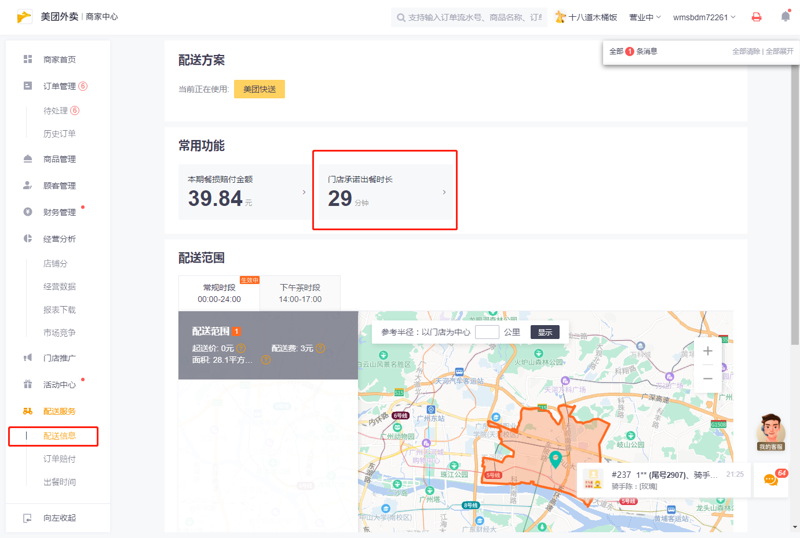
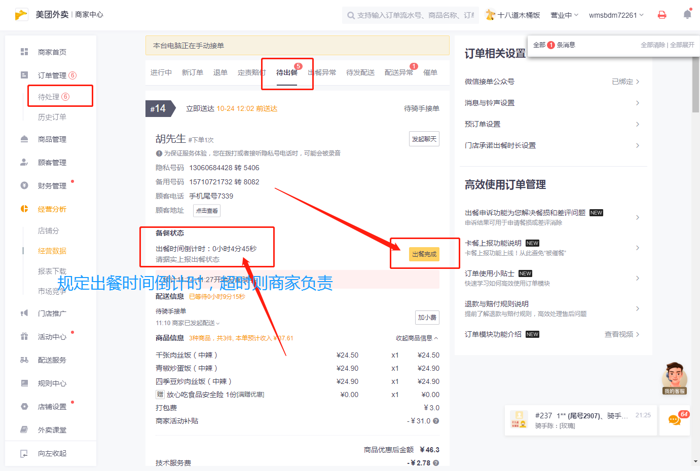

自动出餐需求

美团外卖平台的商家可以设置出餐时间，也就是每个订单必须要在该出餐时间内出餐（如图0-1），否则导致用户差评商家需要负责，按时出餐就是骑手负责。但是每个订单餐品做好了需要手动去点击该订单的出餐按钮（如图0-2）很麻烦，然后骑手就会来拿然后派送。

​                         

图（0-1）

​                         

图(0-2)

所以自动出餐的功能就是让他在规定时间倒计时结束前自动点击（可以有个填写框设定出餐时间还剩多少自动点击就更好，方便调整）
