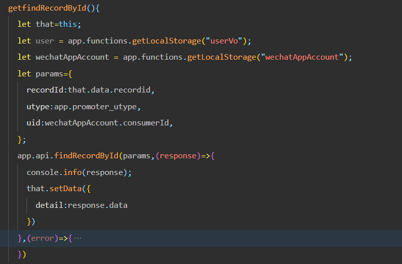
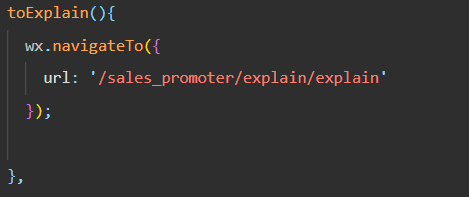
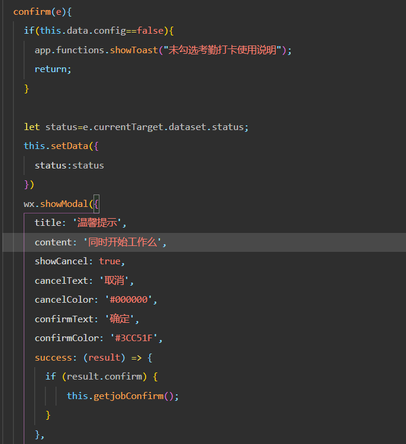
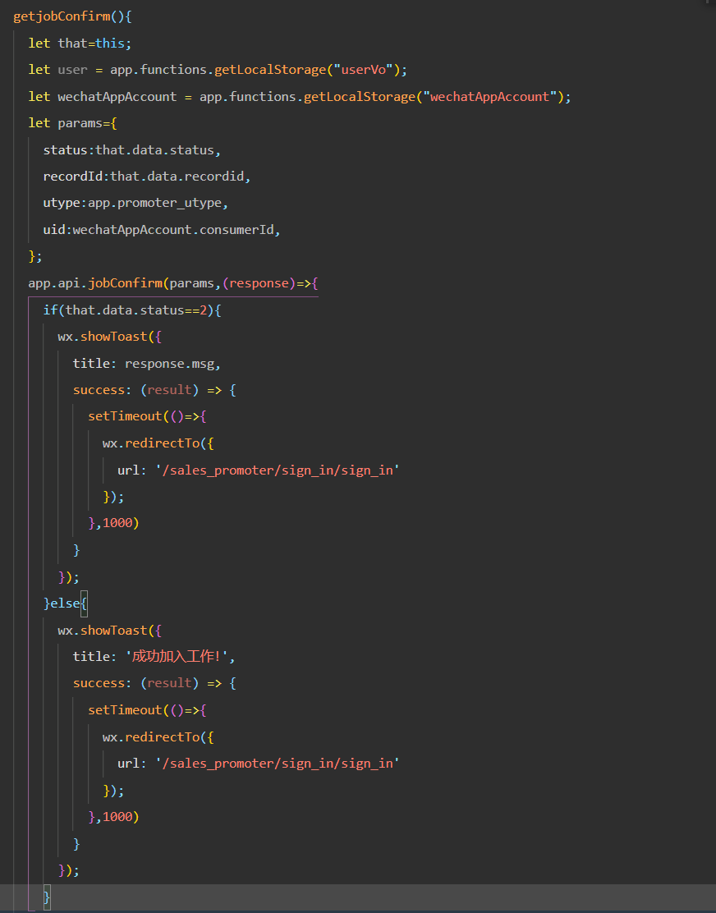

# **雇佣页面 employment**

这个页面由工作记录页面work_records跳转进来

## **onload**

一个参数 newid

查询新工作邀请记录

​                         

将查询的数据显示在页面上，用户点击《考勤打卡使用说明》可以跳转到考勤打卡说明页面explains

​                         

用户点击同意开始工作 弹出框询问用户是否确定，确定就发送请求确认工作

​                         

​                         