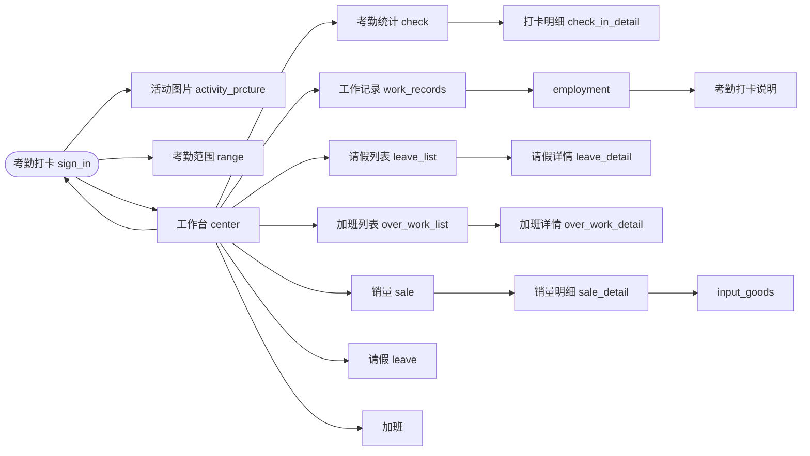

```mermaid
graph LR

sign_in([考勤打卡 sign_in]) --> activity_prcture[活动图片 activity_prcture]

sign_in --> range[考勤范围 range]

sign_in
--> center[工作台 center]
--> sign_in

center
--> check[考勤统计 check]
--> check_in_detail[打卡明细 check_in_detail]

center
--> work_records[工作记录 work_records]
--> employment[employment]
--> explain[考勤打卡说明]

center 
--> leave_list[请假列表 leave_list]
--> leave_detail[请假详情 leave_detail]

center 
--> over_work_list[加班列表 over_work_list] 
--> over_work_detail[加班详情 over_work_detail]

center
--> sale[销量 sale]
--> sale_detail[销量明细 sale_detail]
--> input_goods[input_goods]
 
center --> leave[请假 leave]

center --> over_work[加班 ]
```

