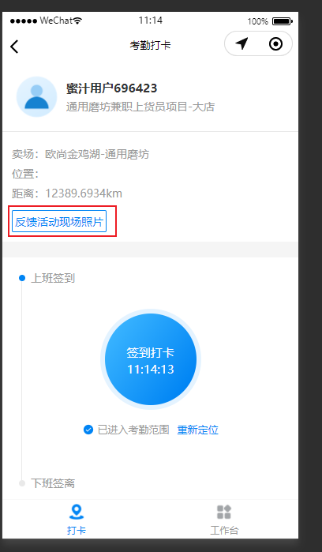
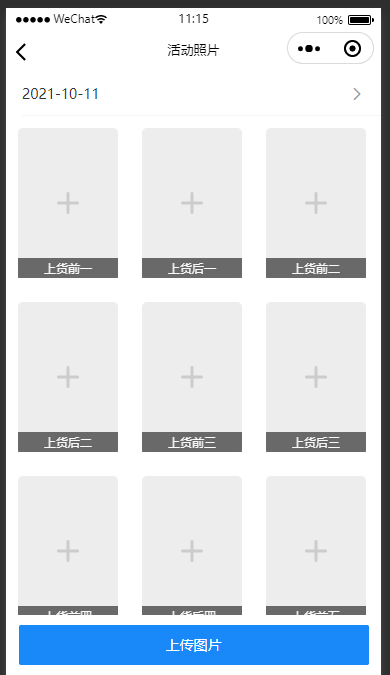
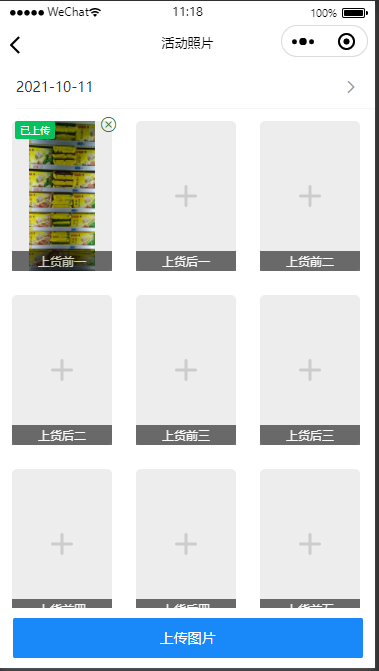
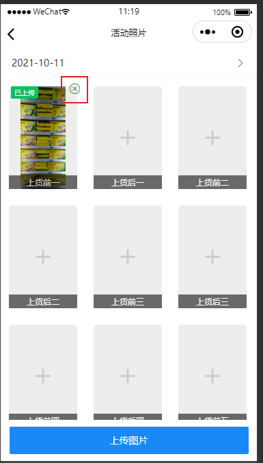
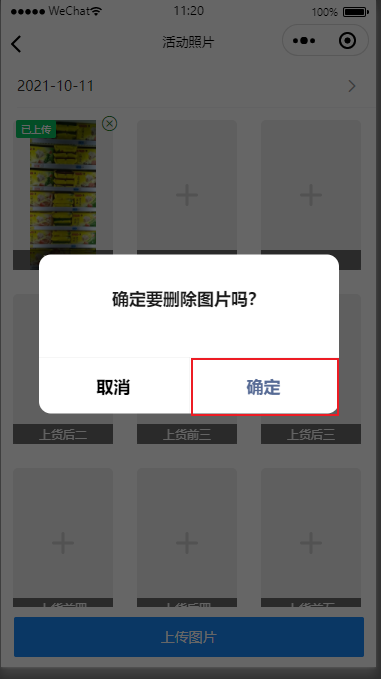
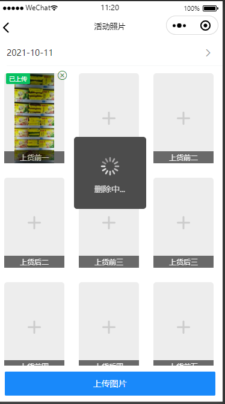
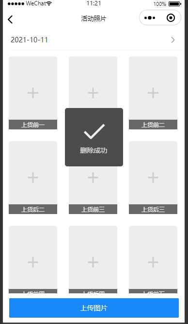
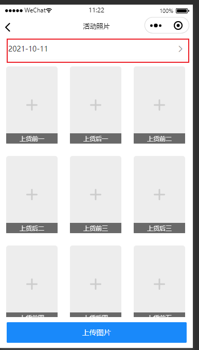
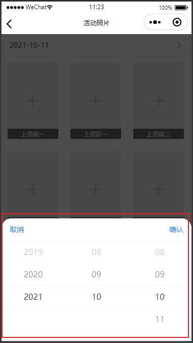
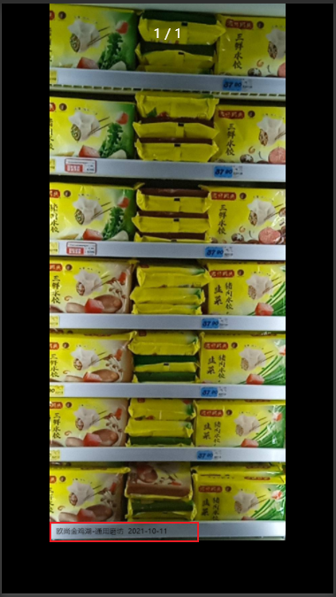

# **【每刻兼职】小程序使用文档说明**

by Riaan

## **小程序体验二维码**

- 手机微信扫描下面二维码，并提交申请

​                         

## **前言**

- 需要将小程序更新到版本后，才能使用以下的功能。

​                         

- 打开小程序，点击进入促销员菜单

​                         

- 然后点击【**反馈活动图片**】按钮，进入活动图片页面。

## **上传照片**

​                         

- 点击 + 号即可上传图片。右上角的x可以删除错误的图片。

​                         

**注意：**可上传图片的日期由后台设置控制，一般是7天。

### **如何修改上传错误照片**

- 点击已上传图片右上角的 x 图标，然后点击确定，即可删除图片。

​                         

​                         

​                         

​                         

**注意：**可删除图片的日期由后台控制，一般是当天。

### **如何选择日期补传照片**

​                         

​                         

- 点击日期选择器，选择日期，然后点击 + 图标，即可补传图片。

**注意：**可上传图片的日期由后台控制，一般是7天。

### **上传照片如何有水印**

- 点击 + 号，选择图片，图片选择后自动添加上水印。

​                         

- 点击图片即可放大预览图片。水印的颜色由系统后台设定。