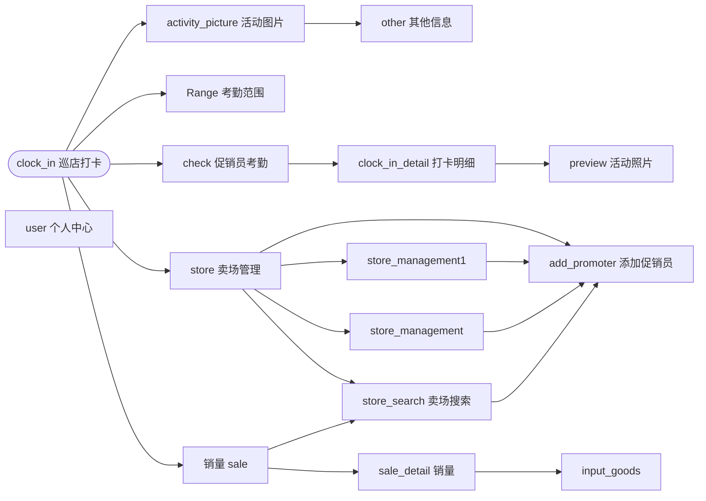

```mermaid
graph LR

clock_in([clock_in 巡店打卡])
--> activity_picture[activity_picture 活动图片]
--> other[other 其他信息]

clock_in --> Range[Range 考勤范围]

clock_in
--> check[check 促销员考勤]
--> clock_in_detail[clock_in_detail 打卡明细]
--> preview[preview 活动照片]

clock_in --> store[store 卖场管理]

store --> add_promoter[add_promoter 添加促销员]

store 
--> store_management1[store_management1]
--> add_promoter

store
--> store_management[store_management]
--> add_promoter

store
--> store_search[store_search 卖场搜索]
--> add_promoter

clock_in
--> sale[销量 sale]
--> sale_detail[sale_detail 销量]
--> input_goods[input_goods]

sale --> store_search

user[user 个人中心]

```

