# **接口调用情况**

# **销量页面**

## **接口1**

### **名称：**

findSalesReportByConsumer

### **参数：**

1. utype: 1
2. uid: 381651
3. sign: meikejob
4. accessToken: CCBAECABCB6C9299299B171CF43970B0
5. token: CCBAECABCB6C9299299B171CF43970B0

### **返回数据：**


```
{
	"data":{
		"isSalesRedTotal":0,
		"projectName":"通用磨坊兼职上货员项目-大店",
		"psId":106987,
		"storeName":"苏果文昌巷社区店",
		"workDateReports":[
			{
				"isSalesRed":0,
				"reportStatus":2,
				"workDate":"2021-09-27"
			},
			{
				"isSalesRed":0,
				"reportStatus":2,
				"workDate":"2021-09-26"
			},
			{
				"isSalesRed":0,
				"reportStatus":2,
				"workDate":"2021-09-25"
			},
			{
				"isSalesRed":0,
				"reportStatus":2,
				"workDate":"2021-09-24"
			}
		]
	},
	"msg":"成功",
	"status":0
}
```


### **图片：**

​                 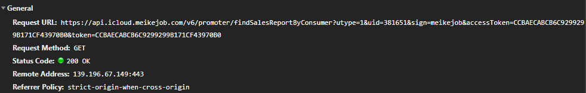        

​                 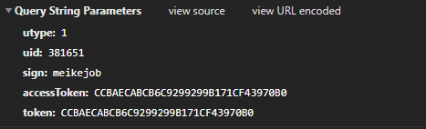        

​                 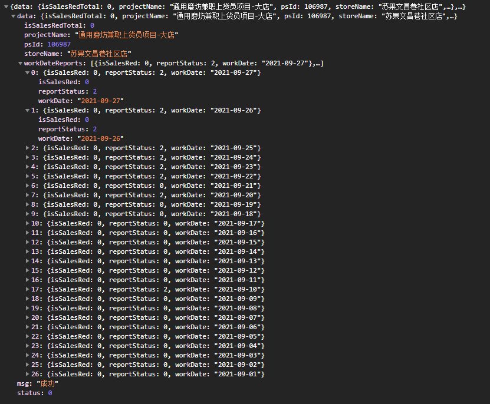        

# **销量详情页面**

## **接口1**

### **名称：**

findSalesReportMater

### **参数：**

1. date: 2021-09-27
2. psid: 106987
3. utype: 1
4. uid: 381651
5. sign: meikejob
6. accessToken: B6E79442C39C97389F44E2451BB43ACB
7. token: B6E79442C39C97389F44E2451BB43ACB

### **返回数据：**


```
{
  "data": {
    "assemList": [
      {
        "assemType": 2,
        "id": 971,
        "maxLangth": 20,
        "name": "上货次数",
        "placeholder": "请输入整数",
        "value": "1"
      },
      {
        "assemType": 3,
        "id": 972,
        "maxLangth": 50,
        "name": "备注\t",
        "placeholder": "请输入文本",
        "value": "无"
      }
    ],
    "reportStatus": 2
  },
  "msg": "成功",
  "status": 0
}
```


### **图片：**

​                 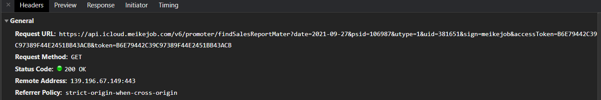                         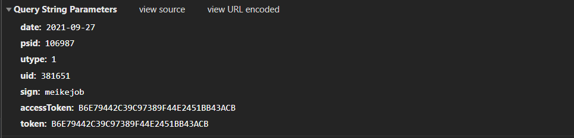                         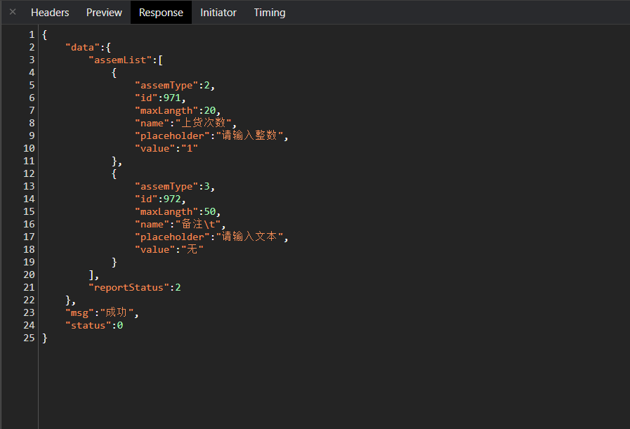        

## **接口2**

### **名称：**

findSalesReportSku

### **参数：**

1. date: 2021-09-27
2. psid: 106987
3. utype: 1
4. uid: 381651
5. sign: meikejob
6. accessToken: B6E79442C39C97389F44E2451BB43ACB
7. token: B6E79442C39C97389F44E2451BB43ACB

### **返回数据：**


```
{
	"data":[
		{
			"assemList":[
				{
					"assemType":2,
					"id":2,
					"maxLangth":50,
					"name":"销量",
					"placeholder":"请输入整数",
					"value":"0"
				}
			],
			"id":1727,
			"name":"湾仔码头汇总到货量(箱)",
			"reportStatus":2,
			"type":"湾仔码头汇总到货量(箱)"
		},
		{
			"assemList":[
				{
					"assemType":2,
					"id":2,
					"maxLangth":50,
					"name":"销量",
					"placeholder":"请输入整数",
					"value":"0"
				}
			],
			"id":1728,
			"name":"哈根达斯到货量(箱)",
			"reportStatus":2,
			"type":"哈根达斯到货量(箱)"
		}
	],
	"msg":"成功",
	"status":0
}
```


### **图片：**

​                 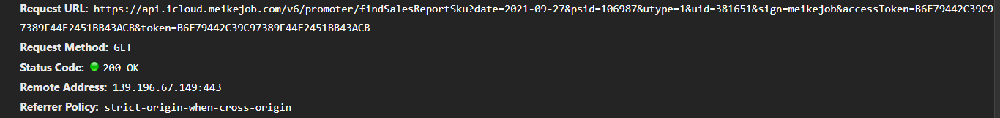                         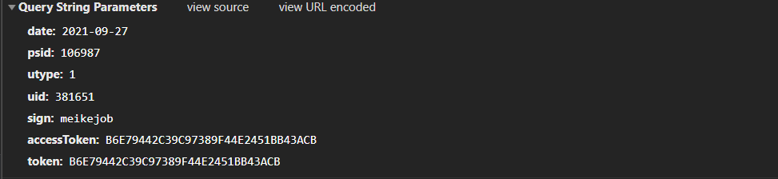                         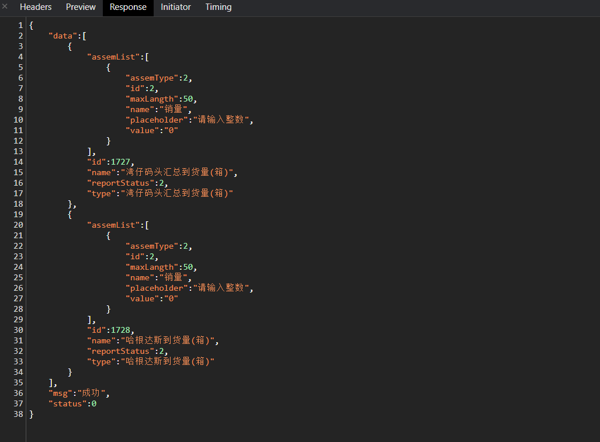        

## **接口3**

### **名称：**

getsubMatterReport

### **参数：**

1. date: 2021-09-27
2. psid: 106987
3. reports: [{"971":"0"},{"972":"测试"}]
4. utype: 1
5. uid: 381651
6. sign: meikejob
7. accessToken: B6E79442C39C97389F44E2451BB43ACB
8. token: B6E79442C39C97389F44E2451BB43ACB

### **返回数据：**


```
{
	"msg":"成功",
	"status":0
}
```


### **图片：**

​                                                                           

# **输入商品页面 input_goods**

这个页面只用了一个接口，正常使用没问题

## **接口1**

### **名称：**

subSkuReportByConsumer

### **参数：**

1. date: 2021-09-27
2. psid: 106987
3. reports: [{"skuId":1727,"skuVal":[{"2":"1"}]},{"skuId":1728,"skuVal":[{"2":"2"}]}]
4. utype: 1
5. uid: 381651
6. sign: meikejob
7. accessToken: B6E79442C39C97389F44E2451BB43ACB
8. token: B6E79442C39C97389F44E2451BB43ACB

### **返回数据：**


```
{
	"msg":"成功",
	"status":0
}
```


### **图片：**

​                                          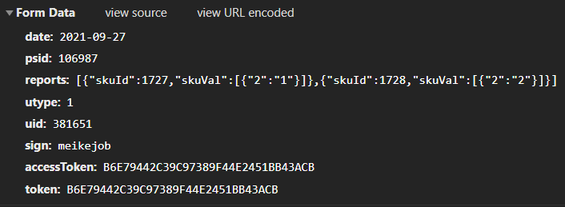                         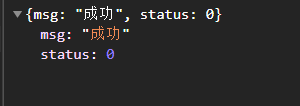        

# **活动图片页面**

## **接口1**

### **名称：**

findPromoterFeedBackPhoto

### **参数：**

1. date: 2021-09-27
2. uid: 381651
3. queryStatus: 2
4. psId: 106987
5. utype: 1
6. sign: meikejob
7. accessToken: CCBAECABCB6C9299299B171CF43970B0
8. token: CCBAECABCB6C9299299B171CF43970B0

### **返回数据：**


```
{
	"data":[
		{
			"boxId":38,
			"boxName":"上货前一",
			"boxSeq":1,
			"photoId":165906,
			"photoUrl":"http://meikejobnew.oss-cn-shanghai.aliyuncs.com/jianmi/release/meike/feedback/wonderful/1632719646628149.jpg",
			"psId":106987
		},
		{
			"boxId":39,
			"boxName":"上货后一",
			"boxSeq":2,
			"photoId":165907,
			"photoUrl":"http://meikejobnew.oss-cn-shanghai.aliyuncs.com/jianmi/release/meike/feedback/wonderful/1632719646632258.jpg",
			"psId":106987
		},
		{
			"boxId":40,
			"boxName":"上货前二",
			"boxSeq":3,
			"photoId":165908,
			"photoUrl":"http://meikejobnew.oss-cn-shanghai.aliyuncs.com/jianmi/release/meike/feedback/wonderful/1632719646636744.jpg",
			"psId":106987
		},
		{
			"boxId":41,
			"boxName":"上货后二",
			"boxSeq":4,
			"photoId":165909,
			"photoUrl":"http://meikejobnew.oss-cn-shanghai.aliyuncs.com/jianmi/release/meike/feedback/wonderful/1632719646638877.jpg",
			"psId":106987
		},
		{
			"boxId":42,
			"boxName":"上货前三",
			"boxSeq":5,
			"psId":106987
		},
		{
			"boxId":49,
			"boxName":"上货后三",
			"boxSeq":6,
			"psId":106987
		},
		{
			"boxId":43,
			"boxName":"上货前四",
			"boxSeq":7,
			"psId":106987
		},
		{
			"boxId":44,
			"boxName":"上货后四",
			"boxSeq":8,
			"psId":106987
		},
		{
			"boxId":45,
			"boxName":"上货前五",
			"boxSeq":9,
			"psId":106987
		},
		{
			"boxId":50,
			"boxName":"上货后五",
			"boxSeq":10,
			"psId":106987
		},
		{
			"boxId":46,
			"boxName":"到货单一",
			"boxSeq":11,
			"psId":106987
		},
		{
			"boxId":47,
			"boxName":"到货单二",
			"boxSeq":12,
			"psId":106987
		},
		{
			"boxId":48,
			"boxName":"到货单三",
			"boxSeq":13,
			"psId":106987
		}
	],
	"msg":"成功",
	"status":0,
	"success":true
}
```


### **图片：**

​                         

​                 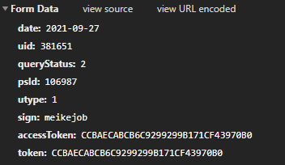        

​                 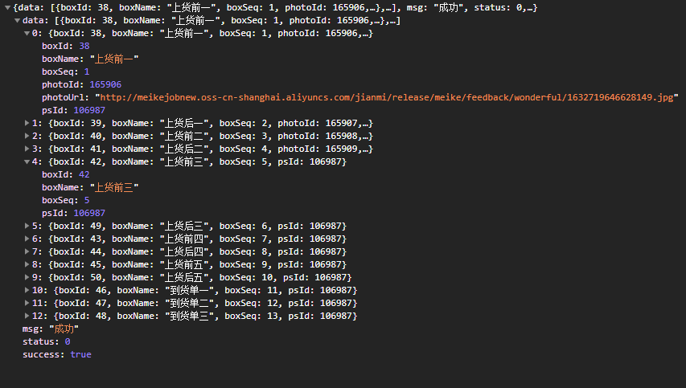        

## **上传图片接口：**

### **名称：**

https://meikejobnew.oss-cn-shanghai.aliyuncs.com/

## **接口2**

### **名称：**

batchPromoterUploadPhoto

### **参数：**

pId: 1123

psId: 97333

date: 2021-09-28

uid: 372197

utype: 2

photoInfo: [{"boxId":38,"photoUrl":"http://meikejobnew.oss-cn-shanghai.aliyuncs.com/jianmi/release/meike/feedback/wonderful/1632785358450244.jpg"},{"boxId":39,"photoUrl":"http://meikejobnew.oss-cn-shanghai.aliyuncs.com/jianmi/release/meike/feedback/wonderful/1632785927674425.jpg"},{"boxId":40,"photoUrl":"http://meikejobnew.oss-cn-shanghai.aliyuncs.com/jianmi/release/meike/feedback/wonderful/1632786041472279.jpg"},{"boxId":41,"photoUrl":"http://meikejobnew.oss-cn-shanghai.aliyuncs.com/jianmi/release/meike/feedback/wonderful/1632786184175127.jpg"},{"boxId":42,"photoUrl":"http://meikejobnew.oss-cn-shanghai.aliyuncs.com/jianmi/release/meike/feedback/wonderful/1632786243432333.jpg"},{"boxId":49,"photoUrl":"http://meikejobnew.oss-cn-shanghai.aliyuncs.com/jianmi/release/meike/feedback/wonderful/1632787159160193.jpg"},{"boxId":43,"photoUrl":"http://meikejobnew.oss-cn-shanghai.aliyuncs.com/jianmi/release/meike/feedback/wonderful/1632787159163152.jpg"},{"boxId":44,"photoUrl":"http://meikejobnew.oss-cn-shanghai.aliyuncs.com/jianmi/release/meike/feedback/wonderful/1632789315416383.jpg"},{"boxId":45,"photoUrl":"http://meikejobnew.oss-cn-shanghai.aliyuncs.com/jianmi/release/meike/feedback/wonderful/16327893154211.jpg"},{"boxId":50,"photoUrl":"http://meikejobnew.oss-cn-shanghai.aliyuncs.com/jianmi/release/meike/feedback/wonderful/1632816144098581.png"}]

sign: meikejob

accessToken: CF3D512B0B7B26F2691D696A11B0AB14

token: CF3D512B0B7B26F2691D696A11B0AB14

###  

### **返回数据：**


```
{
	"msg":"成功",
	"status":0,
	"success":true
}
```


### **图片：**

​                                          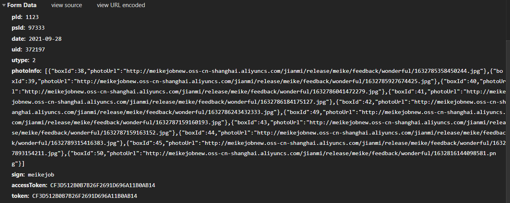                         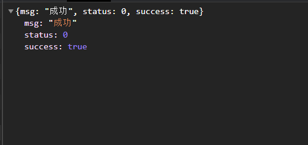        

## **接口3**

### **名称：**

promoterUploadPhoto（这个接口在代码里没有使用到）

### **参数：**

###  

### **返回数据：**

###  

### **图片：**