# 页面导向流程图

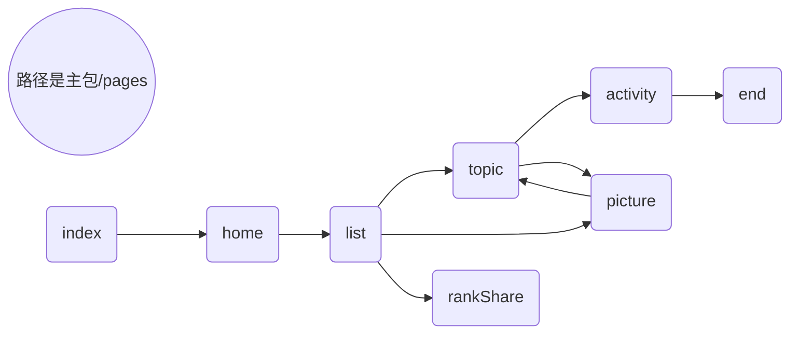

# 页面

## 说明：一共八个页面；

## index

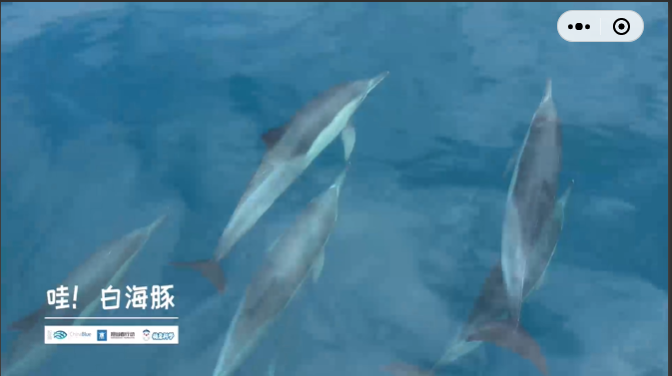

未使用组件

## home

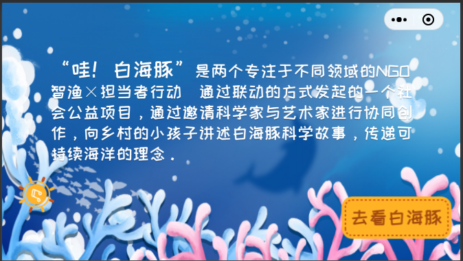

使用 audio_box 组件。

## list

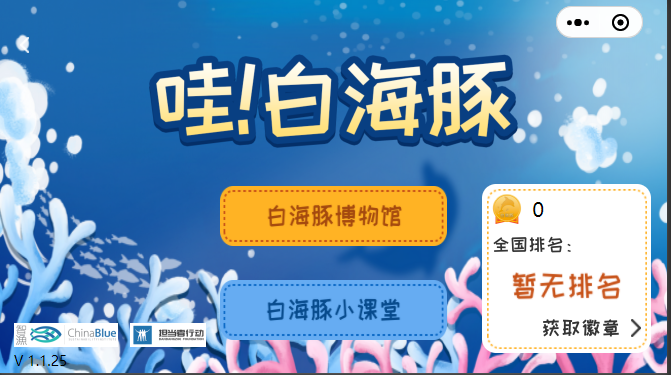

使用 audio_box 组件。

## picture

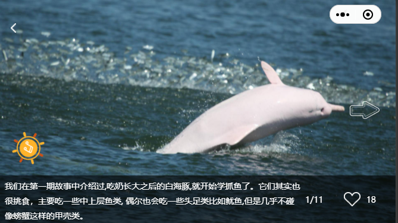

使用了 guide、classroom、back、tips 和 audio_box 等组件。

## topic

使用 back、dialog、preview、tips 和 audio_box 等组件。

## rankShare

使用 back 等组件。

## activity

使用 back 和 picker等组件。

## end

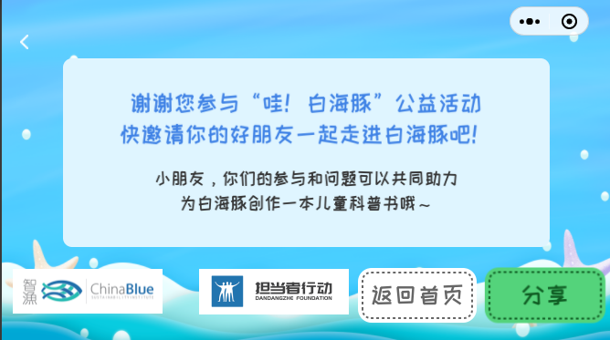

使用 back 和 logo 等组件。

# 组件

## 说明：一共九个组件

## audio_box

音频播放组件

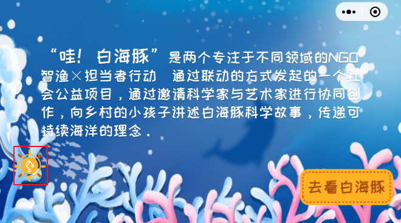

## back

导航栏返回组件

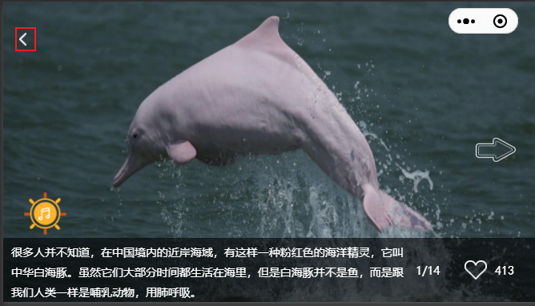

## classroom

会晃动的小课堂图片组件

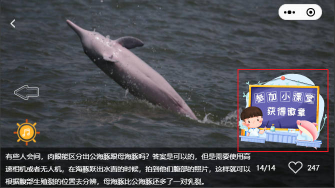

## dialog

回答问题之后显示的弹窗

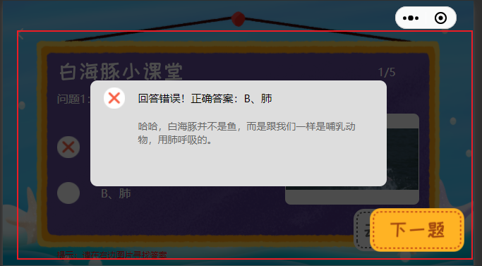

## guide

picture页面的使用指引

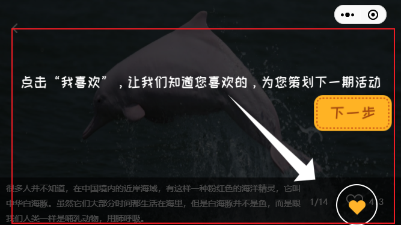

## logo

logo标识

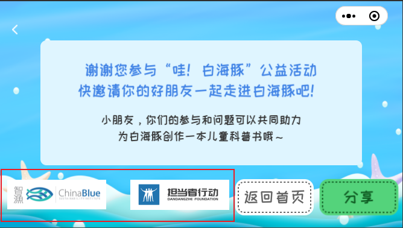

## picker

地址选择器

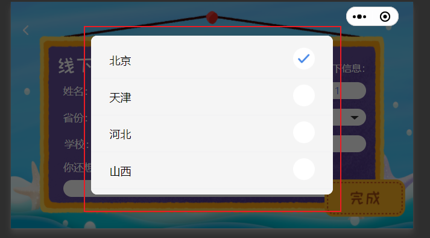

## preview

图片预览

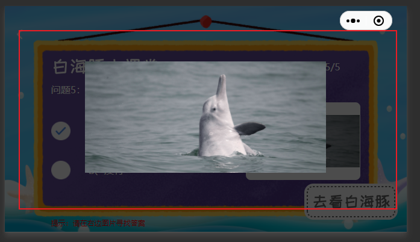

# 其他信息

index（视频播放页面，首页）、home（主页）、list（菜单选择页）、rankShare（勋章分享页）和end（结尾页）这几个页面较为简单。

picture（白海豚博物馆）、topic（白海豚小课堂）和 activity（线下登记）这几个页面较为复杂，与组件相互获取对方实例，互相调用对方方法，耦合性极强，维护难度大。

