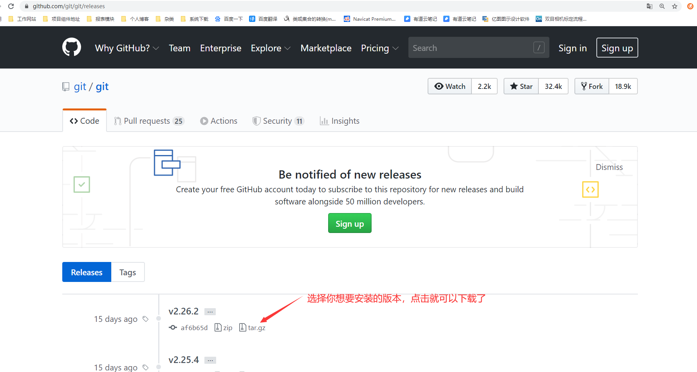
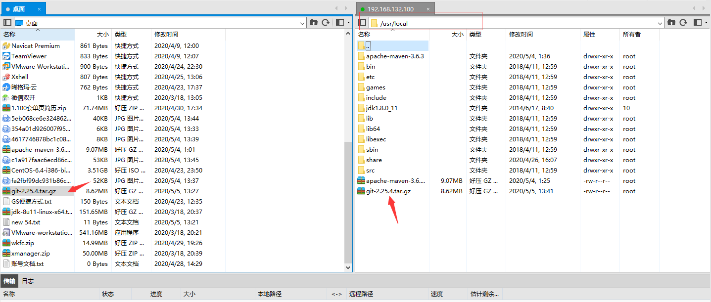
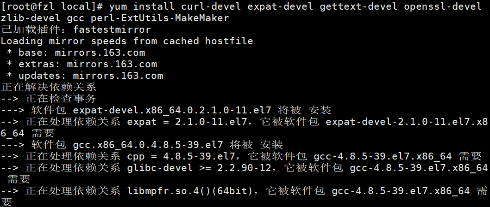
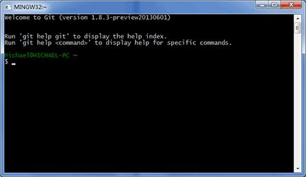

# Git安装配置

在使用Git前需要先安装 Git。Git 目前支持 Linux、MacOS和 Windows 平台上运行。

Git 各平台安装包下载地址为：http://git-scm.com/downloads

##  Linux 平台上安装

在有 yum 的系统上（比如 Fedora）或者有 apt-get 的系统上（比如 Debian 体系），可以用下面的命令安装：

各 Linux 系统可以使用其安装包管理工具（apt-get、yum 等）进行安装：

### Debian/Ubuntu

Debian/Ubuntu Git 安装命令为：

```
$ apt-get install git

# 查看Git是否安装完成
$ git --version
git version 1.8.1.2
```

### Centos/RedHat

如果你使用的系统是 Centos/RedHat 安装命令为：

```
$ yum -y install git

#查看Git是否安装完成
$ git --version
git version 1.7.1
```

### 源码安装

有人想问，直接在线安装多么容易，为啥还下载安装呢，你们也看到了，上述的安装版本不是Git官方最新的包，下载包安装可以选版本。

1.首先我们需要删除旧的Git

```
########## Centos/RedHat ##########
$ yum -y remove git

########## Debian/Ubuntu ##########
$ apt-get -y remove git
```

2.进入git在GitHub上发布版本页面https://github.com/git/git/releases，这个页面我们可以找到所有git已发布的版本。这里我们选择最新版的tar.gz包。

```
https://github.com/git/git/releases
```



 

3.下载最新版本的tar.gz的Git到本地电脑上，利用Xftp工具将压缩包上传至Linux服务器的/usr/local目录下



 

4.进入/usr/local 目录解压git文件

```
tar -zxvf git-2.31.1.tar.gz
```


5.拿到解压后的源码以后我们需要编译源码了，不过在此之前需要安装编译所需要的依赖。

```
########## Centos/RedHat ##########
$ yum install dh-autoreconf curl-devel expat-devel gettext-devel \
  openssl-devel perl-devel zlib-devel

########## Debian/Ubuntu ##########
$ apt-get install dh-autoreconf libcurl4-gnutls-dev libexpat1-dev \
  gettext libz-dev libssl-dev
```



 

6.编译git源码，进入cd /usr/local/git-2.25.4 目录

```
make prefix=/usr/local/git all
```

7.安装git至/usr/bin/git路径

```
make prefix=/usr/local/git install
```

8.配置环境变量

```
vi /etc/profile 
```

\9. 在底部加上如下

```
export PATH=$PATH:/usr/bin/git/bin
```

10.刷新环境变量

```
source /etc/profile
```

11.查看Git是否安装完成

```
git --version
```

至此，从github上下载最新的源码编译后安装git完成。


## windos平台上安装

在Windows上使用Git，可以从Git官网直接[下载安装程序](http://git-scm.com/download/win)，然后按默认选项安装即可。

安装完成后，在开始菜单里找到“Git”->“Git Bash”，蹦出一个类似命令行窗口的东西，就说明Git安装成功！



安装完成后，还需要最后一步设置，配置个人的用户名称和电子邮件地址，在命令行输入：

```
$ git config --global user.name "Your Name"
$ git config --global user.email "email@example.com"
```

注意`git config`命令的`--global`参数，用了这个参数，表示你这台机器上所有的Git仓库都会使用这个配置，当然也可以对某个仓库指定不同的用户名和Email地址。
