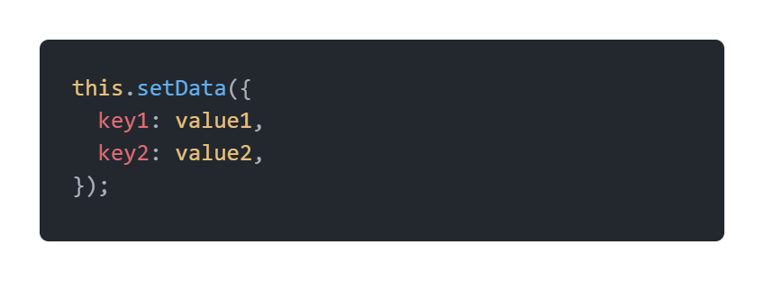
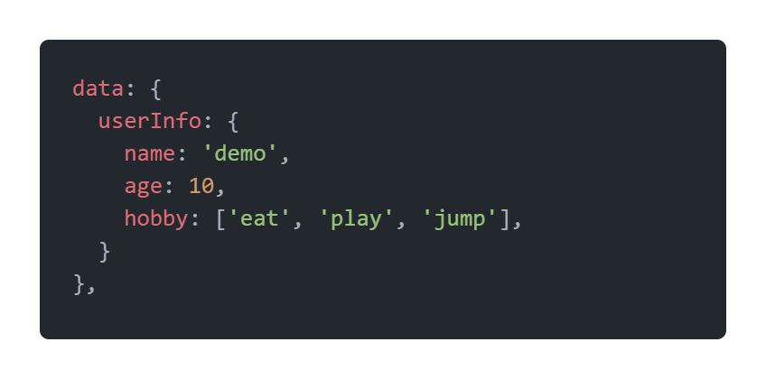
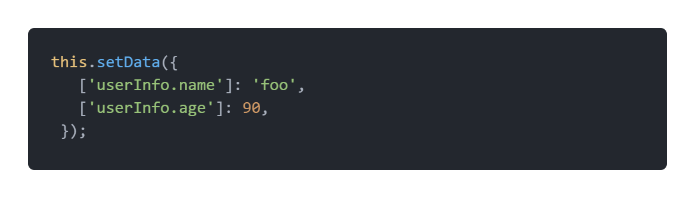
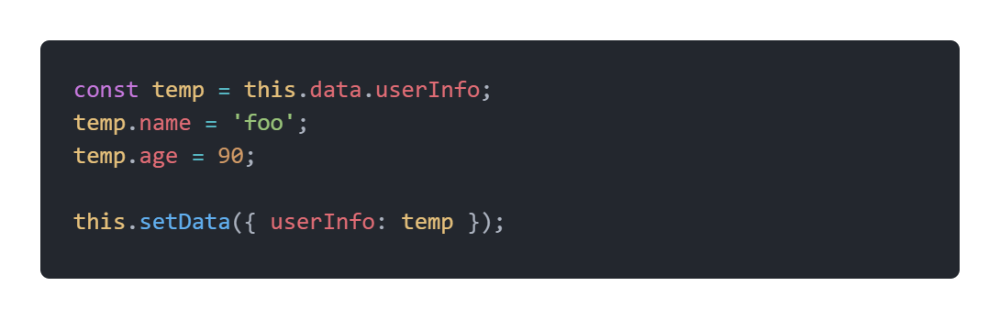
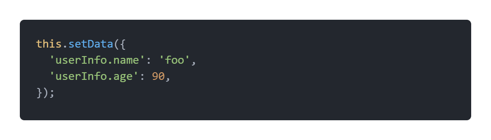
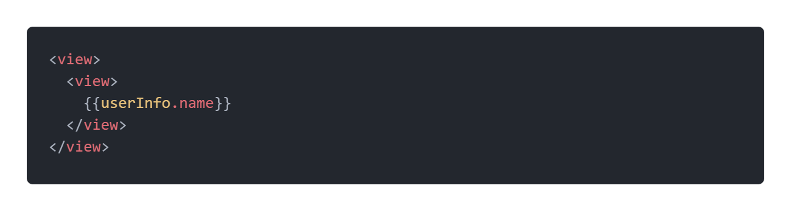
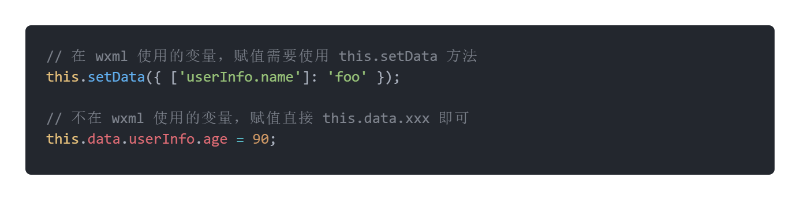

# setData的使用

`setData` 函数用于将数据从逻辑层发送到视图层（异步），同时改变对应的 `this.data` 的值（同步）。[官方文档介绍](https://developers.weixin.qq.com/miniprogram/dev/reference/api/Page.html)。

## setData修改对象、数组中的值

在微信小程序的前端开发中，使用this.setData方法修改data中的值，其格式为

**假设原数据为：**

### 方式一：使用['字符串']

例如：

### 方式二：构造变量，重新赋值

例如：

### 方式三： 直接使用字符串

例如：

这种方式不能使用模板字符串或者变量拼接，与第一种方式对比，推荐还是使用第一种方法。

## 开发规范

如果 data 里面的变量未绑定在wxml，赋值直接 this.data.xxxx 即可，不需要使用 this.setData 方法。

例如：

