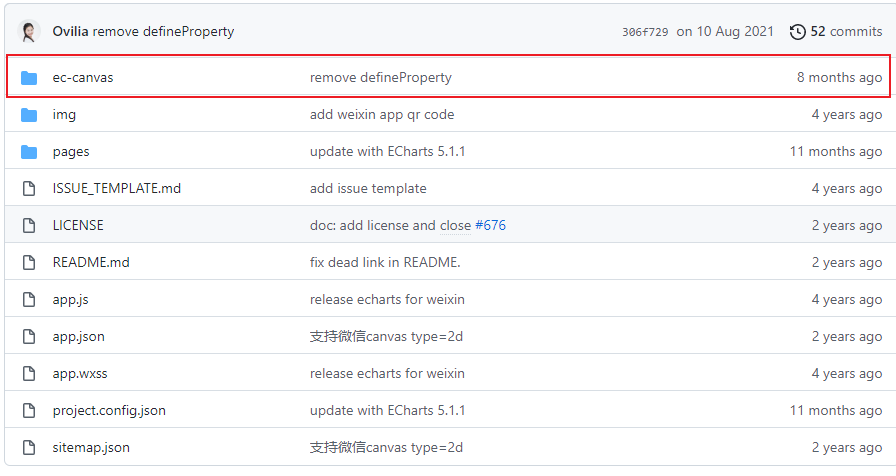
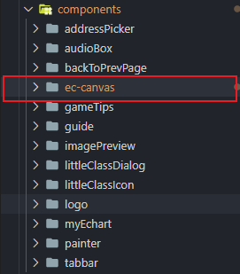
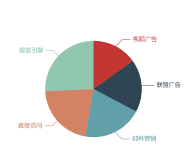
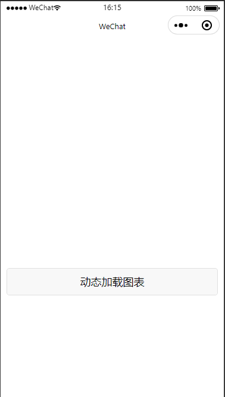
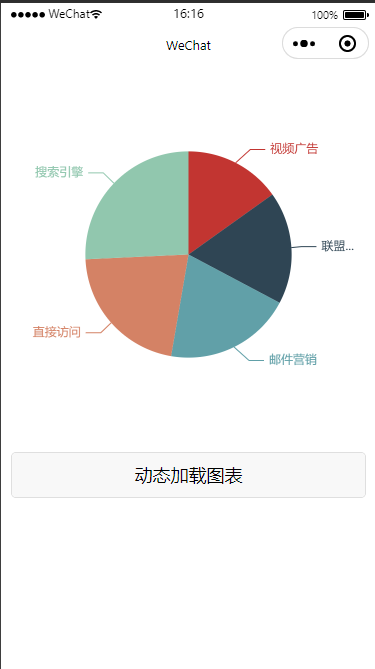
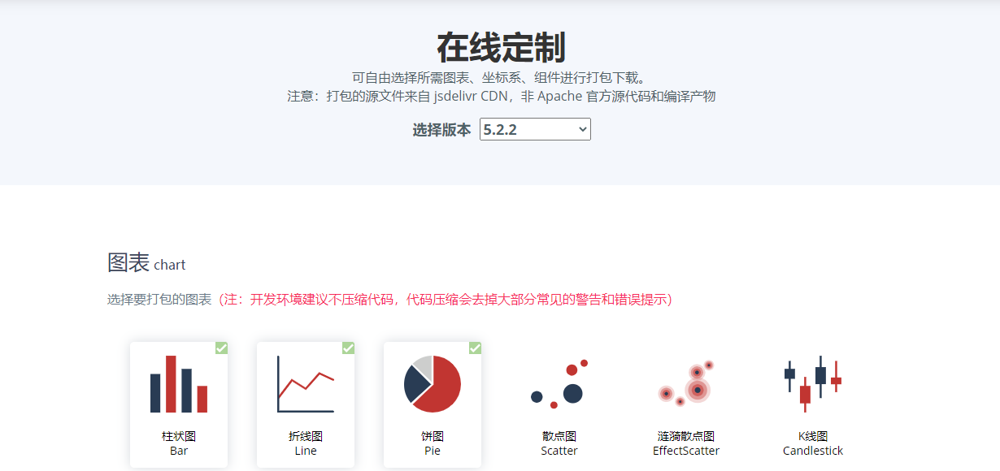
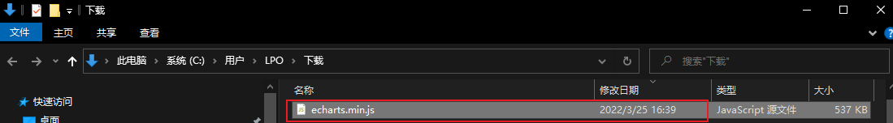

# 小程序使用echarts


**官网地址：**

https://echarts.apache.org/

 **github地址**

https://github.com/ecomfe/echarts-for-weixin

## 基本使用

### 下载

打开[github地址](https://github.com/ecomfe/echarts-for-weixin)，下载代码，将`ec-canvas`组件放置项目`components`目录





### 使用组件

在`app.json`配置：

```
{
  "usingComponents": {
    "ec-canvas": "components/ec-canvas/ec-canvas"
  }
}
```

`index.wxml` 中使用 `<ec-canvas>` 组件，内容如下：

```
<view class="container">
  <ec-canvas id="echart" canvas-id="echart" ec="{{ ec }}"></ec-canvas>
</view>
```

`ec` 是一个在 `index.js` 中定义的对象，它使得图表能够在页面加载后被初始化并设置。`index.js` 的结构如下：

```
# 这里一定要导入
import * as echarts from '../../components/ec-canvas/echarts';

function initChart(canvas, width, height, dpr) {
  const chart = echarts.init(canvas, null, {
    width: width,
    height: height,
    devicePixelRatio: dpr // 像素
  });
  canvas.setChart(chart);
  const option = {
    series: [
      {
        name: '访问来源',
        type: 'pie',    // 设置图表类型为饼图
        radius: '55%',  // 饼图的半径，外半径为可视区尺寸（容器高宽中较小一项）的 55% 长度。
        data: [          // 数据数组，name 为数据项名称，value 为数据项值
          { value: 235, name: '视频广告' },
          { value: 274, name: '联盟广告' },
          { value: 310, name: '邮件营销' },
          { value: 335, name: '直接访问' },
          { value: 400, name: '搜索引擎' }
        ]
      }
    ]
  };
  chart.setOption(option);
  return chart;
}

Page({
  data: {
    ec: {
      onInit: initChart
    }
  }
});

```

`index.css`：

```
# ec-canvas组件的宽度默认100%，包含ec-canvas的元素必须设置宽高
.container {
  width: 375px;
  height:375px;
}
```

示例：




## 高级使用

### 动态渲染

`index.wxml`

````
<view class="wrap">
  <ec-canvas id="echart" canvas-id="echart" ec="{{ ec }}"></ec-canvas>
  <button size="default" bindtap="onShowChart" style="margin: 10px;">动态加载图表</button>
</view>
````

`index.css`

```
# ec-canvas组件的宽度默认100%，包含ec-canvas的元素必须设置宽高
.container {
  width: 375px;
  height:375px;
}
```

`index.ts`

```
# 这里一定要导入
import * as echarts from '../../components/ec-canvas/echarts';

Page({
  data: {
    ec: {
      // 将 lazyLoad 设为 true 后，需要手动初始化图表
      lazyLoad: true
    },
    ecComponent: {},
  },
  onReady() {
    // 获取组件
    this.ecComponent = this.selectComponent('#echart');
  },
  onShowChart() {
    this.ecComponent.init((canvas, width, height, dpr) => {
      // 获取组件的 canvas、width、height 后的回调函数
      // 在这里初始化图表
      const chart = echarts.init(canvas, null, {
        width: width,
        height: height,
        devicePixelRatio: dpr // new
      });
      chart.setOption(this.getEchartOptions());
      // 注意这里一定要返回 chart 实例，否则会影响事件处理等
      return chart;
    });
  },
  getEchartOptions() {
    const options = {
      series: [
        {
          name: '访问来源',
          type: 'pie',    // 设置图表类型为饼图
          radius: '55%',  // 饼图的半径，外半径为可视区尺寸（容器高宽中较小一项）的 55% 长度。
          data: [          // 数据数组，name 为数据项名称，value 为数据项值
            { value: 235, name: '视频广告' },
            { value: 274, name: '联盟广告' },
            { value: 310, name: '邮件营销' },
            { value: 335, name: '直接访问' },
            { value: 400, name: '搜索引擎' }
          ]
        }
      ]
    };
    return options;
  }
});
```



### 封装成组件

如果一个页面使用多个图表的话，下面的代码将会复写多次：

```
Page({
  data: {
    ec: {
      // 将 lazyLoad 设为 true 后，需要手动初始化图表
      lazyLoad: true
    },
    ecComponent: {},
  },
  onReady() {
    // 获取组件
    this.ecComponent = this.selectComponent('#echart');
  },
  onShowChart() {
    this.ecComponent.init((canvas, width, height, dpr) => {
      // 获取组件的 canvas、width、height 后的回调函数
      // 在这里初始化图表
      const chart = echarts.init(canvas, null, {
        width: width,
        height: height,
        devicePixelRatio: dpr // new
      });
      chart.setOption(this.getEchartOptions());
      // 注意这里一定要返回 chart 实例，否则会影响事件处理等
      return chart;
    });
  },
```

新建一个组件`myEchart`

`myEchart.wxml`

```
<view style="width:{{_width}}rpx;height:{{_height}}rpx;position: relative;">
  <ec-canvas id="{{id}}" canvas-id="{{id}}" ec="{{ ec }}"></ec-canvas>
</view>
```

`myEchart.ts`

```
import * as echarts from '../ec-canvas/echarts';


Component({
  /**
   * 组件的属性列表
   */
  properties: {
    width: {
      type: Number,
      observer(value) {
        if (value) {
          this.setData({_width: value * 2})
        }
      }
    },
    height: {
      type: Number,
      observer(value) {
        if (value) {
          this.setData({_height: value * 2})
        }
      }
    },
    // echarts的配置，传入配置就会渲染
    options: {
      type: Object,
      observer(value) {
        if (value && JSON.stringify(value) !== '{}') {
          this.data.echartsComponnet.init((canvas: any, width: any, height: any) => {
            // 初始化图表
            const Chart = echarts.init(canvas, null, {
              width: width,
              height: height,
              devicePixelRatio: this.data.dpr
            });
            Chart.setOption(this.data.options);
            // 注意这里一定要返回 chart 实例，否则会影响事件处理等
            return Chart;
          });
        }
      }
    },
    id: {
      type: String,
      value: 'id',
    },
  },
  /**
   * 组件的初始数据
   */
  data: {
    ec: { lazyLoad: true, },
    echartsComponnet: {} as any,
    dpr: 0,
    _width: 0, // 内置属性，用于px2rpx
    _height: 0,
  },

  /**
   * 组件的方法列表
   */
  methods: {
    // 获取dpr可以使图表在手机上不模糊
    setPixelRatio() {
      let pixelRatio = 0
      wx.getSystemInfo({
        success: (res) => {
          pixelRatio = res.pixelRatio
          this.setData({ dpr: pixelRatio })
        },
      })
    }
  },
  attached() {
    this.setPixelRatio();
    this.setData({
      echartsComponnet: this.selectComponent('#' + this.data.id)
    })
  }
})

```

### 注意：

在项目中使用echart组件的话，`echarts.js`文件达900多kb，小程序包的体积会太大了

#### 在线定制图表

在线定制需要使用到的图表类型和工具

地址：[ECharts 在线构建 (apache.org)](https://echarts.apache.org/zh/builder.wxml)



将下载的`echarts.min.js`重命名为`echarts.js`，然后替换掉`ec-canvas/echarts.js`即可




#### 开启Canvas2d

最新版的 ECharts 微信小程序支持微信 Canvas 2d，当用户的基础库版本 >= 2.9.0 且没有设置 `force-use-old-canvas="true"` 的情况下，使用新的 Canvas 2d（默认）。

使用新的 Canvas 2d 可以提升渲染性能，解决非同层渲染问题，强烈建议开启

如果仍需使用旧版 Canvas，使用方法如下：

```
<ec-canvas id="xxx" canvas-id="xxx" ec="{{ ec }}" force-use-old-canvas="true"></ec-canvas>
```

## 代码片段

片段一：https://developers.weixin.qq.com/s/OOTwnsms7Cin

## 参考链接

[[开盖即食\]小程序图表插件 ECharts 实战 | 微信开放社区 (qq.com)](https://developers.weixin.qq.com/community/develop/article/doc/000c4abfe5c4e073319a5a0a557013)

[ecomfe/echarts-for-weixin: Apache ECharts 的微信小程序版本 (github.com)](https://github.com/ecomfe/echarts-for-weixin)

