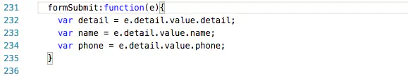

## 一. 跨页面传值.

##### 1 . 用 navigator标签传值或 `wx.navigator`, 比如


图片.png

这里将`good_id=16` 参数传入 detail 页面, 然后 detail 页面的 onload 方法内接受.



图片.png

如果需要传多个参数, 用 & 链接即可


图片.png


图片.png


 如果要传 数组, 字典等复杂类型, 要先用 `JSON.stringify()` 转成字符串传递.


图片.png

> 注 : 如果转化的字符串中 有"?"，"&"或"="等这样的符号，则只会传递符号以前的字符串，符号后面数据会被丢失，这个问题我猜想可能是小程序内部的路由处理 对这些符号敏感吧。所以有时候这里可以先用 `encodeURIComponent()` 进行转码，在目标页面再用 `decodeURIComponent()` 解码，这样就可以避免数据丢失了。OK，这是第一种 依靠跳转的url带参数传值

##### 2 . 用`getCurrentPages()` 获取栈中全部页面的, 然后把数据写入相应页面.

- 2.1. 先获取全部页面, 取出来是个数组, 然后用下标定位

  

  图片.png

> 注：这里 这个 `__route__` 是一个属性，在最新的小程序中，已经可以用 `route` 这个属性替换，即图中的
>  `arr[arr.length - 2].__route__` 与 `arr[arr.length - 2].route` 等效。


图片.png

这里可以传字符串, 也能传数组等,  这样就把 `address` 传递并接受了

> 注 : 这个方法适合 往后面传值(即已经存在的页面), 这样才能在栈中找到并主动写入数据, 且 一定要在 `onshow()` 方法中接受, 因为再次返回只执行`onshow()`方法.

- 2.2  这里是在当前页面直接赋值前一个页面的data, 所以要在前一个页面的`onshow()` 方法中做设置, 确保数据传递并更新到视图层, 但这个这个方法有一个问题, 就是当前页面直接赋值时, 容易造成时序问题, 导致数据错乱. 推荐以下这种写法


推荐这一种写法.png


与上面一种的对比.png

> 注 : 是不是很熟悉?只是用系统的`setData()`替换了直接赋值, 其实`arr[arr.length - 2]` 就类似于 `this/that` , 而 `arr[arr.length - 2]` 就相当于前一页的`this/that` , 且这样写, 在前一页的`onshow()` 还不用设置, 数据传递与更新视图层 一键搞定.


onshow() 方法截图.png

##### 3 . 写入本地, 跨页面在取出来 `wx.setStorage/wx.getStorage`等, 小程序中对写入本地数据 封装了很多方法, 各有侧重, 这里就不多说了


图片.png


图片.png

##### 4 .  把 数据声明为全局变量, 可在任何页面获取


```bash
let detail = getApp().detail;
```

## 二. 页内传值

##### 1 . 设置id的方法标识跳转后传递后的参数


图片.png

在bindtap定义的点击方法 `swiperTap : function(e)` 中获取


```bash
let id = e.currentTarget.id;
```

##### 2 . 设置 data-xxx 的方法来标识要传递的值


图片.png

> 注 : 这里 `data-index="{{index}}"`里的 {{index}} 是有效的, 在用wx-for 渲染视图层时, index 代表点击的下标.  在bindtap定义的点击方法 `swiperTap : function(e)`  中获取,  即


```bash
let index = e.currentTarget.dataset.index;
```

其他的参数取出也如此,


```bash
let type = e.currentTarget.dataset.type;
```

##### 3 . form表单和input输入框


