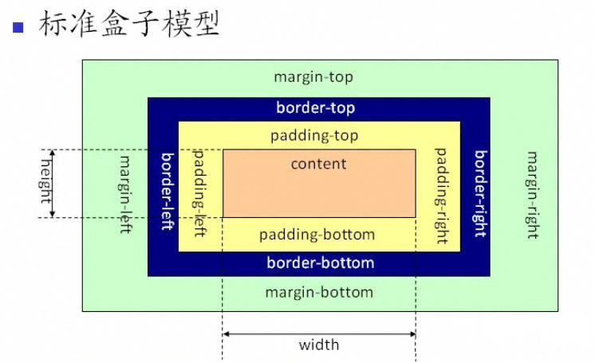
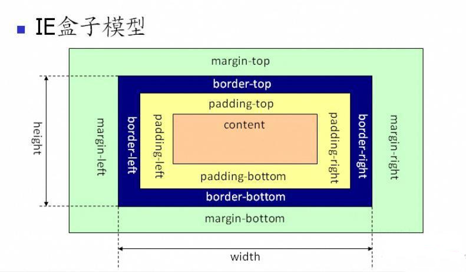
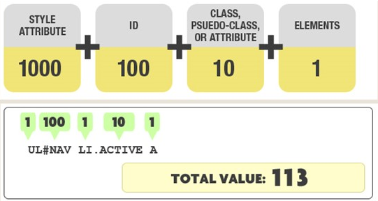
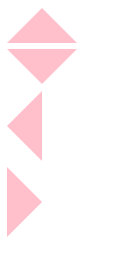
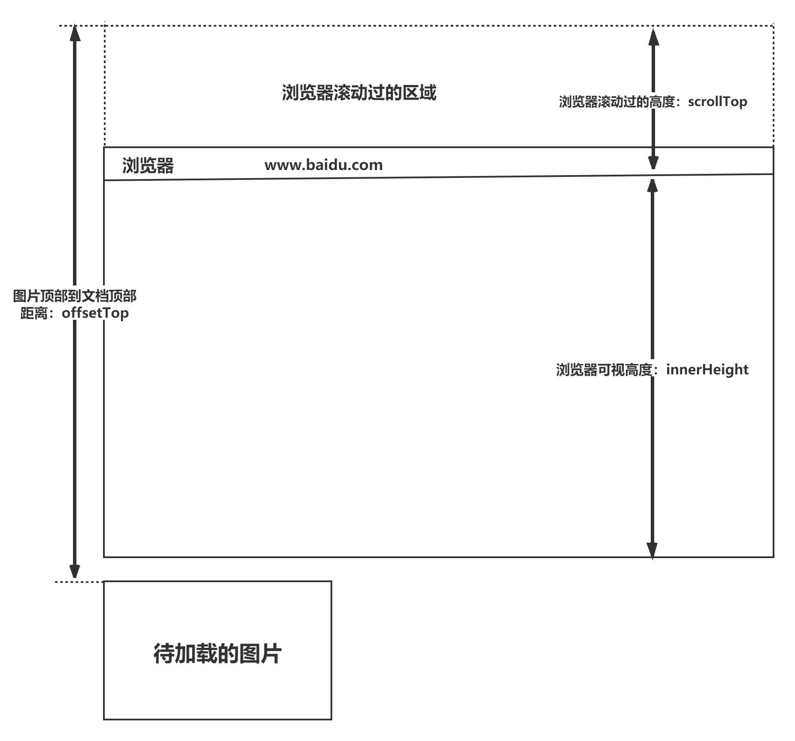

!#brushQuestions

### HTML5 的新特性有哪些？CSS3 的新特性有哪些？（必会） 

**H5 新特性** 

1、拖拽释放(Drap and drop) API ondrop 
拖放是一种常见的特性，即抓取对象以后拖到另一个位置，在 HTML5 中，拖放是标准的一部分，任何元素都能够拖放 。

2、自定义属性 data-id 

3、语义化更好的内容标签(header，nav，footer ，aside， article， section) 

4、音频 ，视频(audio， video) 如果浏览器不支持自动播放怎么办?在属性中添加 autoplay 

5、画布 Canvas 

5.1）getContext() 

方法返回一个用于在画布上绘图的环境 Canvas.getContext(contextID) 

参数 contextID 指定了您想要在画布上绘制的类型。当前唯一的合法值是 “2d”，它指定了 

二维绘图，并且导致这个方法返回一个环境对象，该对象导出一个二维绘图 API 

5.2）cxt.stroke() 如果没有这一步，线条是不会显示在画布上的 ！

5.3）canvas 和 image 在处理图片的时候有什么区别? 

image 是通过对象的形式描述图片的，canvas 通过专门的 API 将图片绘制在画布上. 

6、 地理(Geolocation) API 

7、 本地离线存储 localStorage 长期存储数据 浏览器关闭后数据不丢失 

8、 sessionStorage 的数据在浏览器关闭后自动删除 

9、 表单控件 calendar ， date ， time ， email ， url ， search ， tel ， file ， number 

10、新的技术 webworker， websocket ， Geolocation

**CSS3 新特性** 

1、颜色: 新增 RGBA ， HSLA 模式 

2、文字阴影(text-shadow) 

3、边框: 圆角(border-radius) 边框阴影 : box-shadow 

4、盒子模型: box-sizing 

5、背景：background-size background-origin background-clip 

6、渐变: linear-gradient 、radial-gradient 

7、过渡 : transition 可实现动画 

8、自定义动画 animate 和 @keyfrom 

9、媒体查询 多栏布局 

@media screen and 

(width:800px) {…} 

10、border-image 

11、2D 转换;transform: 

translate(x，y) rotate(x，y) skew(x，y) scale(x，y) 

12、3D 转换 

13、字体图标 font-face 

14、弹性布局 flex 

### Localstorage、sessionStorage、cookie 的区别（必会） 


**共同点：**都是保存在浏览器端、且同源的 

**区别：** 

1、cookie 数据始终在同源的 http 请求中携带（即使不需要），即 cookie 在浏览器和服务器间来回传递，而 sessionStorage 和 localStorage 不会自动把数据发送给服务器，仅在本地保存。 cookie 数据还有路径（path）的概念，可以限制 cookie 只属于某个路径下 

2、存储大小限制也不同，cookie 数据不能超过 4K，同时因为每次 http 请求都会携带 cookie、 所以 cookie 只适合保存很小的数据，如会话标识。sessionStorage 和 localStorage 虽然也有存储大小的限制，但比 cookie 大得多，可以达到 5M 或更大 

3、数据有效期不同，

sessionStorage：仅在当前浏览器窗口关闭之前有效；localStorage：始终有效，窗口或浏览器关闭也一直保存，因此用作持久数据；cookie：只在设置的 cookie 过期时间之前有效，即使窗口关闭或浏览器关闭 

4、作用域不同

sessionStorage 不在不同的浏览器窗口中共享，即使是同一个页面；localstorage 在所有同源窗口中都是共享的；cookie 也是在所有同源窗口中都是共享的 

5、web Storage 支持事件通知机制，可以将数据更新的通知发送给监听者 

6、web Storage 的 api 接口使用更方便


### H5 的浏览器存储有哪些？（必会） 

1、cookie 

这个存储用了很久了，而且也是以前大多网站十分喜欢的存储站点。但是也很容易被 清除。同时 cookie 会在每一次通信过程中传向服务端。同时 cookie 有一个很好的地 方就是，它本身有一个过期时间属性，可以用来标注一个变量的有效期。而 cookie 一 旦过期就会被自动删除掉 

2、localStorage、sessionStorage 

localStorage: 持久存储，只要用户不主动删除就会一直存在。 

sessionStorage：面向 session 的浏览器存储，因此只存在于一个页面的生命周期 内，关闭即清除两者均采用键值对的形式存储数据 

3、indexedDB 

内嵌在浏览器端的非关系型数据库，数据以键值对的形式存储，兼容性良好 

indexDB 直接操作的存储对象是 ObjectStore，这有点类似其他数据库中 table 概念 

4、websql 

内嵌在浏览器的关系型数据库，前端可以像在使用 mysql、Oracle 一样的写 sql 语句， 

并存储信息。兼容性良好。存储后可在浏览器 resource 中查看 

5、window 变量 

生命周期有限，一般大家也不会去使用。但是对于全局变量的临时存储来说，还是一 个不可多得的好地方

### 简述 transform，transition，animation 的作用？（必会） 

1、transform：描述了元素的静态样式，本身不会呈现动画效果，可以对元素进行旋转 rotate、扭曲 skew、缩放 scale 和移动 translate以及矩阵变形 matrix。 

transition 和 animation 两者都能实现动画效果 

transform 常常配合 transition 和 animation 使用

2、transition 样式过渡，从一种效果逐渐改变为另一种效果 

transition 是一个合写属性 

Transition:

- transition-property 

- transition-duration 

- transition-timing-function 

- transition-delay 

从上到下分别是：css 属性、过渡效果花费时间、速度曲线、过渡开始的延迟时间 

transition 通常和 hover 等事件配合使用，需要由事件来触发过渡 

3、animation 动画 由@keyframes 来描述每一帧的样式 

**区别：** 

3.1）transform 仅描述元素的静态样式，常常配合 transition 和 animation 使用 

3.2）transition 通常和 hover 等事件配合使用，animation 是自发的，立即播放 

3.3）animation 可设置循环次数 

3.4）animation 可设置每一帧的样式和时间，transition 只能设置头尾 

3.5）transition 可与 js 配合使用，js 设定要变化的样式，transition 负责动画效果。

### 如何使一个盒子水平垂直居中？（必会） 

**方法一：利用定位（常用方法，推荐）**

```html
<!DOCTYPE html>
<html lang="en">

<head>
    <meta charset="UTF-8">
    <meta name="viewport" content="width=device-width， initial-scale=1.0">
    <title>Document</title>
    <style>
        .parent {
            width: 500px;
            height: 500px;
            border: 1px solid #000;
            position: relative;
        }

        .child {
            width: 100px;
            height: 100px;
            border: 1px solid #999;
            position: absolute;
            top: 50%;
            left: 50%;
            margin-top: -50px;
            margin-left: -50px;
        }
    </style>
</head>

<body>
    <div class="parent">
        <div class="child">我是子元素</div>
    </div>
</body>

</html>
```


**方法二：利用 margin:auto;** 

```html
<!DOCTYPE html>
<html lang="en">

<head>
    <meta charset="UTF-8">
    <meta name="viewport" content="width=device-width， initial-scale=1.0">
    <title>Document</title>
    <style>
        .parent {
            width: 500px;
            height: 500px;
            border: 1px solid #000;
            position: relative;
        }

        .child {
            width: 100px;
            height: 100px;
            border: 1px solid #999;
            position: absolute;
            margin: auto;
            top: 0;
            left: 0;
            right: 0;
            bottom: 0;
        }
    </style>
</head>

<body>
    <div class="parent">
        <div class="child">我是子元素</div>
    </div>
</body>

</html>
```


**方法三：利用 display:table-cell** 

```html
<!DOCTYPE html>
<html lang="en">

<head>
    <meta charset="UTF-8">
    <meta name="viewport" content="width=device-width， initial-scale=1.0">
    <title>Document</title>
    <style>
        .parent {
            width: 500px;
            height: 500px;
            border: 1px solid #000;
            display: table-cell;
            vertical-align: middle;
            text-align: center;
        }

        .child {
            width: 100px;
            height: 100px;
            border: 1px solid #999;
            display: inline-block;
        }
    </style>
</head>

<body>
    <div class="parent">
        <div class="child">我是子元素</div>
    </div>
</body>

</html>
```

**方法四：利用 display：flex;设置垂直水平都居中**

```html
<!DOCTYPE html>
<html lang="en">

<head>
    <meta charset="UTF-8">
    <meta name="viewport" content="width=device-width， initial-scale=1.0">
    <title>Document</title>
    <style>
        .parent {
            width: 500px;
            height: 500px;
            border: 1px solid #000;
            display: flex;
            justify-content: center;
            align-items: center;
        }

        .child {
            width: 100px;
            height: 100px;
            border: 1px solid #999;
        }
    </style>
</head>

<body>
    <div class="parent">
        <div class="child">我是子元素</div>
    </div>
</body>

</html>
```


**方法五：计算父盒子与子盒子的空间距离(这跟方法一是一个道理)**

```html
<!DOCTYPE html>
<html lang="en">

<head>
    <meta charset="UTF-8">
    <meta name="viewport" content="width=device-width， initial-scale=1.0">
    <title>Document</title>
    <style>
        .parent {
            width: 500px;
            height: 500px;
            border: 1px solid #000;
        }

        .child {
            width: 100px;
            height: 100px;
            border: 1px solid #999;
            margin-top: 200px;
            margin-left: 200px;
        }
    </style>
</head>

<body>
    <div class="parent">
        <div class="child">我是子元素</div>
    </div>
</body>

</html>
```


**方法六：利用 transform** 

```html
<!DOCTYPE html>
<html lang="en">

<head>
    <meta charset="UTF-8">
    <meta name="viewport" content="width=device-width， initial-scale=1.0">
    <title>Document</title>
    <style>
        .parent {
            width: 500px;
            height: 500px;
            border: 1px solid #000;
            position: relative;
        }

        .child {
            width: 100px;
            height: 100px;
            border: 1px solid #999;
            position: absolute;
            top: 50%;
            left: 50%;
            transform: translate(-50%， -50%);
        }
    </style>
</head>

<body>
    <div class="parent">
        <div class="child">我是子元素</div>
    </div>
</body>

</html>
```

### 如何垂直居中一个 img?（必会）

```css
/* 的容器设置如下  */
#container {
    display: table-cell;
    text-align: center;
    vertical-align: middle;
}
```


### 如何实现双飞翼（圣杯）布局？（必会）

#### **1、利用定位实现两侧固定中间自适应** 

1.1）父盒子设置左右 padding 值 

1.2）给左右盒子的 width 设置父盒子的 padding 值，然后分别定位到 padding 处. 

1.3）中间盒子自适应 

```html
<!DOCTYPE html>
<html lang="en">

<head>
    <meta charset="UTF-8">
    <meta name="viewport" content="width=device-width， initial-scale=1.0">
    <title>Document</title>
    <style>
        .father {
            position: relative;
            padding: 0 200px;
        }

        .left，
        .right {
            width: 200px;
            height: 350px;
            background-color: yellow;
            position: absolute;
            top: 0;
        }

        .left {
            left: 0;
        }

        .right {
            right: 0;
        }

        .center {
            background-color: lightblue;
            height: 350px;
        }
    </style>
</head>

<body>
    <div class="father">
        <div class="left">这里是左边内容</div>
        <div class="center">这里是中间内容</div>
        <div class="right">这里是右边内容</div>
    </div>
</body>

</html>
```


#### **2、利用 flex 布局实现两侧固定中间自适应** 

2.1）父盒子设置 display:flex; 

2.2）左右盒子设置固定宽高 

2.3）中间盒子设置 flex:1 ;

```html
<!DOCTYPE html>
<html lang="en">

<head>
    <meta charset="UTF-8">
    <meta name="viewport" content="width=device-width， initial-scale=1.0">
    <title>Document</title>
    <style>
        .father {
            display: flex;
        }

        .left，
        .right {
            width: 200px;
            height: 350px;
            background-color: yellow;
        }

        .center {
            background-color: lightblue;
            flex: 1;
            height: 350px;
        }
    </style>
</head>

<body>
    <div class="father">
        <div class="left">这里是左边内容</div>
        <div class="center">这里是中间内容</div>
        <div class="right">这里是右边内容</div>
    </div>
</body>

</html>
```

#### **3、利用 bfc 块级格式化上下文， 实现两侧固定中间自适应** 

3.1）左右固定宽高，进行浮动 

3.2）中间 overflow: hidden;

```html
<!DOCTYPE html>
<html lang="en">

<head>
    <meta charset="UTF-8">
    <meta name="viewport" content="width=device-width， initial-scale=1.0">
    <title>Document</title>
    <style>
        .father {
            height: 500px;
            background-color: pink;
        }

        .left {
            float: left;
            width: 200px;
            height: 400px;
            background-color: blue;
        }

        .right {
            float: right;
            width: 200px;
            height: 400px;
            background-color: blue;
        }

        .center {
            height: 450px;
            background-color: green;
            overflow: hidden;
        }
    </style>
</head>

<body>
    <div class="father">
        <!-- 注意:left 和 right 必须放在 center 前面 -->
        <div class="left"></div>
        <div class="right"></div>
        <div class="center"></div>
    </div>
</body>

</html>
```


### CSS 的盒模型？（必会） 

盒子模型（Box Modle）可以用来对元素进行布局，包括内边距，边框，外边距，和实际内容这几个部分 

**盒子模型分为两种:** 

第一种是 W3C 标准的盒子模型（标准盒模型）

第二种 IE 标准的盒子模型（怪异盒模型） 

**标准盒模型与怪异盒模型的表现效果的区别之处：** 

1、标准盒模型中 width 指的是内容区域 content 的宽度 

height 指的是内容区域 content 的高度 

标准盒模型下盒子的大小 width = content + border + padding + margin




2、怪异盒模型中的 width 指的是内容、边框、内边距总的宽度（content \+ border + padding），height 指的是内容、边框、内边距总的高度； 

怪异盒模型下盒子的大小 width =（content + border + padding） + margin



除此之外，我们还可以通过属性 box-


来设置盒子模型的解析模式 可以为 box-sizing 赋两个值： 

content-box：默认值，border 和 padding 不算到 width 范围内，可以理解为是 W3C 的 标准模型(default)。总宽 = width  + padding + border + margin 

border-box：border 和 padding 划归到 width 范围内，可以理解为是 IE 的怪异盒 模型，总宽 =  width + margin


### 什么是渐进增强和优雅降级?它们有什么不同？（必会）


优雅降级和渐进增强印象中是随着 CSS3 流出来的一个概念。由于低级浏览器不支持CSS3，但 CSS3 的效果又太优秀不忍放弃，所以在高级浏览中使用 CSS3 而低级浏览器只 保证最基本的功能。关键的区别 是他们所侧重的内容，以及这种不同造成的工作流程的差异

举个例子：

```css
a {
    display: block;
    width: 200px;
    height: 100px;
    background: aquamarine; /*我就是要用这个新 css 属性*/
    transition: all 1s ease 0s; /*可是发现了一些低版本浏览器不支持怎么吧*/ /*往下兼容*/
    -webkit-transition: all 1s ease 0s;
    -moz-transition: all 1s ease 0s;
    -o-transition: all 1s ease 0s; /*那么通常这样考虑的和这样的侧重点出发的 css 就是优雅降级*/
}
a:hover {
    height: 200px;
}
/*那如果我们的产品要求我们要重低版本的浏览器兼容开始*/
a {
    /*优先考虑低版本的*/
    -webkit-transition: all 1s ease 0s;
    -moz-transition: all 1s ease 0s;
    -o-transition: all 1s ease 0s; /*高版本的就肯定是渐进增强*/
    transition: all 1s ease 0s;
}

```

“优雅降级”观点认为应该针对那些最高级、最完善的浏览器来设计网站 

“渐进增强”观点则认为应关注于内容本身


### 哪些是块级元素，那些是行内元素，各有什么特点 ？（必会）

行内元素: a、span、b、img、strong、input、select、lable、em、button、textarea

块级元素：div、ul、li、dl、dt、dd、p、h1-h6、blockquote、form 、hr、table

**行内、块级元素区别：**

1、块级元素会独占一行，其宽度自动填满其父元素宽度，行内元素不会独占一行，相邻的行内元素会排列在同一行里，直到一行排不下，才会换行，其宽度随元素的内容而变化 

2、一般情况下，块级元素可以设置 width，height 属性，行内元素设置 width， height 无效 

(注意：块级元素即使设置了宽度，仍然是独占一行的) 

3、块级元素可以设置 margin 和 padding，行内元素的水平方向的 padding-left，padding-right，margin-left，margin-right 都产生边距效果，但是竖直方向的 padding-top，padding-bottom，margin-top，margin-bottom 都不会产生边距效果。（水平方向有效， 竖直方向无效） 

本质（浏览器将块级元素的dispaly属性默认为block，行内元素属性默认为inline，因此行内元素与块级元素的切换可以通过修改display属性实现）


### CSS 中选择器的优先级以及 CSS 权重如何计算？

！Important>行内样式>ID 选择器>类选择器>标签>通配符>继承>浏览器默认属性 

**权重**

CSS 权重是由四个数值决定，看一张图比较好解释：



图里是英文的，翻译过来分别介绍一下，4 个等级的定义如下： 

第一等：内联样式，如：style="color:red;"，权值为 1000.（该方法会造成 css 难以管理， 

所以不推荐使用） 

第二等：ID 选择器，如：#header，权值为 0100 

第三等：类、伪类、属性选择器如：.bar， 权值为 0010 

第四等：标签、伪元素选择器，如：div ::first-line 权值为 0001 

最后把这些值加起来，再就是当前元素的权重了 

**其他：** 

无条件优先的属性只需要在属性后面使用!important。它会覆盖页面内任何位置定义的元素样式。 

（ie6 支持上有些 bug） 

注意：通用选择器（*），子选择器（>）和相邻同胞选择器（+）的 权值为 0000，继承的样式没有权值 

**CSS 权重计算方式** 

计算选择符中的 ID 选择器的数量（=a） 

计算选择符中类、属性和伪类选择器的数量（=b）

计算选择符中标签和伪元素选择器的数量（=c） 

忽略全局选择器 

在分别计算 a、b、c 的值后，按顺序连接 abc 三个数字组成一个新的数字，改值即为所计算的选 

择符的权重。如果两个选择符的计算权重值相同，则采取“就近原则”。

示例：

```css
div#app.child[name="appName"] /a=1,b=2,c=1 —>权重 = 1 + 100 + 10 +10 = 121/
```

### CSS 选择器有哪些?哪些属性可以继承?

**CSS 选择器：** 

1、id 选择器（ # myid） 

2、类选择器（.myclassname） 

3、标签选择器（div, h1, p） 

4、相邻选择器（h1 \+ p） 

5、子选择器（ul > li） 

6、后代选择器（li a） 

7、通配符选择器（ * ） 

8、属性选择器（a[rel = "external"]） 

9、伪类选择器（a:hover, li:nth-child） 

**继承问题：** 

可继承的样式： font-size 

font-family color, UL LI DL DD DT; 

不可继承的样式：border padding margin width height ;


### HTML5 的离线存储怎么使用，工作原理是什么？（必会） 

在用户没有与因特网连接时，可以正常访问站点或应用，在用户与因特网连接时，更新用 

户机器上的缓存文件 

**原理：**HTML5 的离线存储是基于一个新建的.appcache 文件的缓存机制(不是存储技术)， 

通过这个文件上的解析清单离线存储资源，这些资源就会像 cookie 一样被存储了下来。之 

后当网络在处于离线状态下时，浏览器会通过被离线存储的数据进行页面展示 

**如何使用：** 

1、页面头部像下面一样加入一个 manifest 的属性； 

```html
<html manifest="demo_html.appcache">
```

2、在 demo_html.appcache 文件的编写离线存储的资源；

```text
CACHE MANIFEST
# 2012-02-21 v1.0.0
/theme.css
/logo.gif
/main.js

NETWORK:
login.php

FALLBACK:
/html/ /offline.html
```

### 说说你对语义化的理解？列举 5 个语义化的标签？（必会）

1、去掉或样式丢失的时候能让页面呈现清晰的结构：HTML 本身是没有表现的，我们看到 例如\<h1>是粗体，字体大小 2em，加粗；\<strong>是加粗的，不要认为这是 HTML 的表现，这些其实 HTML 默认的 CSS 样式在起作用，所以去掉或样式丢失的时候能让 页面呈现清晰的结构不是语义化的 HTML 结构的优点，但是浏览器都有有默认样式，默 认样式的目的也是为了更好的表达 HTML 的语义，可以说浏览器的默认样式和语义化的 HTML 结 构是不可分割的 

2、屏幕阅读器（如果访客有视障）会完全根据你的标记来“读”你的网页 

3、PDA、手机等设备可能无法像普通电脑的浏览器一样来渲染网页（通常是因为这些设备 对 CSS 的支持较弱） 

4、有利于 SEO：和搜索引擎建立良好沟通，有助于爬虫抓取更多的有效信息：爬虫依赖于 标签来确定上下文和各个关键字的权重 

5、便于团队开发和维护，语义化更具可读性，是下一步吧网页的重要动向，遵循 W3C 标 准的团队都遵循这个标准，可以减少差异化 

**常见的语义化标签** 

\<header>元素描述了文档的头部区域标签定义导航链接的部分 

\<section> 标签定义文档中的节（section、区段）。比如章节、页眉、页脚或文档中的其他部分 

\<article> 标签定义独立的内容 

\<aside> 标签定义页面主区域内容之外的内容（比如侧边栏） 

\<footer> 元素描述了文档的底部区域


### 列举 5 个以上的 H5 事件？（必会）

**H5 事件** 

onblur：当失去焦点时运行脚本 

onchange：当元素改变时运行脚本 

onclick：当单击鼠标时运行脚本 

ondrop：当被拖动元素正在被拖放时运行脚本 

onended：当媒体已抵达结尾时运行脚本 

onerror：当在元素加载期间发生错误时运行脚本

onfocus：当获得焦点时运行脚本 

oninput：当元素获得用户输入时运行脚本 

onkeydown：当按下按键时运行脚本（还没松开时就触发） 

onkeypress：当按下按键时运行脚本（还没松开时就触发） 

onkeyup：当松开按键时运行脚本（松开时即触发） 

onload：当加载时运行脚本 

onmousedown： 当按下鼠标按钮时运行脚本 

onmousemove：当鼠标指针移动时运行脚本 

onmouseout：当鼠标指针移出元素时运行脚本 

onmouseover：当鼠标指针移至元素之上时运行脚本 

onmouseup：当松开鼠标按钮时运行脚本

### 列举 5 个以上的 H5input 元素 type 属性值？

| 值       | 描述                                                         |
| :------- | :----------------------------------------------------------- |
| button   | 定义可点击的按钮（大多与 JavaScript 使用来启动脚本）         |
| checkbox | 定义复选框。                                                 |
| colord   | 定义拾色器。                                                 |
| date     | 定义日期字段（带有 calendar 控件）                           |
| month    | 定义日期字段的月（带有 calendar 控件）                       |
| time     | 定义日期字段的时、分、秒（带有 time 控件）                   |
| email    | 定义用于 e-mail 地址的文本字段                               |
| file     | 定义输入字段和 "浏览..." 按钮，供文件上传                    |
| hidden   | 定义隐藏输入字段                                             |
| image    | 定义图像作为提交按钮                                         |
| number   | 定义带有 spinner 控件的数字字段                              |
| password | 定义密码字段。字段中的字符会被遮蔽。                         |
| radio    | 定义单选按钮。                                               |
| search   | 定义用于搜索的文本字段。                                     |
| submit   | 定义提交按钮。提交按钮向服务器发送数据。                     |
| text     | 默认。定义单行输入字段，用户可在其中输入文本。默认是 20 个 字符。 |
| url      | 定义用于 URL 的文本字段。                                    |


### 用 CSS3 做一个三角形？（必会） 

```html
<div class="up"></div>
<div class="down"></div>
<div class="left"></div>
<div class="right"></div>
```

```css
.up {
  width: 0;
  height: 0;
  border-width: 0 28px 28px;
  border-style: solid;
  border-color: transparent transparent pink transparent;
}
.down {
  width: 0;
  height: 0;
  border-width: 28px 28px 0 28px;
  border-style: solid;
  border-color: pink transparent transparent transparent;
}
.left {
  width: 0;
  height: 0;
  border-width: 28px 28px 28px 0;
  border-style: solid;
  border-color: transparent pink transparent transparent;
}
.right {
  width: 0;
  height: 0;
  border-width: 28px 0 28px 28px;
  border-style: solid;
  border-color: transparent transparent transparent pink;
}
div {
  margin-bottom: 5px;
}
```

实现效果：




### CSS 中哪些属性可继承，哪些不可以？（必会） 

**能继承的属性** 

1. 字体系列属性:font、font-family、font-weight、font-size、font-style; 

2. 
    文本系列属性: 

  2.1）内联元素：color、line-height、word-spacing、letter-spacing、 text-transform; 

  2.2）块级元素：text-indent、text-align；

3. 
    元素可见性：visibility 

4. 
    表格布局属性：caption-side、border-collapse、border-spacing、empty-cells、 table-layout; 

5. 
    列表布局属性：list-style 

**不能继承的属性** 

1. 
display：规定元素应该生成的框的类型； 

2. 
文本属性：vertical-align、text-decoration; 

3. 
盒子模型的属性：width、height、margin 、border、padding; 

4. 
背景属性：background、background-color、background-image; 

5. 
定位属性：float、clear、position、top、right、bottom、left、min-width、 min-height、max-width、max-height、overflow、clip；


### CSS 单位中 px、em 和 rem 的区别？（必会） 

1、px 像素（Pixel）。绝对单位。像素 px 是相对于显示器屏幕分辨率而言的，是一 个虚拟长度单位，是计算机系统的数字化图像长度单位 。

2、em 是相对长度单位，相对于当前对象内文本的字体尺寸。如当前对行内文本的字体尺寸未被人为设置，则相对于浏览器的默认字体尺寸。它会继承父级元素的字体大小，因此并不是一个固定的值 

3、rem 是 CSS3 新增的一个相对单位（root em，根 em），使用 rem 为元素设定字体大小时，仍然是相对大小，但相对的只是 HTML 根元素 

4、区别： IE 无法调整那些使用 px 作为单位的字体大小，而 em 和 rem 可以缩放，rem相对的只是 HTML 根元素。这个单位可谓集相对大小和绝对大小的优点于一身，通过它既可以做到只修改根元素就成比例地调整所有字体大小，又可以避免字体大小逐层复合的连锁反应。目前，除了 IE8 及更早版本外，所有浏览器均已支持 rem


### rem 适配方法如何计算 HTML 跟字号及适配方案？（必 会）

看这篇文章就行了

[前端页面适配的rem换算 - 有你便是晴天 - 博客园 (cnblogs.com)](https://www.cnblogs.com/liangxuru/p/6970629.html)

[移动端适配vw方案 - 知乎 (zhihu.com)](https://zhuanlan.zhihu.com/p/340299974)

### CSS 中 link 和@import 的区别？（必会） 

**适用范围不同** 

@import 可以在网页页面中使用，也可以在 CSS 文件中使用，用来将多个CSS 文件引入到一个 CSS 文件中；而 link 只能将 CSS 文件引入到网页页面中 

**功能范围不同** 

link 属于 XHTML 标签，而@import 是 CSS 提供的一种方式，link 标签除了可以加载 CSS 外，还可以定义 RSS，定义 rel 连接属性等，@import 就只能加载 CSS 

**加载顺序不同** 

当一个页面被加载的时候，link 引用的 CSS 会同时被加载，而@import引用的 CSS 会等到页面全部被下载完再被加载。所以有时候浏览@import 加载 CSS 的页面时开始会没有样式（就是闪烁），网速慢的时候还挺明显 

**兼容性** 

由于@import 是 css2.1 提出的，所以老的浏览器不支持，@import 只有在 IE5以上的才能识别，而 link 标签无此问题 

**控制样式时的差别** 

使用 link 方式可以让用户切换 CSS 样式.现代浏览器如Firefox,Opera,Safari 都支持 rel=”alternate stylesheet”属性(即可在浏览器上选择不同 的风格),当然你还可以使用 Javascript 使得 IE 也支持用户更换样式权重区别 link 引入的样式权重大于@import 引入的样式 

### Display：none 与 visibility：hidden 的区别？（必会） 

最常用的为 display:none 和 visibility:hidden 

dispaly:none 设置该属性后，该元素下的元素都会隐藏，占据的空间消失

visibility:hidden 设置该元素后，元素虽然不可见了，但是依然占据空间的位置 

**区别**

1.visibility 具有继承性，其子元素也会继承此属性，若设置 visibility:visible，则子元素会显示 

2.visibility 不会影响计数器的计算，虽然隐藏掉了，但是计数器依然继续运行着。 

3.在 CSS3 的 transition 中支持 visibility 属性，但是不支持 display，因为transition 可以延迟执行，因此配合 visibility 使用纯CSS 实现 hover 延时显示效果可以提高用户体验 

4.display:none 会引起回流(重排)和重绘 visibility:hidden 会引起重绘


### Position 的值有哪些，分别有哪些作用？（必会） 

static：默认值 

不脱离文档流，top，right，bottom，left 等属性不生效 

绝对定位：absolute 

绝对定位的关键是找对参照物，要成为绝对定位元素的参照物必须满足以下两个条件： 

1.参照物和绝对定位元素必须是包含与被包含关系； 

2.该参照物必须具有定位属性； 

如果找不到满足以上两个条件的父包含块，那么相对于浏览器窗口进行定位 

注：设置了 position:absolute;属性后，元素会脱离正常文档流，不在占据空间；左右 margin为 auto 将会失效；我们通过left、top、bottom、right 来决定元素位置 

相对定位：relative 

参照物：元素偏移前位置 

注：设置了相对定位，左右 

margin 为 auto 仍然有效、并且不会脱离文档流。 

固定定位：fixed 

参照物：浏览器窗口； 

注：固定定位会脱离文档流； 

当绝对定位和固定定位参照物都是浏览器窗口时的区别： 当出现滚动条时，固定定位的元素不会随滚动条滚动，绝对定位会跟随滚动条滚动 


### 为什么会出现浮动？浮动元素会引起什么问题？如何清除浮动？（必会）
浮动定位将元素排除在普通流之外，即元素讲脱离文档流，不占据空间。浮动元素碰到包含它的边框或者浮动元素的边框停留 

**为什么需要清除浮动** 

问题1、父元素的高度无法被撑开，影响与父元素同级的元素； 

问题2、与浮动元素同级的非浮动元素（内联元素）会跟随其后；

问题3、若非第一个元素浮动，则该元素之前的元素也需要浮动，否则会影响页面显示的结构解决法； 

**清除浮动的方式** 

1、在父元素的最后加一个冗余元素并为其设置clear:both

```html
<div class="container">
  <div class="wrap">content</div>
  <div class="clearfix"></div>
</div>
```

```css
.container {
  border: 3px solid pink;
}
.wrap {
  float: left;
  width: 200px;
  height: 200px;
  background: lightblue;
}
.clearfix::after {
  content: "";
  /*采用此方法可以有效避免浏览器兼容问题*/
  display: table;
  clear: both;
}
```

2、给父元素设置一个伪元素

```html
<div class="container clearfix">
  <div class="wrap">content</div>
</div>
```

```css
.container {
  border: 3px solid pink;
}
.wrap {
  float: left;
  width: 200px;
  height: 200px;
  background: lightblue;
}
.clearfix::after {
  content: "";
  /*采用此方法可以有效避免浏览器兼容问题*/
  display: table;
  clear: both;
}
```

3、给父级元素设置 overflow：hidden；或 overflow：auto；本质是构建一个 BFC；

```html
<div class="container">
  <div class="wrap">content</div>
</div>
```

```css
.container {
  border: 3px solid pink;
  overflow: hidden;
}
.wrap {
  float: left;
  width: 200px;
  height: 200px;
  background: lightblue;
}
```


### 简述弹性盒子 flex 布局及 rem 布局？（必会） 

rem 是 CSS3 新增的一个相对单位，相对于根节点(html)字体大小的值，r 就是 root 

html{font-size:10px} 则 2rem=20px 

通过它就可以做到只修改根元素的大小，就能成比例地调整所有的字体大小，只依赖 html 

字体的大小 

#### **适配方案步骤：** 

1、首先动态计算 html 的 font-size 

2、将所有的 px 换算成 rem(计算过程请看下面代码和注释（注意：rem 的换算是根据设计图稿的像素计算的，下面的计算只是动态计算 html 的 font-size 大小）， 

请看下面的注意事项

```html
<!DOCTYPE html>
<html>

<head>
  <meta charset="utf-8">
  <meta name="viewport" content="width=device-width, initial-scale=1">
  <style>
    body {
      margin: 0;
    }

    div {
      /*width: 80px;*/
      height: 100px;
      width: 4rem;
      height: 4rem;
      /*1rem=20; nrem=80; n=80/rem; n=80/20; n=4*/
      background: green;
      float: left;
    }
  </style>
</head>

<body>
  <div>1</div>
  <div>2</div>
  <div>3</div>
  <div>4</div>
</body>
<script>
  (function () {
    var html = document.documentElement;
    var width = html.getBoundingClientRect().width; //获取屏幕宽度（设备独立像素）， 如 iPhone5 为 320
    html.style.fontSize = width / 16 + 'px'; //html font-size = 20px 
    //iphone5 下 1rem=20 这里之所以除以 16，是因为要把宽度分成 16 份，这个数并没有固定，一般选 15，16，以 ipone5 为准是 16，因为一除可以得到整数 20，好计算。 
  })();
</script>
```

**注意：** 

1、必需动态的去设置 html 的大小，才能适配 

2、根据页面的宽度除以一个系数，把算出的这个值赋给 html 的 font-size 属性，rem 换算值是根据 psd 设计图的宽度/系数的 rem 系数 

以 640px 设计稿和 750px 的设计稿，网易这样处理的：

```javascript
var width = document.documentElement.clientWidth;// 屏幕的布局视口宽度 
var rem = width / 7.5; // 750px 设计稿将布局视口分为 7.5 份 
var rem = width / 6.4; // 640px 设计稿将布局视口分为 6.4 份
```

这样不管是 750px 设计稿还是 640px 设计稿，1rem 等于设计稿上的 100px。故 px 转换 rem 时：设计稿元素px / 100px 

在 750px 设计稿上：

```javascript
// 设计稿上 75px 对应 0.75rem, 距离占设计稿的 10 %； 
//在 ipone6 上： 
// width = document.documentElement.clientWidth = 375px； 
// 1rem = 375px / 7.5 = 50px; 
// 0.75rem = 37.5px; (37.5 / 375= 10 %；占屏幕 10 %)

// 在 ipone5 上： 
// width = document.documentElement.clientWidth = 320px； 
// 1 rem = 320px / 7.5 = 42.667px; 
// 0.75rem = 32px; (32/320=10%；占屏幕 10%)
```

故对于设计稿上任何一个尺寸换成 rem 后，在任何屏下对应的尺寸占屏幕宽度的百分比相同。故这种布局可以百分比还原设计图 

​	2.1）为什么要除一个数字，原因是：一个页面里，不可能全都是整屏的元素，肯定有一行中放多个元素。所以就把一行分成 n 份 

​	2.2）不除一个数字的话，那 1 个 rem 就是屏幕的宽度，这个值太大，如果一个元素的宽度比它小的话，就不方便计算 

​	2.3）这个系数，自己定。多少都可以，但是建议给一个能整除的值（这个能整除的数，是还要根据设计稿能整除的数。） 

3、对于切的图片，尺寸是根据设计图的尺寸宽度的，显示起来会很大，如果是 Img 标签，可以设置宽度为切出的图片尺寸，换算成 rem，如果是 background-img，用background-size 属性，设置设计图尺寸宽高，换算成 rem 进行图片的缩放适配。对于上述的第二点，根据设计稿动态转换 rem，这里说一下，前面的计算是动态的设置 html的 font-size 的大小，这是根据设备的独立像素计算的。而设计稿往往是根据物理像素，即设备像素设计的，往往很大，是 750px 及以上，所以在转换 rem 的时候，转换是根据 psd设计稿的像素进行转换，即 1rem = 设计稿像素宽度/系数，例如，如果是 1080px 的设计稿，那么，就用 1rem = 1080/18 = 60px（这里用 18 做系数，是因为能整除），然后布局的时候就根据设计稿的元素尺寸转换，例如设计稿一个元素的高为 60px，那么就可以转化为 1rem 了 

**特点：** 

1、所有有单位的属性会根据屏幕的尺寸自动计算大小 

2、同样一个元素，在不同的设备下的大小是不一样的。在尺寸小的设备下显示的小，在尺寸大的设备下显示的大 

#### 弹性布局适配(会配合 rem 适配使用 )

[什么是弹性盒子 （ Flex Box)？ - 石海莹 - 博客园 (cnblogs.com)](https://www.cnblogs.com/shihaiying/p/11386355.html)

[flex:1详解_莉兹Liz的博客-CSDN博客_flex:1](https://blog.csdn.net/qq_40138556/article/details/103967529)

[CSS Flexbox (w3school.com.cn)](https://www.w3school.com.cn/css/css3_flexbox.asp)


### important 的作用？（必会）


**定义及语法**

!important，作用是提高指定样式规则的应用优先权（优先级）。

语法格式{ cssRule !important }，即写在定义的最后面，例如：box{ color:red !important; }。

在 CSS 中，通过对某一样式声明! important ，可以更改默认的 CSS 样式优先级规则， 使该条样式属性声明具有最高优先级 

**浏览器识别** 

ie7 及 ie7+,firefox,chrome 等浏览器下，已经可以识别 !important 属性， 但是 IE6.0IE6 及更早浏览器下仍然不能完全识别。

important 的样式属性和覆盖它的样式属性单独使用时(不在一个{}里)，IE 6.0 认为! important 优先级较高，否则当含! important 的样式属性被同一个{}里的样式覆盖时，IE 6.0 认为! important 较低

### 如何解决 margin“塌陷”？（必会）

**外边距塌陷共有两种情况：** 

第一种情况：两个同级元素，垂直排列，上面的盒子给 margin-bottom 下面的盒子给margin-top，那么他们两个的间距会重叠，以大的那个计算。解决这种情况的方法为：两个外边距不同时出现 

第二种情况：两个父子元素，内部的盒子给 margin-top，其父级也会受到影响，同时产生上边距，父子元素会进行粘连，决绝这种情况的方法为：父级添加一个 css 属性，overflow： hidden，禁止超出外边距重叠就是margin-collapse 

**解决方案：** 

1、为父盒子设置 border，为外层添加 border 后父子盒子就不是真正意义上的贴合（可以设置成透明：border：1px solid transparent）； 

2、为父盒子添加 overflow：hidden； 

3、为父盒子设定 padding 值； 

4、为父盒子添加 position：fixed； 

5、为父盒子添加 display：table； 

6、利用伪元素给父元素的前面添加一个空元素

```css
.father::before {
    content: "";
    display: table;
}

```

### 什么是外边距重叠？重叠的结果是什么？（必会） 

**外边距重叠** 

外边距重叠指的是，当两个垂直外边距相遇时，它们将形成一个外边距。合并后的外边距的高度等于两个发生合并的外边距的高度中的高度如果都是正边界，边界宽度是相邻边界宽度中最大的值。如果出现负边界，则在最大的正边界中减去绝对值最大的负边界。如果没有正边界，则从零中减去绝对值最大的负边界。只有外边距才可以是负值，内边距不允许为负值。

在 CSS 中，相邻的两个盒子的外边距可以结合成一个单独的外边距，这种合并外边距的方式被称为折叠，并且因而所结合成的外边距称为折叠外边距 

**重叠情况** 

1、两个相邻的外边距都是正数时，折叠结果是它们两者之间较大的值 

2、两个相邻的外边距都是负数时，折叠结果是两者绝对值的较大值 

3、两个外边距一正一负时，折叠结果是两者的相加的和 

4、外边距不重叠的情况 

水平 margin 永远不会重合 

设置了 overflow 属性(visible 除外)的元素和它的子元素之间的 margin 不会重叠 

设置了绝对定位（position:absolute）的盒模型，垂直 margin 不会被重叠，和子元素之 间也不重叠

设置了 display:inline-block 的元素，垂直 margin 不会重叠，和子元素之间也不重叠根元素(如 html)与 body 的 margin 不会重叠 

5、防止外边距重叠的方法 

元素绝对定位 postion:absolute;一般用在内层元素 

内层元素 加 float:left;或 display:inline-block; 

外层元素用 padding 增加边距 

外层元素设置 overflow:hidden; 

内层元素透明边框 border:1px solid transparent;


### 雪碧图 （ 精灵图 ）？（必会） 

**雪碧图**

是把网站上用到的一些图片整合到一张单独的图片中，从而减少你的网站的 HTTP 请求数量，该图片使用 css background 和 background-position 属性渲染，这也就意味着你的标签变得更复杂了，图片是在 css 中定义，并非在标签中 

**优点：** 

1、减少网页的 http 请求，从而加快了网页加载速度，提高用户体验 

2、减少图片的体积，因为每个图片都有一个头部信息，把多个图片放到一个图片里，就会共用同一个头信息，从而减少了字节数 

3、解决了网页设计师在图片命名上的困扰，只需对一张集合的图片上命名就可以了，不需要对每一个小元素进行命名 

4、更换风格方便，只需要在一张或少张图片上修改图片的颜色或样式，整个网页的风格就可以改变 

缺点： 

1、在宽屏，高分辨率的屏幕下的自适应页面，你的图片如果不够宽，很容易出现背景断裂 

2、CSS Sprites 在开发的时候，要通过 photoshop 或其他工具测量计算每一个背景单元的精确位置 

3、在维护的时候比较麻烦，如果页面背景有少许改动，一般就要改这张合并的图片 

4、精灵图不能随意改变大小和颜色。改变大小会失真模糊，降低用户体验，CSS3 新属性可以改变精灵图颜色，但是比较麻烦，并且新属性有兼容问题，现在一般用字体图标代替精灵图 。

### ::before 和::after 中双冒号和单冒号有什么区别、作用？ 

（必会） 

**区别**

在 CSS 中伪类一直用 : 表示，如 :hover，:active 等 

伪元素在 CSS1 中已存在，当时语法是用 : 表示，如 :before 和 :after 

后来在 CSS3 中修订，伪元素用 :: 表示，如 ::before 和 ::after，以此区分伪元素和伪类由于低版本 IE 对双冒号不兼容，开发者为了兼容性各浏览器，继续使使用 :after 这种老语法表示伪元素 

单冒号（：）用于 CSS3 的伪类 

双冒号（：：）用于 CSS3 的伪元素 

想让插入的内容出现在其它内容前，使用::before，否者，使用::after； 

在代码顺序上，::after 生成的内容也比::before 生成的内容靠后 

如果按堆栈视角，::after 生成的内容会在::before 生成的内容之上 

**作用：** 

::before 和::after 的主要作用是在元素内容前后加上指定内容伪类与伪元素都是用于向选择器加特殊效果伪类与伪元素的本质区别就是是否抽象创造了新元素伪类只要不是互斥可以叠加使用伪元素在一个选择器中只能出现一次，并且只能出现在末尾伪类与伪元素优先级分别与类、标签优先级相同 

### CSS3 新增伪类，以及伪元素？（必会） 

**CSS3 新增伪类** 

p:first-of-type选择属于其父元素的首个\<p>元素的每个\<p>元素 

p:last-of-type选择属于其父元素的最后\<p>元素的每个\<p>元素 

p:nth-child(n)选择属于其父元素的第 n 个子元素的每个\<p>元素 

p:nth-last-child(n) 选择属于其父元素的倒数第 n 个子元素的每个\<p>元素 

p:nth-of-type(n) 选择属于其父元素第 n 个\<p>元素的每个\<p>元素 

p:nth-last-of-type(n)选择属于其父元素倒数第 n 个<p>元素的每个\<p>元素 

p:last-child 选择属于其父元素最后一个子元素的每个\<p>元素 

p:target选择当前活动的\<p>元素 

:not(p)选择非\<p>元素的每个元素 

:enabled控制表单控件的可用状态 

:disabled控制表单控件的禁用状态 

:checked单选框或复选框被选中 

**伪元素** 

::first-letter 将样式添加到文本的首字母

::first-line 将样式添加到文本的首行 

::before在某元素之前插入某些内容 

::after在某元素之后插入某些内容

### img 的 alt 与 title 的异同，还有实现图片懒加载的原理？（必会） 

**异同**

alt 是图片加载失败时，显示在网页上的替代文字； title 是鼠标放上面时显示的文字,title是对图片的描述与进一步说明; 

这些都是表面上的区别，alt 是 img 必要的属性，而 title 不是对于网站 seo 优化来说，title 与 alt 还有最重要的一点： 搜索引擎对图片意思的判断，主要靠 alt 属性。所以在图片 alt 属性中以简要文字说明，同时包含关键词，也是页面优化的一部分。条件允许的话，可以在 title 属性里，进一步对图片说明。


由于过多的图片会严重影响网页的加载速度，并且移动网络下的流量消耗巨大，所以说延迟加载几乎是标配了 

**懒加载原理**

图片的加载是由`src`引起的，当对`src`赋值时，浏览器就会请求图片资源。根据这个原理，我们使用HTML5 的`data-xxx`属性来储存图片的路径，在需要加载图片的时候，将`data-xxx`中图片的路径赋值给`src`，这样就实现了图片的按需加载，即懒加载。


注意：`data-xxx` 中的`xxx`可以自定义，这里我们使用`data-src`来定义。


懒加载的实现重点在于确定用户需要加载哪张图片，在浏览器中，可视区域内的资源就是用户需要的资源。所以当图片出现在可视区域时，获取图片的真实地址并赋值给图片即可。


使用原生JavaScript实现懒加载：

**知识点：**

（1）`window.innerHeight` 是浏览器可视区的高度

（2）`document.body.scrollTop || document.documentElement.scrollTop` 是浏览器滚动的过的距离

（3）`imgs.offsetTop` 是元素顶部距离文档顶部的高度（包括滚动条的距离）

（4）图片加载条件：`img.offsetTop < window.innerHeight + document.body.scrollTop;`

**图示：**



```javascript
let img = document.querySelector('img')
document.addEventListener('scroll', () => {
  var scrollTop = document.body.scrollTop || document.documentElement.scrollTop;
  var winHeight = window.innerHeight;
  if (img.offsetTop < scrollTop + winHeight) {
    img.src = img.getAttribute('data-src')
  }
})
```

### BFC 是什么？（高薪常问） 

参考文章

[什么是BFC？看这一篇就够了_Leon的博客-CSDN博客_bfc](https://blog.csdn.net/sinat_36422236/article/details/88763187)

[BFC是什么？ - 知乎 (zhihu.com)](https://zhuanlan.zhihu.com/p/45515245)

### 列举 HTML5 移动开发 APP 框架？（了解） 

1、jquery mobile 框架 

2、mui 框架 

3、ionic 框架 

4、Mobile Angular UI 框架 

5、Intel XDK 框架 

6、Appcelerator Titanium 框架 

7、Sencha Touch 框架 

8、Kendo UI 框架 

9、PhoneGap 框架

### Style 标签写在 body 后与 body 前有什么区别？（了解） 

**区别**

1、 写在 body 标签前利于浏览器逐步渲染： 

resourcesdownloading->CSSOM+DOM->RenderTree(composite)->Layout->paint 

2、写在 body 标签后： 

由于浏览器以逐行方式对 html 文档进行解析； 

当解析到写在尾部的样式表（外联或写在 style 标签）会导致浏览器停止之前的渲染，等待 

加载且解析样式表完成之后重新渲染； 

在 windows 的 IE 下可能会出现 FOUC 现象（即样式失效导致的页面闪烁问题）；

### 如何区分 HTML 和 HTML5？（了解） 

**一、概念** 

HTML 即超文本标记语言，标准通用标记语言下的一个应用。“超文本”就是指页面内可 以 

包含图片、链接，甚至音乐、程序等非文字元素。超文本标记语言的结构包括“头”部 

分（英语： 

Head）、和“主体”部分（英语：Body），其中“头”部提供关于网页的信 

息，“主体”部分提供网 

页的具体内容。通常说的 HTML 指的是 HTML4.0。HTML5 是 

HTML 的第五次重大修改而成的， 

可以理解为升级版，但里面的内容是非常丰富的 

**二、区分 HTML 和 HTML5 有很多方法**

1.在文档类型声明上 HTML：

```html
<!DOCTYPE HTMLPUBLIC "-//W3C//DTD HTML 4.01//EN" "http://www.w3.org/TR/html4/strict.dtd">
```

HTML5：

```html
<!DOCTYPE html>
```

说明：在文档声明上，HTML 代码很长，而 HTML5 只有简简单单的声明。 


2.在结构语义上 HTML4.0：没有体现结构语义化的标签，通常都是这样来命名的,这样表示网站的头部。\<div id="header">\</div>HTML5：在语义上却有很大的优势。提供了一些新的 HTML5 标签比如:\<header> 、\<nav>、<\article>、\<aside>、\<footer>..

使用 CSS 预处理器的优缺点有哪些？（了解） 

**优点：** 

用一种专门的编程语言，为 CSS 增加了一些编程的特性，将 CSS 作为目标生成文件，然后开发者就只要使用这种语言进行编码工作。通俗的说，CSS 预处理器用一种专门的编程语言，进行 Web 页面样式设计，然后再编译成正常的 CSS 文件，以供项目使用。CSS 预处理器为 CSS 增加一些编程的特性，无需考虑浏览器的兼容性问题，例如你可以在 CSS 中使用变量、简单的逻辑程序、函数等等在编程语言中的一些基本特性，可以让你的 CSS 更加简洁、适应性更强、可读性更佳，更易于代码的维护等诸多好处 

**缺点：**简单来说 CSS 预处理器语言较 CSS 玩法变得更高级了，但同时降低了自己对最终代码的控制力。更致命的是提高了门槛，首先是上手门槛，其次是维护门槛，再来是团队整体水平和规范的门槛。这也造成了初学学习成本的昂贵


### Doctype 作用，H5 为什么只需要写\<!DOCTYPE HTML>？（了解） 

**Doctype 作用** 

<!DOCTYPE> 声明位于文档中的最前面，处于 <html> 标签之前。告知浏览器以何种模式来渲染文档 

**原因**

1、HTML5 不基于 SGML，因此不需要对 DTD 进行引用，但是需要 DOCTYPE 来规范浏览器的行为（让浏览器按照它们应该的方式来运行） 

2、HTML4.01 基于 SGML， 所以需要对 DTD 进行引用，才能让浏览器知道该文档所使用的文档类型 


### 什么是字体图标？如何避免图片在网页上失真？（了解） 

**字体图标** 

字体图标简单的说，就是一种特殊的字体，通过这种字体，显示给用户的就像一个个图片一样


字体图标最大的好处，在于它不会变形和加载速度快。字体图标可以像文字一样，随意通过 CSS 来控制它的大小和颜色，对于建网站来说，非常方便 

**图片失真**

首先查看是否是素材的原因，如果是素材的原因可以找 UI 修改图片。如果是前端代码的问题需要通过容器尺寸去控制


### iframe 有哪些优缺点？（了解） 

**iframe 的优点：** 

1、iframe 能够原封不动的把嵌入的网页展现出来 

2、如果有多个网页引用 iframe，那么只需要修改 iframe 的内容，就可以实现调用每一个 

页面的更改，方便快捷 

3、网页如果为了统一风格，头部和版本都是一样的，就可以写成一个页面，用 iframe 嵌 

套，可以增加代码的可重用 

4、如果遇到加载缓慢的第三方内容，如图标或广告，这些问题可以由 iframe 来解决。 

5、iframe 会堵塞主页面的 Onload 事件 

6、iframe 和主页面共享连接池，而浏览器对相同域的连接有限制，所以会影响页面的并行 

加载 

**iframe 的缺点：** 

1、iframe 会阻塞主页面的 Onload 事件； 

2、iframe 和主页面共享链接池，而浏览器对相同城的链接有限制，所以会影响页面的并行 

加载； 

3、使用 iframe 之前需要考虑这两个缺点，如果需要使用 iframe，最好是通过 JavaScript； 

4、动态给 iframe 添加 src 属性值，这样可以可以绕开以上两个问题 

5、不利于 seo 

6、代码复杂，无法一下被搜索引擎索引到 

7、iframe 框架页面会增加服务器的 http 请求，对于大型网站不可取。 

8、很多的移动设备无法完全显示框架，设备兼容性差


### 什么是 canvas，基本用法是什么？你使用它做个什么需 

求？（了解） 

**定义**

canvas 元素是 HTML5 的一部分，允许脚本语言动态渲染位图像。canvas 由一个可绘制 地区 HTML 代码中的属性定义决定高度和宽度。JavaScript 代码可以访问该地区，通过一 套完整的绘图功能类似于其他通用二维的 API，从而生成动态的图形 

**用法**

创建 canvas 标签 

首先我们需要有一个画布（Canvas） 
```html
<canvas id="canvas" width="150" height="150"></canvas>
```

渲染上下文 

创建画布之后，怎么使用了，需要在 javascript 中获取到画布并渲染上下文 

```javascript

var canvas = document.getElementById('canvas'); 

var ctx = canvas.getContext('2d'); 
```

代码的第一行通过使用 document.getElementById() 方法来为\ <canvas> 元素得到 DOM 对象。一旦有了元素对象，你可以通过使用它的 getContext() 方法来访问绘画上下文 

如何检查支持性 

创建 canvas 标签时可以在标签内写上不支持的信息，如该浏览器不支持 canvas 

```html
<canvas id="canvas" width="150" height="150">该浏览器不支持 canvas</canvas> 
```

同时也可以通过检测 getContext()方法是否存在来测试是否支持编程

```javascript
var canvas = document.getElementById('demo');
if (canvas.getContext) {
  var ctx = canvas.getContext('2d');
  // 写功能代码
} else {
  // 写关于不支持canvas的代码
}
```

基本模板

```html
<html>

<head>
  <title>Canvas tutorial</title>
  <style type="text/css">
    canvas {
      border: 1px solid black;
    }
  </style>
</head>

<body onload="draw();">
  <canvas id="tutorial" width="150" height="150"></canvas>
  <script type="text/javascript">
    function draw() {
      var canvas = document.getElementById('demo');
      if (canvas.getContext) {
        var ctx = canvas.getContext('2d');
      }
    }
  </script>
</body>

</html>
```

**canvas 能应对以下需求：** 

1、游戏：游戏在 HTML5 领域具有举足轻重的地位。HTML5 在基于 Web 的图像显示方面比 Flash 更加立体、更加精巧，Ohad 认为运用 canvas 制作的图像能够令 HTML5 游戏在流畅度和跨平台方面发挥更大的潜力 

2、图表制作：现在一些开发者使用 HTML/CSS 完成图标制作，但完全可以用 canvas 来实现。当然，使用 SVG（可缩放矢量图形）来完成图表制作也是非常好的方法。(例如：echarts.js heightchart.js 都是基于 canvas 来绘图!)

### 使用CSS怎么让Chrome支持小于12px的文字比如10px？ （了解） 

**作法**

针对谷歌浏览器内核，加 webkit 前缀，用 transform:scale()这个属性进行缩放！

```css
p span {
  font-size: 10px;
  --webkit-transform: scale(0.8);
  display: block;
}
```

```html
<p><span>豪豪豪 10px</span> </p>
```

