# 什么是Fiddler?

Fiddler是位于客户端和服务器端的HTTP代理，也是目前最常用的http抓包工具之一 。 它能够记录客户端和服务器之间的所有 HTTP请求，可以针对特定的HTTP请求，分析请求数据、设置断点、调试web应用、修改请求的数据，甚至可以修改服务器返回的数据，功能非常强大，是web调试的利器。　　

既然是代理，也就是说：客户端的所有请求都要先经过Fiddler，然后转发到相应的服务器，反之，服务器端的所有响应，也都会先经过Fiddler然后发送到客户端，基于这个原因，Fiddler支持所有可以设置http代理为127.0.0.1:8888的浏览器和应用程序。使用了Fiddler之后，web客户端和服务器的请求如下所示：

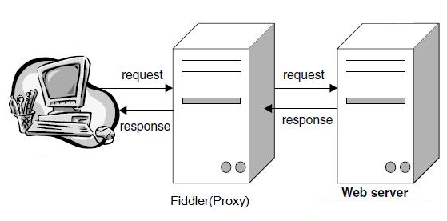

注意：Fiddler 是以代理web服务器的形式工作的，它使用代理地址:127.0.0.1，端口:8888。当Fiddler退出的时候它会自动注销，这样就不会影响别的 程序。不过如果Fiddler非正常退出，这时候因为Fiddler没有自动注销，会造成网页无法访问。解决的办法是重新启动下Fiddler。

## 配置
打开Fiddler  Tool->Fiddler Options->HTTPS 。  （配置完后记得要重启Fiddler）.

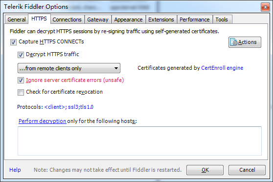

选中"Decrpt HTTPS traffic",    Fiddler就可以截获HTTPS请求，第一次会弹出证书安装提示，若没有弹出提示，勾选Actions-> Trust Root Certificate
另外，如果你要监听的程序访问的 HTTPS 站点使用的是不可信的证书，则请接着把下面的 “Ignore servercertificate errors” 勾选上。

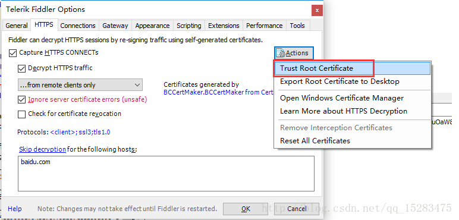

证书安装提示：

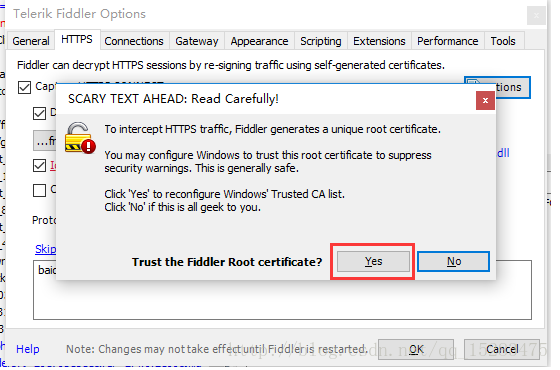

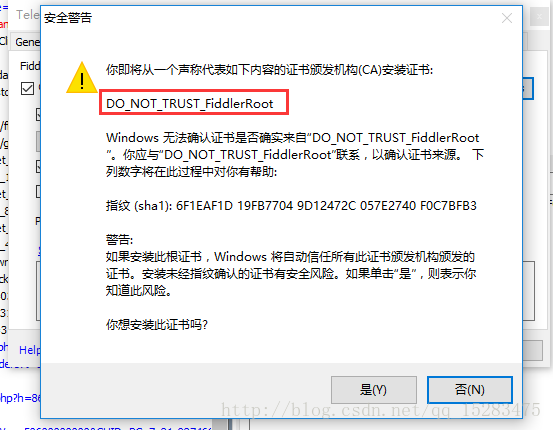

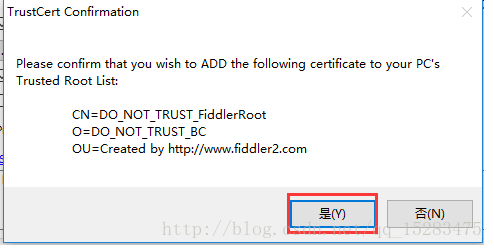

点击确定，这样Fiddler证书就已经添加成功了。

查看一下证书，Actions—>open windows certificate Manager 

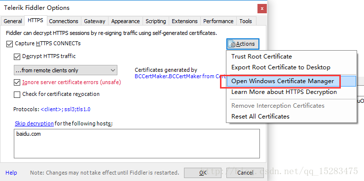

可以证书已经添加进去了，证书名称就是之前提醒大家留意的，【DO_NOT_TRUST_FiddlerRoot】

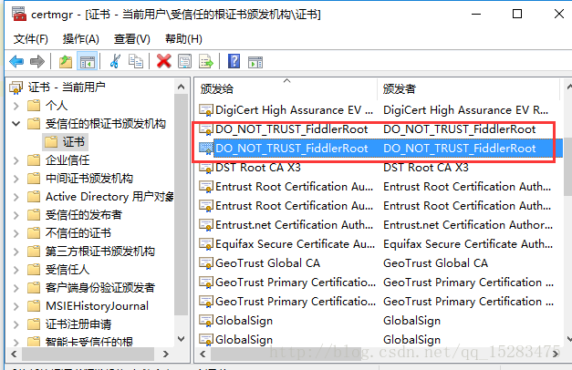

## Fiddler的使用

视图功能区域会话的概念：一次请求和一次响应就是一个会话。

### fiddler主界面

下面挑几个快捷功能区中常用几项解释，其他功能自己尝试：
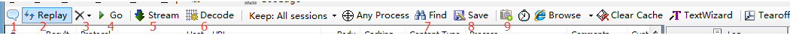

### 快捷功能区

1：给会话添加备注信息
2：重新加载当前会话
3：删除会话选项
4：放行，和断点对应，后面详细讲解
5：响应模式。也即是，当Fiddler拿到远程的response后是缓存起来一次响应给客户端还是以stream的方式直接响应。
6：解码。有些请求是被编码的，点击这个按钮后可以根据响应的编码格式自动解码。
7：查找会话。
8：保存会话。
9：截屏。截屏后，会以会话的方式返回一个截图。

### 接着来看看会话列表

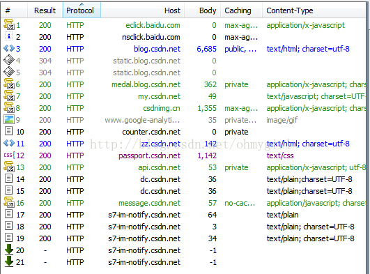
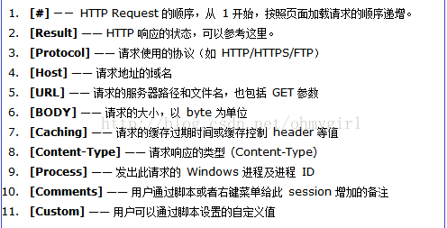

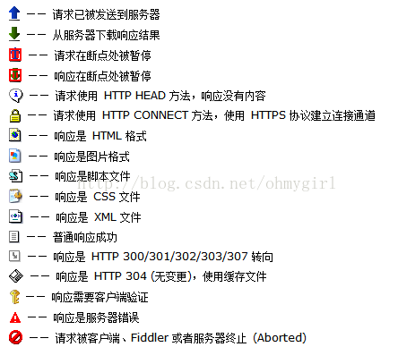

### 快捷键

删除一条会话，可以在选中会话后，按del删除，如若要清空列表，可以用Ctrl+X
左键点击单条HTTP请求，可以在右侧的tab面板中看到如下信息：

### 1. Statistic。

关于HTTP请求的性能和其他数据分析：

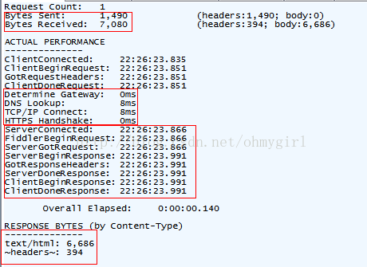

我们可以从中看出一些基本性能数据：如DNS解析的时间消耗是8ms,建立TCP/IP连接的时间消耗是8ms等等信息。

### 2. Inspectors

提供headers、textview、hexview,Raw等多种方式查看单条http请求的请求报文的信息,分为上下两个部分，上半部分是请求头部分，下半部分是响应头部分。对于每一部分，提供了多种不同格式查看每个请求和响应的内容。

#### a、ImageView标签 

JPG 格式使用 ImageView 就可以看到图片,选择一条Content-Type是image/jpeg的回话,点击ImageView

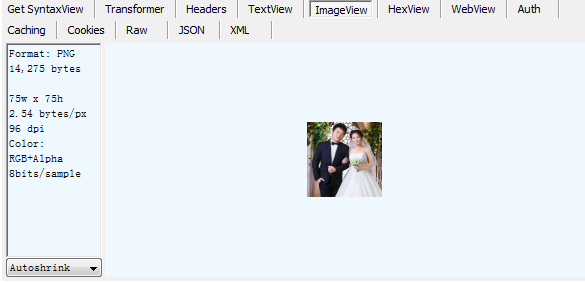

#### b、TextView 标签

HTML/JS/CSS 使用 TextView 可以看到响应的内容。选择一条Content-Type是text/html的回话,点击TextView
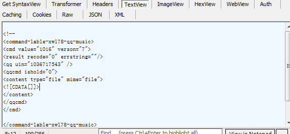

#### c、Raw标签
Raw标签可以查看响应报文和响应正文,但是不包含请求报文

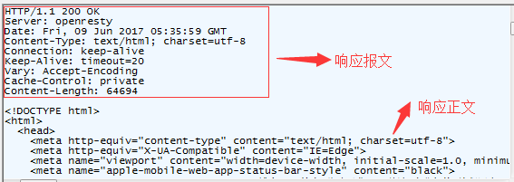

#### d、Auth标签
Auth则可以查看授权Proxy-Authorization 和 Authorization的相关信息
e、Cookies标签
Cookies标签可以看到请求的cookie和响应的set-cookie头信息。
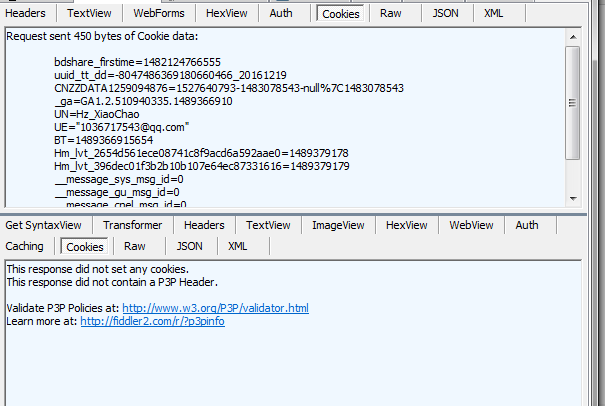

### 3.AutoResponder标签

Fiddler 的AutoResponder tab允许你从本地返回文件，而不用将http request 发送到服务器上。
下边直接说他的使用方式把：

使用的是手机上边的百度手机助手的棋牌游戏界面。

#### 1、首先看图 （我们来重定向第一个欢乐斗地主这个图片）

#### 2、打开Fiddler，然后点击棋牌游戏进入上边这个界面，就能发现会请求当前显示的这五张图片

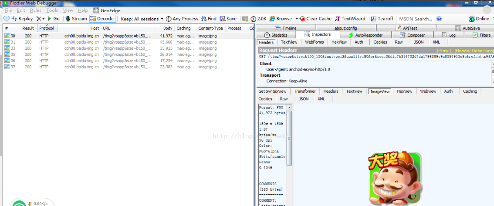

这个时候我们切换到AutoResponder这个界面，点击鼠标左键，把要重定向的这个session会话拖动到AutoResponder界面中

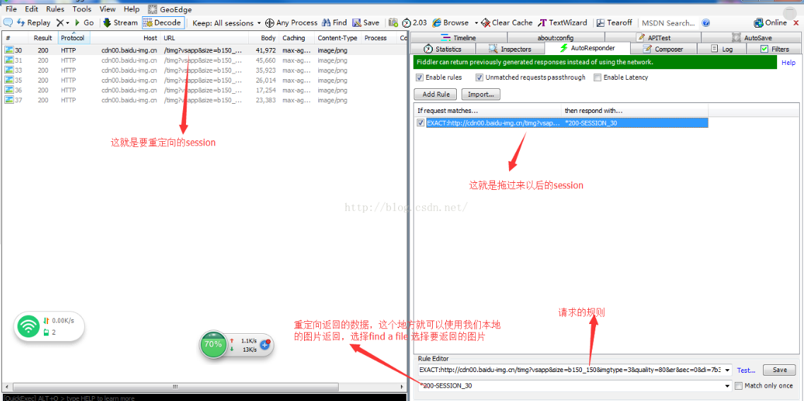

选择了我们要返回的图片以后，然后点击save。
然后关掉应该，清楚应用缓存，然后在打开，点击棋牌游戏，可以看到

这是实现了替换其中一个，也许你会说，是不是本来就是那样啊，那么在介绍一个根据别的规则来进行重定向。

我们通过重定向向，把所有的百度手机助手中的图片都替换成刚才的小头像。

前便的操作时一样的，拖过来以后我们可以点击Save前边的倒的小三角，然后就可以看到，里边有很多规则，现在我们选择
第一个：这是一个正则表达式。

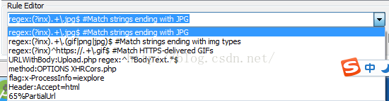

然后在选择刚才的那个头像图片，然后save。
清除缓存，重新打开，可以看下图：

可以看到，所有的jpg格式的都变成了我们的头像了。
关于重定向还有很多，剩下的就需要自己慢慢研究了。
小结：AutoResponder功能是Fiddler最实用的功能之一，Rule可以自由地设定，可以使用搜索（默认）、精确匹配（EXACT）、正则表达式匹配（REGEX）。处理方式可以选择使用文件，也可以选择合适的时间暂停数据流（*bpu、*bpafter），人工干预。通过以上几个步骤，我们演示了怎样将HTTP请求重定向到本地的文件，进行调试，这在我们诊断跟踪一些js文件但却不能修改js文件时非常有用。比 如：在用浏览器测试P页面时，P页面引入了一个js资源文件R.js，由于R.js文件在服务器S上，而我此时又不能登录S服务器（没有S服务器的帐 号），此时我们就可以通过浏览器将R.js文件下载到本地，然后对本地的R.js文件进行调整，最后通过设置Fiddler，将R.js文件的请求使用本 地的R.js文件。

### 4.Composer 自定义请求发送服务器

Composer允许自定义请求发送到服务器，可以手动创建一个新的请求，也可以在会话表中，拖拽一个现有的请求
Parsed模式下你只需要提供简单的URLS地址即可（如下图，也可以在RequestBody定制一些属性，如模拟浏览器User-Agent）

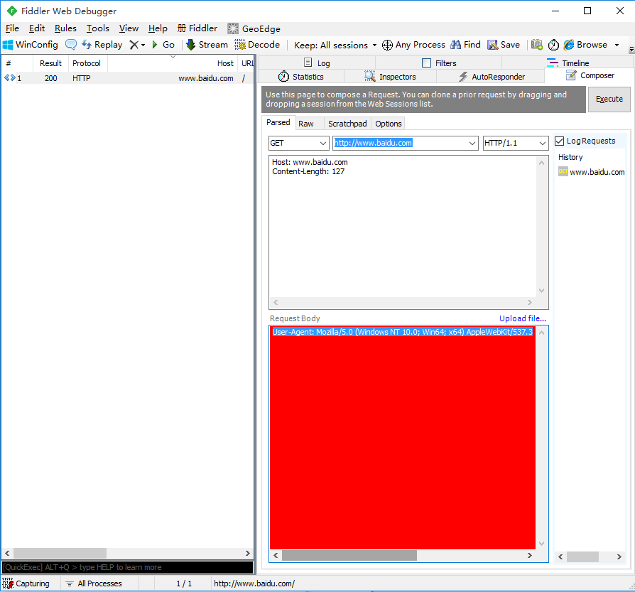

### 5.断点请求/响应
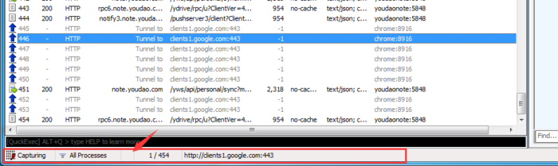

如图，箭头所指的位置时可以点击的。共三种状态：
空白：不设置断点。
箭头向上：表示断点请求。此时客户端的请求是无法直接到达目标服务器的，需要手动控制。
箭头向下：表示断点响应。此时目标服务器的响应是无法直接到达客户端的，需要手动控制。
还有一种打断点的方式
在命令行中输入命令: 
bpu www.baidu.com  （断点请求）
bpuafter www.baidu.com（断点响应）
这种方法只会中断www.baidu.com
断点请求并修改

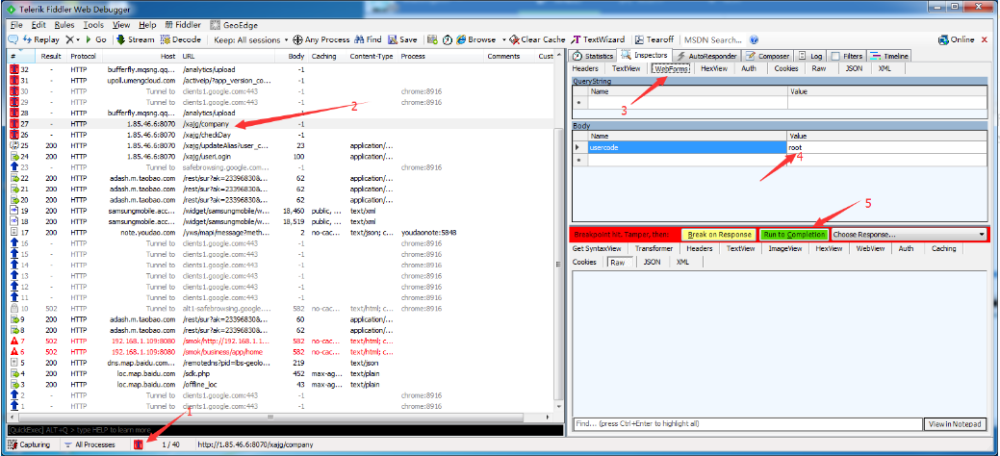

1.如图，操作步骤:
	 
2.设置断点请求，访问网页
	 
3.点击对应的会话
	 
4.查看请求报文信息
	 
5.修改请求内容
	 
完成断点，放行，把该请求发送给目标服务器。

图中Break On Response表示把请求发给服务器，但是服务器的响应被fiddler拦截，此时可以修改响应内容（和断点响应类似）。

断点响应并修改

和断点请求操作类似，只是在响应区域修改报文信息即可。
在断点响应时，请注意超时时间。

### 6.过滤域名

Fiddler抓包可以完成我们移动开发者的调试测试需求。但是多余的网页请求和手机的其他链接影响我们手机开发的需求。所以我们需要排除其他无用的包，只关注我们指定的域名的请求包。
打开fiddler，找到Filters选项并点击打开。如图所示

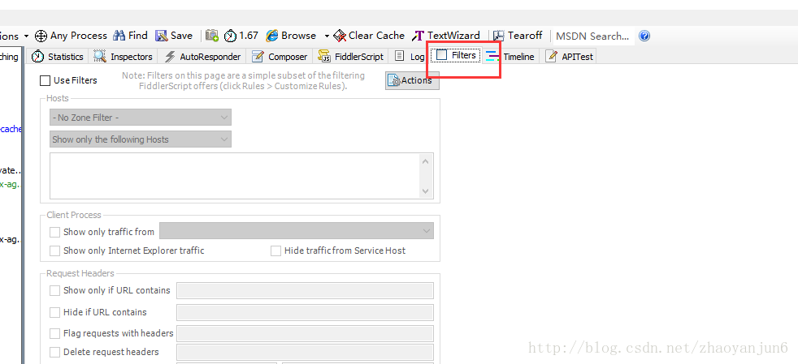

默认情况下，这个页面是灰色的，代表默认不过滤任何请求。现在我们勾选 Use Filters 。

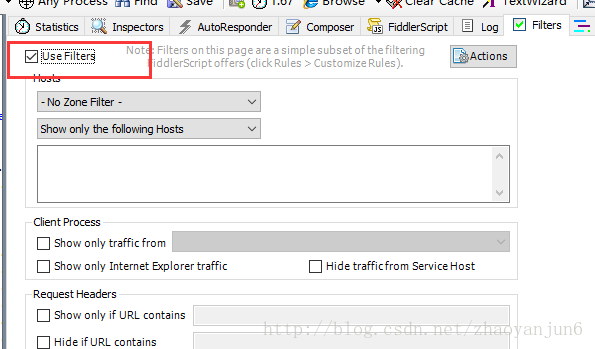

一般常用的有三种过滤条件：
1.域名过滤，只显示特定域名的记录：

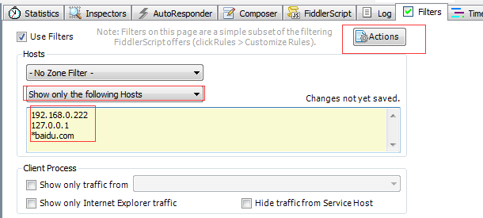

\*.baidu.com表示所有的百度二级域名会话；\*baidu.com表示一级域名+二级域名的会话。设置好了后一定要点击Actions生效；
2.类型过滤，一般对各种图片、CSS、JS这类的静态素材也不需要看的情况下，直接全部过滤掉

 .\*\.(bmp|css|js|gif|ico|jp?g|png|swf|woff) 

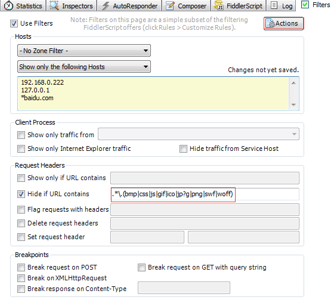

需要过滤多少自己直接加入就好了

#### 3.根据返回状态码，比如只想显示200的状态，其他的不显示

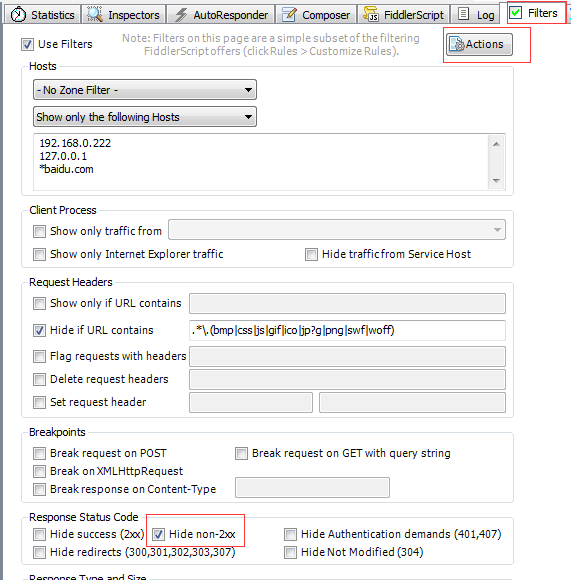

### Fiddler 的内置命令

#### ?
问号（?）后边跟一个字符串，Fiddler 将所有会话中存在该字符串匹配的全部高亮显示（下图输入的是 ?google.com）

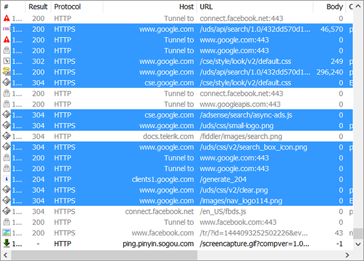

温馨提示：匹配的字符串是 Protocol、Host 和 URL 中的任何子字符串。

#### \> 和 <
大于号（>）和小于号（<）后边跟一个数值，表示高亮所有尺寸大于或小于该数值的会话。
比如我输入 >5000，按下回车后结果如下：
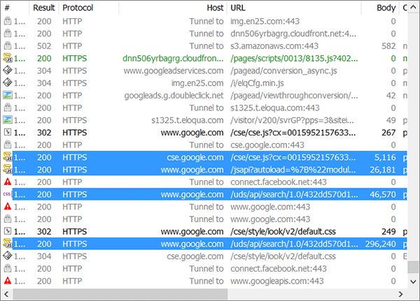

温馨提示：你可以直接输入 >5k 表示你想高亮所有尺寸大于 5KB 的会话。
#### =

等于号（=）后边可以接 HTTP 状态码或 HTTP 方法，比如 =200 表示高亮所有正常响应的会话。
下图输入了 =POST，表示希望高亮所有 POST 方法的会话：

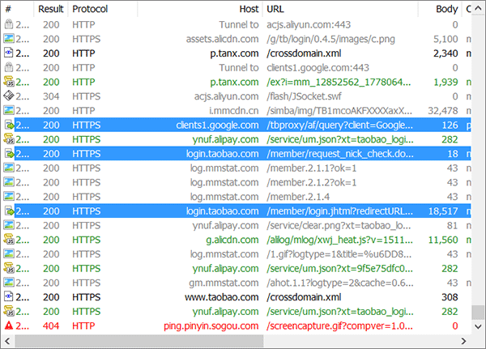

#### @

@ 后边跟的是 Host，比如我想高亮所有鱼C论坛的连接，我可以 @bbs.fishc.com

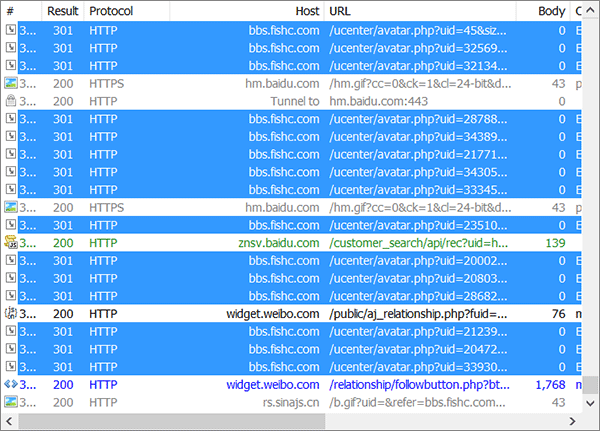

温馨提示：下边 bpafter、bps、bpv、bpm 和 bpu 用于设置断点。

会话被中断下来之后，点击页面上方的 Go 按钮放行当前中断下来的会话，但新的匹配内容还是会被断下来，输入命令但不带参数表示取消之前设置的断点。
#### bpafter

bpafter 后边跟一个字符串，表示中断所有包含该字符串的会话。

比如我想中断所有包含 fishc 的响应，那么我输入 bpafter fishc，然后在浏览器输入 bbs.fishc.com，发现并没有收到服务器响应，因此都给 Fiddler 断下来了：

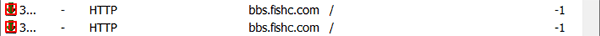

#### bps

bps 后边跟的是 HTTP 状态码，表示中断所有为该状态码的会话。

#### bpv 或 bpm

bpv 或 bpm 后边跟的是 HTTP 方法，表示中断所有为该方法的会话。

#### bpu
跟 bpafter 类似，区别：bpu 是在发起请求时中断，而 bpafter 是在收到响应后中断。

cls 或 clear

清除当前的所有会话。

#### dump

将所有的会话打包成 .zip 压缩包的形式保存到 C 盘根目录下。
#### g 或 go

放行所有中断下来的会话。

#### hide

将 Fiddler 隐藏。

#### show

将 Fiddler 恢复。

#### urlreplace

urlreplace 后边跟两个字符串，表示替换 URL 中的字符串。比如 urlreplace baidu fishc 表示将所有 URL 的 baidu 替换成 fishc。

温馨提示：直接输入 urlreplace 不带任何参数表示恢复原来的样子。

#### start

Fiddler 开始工作。

#### stop

Fiddler 停止工作。

#### quit

关闭 Fiddler。

#### select

select 后边跟响应的类型（Content-Type），表示选中所有匹配的会话。

比如希望 Fiddler 选中所有的图片，可以使用 select image；

而 select css 则选中所有的 css 文件；

当然，select htm 就是选中所有的 html 文件啦

#### allbut 或 keeponly

跟 select 类似，不过 allbut 和 keeponly 会将所有无关的会话删除。

比如我只想看图片，那么我可以 keeponly image，表示将所有与图片无关的会话删除：

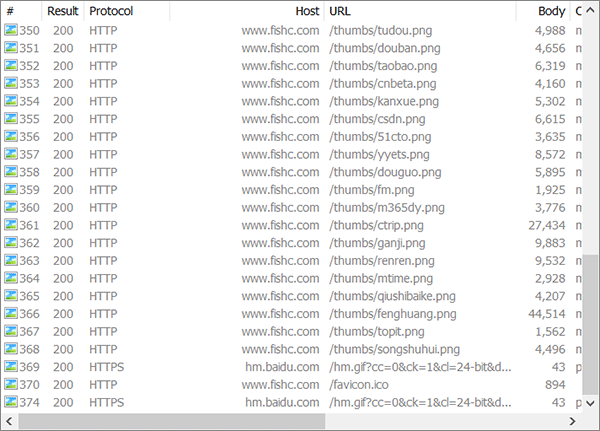

#### !dns

后边跟一个域名，执行 DNS 查找并在右边的 LOG 栏打印结果：

31

#### !listen

设置其他监听的端口，默认是 8888。。

