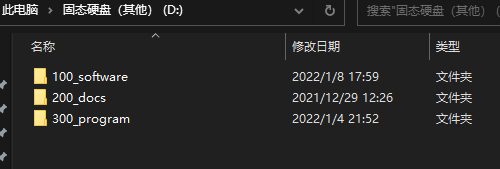
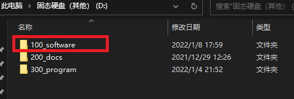

>写作时间 2022-01-08 18:05:27
# 电脑使用管理

## 硬盘分区
首先是，硬盘分区越少越好，一个硬盘，如果要装系统的话，就分为两个区，一个用来当系统盘，一个用来做其他资料存储盘。

## 工作流向

- 收集箱
- 处理中
- 完成了

在工作学习中，将下载的图片和其他文件首先放到**收集箱**，然后在使用中，将处理中所需要的文件放到**处理中**，处理完毕储存到特定的文件夹中。

## 文件管理分类

使用**杜威十进制图书分类法**，例如：

- 000 -计算机科学、资讯与总类
- 100 -哲学与心理学
- 200 -宗教
- 300 -社会科学
- 400 -语言
- 500 -科学（指自然科学)
- 600 -技术应用科学
- 700 -艺术与休闲
- 800 -文学
- 900 -历史、地理与传记

杜威十进图书分类法的优点：
1. 自动排序
2. 可拓展性强

## 文件命名

文件命名版本号-文件内容-所属项目-日期

版本号用v

## 软件安装

软件安装要特别创建一个文件夹，不要使用默认安装路径，为了便于查找和日后的彻底删除。

