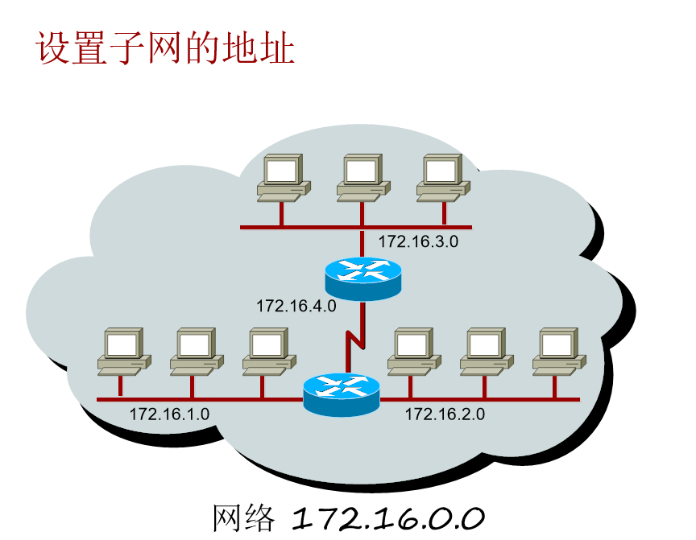

# 十进制和二进制的转换表

# IP地址分类

## 特殊IP地址

### 一些特殊的IP地址： 

- IP地址127.0.0.1：本地回环（loopback）测试地址 
- 广播地址：255.255.255.255 
- IP地址0.0.0.0：代表任何网络 
- 节点号全为1：代表该网段的所有主机

## 私有IP地址

私有IP就是在本地局域网上的IP 与之对应的是公有IP（在互联网上的IP）
随着私有IP网络的发展，为节省可分配的注册IP地址，有一组IP地址被拿出来专门用于私有IP网络，称为私有IP地址。

地址按用途分为私有地址和公有地址两种。所谓私有地址就是在A、B、C三类IP地址中保留下来为企业内部网络分配地址时所使用的IP地址。

　　私有地址主要用于在局域网中进行分配，在 Internet上是无效的。这样可以很好地隔离局域网和 Internet。私有地址在公网上是不能被识别的，必须通过NAT将内部IP地址转换成公网上可用的IP地址，从而实现内部IP地址与外部公网的通信。公有地址是在广域网内使用的地址，但在局域网中同样也可以使用，除了私有地址以外的地址都是公有地址。 

私有ip属于非注册地址，专门为组织机构内部使用。RFC1918定义了私有IP地址范围：

A: 10.0.0.0~10.255.255.255  即 10.0.0.0/8
B:172.16.0.0~172.31.255.255 即 172.16.0.0/12
C:192.168.0.0~192.168.255.255 即 192.168.0.0/16

这些地址是不会被Internet分配的，它们在Internet上也不会被路由，虽然它们不能直接和Internet网连接，但通过技术手段仍旧可以和 Internet通讯（NAT技术）。我们可以根据需要来选择适当的地址类，在内部局域网中将这些地址像公用IP地址一样地使用。在Internet上，有些不需要与 Internet通讯的设备，如打印机、可管理集线器等也可以使用这些地址，以节省IP地址资源。

2^n-2台，其中n是没被借用的主机位的位数。-2是因为，主机位全为0的部分是这个子网的网段号（Net_id），全为1的部分是这个网段的广播地址。

# 子网划分

## 子网划分的好处

- 缩减网络流量 
- 优化网路性能 
- 简化管理 
- 更为灵活地形成大覆盖的网络

## 子网划分的核心思想：“借用”主机位“制造”新的“网络”

## 划分后的子网地址

通过和运算即可算出该IP的网络 

172.16.2.160 即：10101100 00010000 00000010 10100000
255.255.255.196 即：11111111 11111111 11111111 11000000

10101100 00010000 00000010 10100000
11111111 11111111 11111111 11000000

1乘1得1,1乘0得0，对应每一位进行运算，结果为：101011100 00010000 00000010 10000000，转为十进制（网络地址即网络号）：172.16.2.128

## 划分子网方法

- 你所选择的子网掩码将会产生多少个子网？：2得x次方（x代表划分的子网掩码位数）

- 每个子网能有多少台主机？：2得y次方-2（y代表剩下的主机位数）

- 有效子网是？： 有效子网号=256-10进制的子网掩码（结果叫做block size或base number）也就是子网的步长增量，将上面的255.255.255.196来做例子，第17位到24位子网掩码的有效子网即步长增量值为256-255=1，所以子网为172.16.0.0 、172.16.1.0 、172.16.2.0 ……，第25位到32位子网掩码的有效子网步长增量值为256-196=64，所以子网为172.16.0.0 、172.16.0.64 、172.16.0.128、172.16.0.192

- 每个子网的广播地址为？：计算子网时，将主机位全部为1，再转换为10进制，比如将255.255.255.196来做例子，子网为172.16.0.0即 10101100 00010000 0000000 00000000，将主机位全部为1,10101100 00010000 00000000 00111111即广播地址172.16.0.63，或者等于下个子网号-1

- 每个子网的有效主机分别是？：忽略子网内全为0和全为1的地址，剩下的就是有效主机地址，主机位全0即表示该网段，比如子网172.16.1.0即10101100 00010000 00000001 00000000和子网172.16.1.64即10101100 00010000 00000001 01000000。

## 变长子网掩码（VLSM）

变长子网掩码（Variable-Length Subnet Masks，VLSM）的出现是打破传统的以类（class）为标准的地址划分方法，是为了缓解IP地址紧缺而产生的。

作用：节约IP地址空间；减少路由表大小。
注意事项：使用VLSM时，所采用的路
由协议必须能够支持它，这些路由协议包括RIPv2，OSPF，EIGRP和BGP。

## 无类域间路由（CIDR）

CIDR的概念：忽略A、B、C类网络的规则，定义前缀相同网路为一个块，即一条路由条目（如：199.0.0.0/8）

### CIDR概述及其地址块计算

CIDR中文全称是无分类域间路由选择，英文全称是Classless Inter-Domain Routing，在平常，大家多称之为无分类编址，它也是构成超网的一种技术实现。CIDR在一定程度上解决了路由表项目过多过大的问题。CIDR之所以称为无分类编址，就是因为CIDR完全放弃了之前的分类IP地址表示法，它真正消除了传统的A类、B类、C类地址以及划分子网的概念，它使用如下的IP地址表示法：

IP地址 ::= {<网络前缀>， <主机号>} / 网络前缀所占位数

CIDR仅将IP地址划分为网络前缀和主机号两个部分，可以说又回到了二级IP地址的表示，不过大家要注意，最后面用“/”斜线分隔，在其后写上了网络前缀所占的位数，这样就不需要告知路由器地址掩码，仅需要通过网络前缀所占的位数就可以得到地址掩码，为了统一，CIDR中的地址掩码依然称为子网掩码。

CIDR表示法给出任何一个IP地址，就相当于给出了一个CIDR地址块，这是由连续的IP地址组成的，所以CIDR表示法构成了超网，实现了路由聚合，即从一个IP地址就可以得知一个CIDR地址块。例如：已知一个IP地址是：128.14.35.7/20，那么这个已知条件告诉大家的并不仅仅是一个IP地址这么简单，我们来分析一下。

128.14.35.7/20 = 10000000  00001110  00100011  00000111

即前20位是网络前缀，后12位是主机号，那么我们通过令主机号分别为全0和全1就可以得到一个CIDR地址块的最小地址和最大地址，即

最小地址是：128.14.32.0      = 10000000  00001110  00100000  00000000 
最大地址是：128.14.47.255  = 10000000  00001110  00101111 11111111     
子网掩码是：255.255.240.0  = 11111111  11111111  11110000  00000000 

因此就可以看出来，这个CIDR地址块可以指派(47-32+1)\*256=4096个地址，这里没有把全0和全1除外。

### CIDR子网划分

在CIDR表示法中也可以进行进一步的子网划分，和前面的子网划分类似，我们只需要从主机号中借走一定的位数即可，这里与前面的基本子网划分不同，借走2位时可以划分成4个子网，不用减2，其他位数类似。下面通过一个例子来讲解CIDR中的子网划分。

例：某个机构拥有一个大的CIDR地址块，即206.0.64.0/18，现在某个高校需要申请一个较大的CIDR地址块以供学校使用，学校内部又分为4个系，由于每个系的人数不一样，所以要给人数较多的系分配较多的IP地址，人数较少的系分配较少的IP地址，现在采用以下的分配方案：

机构分配给该高校一个CIDR地址块：206.0.68.0/22，然后该高校内部的分配方案如下：

一系：206.0.68.0/23，一系内部又分为206.0.68.0/25、206.0.68.128/25、206.0.69.0/25和206.0.69.128/25四个子网。
二系：206.0.70.0/24，二系内部又分为206.0.70.0/26、206.0.70.64/26、206.0.70.128/26和206.0.70.192/26四个子网。
三系：206.0.71.0/25，三系内部又分为206.0.71.0/26和206.0.71.64/26两个子网。
四系：206.0.71.128/25，四系内部又分为206.0.71.128/26和206.0.71.192/26两个子网。

#### 请分析以上方案划分的具体细节。

答：这是一个CIDR子网划分中比较复杂的例子，分析如下：

第一，这个机构拥有的地址块是206.0.64.0/18 =206.0.0100 0000.0000 0000/18，网络前缀是18位，所以其

最小地址是：206.0.64.0/18       = 206.0.0100 0000.0000 0000/18
最大地址是：206.0.127.255/18 = 206.0.0111 1111.1111 1111/18
子网掩码是：255.255.192.0/18 = 1111 1111.1111 1111.1100 0000.0000 0000/18
拥有的地址数：(127-64+1)*(255-0+1)=16384

然后，我们来看一下这个机构给该高校分配的CIDR地址块，即206.0.68.0/22，由此可以看出来网络前缀由18增加到了22，所以该机构相当于将其CIDR地址块划分成了16个子块即子网，然后给该高校了第二个子网，即206.0.0100 0100.0/22，黑色加粗的部分是原来的网络前缀，后面红色部分类似于前面介绍的子网号，由于是4位，所以可以从0000~1111，共16个子网，0001自然就是第二个子网。

第二，既然高校拥有了机构的第二个子网的CIDR地址块206.0.68.0/22 = 206.0.0100 0100.0/22，其网络前缀是22位，所以其

最小地址是：206.0.68.0/22       = 206.0.0100 0100.0000 0000/22
最大地址是：206.0.71.255/22   = 206.0.0100 0111.1111 1111/22
子网掩码是：255.255.252.0/22 = 1111 1111.1111 1111.1111 1100.0000 0000/22
拥有的地址数：(71-68+1)\*(255-0+1)=1024
然后该高校内部又对这个CIDR地址块进行了划分，进一步得到了高校内部的子网，紧接着我们来看看一系的CIDR地址块是怎么得到的。

第三，一系的CIDR地址块是206.0.68.0/23，可以看出来其网络前缀相对于高校的CIDR地址块来说增加了1位，说明高校首先将其CIDR地址块划分成了2个子网，其中一个给了一系。那么这两个子网分别是：一系的：206.0.68.0/23 = 206.0.0100 0100.0/23和剩余的（记为余1）：206.0.70.0/23 =206.0.0100 0110.0/23，注意其中的红色部分就是新增的这一位，用来标志两个子网。

那么，一系的
最小地址是：206.0.68.0/23       = 206.0.0100 0100.0000 0000/23
最大地址是：206.0.69.255/23   = 206.0.0100 0101.1111 1111/23
子网掩码是：255.255.254.0/23 = 1111 1111.1111 1111.1111 1110.0000 0000/23
拥有的地址数：(69-68+1)*(255-0+1)=512

余1的
最小地址是：206.0.70.0/23       = 206.0.0100 0110.0000 0000/23
最大地址是：206.0.71.255/23   = 206.0.0100 0111.1111 1111/23
子网掩码是：255.255.254.0/23 = 1111 1111.1111 1111.1111 1110.0000 0000/23
拥有的地址数：(71-70+1)*(255-0+1)=512
现在，一系的CIDR地址块已经很明确，然后一系内部又进行了划分，即又分为206.0.68.0/25、206.0.68.128/25、206.0.69.0/25和206.0.69.128/25四个子网，网络前缀从23位变成了25位，相当于占用了主机号两位，所以可以划分为4个子网，分别对应00、01、10、11这四个子网，这四个子网的最小地址、最大地址以及子网掩码和拥有的地址数按照上述的方法就可以得到，这个比较简单，建议大家可以自己手动计算一下，正好看看自己掌握了多少，这里就不再给出这四个子网的细节。

第四，一系明确以后，就要考虑其他系的划分，可以看到二系分配到的CIDR地址块是206.0.70.0/24，可以看出来其网络前缀相对于余1的CIDR地址块来说增加了1位，说明余1的CIDR地址块被划分成了2个子网，其中一个给了二系。那么这两个子网分别是：二系的：206.0.70.0/24 = 206.0.0100 0110.0/24和剩余的（记为余2）：206.0.71.0/24 =206.0.0100 0111.0/24，注意其中的红色部分就是新增的这一位，用来标志两个子网。

那么
最小地址是：206.0.70.0/24       = 206.0.0100 0100.0000 0000/24
最大地址是：206.0.70.255/24   = 206.0.0100 0100.1111 1111/24
子网掩码是：255.255.255.0/24 = 1111 1111.1111 1111.1111 1111.0000 0000/24
拥有的地址数：(70-70+1)*(255-0+1)=256

余2的
最小地址是：206.0.71.0/24       = 206.0.0100 0111.0000 0000/24
最大地址是：206.0.71.255/24   = 206.0.0100 0111.1111 1111/24
子网掩码是：255.255.255.0/24 = 1111 1111.1111 1111.1111 1111.0000 0000/24
拥有的地址数：(70-70+1)*(255-0+1)=256
现在，二系的CIDR地址块已经很明确，然后二系内部又进行了划分，即又分为206.0.70.0/26、206.0.70.64/26、206.0.70.128/26和206.0.70.192/26四个子网，网络前缀从24位变成了26位，相当于占用了主机号两位，所以可以划分为4个子网，分别对应00、01、10、11这四个子网，这四个子网的最小地址、最大地址以及子网掩码和拥有的地址数按照上述的方法就可以得到，这个比较简单，建议大家可以自己手动计算一下，正好看看自己掌握了多少，这里就不再给出这四个子网的细节。

第五，二系明确以后，就要考虑其他系的划分，可以看到三系分配到的CIDR地址块是206.0.71.0/25，而四系分配到的CIDR地址块是206.0.71.128/25，可以看出来其网络前缀相对于余2的CIDR地址块来说增加了1位，说明余2的CIDR地址块被划分成了2个子网，其中一个给了三系，另外一个给了四系。那么这两个子网分别是：三系的：206.0.71.0/25 = 206.0.71.0000 0000/25和四系的：206.0.71.128/25 = 206.0.71.1000 0000/25，注意其中的红色部分就是新增的这一位，用来标志两个子网。

那么，三系的
最小地址是：206.0.71.0/25       = 206.0.0100 0100.0000 0000/25
最大地址是：206.0.71.127/25   = 206.0.0100 0100.0111 1111/25
子网掩码是：255.255.255.128/25 = 1111 1111.1111 1111.1111 1111.1000 0000/25
拥有的地址数：(71-71+1)*(127-0+1)=128

​    
四系的
最小地址是：206.0.71.128/25   = 206.0.0100 0100.1000 0000/25
最大地址是：206.0.71.255/25   = 206.0.0100 0100.1111 1111/25
子网掩码是：255.255.255.128/25 = 1111 1111.1111 1111.1111 1111.1000 0000/25
拥有的地址数：(71-71+1)*(255-128+1)=128

现在，三系和四系的CIDR地址块已经很明确，到目前为止，该高校已经将所有的CIDR地址块分配给了四个系，一系有512个地址，二系有256个地址，三系和四系各有128个地址。然后三系内部又进行了划分，即又分为206.0.71.0/26和206.0.71.64/26两个子网，网络前缀从25位变成了26位，相当于占用了主机号一位，所以可以划分为2个子网，分别对应0、1这两个子网，同时，四系内部也又进行了划分，即又分为206.0.71.128/26和206.0.71.192/26两个子网，网络前缀从25位变成了26位，相当于占用了主机号一位，所以可以划分为2个子网，分别对应0、1这两个子网，三系和四系各自的两个子网的最小地址、最大地址以及子网掩码和拥有的地址数按照上述的方法就可以得到，这个比较简单，建议大家可以自己手动计算一下，正好看看自己掌握了多少，这里就不再给出这些子网的细节。

#### CIDR的优点

- 减少网络数目，缩小了路由选择表 
- 从网络流量、cpu和内存方法说，开销更低 
- 对网络进行编址时，灵活性更大

