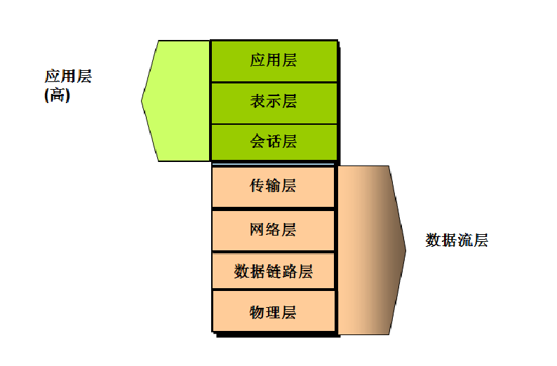
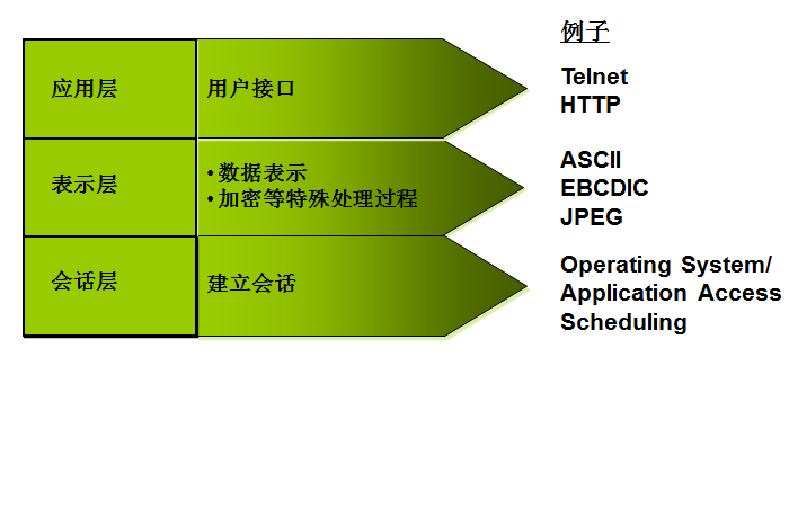
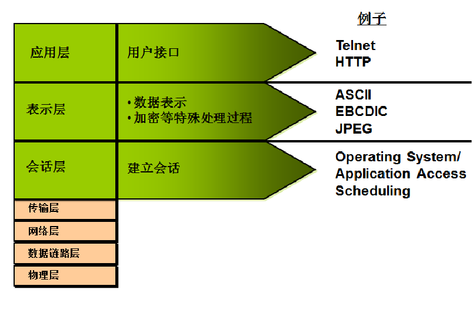
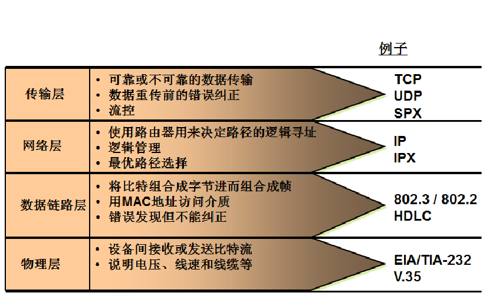

# OSI分层模型

开放式系统互联通信参考模型（英语：Open System Interconnection Reference Model，缩写为 OSI），简称为OSI模型（OSI model），一种概念模型，由国际标准化组织提出，一个试图使各种计算机在世界范围内互连为网络的标准框架。定义于ISO/IEC 7498-1。

##  网络分层的优点

层 layer：描述了所有需求的有效的通讯过程，并把这些过程逻辑上的组叫做层。 

### 分层的优点： 

促进标准化工作,允许各个供应商进行开发. 各层间相互独立,把网络操作分成低复杂性单元. 灵活性好,某一层变化不会影响到别层，设计者可专心设计和开发模块功能.相邻层之间通过一个接口在上下通信

## OSI模型

### 应用层，表示层，会话层作用

### 下四层

### 下四层的作用

## PDU

PDU（protocol data unit):每一层使用自己层的协议和别的系统的对应层相互通信，协议层的协议在对等层之间交换的信息叫协议数据单元。

**上层                :  message 
transport layer : segment 
Network layer:   packet 
Data-link layer:  Frame 
Physical layer:   bit**

TODO 先放着把，后面没搞完

