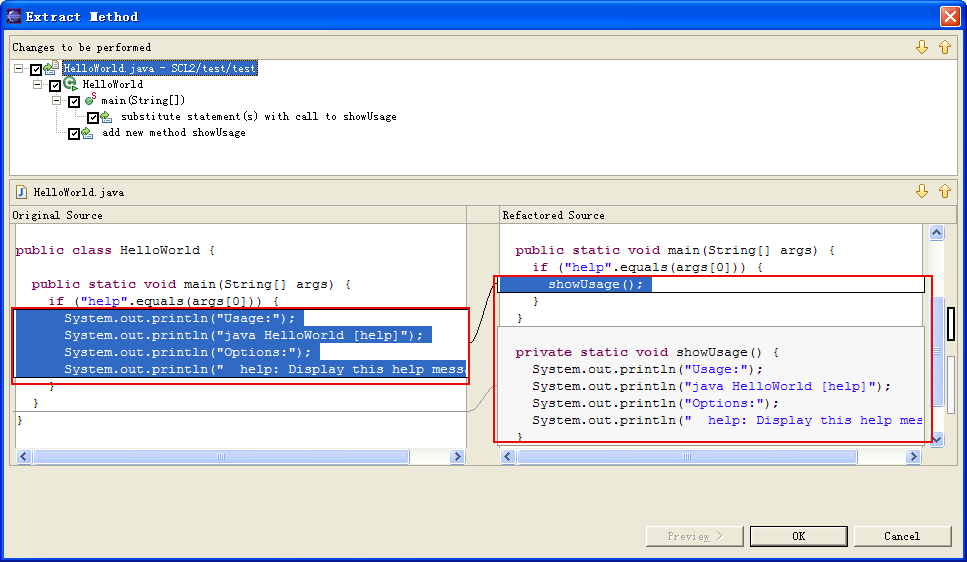

> 修改时间：2022-01-16 19:17:08

# 重构

重构（Refactoring）就是在不改变软件系统外部行为的前提下，改善它的内部结构，通过调整程序代码改善软件的质量、性能，使其程序的设计模式和架构更趋合理，提高软件的扩展性和维护性。

**ex1：**从单个字母的“i”重构为“interestRate”（利率，图一）

 

 **ex2：**较复杂的重构是把一段if区块中的代码变为一个子程序（图二）

 

# 重构有四大好处

1. **重构改进软件设计**

   如果没有重构，程序的设计会逐渐腐败变质。重构很像是在整理代码，你所做的就是让所有东西回到应出的位置上。经常性的重构可以帮助维持自己该有的形态。

2. **重构使软件更容易理解**

   重构可以帮助我们让代码更易读。

3. **重构帮助找到bug**

   对代码进行重构，可以帮助我们深入理解代码，对代码理解的越深，就越能帮我们找到bug。重构能够帮大家更有效地写出强健的代码。（这对程序员来说是重点）

4. **重构提高编程速度**

   重构可以帮助我们更快速地开发软件，因为它阻止系统腐败变质，它甚至还可以提高设计质量。（这对Boss来说是重点） 

# 何时重构

#### 1. 神秘的命名

一个好的命名，能让读者一眼就清楚代码的意思，整洁代码中最重要的一环是从好的命名开始。现实中很多人不愿意给程序改名，觉得不值得花费这个时间，但好的名字能节省未来用在猜谜上的大把时间，所以当项目中出现神秘命名时，便是重构的开始。关于代码有意义的命名请参阅《代码整洁之道》第二章 有意义的命名。

#### 2. 重复代码

在优秀的开发者心中，践行着事不过三的原则，即一段代码在三处以上的地方用到时，便是开始重构的时候，三不是一个绝对值，准确的说，如果你在一个以上的地方看到相同的代码结构，便应该立即开始重构代码。很多新手开发者在写代码时，喜欢通过拷贝粘贴的方式进行开发，这会给后期其他人维护和修改代码造成更多的不必要的麻烦。

#### 3. 过长函数

有大佬曾讲过，但凡是一个函数如果超过50行以上的代码，就应该开始考虑进行重构它。根据我以往的开发经验，粒度越小的函数，会活的最长最好，他们都遵循着单一职能原则。当函数过长，复杂度就会越高，理解就越难，所以很多开发者喜欢在长长的函数中，加入更多的注释来解释程序，这是一个错误的做法，过多的注释内容更容易干扰代码的阅读和理解。所以当我们感觉需要用注释来说明代码逻辑的时候，我们就应该把需要注释的内容单独抽象出来，写到一个单独的函数中去，并命一个直观的好名字。

#### 4. 过长参数列表

曾经我在编写Angular1的代码时，在控制器中经常需要注入很多依赖对象，在回调函数中需要传递大量的参数，导致经常自己手抖或者顺序不对导致一些BUG。过长的参数列表会经常令人产生迷惑，容易让人犯错，我们可以把多个参数合并成一个对象，通过传递对象的方式减少过长的参数列表，从而让代码更简洁已读。

#### 5. 全局数据

在项目中使用全局数据，容易造成数据的污染与冲突。在很多的代码规范中，对全局数据的使用都是明令禁止的，全局数据从代码库任何一个位置都可以修改它，这使其排查BUG的时候异常的困难。在实际开发中可以对全局数据进行抽象封装，在使用到数据的地方进行手动导入操作。

#### 6. 可变数据

对于弱类型开发语言Js，可变数据的问题很容易就发生，在一处更新数据后，却没有意识到软件的另一处期望着完全不同数据类型的数据，于是就改出了一处BUG，这种情况发生在很罕见的情况下，所以要找出故障的原因也会更加的困难，所以现在Ts开始在前端技术圈愈发流行起来。

#### 7. 发散式变化

在软件开发之初，我们希望软件能够更容易被修改，一旦需要修改，我们就能立即跳转到系统的某一点，只在该位置做修改即可完成。如果某个模块经常因为不同的原因在不同的方向上发生变化，发散式变化就出现了。

#### 8. 分散修改

分散的修改类似于发散式变化，正好又相反。如果每遇到某种变化，你都必须在许多不同的类内做出许多小修改，那么所面临的问题就是分散的修改，在这种情况下，你的代码散步在多个地方，你不但很难找到它们，也很容易错过某个重要的修改。这时候你需要进行封装和抽象，或者搬移某些代码到同一个模块中，以达到集中修改的地步。

#### 9. 依恋情结

接受过面向对象编程的开发者在编写代码时，或多或少都会想到代码要高内聚、低耦合、开放封闭等。但有时你会发现，一个函数跟另一个模块中的函数或者数据交流格外频繁，远胜于在自己所处模块内部的访问，这就是代码的依恋情结。我们可以通过搬移这部分代码到所访问模块的内部，或者我们再抽象一层，将函数分解为多个较小的函数，分别放置在不同地点。

#### 10. 数据泥团

曾经在维护他人代码时，经常看到在很多地方相同的字符串、相同的参数散落在代码的各个角落里，使其让人很难维护这样的代码。我们只需要将这些散落在到处的数据，进行抽象，将它们提炼到一个独立的对象中，再通过导入对象的方式访问这些数据即可，这样就可以帮我们降低很多重复的内容，使其修改代码时也不会再出现分散的修改。

#### 11. 基本类型偏执

在一些代码腐化的项目中，基本类型偏执是很常见的问题，比如价格可以用浮点数类型进行表示，坐标范围可以封装为对象进行展示，实际却是用字符串进行存储和展示。字符串似乎成了万能的数据类型，完全可以将这些类型偏执的代码替换为正确的类型进行展示。

#### 12. 重复的switch

在新手编写的代码中，当遇到条件判断或者分支判断时，大量重复嵌套的if和重复的switch是常见的处理问题的方法。这些重复的switch的问题在于，当你想增加一个选择分支时，就必须找到所有的switch，一一进行修改。对于重复的分支判断，我们可以利用`多态`来取代条件表达式，这样会让代码更优雅。

#### 13. 循环语句

在大量的业务场景中，循环语句都是不必要的，很多新人喜欢写大量的for循环语句，来实现需求。实际上我们可以利用`管道`来取代循环，比如使用filter、map、forEach等方法，帮助我们更快地看清被处理的元素以及处理他们的动作。

#### 14. 冗余的元素

在项目开发中，为了支持变化促进代码复用，往往我们会进行代码的抽象与封装，但往往这时候很难掌握抽象的度，导致过渡封装。可能一个方法名字和实现代码看起来一模一样，可能一个抽象出来的类根本就是一个简单的函数等，这就造成了代码的冗余。我们可以通过合并的方式，将过度抽象的代码给释放出来，从而减少代码的冗余。

#### 15. 夸夸其谈通用性

同样，过度设计的代码中，必定会出现各种各样的特殊情况，用来处理一些特别罕见或非必要的一些事情，实际上这些特殊的情况只会让系统更难维护和理解，所以在设计之初就考虑清楚如果确实能用上那么这么做是值得的，如果用不到，就只会让代码更加容易出现坏味道。

#### 16. 临时字段

在多人编写的项目中，也许你有看到过他人，在代码中定义某个临时字段，但这个字段只在特定的情况下才会使用到，如果代码没进入分支，这样的临时字段就很容易让人产生误解。我们可以将这些临时的字段，抽象到一个专门的类当中，然后把这些字段和相关的代码都搬移到这个类中，再在需要的地方调用该类中的方法即可。

#### 17. 过长的消息链

在使用他人编写的代码获取数据时，我们查看其逻辑时，发现你访问的对象，是代理的另外一个对象，另外一个对象又再请求另一个对象时，这时过长的消息链就出现了，如果你着急修复一个BUG，遇上这样的代码也许会让你抓狂。当消息链过长时，我们可以通过抽象和搬移这些代码到一个类中，来截断过长的消息联来缩短代码的深度，使其代码的可读性大大提高。

#### 18. 中间人

面向对象编程的特征之一就是封装，封装往往会伴随着委托。但也许你看到过某个类的接口有一半的函数都委托给其他的类进行实现的话，这就是过度运用封装了。这时候我们应该移除中间人代码，直接和真正的实现对象进行交互。

#### 19. 内幕交易

在实际开发中，很多人都贯彻着模块的高内聚，但内聚后势必就会增加模块间大量的交换数据，这会增加模块间的耦合。如果两个模块间一直存在着私下的交换数据，那么我们就有必要找出两个模块间共同数据，抽象为两者的数据中介，把这种交换行为放在明面上。

#### 20. 过大的类

臃肿的代码中，最大的功臣莫过于一个超大的类。一个类需要做很多的事情，自然就会出现很多的字段，重复代码也就接踵而至，代码开始混乱并最终走向死亡。对于这种大类，我们需要运用抽象能力，对这些代码进行提炼，相同的业务提炼到相应的类中，公共的内容提取到超类中。

#### 21. 异曲同工的类

在迭代过多个版本的代码中，异曲同工的类格外的多，大体上看大家似乎都做着一样的事情，仅有一些细微的差别，比如一些参数的不同等。这些类充斥着大量重复的代码，我们可以通过改变函数的声明将函数的参数变得一致，再将几者进行合并，如果出现重复代码，我们再将他们抽象为超类进行补偿。

#### 22. 纯数据类

在一些有经验的程序员中，他们出于方便管理的考虑，会把一些零散的数据，放到一个专门的纯数据类中，这样这个类就拥有一大堆的字段，以及用于访问这些字段的函数。但这些纯数据类，除了用于访问读写这些字段外，就一无是处，我们应该把处理数据的行为，从其他地方搬移到纯数据类中。

#### 23. 被拒绝的遗赠

在维护一些有继承关系的代码时，经常发现，一个子类继承了父类，获得了父类的所有的函数和数据，但子类却只从父类哪里取得一个值，父类其他的函数和值就被子类给拒绝了。这意味着继承体系设计的错误，我们需要为这个子类新建一个兄弟类，再把用不到的函数和值推给那个兄弟类，这样父类就持有所有子类共享的东西了。

#### 24. 注释

优秀的代码，自带解释性。但实际上大部分注释的存在都是因为代码很糟糕，所以不得不加一些注释内容，便于进行补充说明。所以，当你感觉需要写注释时，就需要先尝试进行代码重构，运用提炼函数和改变函数声明的手法，试着让所有的注释都变得很多余。

以上就是代码的24种坏味道理论篇，在下一篇文章中，将正式开始进行演练和实践！

 

 

 

------

参考：

[https://zh.wikipedia.org/wiki/%E4%BB%A3%E7%A0%81%E9%87%8D%E6%9E%84](https://zh.wikipedia.org/wiki/代码重构)

[https://baike.baidu.com/item/%E9%87%8D%E6%9E%84/2182519](https://baike.baidu.com/item/重构/2182519)

[https://baike.baidu.com/item/%E4%BB%A3%E7%A0%81%E9%87%8D%E6%9E%84](https://baike.baidu.com/item/代码重构)

https://segmentfault.com/a/1190000011460556

https://juejin.im/post/6844903926744121357