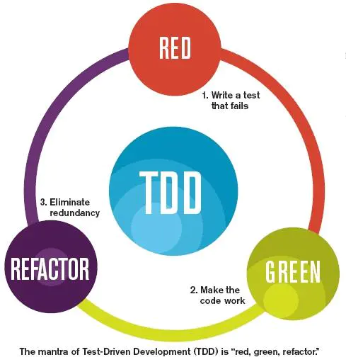

测试驱动开发，英文全称Test-Driven Development，简称TDD，是一种不同于传统软件开发流程的新型的开发方法。它要求在编写某个功能的代码之前先编写测试代码，然后只编写使测试通过的功能代码，通过测试来推动整个开发的进行。这有助于编写简洁可用和高质量的代码，并加速开发过程。

## 例子：

盖房子的时候，工人师傅砌墙，会先用桩子拉上线，以使砖能够垒的笔直，因为垒砖的时候都是以这根线为基准的。TDD就像这样，先写测试代码，就像工人师傅先用桩子拉上线，然后编码的时候以此为基准，只编写符合这个测试的功能代码。

而一个新手或菜鸟级的小师傅，却可能不知道拉线，而是直接把砖往上垒，垒了一些之后再看是否笔直，这时候可能会用一根线，量一下砌好的墙是否笔直，如果不直再进行校正，敲敲打打。使用传统的软件开发过程就像这样，我们先编码，编码完成之后才写测试程序，以此检验已写的代码是否正确，如果有错误再一点点修改。

## 为什么要 TDD

### 传统开发方式 VS TDD 开发方式

**传统开发方式**

- 需求分析，想不清楚细节，管他呢，先开始写
- 发现需求细节不明确，去跟业务人员确认
- 确认好几次终于写完所有逻辑
- 运行起来测试一下，靠，果然不工作，调试
- 调试好久终于工作了
- 转测试，QA 测出 bug，debug， 打补丁
- 终于，代码可以工作了
- 一看代码烂的像坨屎，不敢动，动了还得手工测试，还得让 QA 测试，还得加班...

**TDD 开发方式**

- 先分解任务，分离关注点（后面有演示）
- 列 Example，用实例化需求，澄清需求细节
- 写测试，只关注需求，程序的输入输出，不关心中间过程
- 写实现，不考虑别的需求，用最简单的方式满足当前这个小需求即可
- 重构，用手法消除代码里的坏味道
- 写完，手动测试一下，基本没什么问题，有问题补个用例，修复
- 转测试，小问题，补用例，修复
- 代码整洁且用例齐全，信心满满地提交

### TDD 的好处

**降低开发者负担**
通过明确的流程，让我们一次只关注一个点，思维负担更小。

**保护网**
TDD 的好处是覆盖完全的单元测试，对产品代码提供了一个保护网，让我们可以轻松地**迎接需求变化**或**改善代码的设计**。
所以如果你的项目需求稳定，一次性做完，后续没有任何改动的话，能享受到 TDD 的好处就比较少了。

**提前澄清需求**
先写测试可以帮助我们去思考需求，并提前澄清需求细节，而不是代码写到一半才发现不明确的需求。

**快速反馈**
有很多人说 TDD 时，我的代码量增加了，所以开发效率降低了。但是，如果没有单元测试，你就要手工测试，你要花很多时间去准备数据，启动应用，跳转界面等，反馈是很慢的。准确说，快速反馈是单元测试的好处。

## 怎么 TDD

 

TDD 的基本流程是：红，绿，重构。
更详细的流程是：

- 写一个测试用例
- 运行测试
- 写刚好能让测试通过的实现
- 运行测试
- 识别坏味道，用手法修改代码
- 运行测试

### **为什么要先运行一下测试**

- 你可能以为测试只有成功和失败两种情况，然而，失败有无数多种，运行测试才能保证当前的失败是你期望的失败，一切都是为了让程序符合预期，这样当出现错误的时候，就能很快定位到错误。
- 防止测试本身是错误的。比如,你可能一不小心手滑写了下面一个测试。

## 测试驱动开发评价

### 正面评价

- 可以有效的避免过度设计带来的浪费。但是也有人强调在开发前需要有完整的设计再实施可以有效的避免重构带来的浪费。
- 可以让开发者在开发中拥有更全面的视角。

### 负面评价

- 开发者可能只完成满足了测试的代码，而忽略了对实际需求的实现。有实践者认为用结对编程的方式可以有效的避免这个问题。
- 会放慢开发实际代码的速度，特别对于要求开发速度的原型开发造成不利。这里需要考虑开发速度需要包含功能和品质两个方面，单纯的代码速度可能不能完全代表开发速度。
- 对于GUI,资料库和Web应用而言。构造单元测试比较困难，如果强行构造单元测试，反而给维护带来额外的工作量。有开发者认为这个是由于设计方法，而不是开发方法造成的困难。
- 使得开发更为关注用例和测试案例，而不是设计本身。当前对于这个观点有较多的争议。
- 测试驱动开发会导致单元测试的覆盖度不够，比如可能缺乏边界测试。在实际的操作中，和非测试驱动开发一样，当代码完成以后还是需要补充单元测试，提高测试的覆盖度。

## TDD原则

**独立测试：**不同代码的测试应该相互独立，一个类对应一个测试类（对于C代码或C++全局函数，则一个文件对应一个测试文件），一个函数对应一个测试函数。用例也应各自独立，每个用例不能使用其他用例的结果数据，结果也不能依赖于用例执行顺序。 一个角色：开发过程包含多种工作，如：编写测试代码、编写产品代码、代码重构等。做不同的工作时，应专注于当前的角色，不要过多考虑其他方面的细节。

**测试列表：**代码的功能点可能很多，并且需求可能是陆续出现的，任何阶段想添加功能时，应把相关功能点加到测试列表中，然后才能继续手头工作，避免疏漏。

**测试驱动：**即利用测试来驱动开发，是TDD的核心。要实现某个功能，要编写某个类或某个函数，应首先编写测试代码，明确这个类、这个函数如何使用，如何测试，然后在对其进行设计、编码。

**先写断言：**编写测试代码时，应该首先编写判断代码功能的断言语句，然后编写必要的辅助语句。

**可测试性：**产品代码设计、开发时的应尽可能提高可测试性。每个代码单元的功能应该比较单纯，“各家自扫门前雪”，每个类、每个函数应该只做它该做的事，不要弄成大杂烩。尤其是增加新功能时，不要为了图一时之便，随便在原有代码中添加功能，对于C++编程，应多考虑使用子类、继承、重载等OO方法。

**及时重构：**对结构不合理，重复等“味道”不好的代码，在测试通过后，应及时进行重构。

**小步前进：**软件开发是复杂性非常高的工作，小步前进是降低复杂性的好办法。

 

 

 

 

------

 

参考：

https://baike.baidu.com/item/TDD/9064369?fr=aladdin

[https://baike.baidu.com/item/%E6%B5%8B%E8%AF%95%E9%A9%B1%E5%8A%A8%E5%BC%80%E5%8F%91/3328831?fr=aladdin](https://baike.baidu.com/item/测试驱动开发/3328831?fr=aladdin)

https://www.jianshu.com/p/62f16cd4fef3

https://blog.csdn.net/abchywabc/article/details/91351044