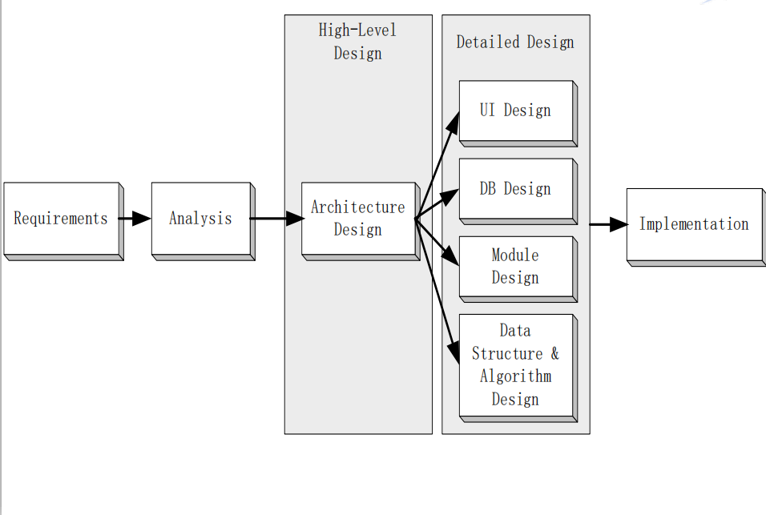

# 先理解三个重要名词

- 客户——客户是指让软件产品得到开发的个人或组织，开发经费是由客户提供的的。

- 开发人员——开发人员是负责建造软件产品组织的成员

- 用户——用户受客户委托，代表客户使用该软件，例如：银行的ATM系统的客户是银行，也就是说是有银行来投资建设的ATM系统，而该系统的用户是该银行的广大储户。

# 软件过程
软件是抽象的，同时它也是一种实体，所以，它也和物理实体一样， 会经历产生，发展和消亡的过程，这个过程就是软件过程。

## 软件过程可以分为五个工作流和两个阶段

- 1.需求工作流
- 2.分析工作流
- 3.设计工作流
- 4.实现与集成工作流
- 5.测试工作流
- 6.交付后的维护阶段
- 7.退役阶段

###  1.需求工作流

需求工作流的目的是为了让开发组织确定客户的需求
对概念进行探索和提炼，然后引出客户的需求
需求文档——需求文档必须为客户完全了解，所以需求文档必须了解客户方的语言，即自然人类语言，同时需求文档还必须获得客户的认可，需求是软件过程中难度最大的一项工作，这是因为软件本身以及要解决的问题是复杂的。

### 2.分析工作流
分析工作流，目标是分析并精化需求，以理解软件正确开发和易于维护所必需的需求细节，分析工作流采用比自然语言更为精确的语言，以确保设计和实现工作流正确实施，在实施分析工作流的期间，会添加更多的细节，可能与用户了理解目标产品无关，但是，对于开发该软件产品的软件专业人员是必要的。分析工作流的输出是规格说明文档。规格说明文档回答了目标产品将要做什么

### 3.设计工作流
- 设计文档

- 如何实现目标产品

### 4.实现与集成工作流

使用计算机语言对组成的部分进行编码实现
各个已经编码实现的模块，还要进行集成，获取一个能够作为一个整体来运行的软件产品

### 5.测试工作流

在软件过程中，自始至终都与其他工作流并行进行，也就是说，软件过程中的每一个工作流都需要测试。

测试方式分2种：
基于执行的测试，测试对象只有可执行的代码
基于非执行的测试，测试对象包括所有非代码的工作成果，如各种文档以及代码

### 6.交付后的维护阶段

交付后的维护，一旦开发方交付了软件产品，客户接受了软件产品，开发人员对该产品所进行的任何改变，就称之为对该产品的维护。
维护是软件过程中整体组成部分之一，分为纠错性维护、完善性维护和适应性维护，维护对于软件生命的维护和用户坚持使用该产品起着重要和必要的作用，因为软件的复杂性和文档的缺乏，维护是软件生产中最具挑战性的阶段，事实上，平均有三分之二的预算用于软件交付后的维护。维护时开发方和用户方投入较大的一个阶段。

### 7.退役阶段

软件最后的一个阶段，退役阶段，在软件使用的若干年之后，当进一步维护已经不值得，或用户决定不再使用该软件了时，该软件就进入到了退役阶段。

----

参考或转载：
https://www.icourse163.org/course/NEU-1001812013