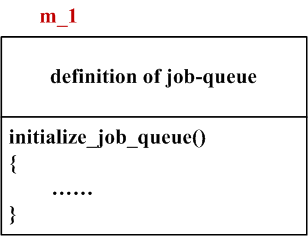
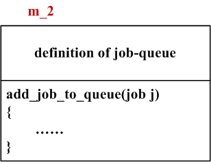
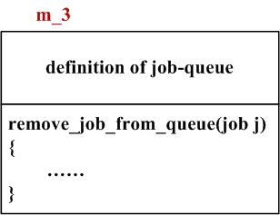
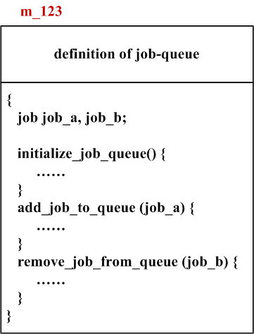
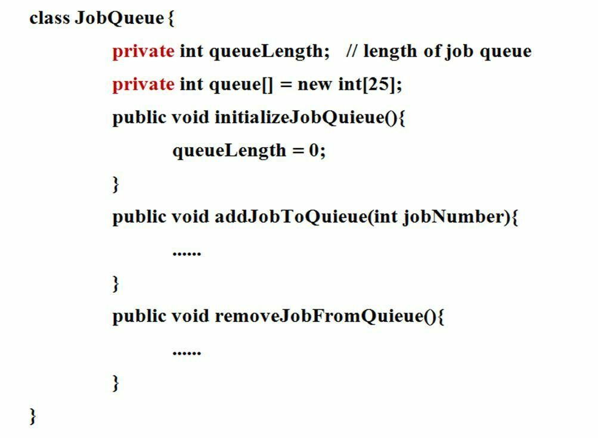
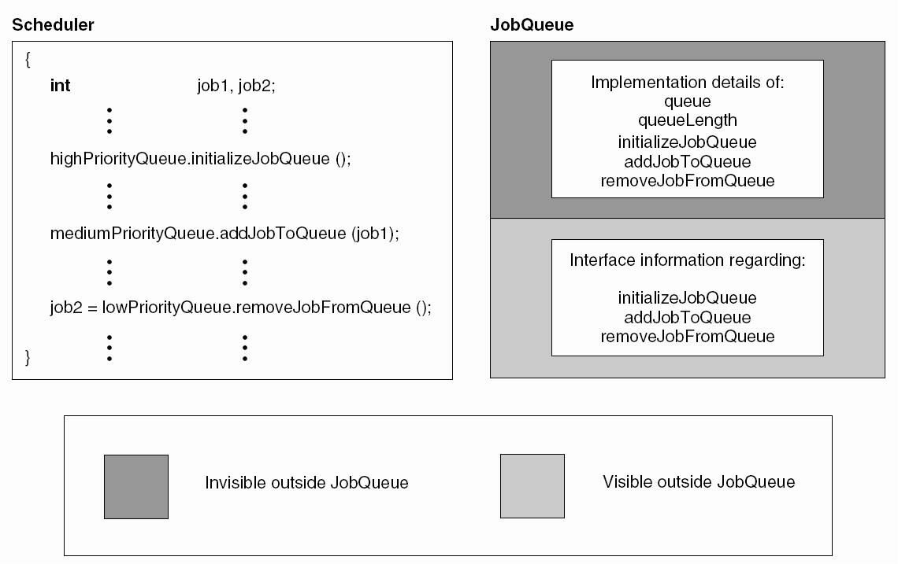

# 数据封装

例子：

为大型主机设计操作系统。已决定将提交给计算机的批处理任务分为高优先级、中优先级或低优先级。传入批处理任务必须有三个队列，每个任务类型一个队列。当用户提交任务时，该任务将被添加到相应的队列中，当操作系统确定某个任务已准备好运行时，该任务将从其队列中删除，并为其分配内存。

用结构化语言来实现的话，有以下这几个模块。

模块m_1初始化任务队列，模块m_2添加任务到队列，m_3模块从队列中移除任务。

在调度程序模块m_123中，将会调用m_1、m_2和m_3这几个模块。

在整个系统中，4个模块都对相同的数据结构任务队列job-queue进行了定义，那么这将非常难维护，因为只要有一个地方需要对任务队列进行修改，其他三个地方也都要随即进行改变。

如果我们把初始任务队列，添加任务和移除任务放在一个模块中，而且是使这三个操作都是在相同的数据结构上，我们将获得一个新的模块m_encapsulation。

那么，显然模块m_encapsulation具有信息型内聚。

m_encapsulation是对数据封装的一种实现，也就是说，所谓数据封装就是指这样的数据结构以及对该数据结构所进行的操作。

## 数据封装的优势

### 1.数据封装在开发上的优势

- 数据封装就是抽象的一个例子

- 任务队列例子：

    - 数据结构

        - 任务队列
    - 三种操作
        - 初始化任务队列
        - 添加任务到队列
        - 从队列移除任务

数据结构进行的这些操作就构成了一种数据抽象，数据抽象使得设计者可以在数据结构以及操作的层次上去思考问题，而更晚的一些时候采取考虑如何实现这些数据结构以及这些操作。

### 2.数据封装在维护上的优势

数据封装使得将来对软件所做的改动而造成的影响最小化，例如在下面这段代码中，

这是我们对任务队列这个类所做的实现， 这个类，它有属性，有任务队列，有任务长度，初始化任务，添加和移除任务等等。

那些调用类不需要知道jobQueue如何被实现的，对于他们而言他们获得的信息，只是jobQueue对外提供的接口而已，所以数据封装简化了维护。

抽象数据类型——就是指这样的一种数据类型即在该数据类型上所进行的各种操作

# 信息隐藏

## 数据抽象

- 设计者在抽象数据类型的层次上思考

- 信息隐藏又称为细节隐藏，

- 就是以对其他模块隐藏实现细节的方式设计模块，

- 将来对该模块的改变本地化，

- 改变不会影响其他模块

如何把信息隐藏融入到抽象数据类型的实现中，以以下图中的Java类为例子。

用Java的访问控制符private来界定JobQueue的属性queueLength和queue是私有的，就是不外界不可见的。

任务队列，任务初始化，任务添加，任务移除的具体实现细节外界不可见，外界可见的只是任务初始化，任务添加和任务移除的这几个接口而已。

----

参考或转载：
https://www.icourse163.org/course/NEU-1001812013

