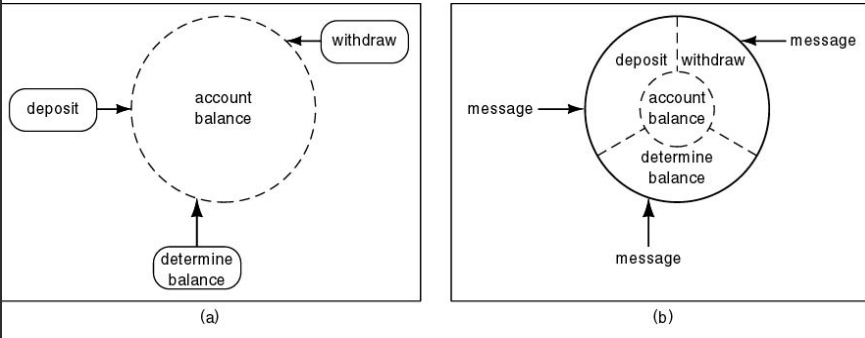
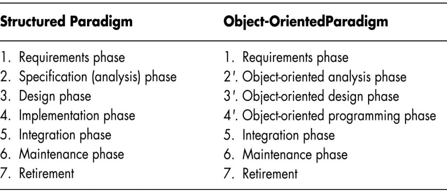
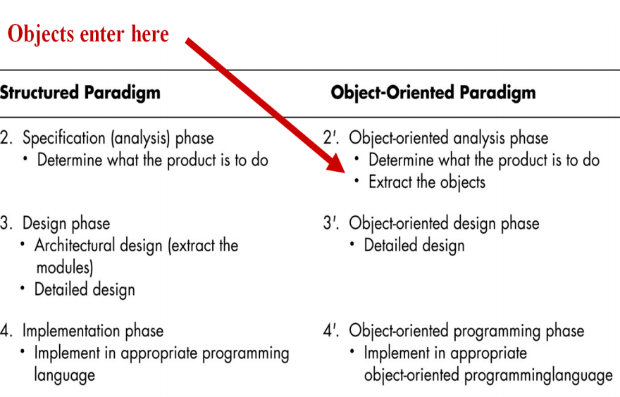

# 结构化范型

事实上，结构化范型一开始也获得了很大的成功，但是，随着软件系统的规模越来越大，但软件系统的代码量越来越大，超过50000行的时候，结构化范型暴漏出越来越多的问题。

例如：维护问题，原因在于结构化方法只能是面向操作或者面向数据，不能二者兼备。

# 面向对象范型

数据和操作都是同等重要，而对象把数据和对数据的操作封装在一起了。

例如：

银行系统

- 数据：账户余额

- 操作：存款、取框和查询余额等等

## 面向对象范型比较结构化的优势

- 封装和信息隐藏

- 职责驱动设计

- 对维护和开发影响较小

例如：下图

如果用结构化范型来实现的话，就是a图的样子，操作跟数据分离了，如果是用面向对象范型来实现的话，就是b图的样子，就是将数据和操纵封装在一起了，需要直接执行操作发送信息即可。操作方法对外面来说是隐藏的，不可见的。

## 职责驱动设计

- 又成为合同设计
- 例如：你在沈阳学习，母亲节到了，要给在成都的妈妈送一朵鲜花
    - 打电话给花店
    - 下单
    - 支付订单
    - 完成
- 在面向对象范型中
    - 描述为向某个对象的某个方法发送一条消息

# 从分析到设计的过渡

结构化范型

- 在分析（什么）和设计（如何）之间摇摆

| 结构化范型 | 面向对象范型 |
| :--------: | :----------: |
| 1.需求阶段 |       1.需求阶段       |
|     2.规格分析阶段       |      2.面向对象分析阶段        |
|       3.设计阶段     |      3.面向对象设计阶段        |
|       4.实现阶段     |     4.面向对象编程阶段         |
|       5.集成阶段     |    5.集成阶段          |
|       6.维护阶段     |        6.维护阶段      |
|       7.退役     |       7.退役       |

**更详细一点**

### 结构化范型

2.规格分析阶段

- 确定产品的用途

3.设计阶段

- 架构设计（提取模块）

4.实现阶段

- 用合适的编程语言实现

### 面向对象范型

2.面向对象设计阶段

- 确定产品的用途
- 提取出对象

3.面向对象设计阶段

- 详细设计

4.面向对象编程阶段

- 用合适的面向对象编程语言实现

