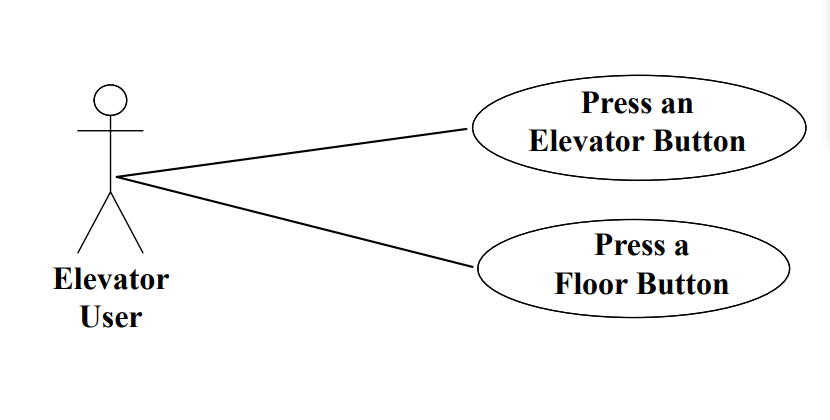
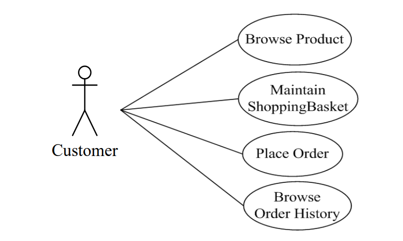
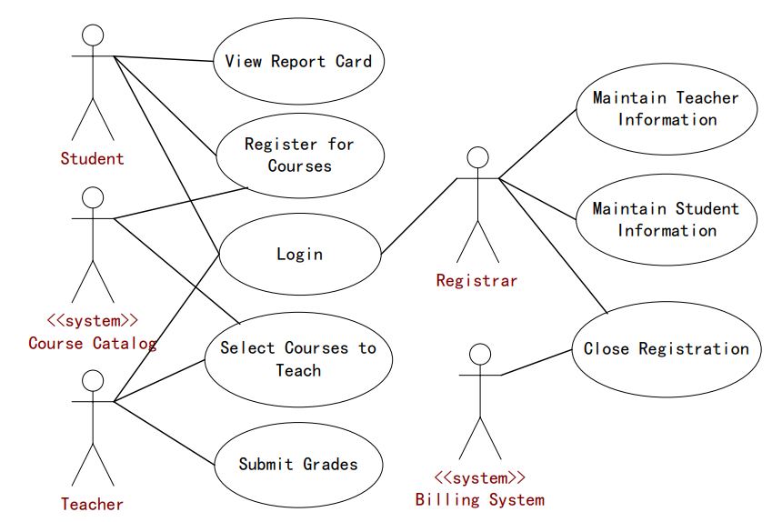
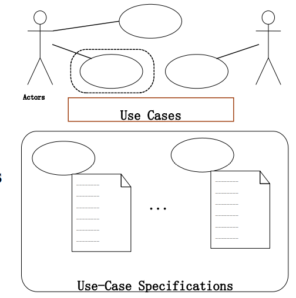
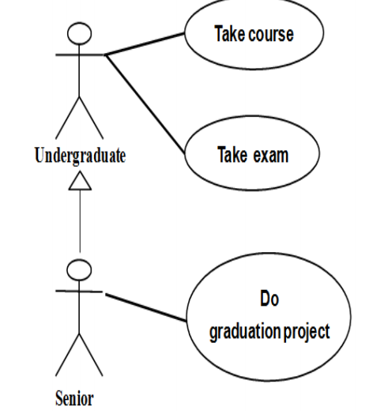
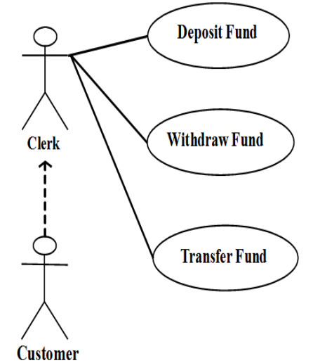
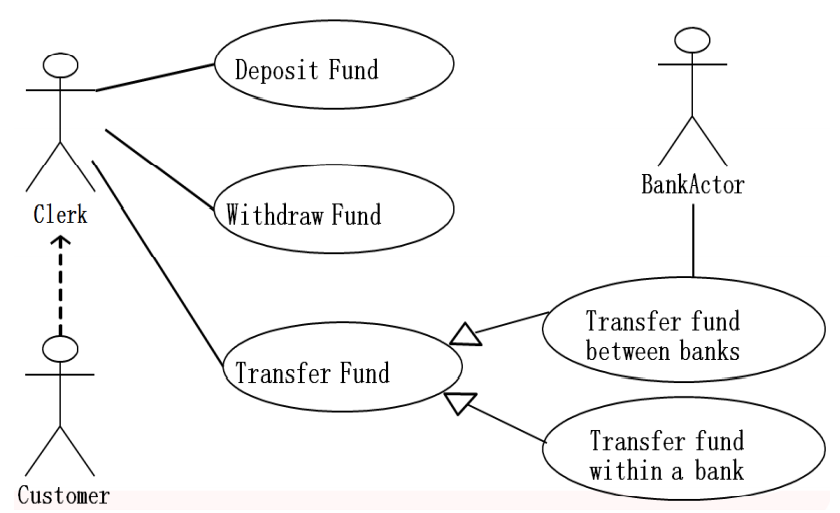
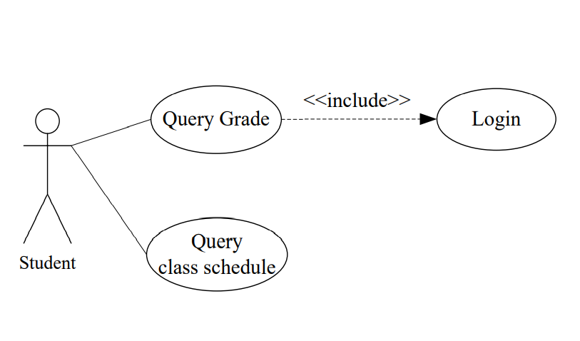
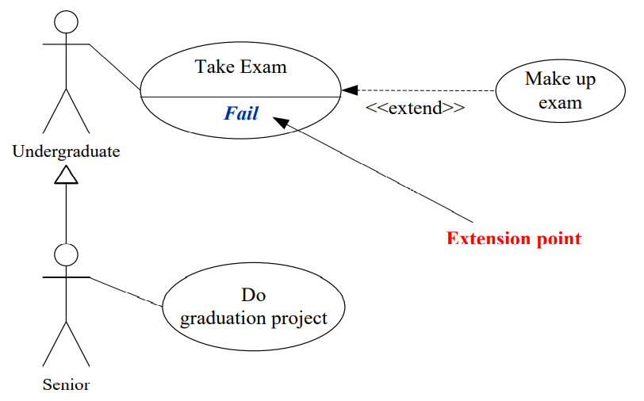

# 通过案例来学习用例图

## 案例一：电梯系统

电梯使用者就是参与者，参与者使用者与电梯系统有两个简单的交互，也就是有两个简单的用例。

一个用例是按下楼层中的按钮，即等待电梯来接用户，一个用例是按下电梯里面的按钮，选择目标楼层。

## 案例二：在线商店系统

在线商店的顾客就是在线商店系统的参与者，参与者与在线商店系统有图中几种交互。

- 浏览商品

- 维护购物篮

- 下订单

- 浏览订单历史

## 案例三：课程注册系统

有五个参与者，三个参与者是人，学生和老师，连有两个独立于软件系统的现存系统。

学生与目标系统有三种交互：

- 登录

- 注册课程

- 浏览成绩单

老师与目标系统也有三个交互：

- 登录
- 选择要教的课程
- 提交成绩

注册管理人与目标系统的交互：

- 维护老师信息

- 维护学生信息

- 关闭注册

计费系统可以关闭注册，课程管理系统可以注册课程和选择授课课程，这两个系统为目标系统的外部参与者。

用例图给读者提供的信息非常丰富，但是用例的直线细节在用例图中是无法表现出来的，那么就需要用例说明对用例图进行补充说明。

用例说明

对图中的每一个用例都至少做一个用例说明

## 用例说明

- 用例名
- 简单描述
- 事件流
- 关系
- 是否有特殊要求
- 前置条件
- 后置条件

## 参与者之间的关系

### 泛化关系

大学生是参与者，需要修课程和考试，大四学生也是参与者，大四学生还将要做毕业设计，同时，大四学生作为一种大学生，也要修课程和考试，而做毕业设计是其他年级所不需要的，所以大四学生和大学生构成了一种泛化的关系，或者也可以理解为继承关系。

大四学生作为子参与者，子参与者也有他自己的操作。

### 代理关系

这些用例的实际参与者是银行工作人员，这些用例的实际发起者是客户，银行工作人员只是在客户的委托下进行操作，所以客户跟银行工作人员的关系是代理关系，代理关系用虚线从代理请求者指向代理。

### 泛化关系和代理关系的结合

还是在银行管理系统中，还是转账，有两种情况，一种是跨行转账，一种是银行内部转账。这两种情况有不同的实现流程，这两种都是转账，所以这两种转账是转账的子用例。所以他们是泛化的关系，用空心三角指向父用例。

### 包含关系

学生可以查询课表和查询成绩，但是查询成绩需要登录，查询用例是否完成能要看登录用例是否完成，所以查询成绩和登录之间就构成了包含关系。

### 扩展关系

大学生需要考试，如果考试失败，那么就需要补考，补考这个用例就扩展了考试的这个用例，失败就是扩展点。